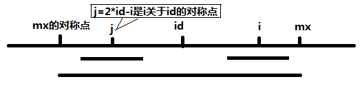

==== 两数之和

给定一个整数数组和一个目标值，找出数组中和为目标值的两个数。 +

你可以假设每个输入只对应一种答案，且同样的元素不能被重复利用。 +

示例: +

----
给定 nums = [2, 7, 11, 15], target = 9

因为 nums[0] + nums[1] = 2 + 7 = 9
所以返回 [0, 1]
----

**解法1:** +
[source,cpp,linenums]
----
class Solution {
public:
    vector<int> twoSum(vector<int>& nums, int target) {
        unordered_map<int, int> m;
        vector<int> res;
        for (int i = 0; i < nums.size(); ++i) {
            m[nums[i]] = i;
        }
        for (int i = 0; i < nums.size(); ++i) {
            int t = target - nums[i];
            if (m.count(t) && m[t] != i) {
                res.push_back(i);
                res.push_back(m[t]);
                break;
            }
        }
        return res;
    }
};
----

**解法2:** +

[source,cpp,linenums]
----
class Solution {
public:
    vector<int> twoSum(vector<int>& nums, int target) {
        unordered_map<int, int> m;
        for (int i = 0; i < nums.size(); ++i) {
            if (m.count(target - nums[i])) {
                return {i, m[target - nums[i]]};
            }
            m[nums[i]] = i;
        }
        return {};
    }
};
----

==== 两数相加

给定两个非空链表来表示两个非负整数。位数按照逆序方式存储，它们的每个节点只存储单个数字。将两数相加返回一个新的链表。 +

你可以假设除了数字 0 之外，这两个数字都不会以零开头。 +

示例： +

----
输入：(2 -> 4 -> 3) + (5 -> 6 -> 4)
输出：7 -> 0 -> 8
原因：342 + 465 = 807
----

[source, cpp, linenums]
----
class Solution {
public:
    ListNode *addTwoNumbers(ListNode *l1, ListNode *l2) {
        ListNode *res = new ListNode(-1);
        ListNode *cur = res;
        int carry = 0;
        while (l1 || l2) {
            int n1 = l1 ? l1->val : 0;
            int n2 = l2 ? l2->val : 0;
            int sum = n1 + n2 + carry;
            carry = sum / 10;
            cur->next = new ListNode(sum % 10);
            cur = cur->next;
            if (l1) l1 = l1->next;
            if (l2) l2 = l2->next;
        }
        if (carry) cur->next = new ListNode(1);
        return res->next;
    }
};
----

==== 无重复字符的最长子串

给定一个字符串，找出不含有重复字符的最长子串的长度。 +

示例： +

给定 "abcabcbb" ，没有重复字符的最长子串是 "abc" ，那么长度就是3。 +

给定 "bbbbb" ，最长的子串就是 "b" ，长度是1。 +

给定 "pwwkew" ，最长子串是 "wke" ，长度是3。请注意答案必须是一个子串，"pwke" 是 子序列  而不是子串。 +

**解法1:** +
[source, cpp, linenums]
----
class Solution {
public:
    int lengthOfLongestSubstring(string s) {
        int m[256] = {0}, res = 0, left = 0;
        for (int i = 0; i < s.size(); ++i) {
            if (m[s[i]] == 0 || m[s[i]] < left) {
                res = max(res, i - left + 1);
            } else {
                left = m[s[i]];
            }
            m[s[i]] = i + 1;
        }
        return res;
    }
};
----

**解法2:** +
[source,cpp, linenums]
----
class Solution {
public:
    int lengthOfLongestSubstring(string s) {
        vector<int> m(256, -1);
        int res = 0, left = -1;
        for (int i = 0; i < s.size(); ++i) {
            left = max(left, m[s[i]]);
            m[s[i]] = i;
            res = max(res, i - left);
        }
        return res;
    }
};
----

**解法3** +
[source, cpp, linenums]
----
class Solution {
public:
    int lengthOfLongestSubstring(string s) {
        int res = 0, left = 0, i = 0, n = s.size();
        unordered_set<char> t;
        while (i < n) {
            if (!t.count(s[i])) {
                t.insert(s[i++]);
                res = max(res, (int)t.size());
            }  else {
                t.erase(s[left++]);
            }
        }
        return res;
    }
};
----

**解法4:** +
[source, cpp, linenums]
----
class Solution {
public:
    int lengthOfLongestSubstring(string s) {
        int res = 0, left = 0, i = 0, n = s.size();
        unordered_map<char, int> m;
        for (int i = 0; i < n; ++i) {
            left = max(left, m[s[i]]);
            m[s[i]] = i + 1;
            res = max(res, i - left + 1);
        }
        return res;
    }
};
----

==== 两个排序数组的中位数

给定两个大小为 m 和 n 的有序数组 nums1 和 nums2 。 +

请找出这两个有序数组的中位数。要求算法的时间复杂度为 O(log (m+n)) 。 +

你可以假设 nums1 和 nums2 均不为空。 +

示例 1: +
----
nums1 = [1, 3]
nums2 = [2]

中位数是 2.0
----

示例 2: +

----
nums1 = [1, 2]
nums2 = [3, 4]

中位数是 (2 + 3)/2 = 2.5
----

**解法1:** +
[source,cpp,linenums]
----
class Solution {
public:
    double findMedianSortedArrays(vector<int>& nums1, vector<int>& nums2) {
        int total = nums1.size() + nums2.size();
        if (total % 2 == 1) {
            return findKth(nums1, 0, nums2, 0, total / 2 + 1);
        } else {
            return (findKth(nums1, 0, nums2, 0, total / 2) + findKth(nums1, 0, nums2, 0, total / 2 + 1)) / 2;
        }
    }
    double findKth(vector<int> &nums1, int i, vector<int> &nums2, int j, int k) {
        if (nums1.size() - i > nums2.size() - j) return findKth(nums2, j, nums1, i, k);
        if (nums1.size() == i) return nums2[j + k - 1];
        if (k == 1) return min(nums1[i], nums2[j]);
        int pa = min(i + k / 2, int(nums1.size())), pb = j + k - pa + i;
        if (nums1[pa - 1] < nums2[pb - 1])
            return findKth(nums1, pa, nums2, j, k - pa + i);
        else if (nums1[pa - 1] > nums2[pb - 1])
            return findKth(nums1, i, nums2, pb, k - pb + j);
        else
            return nums1[pa - 1];
    }
};
----

**解法2:** +
[source, cpp, linenums]
----
class Solution {
public:
    double findMedianSortedArrays(vector<int>& nums1, vector<int>& nums2) {
        int m = nums1.size(), n = nums2.size();
        return (findKth(nums1, nums2, (m + n + 1) / 2) + findKth(nums1, nums2, (m + n + 2) / 2)) / 2.0;
    }
    int findKth(vector<int> nums1, vector<int> nums2, int k) {
        int m = nums1.size(), n = nums2.size();
        if (m > n) return findKth(nums2, nums1, k);
        if (m == 0) return nums2[k - 1];
        if (k == 1) return min(nums1[0], nums2[0]);
        int i = min(m, k / 2), j = min(n, k / 2);
        if (nums1[i - 1] > nums2[j - 1]) {
            return findKth(nums1, vector<int>(nums2.begin() + j, nums2.end()), k - j);
        } else {
            return findKth(vector<int>(nums1.begin() + i, nums1.end()), nums2, k - i);
        }
        return 0;
    }
};
----

**解法3:** +
[source,cpp,linenums]
----
class Solution {
public:
    double findMedianSortedArrays(vector<int>& nums1, vector<int>& nums2) {
        int m = nums1.size(), n = nums2.size();
        if (m < n) return findMedianSortedArrays(nums2, nums1);
        if (n == 0) return ((double)nums1[(m - 1) / 2] + (double)nums1[m / 2]) / 2.0;
        int left = 0, right = n * 2;
        while (left <= right) {
            int mid2 = (left + right) / 2;
            int mid1 = m + n - mid2;
            double L1 = mid1 == 0 ? INT_MIN : nums1[(mid1 - 1) / 2];
            double L2 = mid2 == 0 ? INT_MIN : nums2[(mid2 - 1) / 2];
            double R1 = mid1 == m * 2 ? INT_MAX : nums1[mid1 / 2];
            double R2 = mid2 == n * 2 ? INT_MAX : nums2[mid2 / 2];
            if (L1 > R2) left = mid2 + 1;
            else if (L2 > R1) right = mid2 - 1;
            else return (max(L1, L2) + min(R1, R2)) / 2;
        }
        return -1;
    }
};
----

==== 最长回文子串

给定一个字符串 s，找到 s 中最长的回文子串。你可以假设 s 的最大长度为1000。 +

示例 1： +

----
输入: "babad"
输出: "bab"
注意: "aba"也是一个有效答案。
----

示例 2： +

----
输入: "cbbd"
输出: "bb"
----

**解法1:** +
[source, cpp, linenums]
----
class Solution {
public:
    string longestPalindrome(string s) {
        int startIdx = 0, left = 0, right = 0, len = 0;
        for (int i = 0; i < s.size() - 1; ++i) {
            if (s[i] == s[i + 1]) {
                left = i;
                right = i + 1;
                searchPalindrome(s, left, right, startIdx, len);
            }
            left = right = i;
            searchPalindrome(s, left, right, startIdx, len);
        }
        if (len == 0) len = s.size();
        return s.substr(startIdx, len);
    }
    void searchPalindrome(string s, int left, int right, int &startIdx, int &len) {
        int step = 1;
        while ((left - step) >= 0 && (right + step) < s.size()) {
            if (s[left - step] != s[right + step]) break;
            ++step;
        }
        int wide = right - left + 2 * step - 1;
        if (len < wide) {
            len = wide;
            startIdx = left - step + 1;
        }
    }
};
----

----
此题还可以用动态规划Dynamic Programming来解，根Palindrome Partitioning II 拆分回文串之二的解法很类似，我们维护一个二维数组dp，其中dp[i][j]表示字符串区间[i, j]是否为回文串，当i = j时，只有一个字符，肯定是回文串，如果i = j + 1，说明是相邻字符，此时需要判断s[i]是否等于s[j]，如果i和j不相邻，即i - j >= 2时，除了判断s[i]和s[j]相等之外，dp[j + 1][i - 1]若为真，就是回文串，通过以上分析，可以写出递推式如下：
dp[i, j]   = 1                                           if i == j

           = s[i] == s[j]                                if j = i + 1

           = s[i] == s[j] && dp[i + 1][j - 1]            if j > i + 1

这里有个有趣的现象就是如果我把下面的代码中的二维数组由int改为vector<vector<int> >后，就会超时，这说明int型的二维数组访问执行速度完爆std的vector啊，所以以后尽可能的还是用最原始的数据类型吧。
----

**解法2:** +
[source, cpp, linenums]
----
class Solution {
public:
    string longestPalindrome(string s) {
        int dp[s.size()][s.size()] = {0}, left = 0, right = 0, len = 0;
        for (int i = 0; i < s.size(); ++i) {
            for (int j = 0; j < i; ++j) {
                dp[j][i] = (s[i] == s[j] && (i - j < 2 || dp[j + 1][i - 1]));
                if (dp[j][i] && len < i - j + 1) {
                    len = i - j + 1;
                    left = j;
                    right = i;
                }
            }
            dp[i][i] = 1;
        }
        return s.substr(left, right - left + 1);
    }
};
----

----
最后要来的就是大名鼎鼎的马拉车算法Manacher's Algorithm，这个算法的神奇之处在于将时间复杂度提升到了O(n)这种逆天的地步，而算法本身也设计的很巧妙，很值得我们掌握。

这个马拉车算法Manacher‘s Algorithm是用来查找一个字符串的最长回文子串的线性方法，由一个叫Manacher的人在1975年发明的，这个方法的最大贡献是在于将时间复杂度提升到了线性，这是非常了不起的。对于回文串想必大家都不陌生，就是正读反读都一样的字符串，比如 "bob", "level", "noon" 等等，那么如何在一个字符串中找出最长回文子串呢，可以以每一个字符为中心，向两边寻找回文子串，在遍历完整个数组后，就可以找到最长的回文子串。但是这个方法的时间复杂度为O(n*n)，并不是很高效，下面我们来看时间复杂度为O(n)的马拉车算法。

由于回文串的长度可奇可偶，比如"bob"是奇数形式的回文，"noon"就是偶数形式的回文，马拉车算法的第一步是预处理，做法是在每一个字符的左右都加上一个特殊字符，比如加上'#'，那么

bob    -->    #b#o#b#

noon    -->    #n#o#o#n#

这样做的好处是不论原字符串是奇数还是偶数个，处理之后得到的字符串的个数都是奇数个，这样就不用分情况讨论了，而可以一起搞定。接下来我们还需要和处理后的字符串t等长的数组p，其中p[i]表示以t[i]字符为中心的回文子串的半径，若p[i] = 1，则该回文子串就是t[i]本身，那么我们来看一个简单的例子：

# 1 # 2 # 2 # 1 # 2 # 2 #
1 2 1 2 5 2 1 6 1 2 3 2 1

为啥我们关心回文子串的半径呢？看上面那个例子，以中间的 '1' 为中心的回文子串 "#2#2#1#2#2#" 的半径是6，而为添加井号的回文子串为 "22122"，长度是5，为半径减1。这是个普遍的规律么？我们再看看之前的那个 "#b#o#b#"，我们很容易看出来以中间的 'o' 为中心的回文串的半径是4，而 "bob"的长度是3，符合规律。再来看偶数个的情况"noon"，添加井号后的回文串为 "#n#o#o#n#"，以最中间的 '#' 为中心的回文串的半径是5，而 "noon" 的长度是4，完美符合规律。所以我们只要找到了最大的半径，就知道最长的回文子串的字符个数了。只知道长度无法确定子串，我们还需要知道子串的起始位置。

我们还是先来看中间的 '1' 在字符串 "#1#2#2#1#2#2#" 中的位置是7，而半径是6，貌似7-6=1，刚好就是回文子串 "22122" 在原串 "122122" 中的起始位置1。那么我们再来验证下 "bob"，"o" 在 "#b#o#b#" 中的位置是3，但是半径是4，这一减成负的了，肯定不对。所以我们应该至少把中心位置向后移动一位，才能为0啊，那么我们就需要在前面增加一个字符，这个字符不能是井号，也不能是s中可能出现的字符，所以我们暂且就用美元号吧，毕竟是博主最爱的东西嘛。这样都不相同的话就不会改变p值了，那么末尾要不要对应的也添加呢，其实不用的，不用加的原因是字符串的结尾标识为'\0'，等于默认加过了。那此时 "o" 在 "$#b#o#b#" 中的位置是4，半径是4，一减就是0了，貌似没啥问题。我们再来验证一下那个数字串，中间的 '1' 在字符串 "$#1#2#2#1#2#2#" 中的位置是8，而半径是6，这一减就是2了，而我们需要的1，所以我们要除以2。之前的 "bob" 因为相减已经是0了，除以2还是0，没有问题。再来验证一下 "noon"，中间的 '#' 在字符串 "$#n#o#o#n#" 中的位置是5，半径也是5，相减并除以2还是0，完美。可以任意试试其他的例子，都是符合这个规律的，最长子串的长度是半径减1，起始位置是中间位置减去半径再除以2。

那么下面我们就来看如何求p数组，需要新增两个辅助变量mx和id，其中id为能延伸到最右端的位置的那个回文子串的中心点位置，mx是回文串能延伸到的最右端的位置，这个算法的最核心的一行如下：

p[i] = mx > i ? min(p[2 * id - i], mx - i) : 1;

可以这么说，这行要是理解了，那么马拉车算法基本上就没啥问题了，那么这一行代码拆开来看就是

如果 mx > i, 则 p[i] = min( p[2 * id - i] , mx - i )

否则，p[i] = 1

当 mx - i > P[j] 的时候，以S[j]为中心的回文子串包含在以S[id]为中心的回文子串中，由于 i 和 j 对称，以S[i]为中心的回文子串必然包含在以S[id]为中心的回文子串中，所以必有 P[i] = P[j]，见下图。
----

当 P[j] >= mx - i 的时候，以S[j]为中心的回文子串不一定完全包含于以S[id]为中心的回文子串中，但是基于对称性可知，下图中两个绿框所包围的部分是相同的，也就是说以S[i]为中心的回文子串，其向右至少会扩张到mx的位置，也就是说 P[i] = mx - i。至于mx之后的部分是否对称，就只能老老实实去匹配了。 +

image::images/question_5_2.png[width="40%", height="45%"]

对于 mx <= i 的情况，无法对 P[i]做更多的假设，只能P[i] = 1，然后再去匹配了。 +

**解法3:** +
[source, cpp, linenums]
----
class Solution {
public:
    string longestPalindrome(string s) {
        string t ="$#";
        for (int i = 0; i < s.size(); ++i) {
            t += s[i];
            t += '#';
        }
        int p[t.size()] = {0}, id = 0, mx = 0, resId = 0, resMx = 0;
        for (int i = 0; i < t.size(); ++i) {
            p[i] = mx > i ? min(p[2 * id - i], mx - i) : 1;
            while (t[i + p[i]] == t[i - p[i]]) ++p[i];
            if (mx < i + p[i]) {
                mx = i + p[i];
                id = i;
            }
            if (resMx < p[i]) {
                resMx = p[i];
                resId = i;
            }
        }
        return s.substr((resId - resMx) / 2, resMx - 1);
    }
};
----

==== Z字形变换

将字符串 "PAYPALISHIRING" 以Z字形排列成给定的行数： +
----
P   A   H   N
A P L S I I G
Y   I   R
----
之后从左往右，逐行读取字符："PAHNAPLSIIGYIR" +

实现一个将字符串进行指定行数变换的函数: +
----
string convert(string s, int numRows);
----
示例 1: +

----
输入: s = "PAYPALISHIRING", numRows = 3
输出: "PAHNAPLSIIGYIR"
----
示例 2: +

----
输入: s = "PAYPALISHIRING", numRows = 4
输出: "PINALSIGYAHRPI"
解释:

P     I    N
A   L S  I G
Y A   H R
P     I
----

----
这道题刚开始看了半天没看懂是咋样变换的，上网查了些资料，终于搞懂了，就是要把字符串摆成一个之字型的，参考了网上这位仁兄的解法 (http://www.cnblogs.com/springfor/p/3889414.html)。

比如有一个字符串 “0123456789ABCDEF”，转为zigzag

当 n = 2 时：

0 2 4 6 8 A C E

1 3 5 7 9 B D F

当 n = 3 时：

0   4    8     C

1 3 5 7 9 B D F

2    6   A     E

当 n = 4 时：

0     6        C

1   5 7   B  D

2 4   8 A    E

3      9       F

我们发现，除了第一行和最后一行没有中间形成之字型的数字外，其他都有，而首位两行中相邻两个元素的index之差跟行数是相关的，为 2*nRows - 2, 根据这个特点，我们可以按顺序找到所有的黑色元素在元字符串的位置，将他们按顺序加到新字符串里面。对于红色元素出现的位置也是有规律的，每个红色元素的位置为 j + 2*nRows-2 - 2*i, 其中，j为前一个黑色元素的列数，i为当前行数。 比如当n = 4中的那个红色5，它的位置为 1 + 2*4-2 - 2*1 = 5，为原字符串的正确位置。当我们知道所有黑色元素和红色元素位置的正确算法，我们就可以一次性的把它们按顺序都加到新的字符串里面。代码如下：
----

[source, cpp, linenums]
----
class Solution {
public:
    string convert(string s, int nRows) {
        if (nRows <= 1) return s;
        string res = "";
        int size = 2 * nRows - 2;
        for (int i = 0; i < nRows; ++i) {
            for (int j = i; j < s.size(); j += size) {
                res += s[j];
                int tmp = j + size - 2 * i;
                if (i != 0 && i != nRows - 1 && tmp < s.size()) res += s[tmp];
            }
        }
        return res;
    }
};
----

==== 反转整数

给定一个 32 位有符号整数，将整数中的数字进行反转。 +

示例 1: +

----
输入: 123
输出: 321
----
 示例 2: +
----
输入: -123
输出: -321
----
示例 3: +
----
输入: 120
输出: 21
----
注意: +

假设我们的环境只能存储 32 位有符号整数，其数值范围是 [−231,  231 − 1]。根据这个假设，如果反转后的整数溢出，则返回 0。 +

**解法1:** +
[source, cpp, linenums]
----
class Solution {
public:
    int reverse(int x) {
        long long res = 0;
        bool isPositive = true;
        if (x < 0) {
            isPositive = false;
            x *= -1;
        }
        while (x > 0) {
            res = res * 10 + x % 10;
            x /= 10;
        }
        if (res > INT_MAX) return 0;
        if (isPositive) return res;
        else return -res;
    }
};
----

**解法2:** +
[source, cpp, linenums]
----
class Solution {
public:
    int reverse(int x) {
        int res = 0;
        while (x != 0) {
            if (abs(res) > INT_MAX / 10) return 0;
            res = res * 10 + x % 10;
            x /= 10;
        }
        return res;
    }
};
----

**解法3:** +
[source, cpp, linenums]
----
class Solution {
public:
    int reverse(int x) {
        long long res = 0;
        while (x != 0) {
            res = 10 * res + x % 10;
            x /= 10;
        }
        return (res > INT_MAX || res < INT_MIN) ? 0 : res;
    }
};
----

**解法4:** +
[source, cpp, linenums]
----
class Solution {
public:
    int reverse(int x) {
        int res = 0;
        while (x != 0) {
            int t = res * 10 + x % 10;
            if (t / 10 != res) return 0;
            res = t;
            x /= 10;
        }
        return res;
    }
};
----

==== 字符串转整数 (atoi)
实现 atoi，将字符串转为整数。 +

在找到第一个非空字符之前，需要移除掉字符串中的空格字符。如果第一个非空字符是正号或负号，选取该符号，并将其与后面尽可能多的连续的数字组合起来，这部分字符即为整数的值。如果第一个非空字符是数字，则直接将其与之后连续的数字字符组合起来，形成整数。 +

字符串可以在形成整数的字符后面包括多余的字符，这些字符可以被忽略，它们对于函数没有影响。 +

当字符串中的第一个非空字符序列不是个有效的整数；或字符串为空；或字符串仅包含空白字符时，则不进行转换。 +

若函数不能执行有效的转换，返回 0。 +

说明： +

假设我们的环境只能存储 32 位有符号整数，其数值范围是 [−231,  231 − 1]。如果数值超过可表示的范围，则返回  INT_MAX (231 − 1) 或 INT_MIN (−231) 。 +

示例 1: +
----
输入: "42"
输出: 42
----
示例 2: +
----
输入: "   -42"
输出: -42
解释: 第一个非空白字符为 '-', 它是一个负号。
     我们尽可能将负号与后面所有连续出现的数字组合起来，最后得到 -42 。
----
示例 3: +
----
输入: "4193 with words"
输出: 4193
解释: 转换截止于数字 '3' ，因为它的下一个字符不为数字。
----
示例 4: +
----
输入: "words and 987"
输出: 0
解释: 第一个非空字符是 'w', 但它不是数字或正、负号。
     因此无法执行有效的转换。
----
示例 5: +
----
输入: "-91283472332"
输出: -2147483648
解释: 数字 "-91283472332" 超过 32 位有符号整数范围。
     因此返回 INT_MIN (−231) 。
----

[source,cpp,linenums]
----
class Solution {
public:
    int myAtoi(string str) {
        if (str.empty()) return 0;
        int sign = 1, base = 0, i = 0, n = str.size();
        while (i < n && str[i] == ' ') ++i;
        if (str[i] == '+' || str[i] == '-') {
            sign = (str[i++] == '+') ? 1 : -1;
        }
        while (i < n && str[i] >= '0' && str[i] <= '9') {
            if (base > INT_MAX / 10 || (base == INT_MAX / 10 && str[i] - '0' > 7)) {
                return (sign == 1) ? INT_MAX : INT_MIN;
            }
            base = 10 * base + (str[i++] - '0');
        }
        return base * sign;
    }
};
----

==== 回文数
判断一个整数是否是回文数。回文数是指正序（从左向右）和倒序（从右向左）读都是一样的整数。 +

示例 1: +
----
输入: 121
输出: true
----
示例 2: +
----
输入: -121
输出: false
解释: 从左向右读, 为 -121 。 从右向左读, 为 121- 。因此它不是一个回文数。
----
示例 3: +
----
输入: 10
输出: false
解释: 从右向左读, 为 01 。因此它不是一个回文数。
----
进阶: +

你能不将整数转为字符串来解决这个问题吗？ +

**解法1:** +
[source, cpp, linenums]
----
class Solution {
public:
    bool isPalindrome(int x) {
        if (x < 0) return false;
        int div = 1;
        while (x / div >= 10) div *= 10;
        while (x > 0) {
            int left = x / div;
            int right = x % 10;
            if (left != right) return false;
            x = (x % div) / 10;
            div /= 100;
        }
        return true;
    }
};
----

**解法2:** +
[source, cpp, linenums]
----
class Solution {
public:
    bool isPalindrome(int x) {
        if (x < 0 || (x % 10 == 0 && x != 0)) return false;
        int revertNum = 0;
        while (x > revertNum) {
            revertNum = revertNum * 10 + x % 10;
            x /= 10;
        }
        return x == revertNum || x == revertNum / 10;
    }
};
----

**解法3:** +
[source, cpp, linenums]
----
class Solution {
public:
    bool isPalindrome(int x) {
        if (x < 0 || (x % 10 == 0 && x != 0)) return false;
        return reverse(x) == x;
    }
    int reverse(int x) {
        int res = 0;
        while (x != 0) {
            if (res > INT_MAX / 10) return -1;
            res = res * 10 + x % 10;
            x /= 10;
        }
        return res;
    }
};
----

==== 正则表达式匹配
给定一个字符串 (s) 和一个字符模式 (p)。实现支持 '.' 和 '*' 的正则表达式匹配。 +
----
'.' 匹配任意单个字符。
'*' 匹配零个或多个前面的元素。
----
匹配应该覆盖整个字符串 (s) ，而不是部分字符串。 +
说明: +

====
* s 可能为空，且只包含从 a-z 的小写字母。
* p 可能为空，且只包含从 a-z 的小写字母，以及字符 . 和 *。
====

示例 1: +

----
输入:
s = "aa"
p = "a"
输出: false
解释: "a" 无法匹配 "aa" 整个字符串。
----
示例 2: +

----
输入:
s = "aa"
p = "a*"
输出: true
解释: '*' 代表可匹配零个或多个前面的元素, 即可以匹配 'a' 。因此, 重复 'a' 一次, 字符串可变为 "aa"。
----
示例 3: +
----
输入:
s = "ab"
p = ".*"
输出: true
解释: ".*" 表示可匹配零个或多个('*')任意字符('.')。
----
示例 4: +
----
输入:
s = "aab"
p = "c*a*b"
输出: true
解释: 'c' 可以不被重复, 'a' 可以被重复一次。因此可以匹配字符串 "aab"。
----
示例 5: +
----
输入:
s = "mississippi"
p = "mis*is*p*."
输出: false
----

**解法1:** +
[source, cpp, linenums]
----
class Solution {
public:
    bool isMatch(string s, string p) {
        if (p.empty()) return s.empty();
        if (p.size() == 1) {
            return (s.size() == 1 && (s[0] == p[0] || p[0] == '.'));
        }
        if (p[1] != '*') {
            if (s.empty()) return false;
            return (s[0] == p[0] || p[0] == '.') && isMatch(s.substr(1), p.substr(1));
        }
        while (!s.empty() && (s[0] == p[0] || p[0] == '.')) {
            if (isMatch(s, p.substr(2))) return true;
            s = s.substr(1);
        }
        return isMatch(s, p.substr(2));
    }
};
----

**解法2:** +
[source, cpp, linenums]
----
class Solution {
public:
    bool isMatch(string s, string p) {
        if (p.empty()) return s.empty();
        if (p.size() > 1 && p[1] == '*') {
            return isMatch(s, p.substr(2)) || (!s.empty() && (s[0] == p[0] || p[0] == '.') && isMatch(s.substr(1), p));
        } else {
            return !s.empty() && (s[0] == p[0] || p[0] == '.') && isMatch(s.substr(1), p.substr(1));
        }
    }
};
----

**解法3:** +
[source, cpp, linenums]
----
class Solution {
public:
    bool isMatch(string s, string p) {
        int m = s.size(), n = p.size();
        vector<vector<bool>> dp(m + 1, vector<bool>(n + 1, false));
        dp[0][0] = true;
        for (int i = 0; i <= m; ++i) {
            for (int j = 1; j <= n; ++j) {
                if (j > 1 && p[j - 1] == '*') {
                    dp[i][j] = dp[i][j - 2] || (i > 0 && (s[i - 1] == p[j - 2] || p[j - 2] == '.') && dp[i - 1][j]);
                } else {
                    dp[i][j] = i > 0 && dp[i - 1][j - 1] && (s[i - 1] == p[j - 1] || p[j - 1] == '.');
                }
            }
        }
        return dp[m][n];
    }
};
----

==== 盛最多水的容器

给定 n 个非负整数 a1，a2，...，an，每个数代表坐标中的一个点 (i, ai) 。在坐标内画 n 条垂直线，垂直线 i 的两个端点分别为 (i, ai) 和 (i, 0)。 +

找出其中的两条线，使得它们与 x 轴共同构成的容器可以容纳最多的水。 +

说明：你不能倾斜容器，且 n 的值至少为 2。 +

image::images/question_11.jpg[width="30%", height="35%"]

图中垂直线代表输入数组 [1,8,6,2,5,4,8,3,7]。在此情况下，容器能够容纳水（表示为蓝色部分）的最大值为 49。 +

示例 : +
----
输入: [1,8,6,2,5,4,8,3,7]
输出: 49
----

这道求装最多水的容器的题和那道 Trapping Rain Water 收集雨水 很类似，但又有些不同，
那道题让求整个能收集雨水的量，这道只是让求最大的一个的装水量，而且还有一点不同的是，
那道题容器边缘不能算在里面，而这道题却可以算，相比较来说还是这道题容易一些，
我们需要定义i和j两个指针分别指向数组的左右两端，然后两个指针向中间搜索，每移动一次算一个值和结果比较取较大的，
容器装水量的算法是找出左右两个边缘中较小的那个乘以两边缘的距离，代码如下： +

**解法1:** +
[source, cpp, linenums]
----
class Solution {
public:
    int maxArea(vector<int>& height) {
        int res = 0, i = 0, j = height.size() - 1;
        while (i < j) {
            res = max(res, min(height[i], height[j]) * (j - i));
            height[i] < height[j] ? ++i : --j;
        }
        return res;
    }
};
----

下面这种方法是对上面的方法进行了小幅度的优化，对于相同的高度们直接移动i和j就行了，不再进行计算容量了，参见代码如下： +
**解法2:** +
[source, cpp, linenums]
----
class Solution {
public:
    int maxArea(vector<int>& height) {
        int res = 0, i = 0, j = height.size() - 1;
        while (i < j) {
            int h = min(height[i], height[j]);
            res = max(res, h * (j - i));
            while (i < j && h == height[i]) ++i;
            while (i < j && h == height[j]) --j;
        }
        return res;
    }
};
----

==== 整数转罗马数字

罗马数字包含以下七种字符： I， V， X， L，C，D 和 M。 +
----
字符          数值
I             1
V             5
X             10
L             50
C             100
D             500
M             1000
----
例如， 罗马数字 2 写做 II ，即为两个并列的 1。12 写做 XII ，即为 X + II 。 27 写做  XXVII, 即为 XX + V + II 。 +

通常情况下，罗马数字中小的数字在大的数字的右边。但也存在特例，例如 4 不写做 IIII，而是 IV。数字 1 在数字 5 的左边，所表示的数等于大数 5 减小数 1 得到的数值 4 。
同样地，数字 9 表示为 IX。这个特殊的规则只适用于以下六种情况： +

--
* I 可以放在 V (5) 和 X (10) 的左边，来表示 4 和 9.
* X 可以放在 L (50) 和 C (100) 的左边，来表示 40 和 90.
* C 可以放在 D (500) 和 M (1000) 的左边，来表示 400 和 900.
--

给定一个整数，将其转为罗马数字。输入确保在 1 到 3999 的范围内。 +
示例 1: +
----
输入: 3
输出: "III"
----

示例 2: +
----
输入: 4
输出: "IV"
----

示例 3: +
----
输入: 9
输出: "IX"
----

示例 4: +
----
输入: 58
输出: "LVIII"
解释: L = 50, V = 5, III = 3.
----

示例 5: +
----
输入: 1994
输出: "MCMXCIV"
解释: M = 1000, CM = 900, XC = 90, IV = 4.
----

之前那篇文章写的是罗马数字转化成整数(http://www.cnblogs.com/grandyang/p/4120857.html)， 这次变成了整数转化成罗马数字，基本算法还是一样。由于题目中限定了输入数字的范围(1 - 3999), 使得题目变得简单了不少。 +

例如整数 1437 的罗马数字为 MCDXXXVII， 我们不难发现，千位，百位，十位和个位上的数分别用罗马数字表示了。 1000 - M, 400 - CD, 30 - XXX, 7 - VII。所以我们要做的就是用取商法分别提取各个位上的数字，然后分别表示出来： +

--
100 - C

200 - CC

300 - CCC

400 - CD

500 - D

600 - DC

700 - DCC

800 - DCCC

900 - CM
--

我们可以分为四类，100到300一类，400一类，500到800一类，900最后一类。每一位上的情况都是类似的，代码如下： +

**解法1:** +
[source, cpp, linenums]
----
class Solution {
public:
    string intToRoman(int num) {
        string res = "";
        char roman[] = {'M', 'D', 'C', 'L', 'X', 'V', 'I'};
        int value[] = {1000, 500, 100, 50, 10, 5, 1};

        for (int n = 0; n < 7; n += 2) {
            int x = num / value[n];
            if (x < 4) {
                for (int i = 1; i <= x; ++i) res += roman[n];
            } else if (x == 4) res = res + roman[n] + roman[n - 1];
            else if (x > 4 && x < 9) {
                res += roman[n - 1];
                for (int i = 6; i <= x; ++i) res += roman[n];
            }
            else if (x == 9) res = res + roman[n] + roman[n - 2];
            num %= value[n];
        }
        return res;
    }
};
----

本题由于限制了输入数字范围这一特殊性，故而还有一种利用贪婪算法的解法，建立一个数表，每次通过查表找出当前最大的数，减去再继续查表。参见代码如下： +

**解法2:** +
[source, cpp, linenums]
----
class Solution {
public:
  string intToRoman(int num) {
      string res = "";
      vector<int> val{1000, 900, 500, 400, 100, 90, 50, 40, 10, 9, 5, 4, 1};
      vector<string> str{"M", "CM", "D", "CD", "C", "XC", "L", "XL", "X", "IX", "V", "IV", "I"};
      for (int i = 0; i < val.size(); ++i) {
          while (num >= val[i]) {
              num -= val[i];
              res += str[i];
          }
      }
      return res;
  }
};
----

下面这种方法个人感觉属于比较投机取巧的方法，把所有的情况都列了出来，然后直接按位查表，O(1)的时间复杂度啊，参见代码如下： +

**解法3:** +
[source, cpp, linenums]
----
class Solution {
public:
    string intToRoman(int num) {
        string res = "";
        vector<string> v1{"", "M", "MM", "MMM"};
        vector<string> v2{"", "C", "CC", "CCC", "CD", "D", "DC", "DCC", "DCCC", "CM"};
        vector<string> v3{"", "X", "XX", "XXX", "XL", "L", "LX", "LXX", "LXXX", "XC"};
        vector<string> v4{"", "I", "II", "III", "IV", "V", "VI", "VII", "VIII", "IX"};
        return v1[num / 1000] + v2[(num % 1000) / 100] + v3[(num % 100) / 10] + v4[num % 10];
    }
};
----

==== 罗马数字转整数

罗马数字包含以下七种字符: I， V， X， L，C，D 和 M。 +

----
字符          数值
I             1
V             5
X             10
L             50
C             100
D             500
M             1000
----

例如， 罗马数字 2 写做 II ，即为两个并列的 1。12 写做 XII ，即为 X + II 。 27 写做  XXVII, 即为 XX + V + II 。 +

通常情况下，罗马数字中小的数字在大的数字的右边。但也存在特例，例如 4 不写做 IIII，而是 IV。数字 1 在数字 5 的左边，所表示的数等于大数 5 减小数 1 得到的数值 4 。
同样地，数字 9 表示为 IX。这个特殊的规则只适用于以下六种情况： +

--
* I 可以放在 V (5) 和 X (10) 的左边，来表示 4 和 9。
* X 可以放在 L (50) 和 C (100) 的左边，来表示 40 和 90。
* C 可以放在 D (500) 和 M (1000) 的左边，来表示 400 和 900。
--

给定一个罗马数字，将其转换成整数。输入确保在 1 到 3999 的范围内。 +

示例 1: +
----
输入: "III"
输出: 3
----

示例 2: +
----
输入: "IV"
输出: 4
----

示例 3: +
----
输入: "IX"
输出: 9
----

示例 4: +
----
输入: "LVIII"
输出: 58
解释: L = 50, V= 5, III = 3.
----

示例 5: +
----
输入: "MCMXCIV"
输出: 1994
解释: M = 1000, CM = 900, XC = 90, IV = 4.
----

罗马数转化成数字问题，我们需要对于罗马数字很熟悉才能完成转换。以下截自百度百科： +

罗马数字是最早的数字表示方式，比阿拉伯数字早2000多年，起源于罗马。 +
如今我们最常见的罗马数字就是钟表的表盘符号：Ⅰ，Ⅱ，Ⅲ，Ⅳ（IIII），Ⅴ，Ⅵ，Ⅶ，Ⅷ，Ⅸ，Ⅹ，Ⅺ，Ⅻ…… +
对应阿拉伯数字（就是现在国际通用的数字），就是1，2，3，4，5，6，7，8，9，10，11，12。（注：阿拉伯数字其实是古代印度人发明的，后来由阿拉伯人传入欧洲，被欧洲人误称为阿拉伯数字。） +

1、相同的数字连写，所表示的数等于这些数字相加得到的数，如：Ⅲ = 3； +
2、小的数字在大的数字的右边，所表示的数等于这些数字相加得到的数， 如：Ⅷ = 8；Ⅻ = 12； +
3、小的数字，（限于Ⅰ、X 和C）在大的数字的左边，所表示的数等于大数减小数得到的数，如：Ⅳ= 4；Ⅸ= 9； +
4、正常使用时，连写的数字重复不得超过三次。（表盘上的四点钟“IIII”例外） +
5、在一个数的上面画一条横线，表示这个数扩大1000倍。 +

**有几条须注意掌握：** +

1、基本数字Ⅰ、X 、C 中的任何一个，自身连用构成数目，或者放在大数的右边连用构成数目，都不能超过三个；放在大数的左边只能用一个。 +
2、不能把基本数字V 、L 、D 中的任何一个作为小数放在大数的左边采用相减的方法构成数目；放在大数的右边采用相加的方式构成数目，只能使用一个。 +
3、V 和X 左边的小数字只能用Ⅰ。 +
4、L 和C 左边的小数字只能用X。 +
5、D 和M 左边的小数字只能用C。 +

而这道题好就好在没有让我们来验证输入字符串是不是罗马数字，这样省掉不少功夫。我们需要用到map数据结构，来将罗马数字的字母转化为对应的整数值，因为输入的一定是罗马数字，那么我们只要考虑两种情况即可： +
第一，如果当前数字是最后一个数字，或者之后的数字比它小的话，则加上当前数字 +
第二，其他情况则减去这个数字 +

**解法1:**
[source, cpp, linenums]
----
class Solution {
public:
    int romanToInt(string s) {
        int res = 0;
        unordered_map<char, int> m{{'I', 1}, {'V', 5}, {'X', 10}, {'L', 50}, {'C', 100}, {'D', 500}, {'M', 1000}};
        for (int i = 0; i < s.size(); ++i) {
            int val = m[s[i]];
            if (i == s.size() - 1 || m[s[i+1]] <= m[s[i]]) res += val;
            else res -= val;
        }
        return res;
    }
};
----

我们也可以每次跟前面的数字比较，如果小于等于前面的数字，我们先加上当前的数字，如果大于的前面的数字，我们加上当前的数字减去二倍前面的数字，这样可以把在上一个循环多加数减掉，参见代码如下: +

**解法2:** +
[source, cpp, linenums]
----
class Solution {
public:
    int romanToInt(string s) {
        int res = 0;
        unordered_map<char, int> m{{'I', 1}, {'V', 5}, {'X', 10}, {'L', 50}, {'C', 100}, {'D', 500}, {'M', 1000}};
        for (int i = 0; i < s.size(); ++i) {
            if (i == 0 || m[s[i]] <= m[s[i - 1]]) res += m[s[i]];
            else res += m[s[i]] - 2 * m[s[i - 1]];
        }
        return res;
    }
};
----

==== 最长公共前缀

编写一个函数来查找字符串数组中的最长公共前缀。 +

如果不存在公共前缀，返回空字符串 ""。 +

示例1: +
----
输入: ["flower","flow","flight"]
输出: "fl"
----

示例2: +
----
输入: ["dog","racecar","car"]
输出: ""
解释: 输入不存在公共前缀。
----

说明: +

所有输入只包含小写字母 a-z  +

这道题让我们求一系列字符串的共同前缀，没有什么特别的技巧，无脑查找即可，我们定义两个变量i和j，
其中i是遍历搜索字符串中的字符，j是遍历字符串集中的每个字符串。这里将单词上下排好，则相当于一个各行长度有可能不相等的二维数组，
我们遍历顺序和一般的横向逐行遍历不同，而是采用纵向逐列遍历，在遍历的过程中，如果某一行没有了，说明其为最短的单词，
因为共同前缀的长度不能长于最短单词，所以此时返回已经找出的共同前缀。我们每次取出第一个字符串的某一个位置的单词，
然后遍历其他所有字符串的对应位置看是否相等，如果有不满足的直接返回res，如果都相同，则将当前字符存入结果，继续检查下一个位置的字符，参见代码如下： +

**解法1:**
[source, cpp, linenums]
----
class Solution {
public:
    string longestCommonPrefix(vector<string>& strs) {
        if (strs.empty()) return "";
        string res = "";
        for (int j = 0; j < strs[0].size(); ++j) {
            char c = strs[0][j];
            for (int i = 1; i < strs.size(); ++i) {
                if (j >= strs[i].size() || strs[i][j] != c) {
                    return res;
                }
            }
            res.push_back(c);
        }
        return res;
    }
};
----

我们可以对上面的方法进行适当精简，如果我们发现当前某个字符和下一行对应位置的字符不相等，说明不会再有更长的共同前缀了，
我们直接通过用substr的方法直接取出共同前缀的子字符串。如果遍历结束前没有返回结果的话，说明第一个单词就是公共前缀，
返回为结果即可。代码如下： +

**解法2:**
[source, cpp, linenums]
----
class Solution {
public:
    string longestCommonPrefix(vector<string>& strs) {
        if (strs.empty()) return "";
        for (int j = 0; j < strs[0].size(); ++j) {
            for (int i = 0; i < strs.size() - 1; ++i) {
                if (j >= strs[i].size() || j >= strs[i + 1].size() || strs[i][j] != strs[i + 1][j]) {
                    return strs[i].substr(0, j);
                }
            }
        }
        return strs[0];
    }
};
----

我们再来看一种解法，这种方法给输入字符串数组排了个序，想想这样做有什么好处？既然是按字母顺序排序的话，
那么有共同字母多的两个字符串会被排到一起，而跟大家相同的字母越少的字符串会被挤到首尾两端，那么如果有共同前缀的话，
一定会出现在首尾两端的字符串中，所以我们只需要找首尾字母串的共同前缀即可。比如例子1排序后为 ["flight", "flow", "flower"]，
例子2排序后为 ["cat", "dog", "racecar"]，虽然例子2没有共同前缀，但也可以认为共同前缀是空串，且出现在首尾两端的字符串中。
由于是按字母顺序排的，而不是按长度，所以首尾字母的长度关系不知道，为了防止溢出错误，我们只遍历而这种较短的那个的长度，
找出共同前缀返回即可，参见代码如下： +

**解法3:**
[source, cpp, linenums]
----
class Solution {
public:
    string longestCommonPrefix(vector<string>& strs) {
        if (strs.empty()) return "";
        sort(strs.begin(), strs.end());
        int i = 0, len = min(strs[0].size(), strs.back().size());
        while (i < len && strs[0][i] == strs.back()[i]) ++i;
        return strs[0].substr(0, i);
    }
};
----

==== 三数之和

给定一个包含 n 个整数的数组 nums，判断 nums 中是否存在三个元素 a，b，c ，使得 a + b + c = 0 ？找出所有满足条件且不重复的三元组。 +

注意：答案中不可以包含重复的三元组。 +

----
例如, 给定数组 nums = [-1, 0, 1, 2, -1, -4]，

满足要求的三元组集合为：
[
  [-1, 0, 1],
  [-1, -1, 2]
]
----

这道题让我们求三数之和，比之前那道Two Sum要复杂一些，博主考虑过先fix一个数，然后另外两个数使用Two Sum那种HashMap的解法，但是会有重复结果出现，就算使用set来去除重复也不行，会TLE，看来此题并不是考我们Two Sum的解法。那么我们来分析一下这道题的特点，要我们找出三个数且和为0，那么除了三个数全是0的情况之外，肯定会有负数和正数，我们还是要先fix一个数，然后去找另外两个数，我们只要找到两个数且和为第一个fix数的相反数就行了，既然另外两个数不能使用Two Sum的那种解法来找，如果能更有效的定位呢？我们肯定不希望遍历所有两个数的组合吧，所以如果数组是有序的，那么我们就可以用双指针以线性时间复杂度来遍历所有满足题意的两个数组合。 +

我们对原数组进行排序，然后开始遍历排序后的数组，这里注意不是遍历到最后一个停止，而是到倒数第三个就可以了。这里我们可以先做个剪枝优化，就是当遍历到正数的时候就break，为啥呢，因为我们的数组现在是有序的了，如果第一个要fix的数就是正数了，那么后面的数字就都是正数，就永远不会出现和为0的情况了。然后我们还要加上重复就跳过的处理，处理方法是从第二个数开始，如果和前面的数字相等，就跳过，因为我们不想把相同的数字fix两次。对于遍历到的数，用0减去这个fix的数得到一个target，然后只需要再之后找到两个数之和等于target即可。我们用两个指针分别指向fix数字之后开始的数组首尾两个数，如果两个数和正好为target，则将这两个数和fix的数一起存入结果中。然后就是跳过重复数字的步骤了，两个指针都需要检测重复数字。如果两数之和小于target，则我们将左边那个指针i右移一位，使得指向的数字增大一些。同理，如果两数之和大于target，则我们将右边那个指针j左移一位，使得指向的数字减小一些，代码如下： +

**解法1:**
[source, cpp, linenums]
----
class Solution {
public:
    vector<vector<int>> threeSum(vector<int>& nums) {
        vector<vector<int>> res;
        sort(nums.begin(), nums.end());
        if (nums.empty() || nums.back() < 0 || nums.front() > 0) return {};
        for (int k = 0; k < nums.size(); ++k) {
            if (nums[k] > 0) break;
            if (k > 0 && nums[k] == nums[k - 1]) continue;
            int target = 0 - nums[k];
            int i = k + 1, j = nums.size() - 1;
            while (i < j) {
                if (nums[i] + nums[j] == target) {
                    res.push_back({nums[k], nums[i], nums[j]});
                    while (i < j && nums[i] == nums[i + 1]) ++i;
                    while (i < j && nums[j] == nums[j - 1]) --j;
                    ++i; --j;
                } else if (nums[i] + nums[j] < target) ++i;
                else --j;
            }
        }
        return res;
    }
};
----

或者我们也可以利用set的不能包含重复项的特点来防止重复项的产生，那么我们就不需要检测数字是否被fix过两次，不过个人觉得还是前面那种解法更好一些，参见代码如下： +

**解法2:**
[source, cpp, linenums]
----
class Solution {
public:
    vector<vector<int>> threeSum(vector<int>& nums) {
        set<vector<int>> res;
        sort(nums.begin(), nums.end());
        if (nums.empty() || nums.back() < 0 || nums.front() > 0) return {};
        for (int k = 0; k < nums.size(); ++k) {
            if (nums[k] > 0) break;
            int target = 0 - nums[k];
            int i = k + 1, j = nums.size() - 1;
            while (i < j) {
                if (nums[i] + nums[j] == target) {
                    res.insert({nums[k], nums[i], nums[j]});
                    while (i < j && nums[i] == nums[i + 1]) ++i;
                    while (i < j && nums[j] == nums[j - 1]) --j;
                    ++i; --j;
                } else if (nums[i] + nums[j] < target) ++i;
                else --j;
            }
        }
        return vector<vector<int>>(res.begin(), res.end());
    }
};
----

==== 最接近的三数之和

给定一个包括 n 个整数的数组 nums 和 一个目标值 target。找出 nums 中的三个整数，使得它们的和与 target 最接近。返回这三个数的和。假定每组输入只存在唯一答案。 +
----
例如，给定数组 nums = [-1，2，1，-4], 和 target = 1.

与 target 最接近的三个数的和为 2. (-1 + 2 + 1 = 2).
----

这道题让我们求最接近给定值的三数之和，是在之前那道 3Sum 三数之和的基础上又增加了些许难度，那么这道题让我们返回这个最接近于给定值的值，即我们要保证当前三数和跟给定值之间的差的绝对值最小，所以我们需要定义一个变量diff用来记录差的绝对值，然后我们还是要先将数组排个序，然后开始遍历数组，思路跟那道三数之和很相似，都是先确定一个数，然后用两个指针left和right来滑动寻找另外两个数，每确定两个数，我们求出此三数之和，然后算和给定值的差的绝对值存在newDiff中，然后和diff比较并更新diff和结果closest即可，代码如下： +

[source, cpp, linenums]
----
class Solution {
public:
    int threeSumClosest(vector<int>& nums, int target) {
        int closest = nums[0] + nums[1] + nums[2];
        int diff = abs(closest - target);
        sort(nums.begin(), nums.end());
        for (int i = 0; i < nums.size() - 2; ++i) {
            int left = i + 1, right = nums.size() - 1;
            while (left < right) {
                int sum = nums[i] + nums[left] + nums[right];
                int newDiff = abs(sum - target);
                if (diff > newDiff) {
                    diff = newDiff;
                    closest = sum;
                }
                if (sum < target) ++left;
                else --right;
            }
        }
        return closest;
    }
};
----

==== 电话号码的字母组合

给定一个仅包含数字 2-9 的字符串，返回所有它能表示的字母组合。 +

给出数字到字母的映射如下（与电话按键相同）。注意 1 不对应任何字母。 +

示例: +

----
输入："23"
输出：["ad", "ae", "af", "bd", "be", "bf", "cd", "ce", "cf"]
----

这道题让我们求电话号码的字母组合，即数字2到9中每个数字可以代表若干个字母，然后给一串数字，求出所有可能的组合，相类似的题目有Path Sum II，Subsets II，Permutations，Permutations II，Combinations，Combination Sum 和Combination Sum II 等等。我们用递归Recursion来解，我们需要建立一个字典，用来保存每个数字所代表的字符串，然后我们还需要一个变量level，记录当前生成的字符串的字符个数，实现套路和上述那些题十分类似。在递归函数中我们首先判断level，如果跟digits中数字的个数相等了，我们将当前的组合加入结果res中，然后返回。否则我们通过digits中的数字到dict中取出字符串，然后遍历这个取出的字符串，将每个字符都加到当前的组合后面，并调用递归函数即可，参见代码如下： +

**解法1:**
[source, cpp, linenums]
----
class Solution {
public:
    vector<string> letterCombinations(string digits) {
        if (digits.empty()) return {};
        vector<string> res;
        string dict[] = {"", "", "abc", "def", "ghi", "jkl", "mno", "pqrs", "tuv", "wxyz"};
        letterCombinationsDFS(digits, dict, 0, "", res);
        return res;
    }
    void letterCombinationsDFS(string digits, string dict[], int level, string out, vector<string> &res) {
        if (level == digits.size()) {res.push_back(out); return;}
        string str = dict[digits[level] - '0'];
        for (int i = 0; i < str.size(); ++i) {
            letterCombinationsDFS(digits, dict, level + 1, out + string(1, str[i]), res);
        }
    }
};
----

这道题我们也可以用迭代Iterative来解，在遍历digits中所有的数字时，我们先建立一个临时的字符串数组t，然后跟上面解法的操作一样，通过数字到dict中取出字符串str，然后遍历取出字符串中的所有字符，再遍历当前结果res中的每一个字符串，将字符加到后面，并加入到临时字符串数组t中。取出的字符串str遍历完成后，将临时字符串数组赋值给结果res，具体实现参见代码如下： +

**解法2:**
[source, cpp, linenums]
----
class Solution {
public:
    vector<string> letterCombinations(string digits) {
        if (digits.empty()) return {};
        vector<string> res{""};
        string dict[] = {"", "", "abc", "def", "ghi", "jkl", "mno", "pqrs", "tuv", "wxyz"};
        for (int i = 0; i < digits.size(); ++i) {
            vector<string> t;
            string str = dict[digits[i] - '0'];
            for (int j = 0; j < str.size(); ++j) {
                for (string s : res) t.push_back(s + str[j]);
            }
            res = t;
        }
        return res;
    }
};
----

==== 四数之和

给定一个包含 n 个整数的数组 nums 和一个目标值 target，判断 nums 中是否存在四个元素 a，b，c 和 d ，使得 a + b + c + d 的值与 target 相等？找出所有满足条件且不重复的四元组。 +

注意： +

答案中不可以包含重复的四元组。 +

----
给定数组 nums = [1, 0, -1, 0, -2, 2]，和 target = 0。

满足要求的四元组集合为：
[
  [-1,  0, 0, 1],
  [-2, -1, 1, 2],
  [-2,  0, 0, 2]
]
----

LeetCode中关于数字之和还有其他几道，分别是Two Sum 两数之和，3Sum 三数之和，3Sum Closest 最近三数之和，虽然难度在递增，但是整体的套路都是一样的，在这里为了避免重复项，我们使用了STL中的set，其特点是不能有重复，如果新加入的数在set中原本就存在的话，插入操作就会失败，这样能很好的避免的重复项的存在。此题的O(n^3)解法的思路跟3Sum 三数之和基本没啥区别，就是多加了一层for循环，其他的都一样，代码如下： +

[source, cpp, linenums]
----
class Solution {
public:
    vector<vector<int>> fourSum(vector<int> &nums, int target) {
        set<vector<int>> res;
        sort(nums.begin(), nums.end());
        for (int i = 0; i < int(nums.size() - 3); ++i) {
            for (int j = i + 1; j < int(nums.size() - 2); ++j) {
                if (j > i + 1 && nums[j] == nums[j - 1]) continue;
                int left = j + 1, right = nums.size() - 1;
                while (left < right) {
                    int sum = nums[i] + nums[j] + nums[left] + nums[right];
                    if (sum == target) {
                        vector<int> out{nums[i], nums[j], nums[left], nums[right]};
                        res.insert(out);
                        ++left; --right;
                    } else if (sum < target) ++left;
                    else --right;
                }
            }
        }
        return vector<vector<int>>(res.begin(), res.end());
    }
};
----

==== 删除链表的倒数第N个节点

给定一个链表，删除链表的倒数第 n 个节点，并且返回链表的头结点。 +

示例： +

----
给定一个链表: 1->2->3->4->5, 和 n = 2.

当删除了倒数第二个节点后，链表变为 1->2->3->5.
----

说明： +

给定的 n 保证是有效的。 +

进阶： +

你能尝试使用一趟扫描实现吗？ +

这道题让我们移除链表倒数第N个节点，限定n一定是有效的，即n不会大于链表中的元素总数。还有题目要求我们一次遍历解决问题，那么就得想些比较巧妙的方法了。比如我们首先要考虑的时，如何找到倒数第N个节点，由于只允许一次遍历，所以我们不能用一次完整的遍历来统计链表中元素的个数，而是遍历到对应位置就应该移除了。那么我们需要用两个指针来帮助我们解题，pre和cur指针。首先cur指针先向前走N步，如果此时cur指向空，说明N为链表的长度，则需要移除的为首元素，那么此时我们返回head->next即可，如果cur存在，我们再继续往下走，此时pre指针也跟着走，直到cur为最后一个元素时停止，此时pre指向要移除元素的前一个元素，我们再修改指针跳过需要移除的元素即可。代码如下： +

[source, cpp, linenums]
----
class Solution {
public:
    ListNode* removeNthFromEnd(ListNode* head, int n) {
        if (!head->next) return NULL;
        ListNode *pre = head, *cur = head;
        for (int i = 0; i < n; ++i) cur = cur->next;
        if (!cur) return head->next;
        while (cur->next) {
            cur = cur->next;
            pre = pre->next;
        }
        pre->next = pre->next->next;
        return head;
    }
};
----

==== 有效的括号

给定一个只包括 '('，')'，'{'，'}'，'['，']' 的字符串，判断字符串是否有效。 +

有效字符串需满足： +

--
* 左括号必须用相同类型的右括号闭合。
* 左括号必须以正确的顺序闭合。
--
注意空字符串可被认为是有效字符串。 +

示例1: +
----
输入: "()"
输出: true
----

示例 2: +
----
输入: "()[]{}"
输出: true
----

示例 3: +
----
输入: "(]"
输出: false
----

示例 4: +
----
输入: "([)]"
输出: false
----

示例 5: +
----
输入: "{[]}"
输出: true
----

这道题让我们验证输入的字符串是否为括号字符串，包括大括号，中括号和小括号。这里我们需要用一个栈，我们开始遍历输入字符串，如果当前字符为左半边括号时，则将其压入栈中，如果遇到右半边括号时，若此时栈为空，则直接返回false，如不为空，则取出栈顶元素，若为对应的左半边括号，则继续循环，反之返回false，代码如下： +

[source, cpp, linenums]
----
class Solution {
public:
    bool isValid(string s) {
        stack<char> parentheses;
        for (int i = 0; i < s.size(); ++i) {
            if (s[i] == '(' || s[i] == '[' || s[i] == '{') parentheses.push(s[i]);
            else {
                if (parentheses.empty()) return false;
                if (s[i] == ')' && parentheses.top() != '(') return false;
                if (s[i] == ']' && parentheses.top() != '[') return false;
                if (s[i] == '}' && parentheses.top() != '{') return false;
                parentheses.pop();
            }
        }
        return parentheses.empty();
    }
};
----
