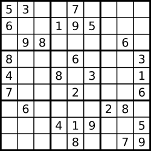

==== 合并两个有序链表

将两个有序链表合并为一个新的有序链表并返回。新链表是通过拼接给定的两个链表的所有节点组成的。  +

示例： +

----
输入：1->2->4, 1->3->4
输出：1->1->2->3->4->4
----

这道混合插入有序链表和我之前那篇混合插入有序数组非常的相似Merge Sorted Array，仅仅是数据结构由数组换成了链表而已，代码写起来反而更简洁。具体思想就是新建一个链表，然后比较两个链表中的元素值，把较小的那个链到新链表中，由于两个输入链表的长度可能不同，所以最终会有一个链表先完成插入所有元素，则直接另一个未完成的链表直接链入新链表的末尾。代码如下： +

**解法1:**
[source, cpp, linenums]
----
class Solution {
public:
    ListNode* mergeTwoLists(ListNode* l1, ListNode* l2) {
        ListNode *dummy = new ListNode(-1), *cur = dummy;
        while (l1 && l2) {
            if (l1->val < l2->val) {
                cur->next = l1;
                l1 = l1->next;
            } else {
                cur->next = l2;
                l2 = l2->next;
            }
            cur = cur->next;
        }
        cur->next = l1 ? l1 : l2;
        return dummy->next;
    }
};
----

下面我们来看递归的写法，当某个链表为空了，就返回另一个。然后核心还是比较当前两个节点值大小，如果l1的小，那么对于l1的下一个节点和l2调用递归函数，将返回值赋值给l1.next，然后返回l1；否则就对于l2的下一个节点和l1调用递归函数，将返回值赋值给l2.next，然后返回l2，参见代码如下： +

**解法2:**
[source, cpp, linenums]
----
class Solution {
public:
    ListNode* mergeTwoLists(ListNode* l1, ListNode* l2) {
        if (!l1) return l2;
        if (!l2) return l1;
        if (l1->val < l2->val) {
            l1->next = mergeTwoLists(l1->next, l2);
            return l1;
        } else {
            l2->next = mergeTwoLists(l1, l2->next);
            return l2;
        }
    }
};
----

下面这种递归的写法去掉了if从句，看起来更加简洁一些，但是思路并没有什么不同： +

[source, cpp, linenums]
----
class Solution {
public:
    ListNode* mergeTwoLists(ListNode* l1, ListNode* l2) {
        if (!l1) return l2;
        if (!l2) return l1;
        ListNode *head = l1->val < l2->val ? l1 : l2;
        ListNode *nonhead = l1->val < l2->val ? l2 : l1;
        head->next = mergeTwoLists(head->next, nonhead);
        return head;
    }
};
----

我们还可以三行搞定，简直丧心病狂有木有！ +

[source, cpp, linenums]
----
class Solution {
public:
    ListNode* mergeTwoLists(ListNode* l1, ListNode* l2) {
        if (!l1 || (l2 && l1->val > l2->val)) swap(l1, l2);
        if (l1) l1->next = mergeTwoLists(l1->next, l2);
        return l1;
    }
};
----

==== 括号生成

给出 n 代表生成括号的对数，请你写出一个函数，使其能够生成所有可能的并且有效的括号组合。 +

例如，给出 n = 3，生成结果为： +

----
[
  "((()))",
  "(()())",
  "(())()",
  "()(())",
  "()()()"
]
----
在LeetCode中有关括号的题共有三道，除了这一道的另外两道是 Valid Parentheses 验证括号和 Longest Valid Parentheses 最长有效括号，这道题给定一个数字n，让生成共有n个括号的所有正确的形式，对于这种列出所有结果的题首先还是考虑用递归Recursion来解，由于字符串只有左括号和右括号两种字符，而且最终结果必定是左括号3个，右括号3个，所以我们定义两个变量left和right分别表示剩余左右括号的个数，如果在某次递归时，左括号的个数大于右括号的个数，说明此时生成的字符串中右括号的个数大于左括号的个数，即会出现')('这样的非法串，所以这种情况直接返回，不继续处理。如果left和right都为0，则说明此时生成的字符串已有3个左括号和3个右括号，且字符串合法，则存入结果中后返回。如果以上两种情况都不满足，若此时left大于0，则调用递归函数，注意参数的更新，若right大于0，则调用递归函数，同样要更新参数。代码如下： +

**解法1:**
[source, cpp, linenums]
----
class Solution {
public:
    vector<string> generateParenthesis(int n) {
        vector<string> res;
        generateParenthesisDFS(n, n, "", res);
        return res;
    }
    void generateParenthesisDFS(int left, int right, string out, vector<string> &res) {
        if (left > right) return;
        if (left == 0 && right == 0) res.push_back(out);
        else {
            if (left > 0) generateParenthesisDFS(left - 1, right, out + '(', res);
            if (right > 0) generateParenthesisDFS(left, right - 1, out + ')', res);
        }
    }
};
----

再来看那一种方法，这种方法是CareerCup书上给的方法，感觉也是满巧妙的一种方法，这种方法的思想是找左括号，每找到一个左括号，就在其后面加一个完整的括号，最后再在开头加一个()，就形成了所有的情况，需要注意的是，有时候会出现重复的情况，所以我们用set数据结构，好处是如果遇到重复项，不会加入到结果中，最后我们再把set转为vector即可，参见代码如下： +

n＝1:    () +

n=2:    (())    ()() +

n=3:    (()())    ((()))    ()(())    (())()    ()()()  +

**解法2:**
[source, cpp, linenums]
----
class Solution {
public:
    vector<string> generateParenthesis(int n) {
        set<string> t;
        if (n == 0) t.insert("");
        else {
            vector<string> pre = generateParenthesis(n - 1);
            for (auto a : pre) {
                for (int i = 0; i < a.size(); ++i) {
                    if (a[i] == '(') {
                        a.insert(a.begin() + i + 1, '(');
                        a.insert(a.begin() + i + 2, ')');
                        t.insert(a);
                        a.erase(a.begin() + i + 1, a.begin() + i + 3);
                    }
                }
                t.insert("()" + a);
            }
        }
        return vector<string>(t.begin(), t.end());
    }
};
----

==== 合并K个排序链表

合并 k 个排序链表，返回合并后的排序链表。请分析和描述算法的复杂度。 +

示例: +

输入: +

----
[
  1->4->5,
  1->3->4,
  2->6
]
输出: 1->1->2->3->4->4->5->6
----

这道题让我们合并k个有序链表，之前我们做过一道Merge Two Sorted Lists 混合插入有序链表，是混合插入两个有序链表。
这道题增加了难度，变成合并k个有序链表了，但是不管合并几个，基本还是要两两合并。那么我们首先考虑的方法是能不能利用之前那道题的解法来解答此题。
答案是肯定的，但是需要修改，怎么修改呢，最先想到的就是两两合并，就是前两个先合并，合并好了再跟第三个，然后第四个直到第k个。
这样的思路是对的，但是效率不高，没法通过OJ，所以我们只能换一种思路，这里就需要用到分治法 Divide and Conquer Approach。简单来说就是不停的对半划分，
比如k个链表先划分为合并两个k/2个链表的任务，再不停的往下划分，直到划分成只有一个或两个链表的任务，开始合并。举个例子来说比如合并6个链表，
那么按照分治法，我们首先分别合并1和4,2和5,3和6。这样下一次只需合并3个链表，我们再合并1和3，最后和2合并就可以了。参见代码如下： +

**解法1:**
[source, cpp, linenums]
----
class Solution {
public:
    ListNode *mergeKLists(vector<ListNode *> &lists) {
        if (lists.size() == 0) return NULL;
        int n = lists.size();
        while (n > 1) {
            int k = (n + 1) / 2;
            for (int i = 0; i < n / 2; ++i) {
                lists[i] = mergeTwoLists(lists[i], lists[i + k]);
            }
            n = k;
        }
        return lists[0];
    }

    ListNode *mergeTwoLists(ListNode *l1, ListNode *l2) {
        ListNode *head = new ListNode(-1);
        ListNode *cur = head;
        while (l1 && l2) {
            if (l1->val < l2->val) {
                cur->next = l1;
                l1 = l1->next;
            } else {
                cur->next = l2;
                l2 = l2->next;
            }
            cur = cur->next;
        }
        if (l1) cur->next = l1;
        if (l2) cur->next = l2;
        return head->next;
    }
};
----

我们再来看另一种解法，这种解法利用了最小堆这种数据结构，我们首先把k个链表的首元素都加入最小堆中，它们会自动排好序。然后我们每次取出最小的那个元素加入我们最终结果的链表中，然后把取出元素的下一个元素再加入堆中，下次仍从堆中取出最小的元素做相同的操作，以此类推，直到堆中没有元素了，此时k个链表也合并为了一个链表，返回首节点即可，代码如下： +

[source, cpp, linenums]
----
struct cmp {
    bool operator () (ListNode *a, ListNode *b) {
        return a->val > b->val;
    }
};

class Solution {
public:
    ListNode *mergeKLists(vector<ListNode *> &lists) {
        priority_queue<ListNode*, vector<ListNode*>, cmp> q;
        for (int i = 0; i < lists.size(); ++i) {
            if (lists[i]) q.push(lists[i]);
        }
        ListNode *head = NULL, *pre = NULL, *tmp = NULL;
        while (!q.empty()) {
            tmp = q.top();
            q.pop();
            if (!pre) head = tmp;
            else pre->next = tmp;
            pre = tmp;
            if (tmp->next) q.push(tmp->next);
        }
        return head;
    }
};
----

==== 两两交换链表中的节点

给定一个链表，两两交换其中相邻的节点，并返回交换后的链表。 +

示例: +

----
给定 1->2->3->4, 你应该返回 2->1->4->3.
----
说明: +
--
* 你的算法只能使用常数的额外空间。
* 你不能只是单纯的改变节点内部的值，而是需要实际的进行节点交换。
--

这道题不算难，是基本的链表操作题，我们可以分别用递归和迭代来实现。对于迭代实现，还是需要建立dummy节点，注意在连接节点的时候，最好画个图，以免把自己搞晕了，参见代码如下： +

**解法1:**
[source, cpp, linenums]
----
class Solution {
public:
    ListNode* swapPairs(ListNode* head) {
        ListNode *dummy = new ListNode(-1), *pre = dummy;
        dummy->next = head;
        while (pre->next && pre->next->next) {
            ListNode *t = pre->next->next;
            pre->next->next = t->next;
            t->next = pre->next;
            pre->next = t;
            pre = t->next;
        }
        return dummy->next;
    }
};
----

递归的写法就更简洁了，实际上利用了回溯的思想，递归遍历到链表末尾，然后先交换末尾两个，然后依次往前交换： +
[source, cpp, linenums]
----
class Solution {
public:
    ListNode* swapPairs(ListNode* head) {
        if (!head || !head->next) return head;
        ListNode *t = head->next;
        head->next = swapPairs(head->next->next);
        t->next = head;
        return t;
    }
};
----

==== k个一组翻转链表

给出一个链表，每 k 个节点一组进行翻转，并返回翻转后的链表。 +

k 是一个正整数，它的值小于或等于链表的长度。如果节点总数不是 k 的整数倍，那么将最后剩余节点保持原有顺序。 +

示例 : +

给定这个链表：1->2->3->4->5 +

当 k = 2 时，应当返回: 2->1->4->3->5 +

当 k = 3 时，应当返回: 3->2->1->4->5 +

说明 : +

--
* 你的算法只能使用常数的额外空间。
* 你不能只是单纯的改变节点内部的值，而是需要实际的进行节点交换。
--

这道题让我们以每k个为一组来翻转链表，实际上是把原链表分成若干小段，然后分别对其进行翻转，那么肯定总共需要两个函数，一个是用来分段的，一个是用来翻转的，我们就以题目中给的例子来看，对于给定链表1->2->3->4->5，一般在处理链表问题时，我们大多时候都会在开头再加一个dummy node，因为翻转链表时头结点可能会变化，为了记录当前最新的头结点的位置而引入的dummy node，那么我们加入dummy node后的链表变为-1->1->2->3->4->5，如果k为3的话，我们的目标是将1,2,3翻转一下，那么我们需要一些指针，pre和next分别指向要翻转的链表的前后的位置，然后翻转后pre的位置更新到如下新的位置： +

----
-1->1->2->3->4->5
 |           |
pre         next

-1->3->2->1->4->5
          |  |
         pre next
----

以此类推，只要next走过k个节点，就可以调用翻转函数来进行局部翻转了，代码如下所示： +

[source, cpp, linenums]
----
class Solution {
public:
    ListNode *reverseKGroup(ListNode *head, int k) {
        if (!head || k == 1) return head;
        ListNode *dummy = new ListNode(-1);
        ListNode *pre = dummy, *cur = head;
        dummy->next = head;
        int i = 0;
        while (cur) {
            ++i;
            if (i % k == 0) {
                pre = reverseOneGroup(pre, cur->next);
                cur = pre->next;
            } else {
                cur = cur->next;
            }
        }
        return dummy->next;
    }
    ListNode *reverseOneGroup(ListNode *pre, ListNode *next) {
        ListNode *last = pre->next;
        ListNode *cur = last->next;
        while(cur != next) {
            last->next = cur->next;
            cur->next = pre->next;
            pre->next = cur;
            cur = last->next;
        }
        return last;
    }
};
----

我们也可以在一个函数中完成，我们首先遍历整个链表，统计出链表的长度，然后如果长度大于等于k，我们开始交换节点，当k=2时，每段我们只需要交换一次，当k=3时，每段需要交换2此，所以i从1开始循环，注意交换一段后更新pre指针，然后num自减k，直到num<k时循环结束，参见代码如下： +

[source, cpp, linenums]
----
class Solution {
public:
    ListNode* reverseKGroup(ListNode* head, int k) {
        ListNode *dummy = new ListNode(-1), *pre = dummy, *cur = pre;
        dummy->next = head;
        int num = 0;
        while (cur = cur->next) ++num;
        while (num >= k) {
            cur = pre->next;
            for (int i = 1; i < k; ++i) {
                ListNode *t = cur->next;
                cur->next = t->next;
                t->next = pre->next;
                pre->next = t;
            }
            pre = cur;
            num -= k;
        }
        return dummy->next;
    }
};
----

我们也可以使用递归来做，我们用head记录每段的开始位置，cur记录结束位置的下一个节点，然后我们调用reverse函数来将这段翻转，然后得到一个new_head，原来的head就变成了末尾，这时候后面接上递归调用下一段得到的新节点，返回new_head即可，参见代码如下： +
[source, cpp, linenums]
----
class Solution {
public:
    ListNode* reverseKGroup(ListNode* head, int k) {
        ListNode *cur = head;
        for (int i = 0; i < k; ++i) {
            if (!cur) return head;
            cur = cur->next;
        }
        ListNode *new_head = reverse(head, cur);
        head->next = reverseKGroup(cur, k);
        return new_head;
    }
    ListNode* reverse(ListNode* head, ListNode* tail) {
        ListNode *pre = tail;
        while (head != tail) {
            ListNode *t = head->next;
            head->next = pre;
            pre = head;
            head = t;
        }
        return pre;
    }
};
----

==== 删除排序数组中的重复项

给定一个排序数组，你需要在原地删除重复出现的元素，使得每个元素只出现一次，返回移除后数组的新长度。 +

不要使用额外的数组空间，你必须在原地修改输入数组并在使用 O(1) 额外空间的条件下完成。 +

**示例 1:** +
----
给定数组 nums = [1,1,2],

函数应该返回新的长度 2, 并且原数组 nums 的前两个元素被修改为 1, 2。

你不需要考虑数组中超出新长度后面的元素。
----

**示例 2:** +
----
给定 nums = [0,0,1,1,1,2,2,3,3,4],

函数应该返回新的长度 5, 并且原数组 nums 的前五个元素被修改为 0, 1, 2, 3, 4。

你不需要考虑数组中超出新长度后面的元素。
----

**说明** +
为什么返回数值是整数，但输出的答案是数组呢? +

请注意，输入数组是以“引用”方式传递的，这意味着在函数里修改输入数组对于调用者是可见的。 +

你可以想象内部操作如下: +
----
// nums 是以“引用”方式传递的。也就是说，不对实参做任何拷贝
int len = removeDuplicates(nums);

// 在函数里修改输入数组对于调用者是可见的。
// 根据你的函数返回的长度, 它会打印出数组中该长度范围内的所有元素。
for (int i = 0; i < len; i++) {
    print(nums[i]);
}
----

这道题要我们从有序数组中去除重复项，和之前那道 Remove Duplicates from Sorted List 移除有序链表中的重复项的题很类似，
但是要简单一些，因为毕竟数组的值可以通过下标直接访问，而链表不行。那么这道题的解题思路是，我们使用快慢指针来记录遍历的坐标，
最开始时两个指针都指向第一个数字，如果两个指针指的数字相同，则快指针向前走一步，如果不同，则两个指针都向前走一步，
这样当快指针走完整个数组后，慢指针当前的坐标加1就是数组中不同数字的个数，代码如下： +

**解法1:** +
[source, cpp, linenums]
----
class Solution {
public:
    int removeDuplicates(vector<int>& nums) {
        if (nums.empty()) return 0;
        int pre = 0, cur = 0, n = nums.size();
        while (cur < n) {
            if (nums[pre] == nums[cur]) ++cur;
            else nums[++pre] = nums[cur++];
        }
        return pre + 1;
    }
};
----

我们也可以用for循环来写，这里的j就是上面解法中的pre，i就是cur，所以本质上都是一样的，参见代码如下： +

**解法2:** +
[source, cpp, linenums]
----
class Solution {
public:
    int removeDuplicates(vector<int>& nums) {
        if (nums.empty()) return 0;
        int j = 0, n = nums.size();
        for (int i = 0; i < n; ++i) {
            if (nums[i] != nums[j]) nums[++j] = nums[i];
        }
        return j + 1;
    }
};
----

==== 移除元素

给定一个数组 nums 和一个值 val，你需要原地移除所有数值等于 val 的元素，返回移除后数组的新长度。 +

不要使用额外的数组空间，你必须在原地修改输入数组并在使用 O(1) 额外空间的条件下完成。 +

元素的顺序可以改变。你不需要考虑数组中超出新长度后面的元素。 +

**示例 1:** +
----
给定 nums = [3,2,2,3], val = 3,

函数应该返回新的长度 2, 并且 nums 中的前两个元素均为 2。

你不需要考虑数组中超出新长度后面的元素。
----

**示例 2:** +
----
给定 nums = [0,1,2,2,3,0,4,2], val = 2,

函数应该返回新的长度 5, 并且 nums 中的前五个元素为 0, 1, 3, 0, 4。

注意这五个元素可为任意顺序。

你不需要考虑数组中超出新长度后面的元素。
----

**说明:** +

为什么返回数值是整数，但输出的答案是数组呢? +

请注意，输入数组是以“引用”方式传递的，这意味着在函数里修改输入数组对于调用者是可见的。 +

你可以想象内部操作如下: +
----
// nums 是以“引用”方式传递的。也就是说，不对实参作任何拷贝
int len = removeElement(nums, val);

// 在函数里修改输入数组对于调用者是可见的。
// 根据你的函数返回的长度, 它会打印出数组中该长度范围内的所有元素。
for (int i = 0; i < len; i++) {
    print(nums[i]);
}
----

这道题让我们移除一个数组中和给定值相同的数字，并返回新的数组的长度。是一道比较容易的题，我们只需要一个变量用来计数，然后遍历原数组，如果当前的值和给定值不同，我们就把当前值覆盖计数变量的位置，并将计数变量加1。代码如下： +
[source, cpp, linenums]
----
class Solution {
public:
    int removeElement(vector<int>& nums, int val) {
        int res = 0;
        for (int i = 0; i < nums.size(); ++i) {
            if (nums[i] != val) nums[res++] = nums[i];
        }
        return res;
    }
};
----

==== 实现strStr()

实现 strStr() 函数。 +

给定一个 haystack 字符串和一个 needle 字符串，在 haystack 字符串中找出 needle 字符串出现的第一个位置 (从0开始)。如果不存在，则返回  -1。 +

**示例 1:** +
----
输入: haystack = "hello", needle = "ll"
输出: 2
----

**示例 2:** +
----
输入: haystack = "aaaaa", needle = "bba"
输出: -1
----

**说明:** +

当 needle 是空字符串时，我们应当返回什么值呢？这是一个在面试中很好的问题。 +

对于本题而言，当 needle 是空字符串时我们应当返回 0 。这与C语言的 strstr() 以及 Java的 indexOf() 定义相符。 +

这道题让我们在一个字符串中找另一个字符串第一次出现的位置，那我们首先要做一些判断，如果子字符串为空，则返回0，如果子字符串长度大于母字符串长度，则返回-1。然后我们开始遍历母字符串，我们并不需要遍历整个母字符串，而是遍历到剩下的长度和子字符串相等的位置即可，这样可以提高运算效率。然后对于每一个字符，我们都遍历一遍子字符串，一个一个字符的对应比较，如果对应位置有不等的，则跳出循环，如果一直都没有跳出循环，则说明子字符串出现了，则返回起始位置即可，代码如下： +

[source, cpp, linenums]
----
class Solution {
public:
    int strStr(string haystack, string needle) {
        if (needle.empty()) return 0;
        int m = haystack.size(), n = needle.size();
        if (m < n) return -1;
        for (int i = 0; i <= m - n; ++i) {
            int j = 0;
            for (j = 0; j < n; ++j) {
                if (haystack[i + j] != needle[j]) break;
            }
            if (j == n) return i;
        }
        return -1;
    }
};
----

==== 两数相除

给定两个整数，被除数 dividend 和除数 divisor。将两数相除，要求不使用乘法、除法和 mod 运算符。 +

返回被除数 dividend 除以除数 divisor 得到的商。 +

**示例 1:** +
----
输入: dividend = 10, divisor = 3
输出: 3
----

**示例 2:** +
----
输入: dividend = 7, divisor = -3
输出: -2
----

**说明:** +
--
* 被除数和除数均为 32 位有符号整数
* 除数不为 0
* 假设我们的环境只能存储 32 位有符号整数，其数值范围是 [−2^31,  2^31 − 1]。本题中，如果除法结果溢出，则返回 2^31 − 1
--

这道题让我们求两数相除，而且规定我们不能用乘法，除法和取余操作，那么我们还可以用另一神器位操作Bit Operation，思路是，如果被除数大于或等于除数，则进行如下循环，定义变量t等于除数，定义计数p，当t的两倍小于等于被除数时，进行如下循环，t扩大一倍，p扩大一倍，然后更新res和m。这道题的OJ给的一些test case非常的讨厌，因为输入的都是int型，比如被除数是-2147483648，在int范围内，当除数是-1时，结果就超出了int范围，需要返回INT_MAX，所以对于这种情况我们就在开始用if判定，将其和除数为0的情况放一起判定，返回INT_MAX。然后我们还要根据被除数和除数的正负来确定返回值的正负，这里我们采用长整型long来完成所有的计算，最后返回值乘以符号即可，代码如下： +

**解法1:** +
[source, cpp, linenums]
----
class Solution {
public:
    int divide(int dividend, int divisor) {
        if (divisor == 0 || (dividend == INT_MIN && divisor == -1)) return INT_MAX;
        long long m = abs((long long)dividend), n = abs((long long)divisor), res = 0;
        int sign = ((dividend < 0) ^ (divisor < 0)) ? -1 : 1;
        if (n == 1) return sign == 1 ? m : -m;
        while (m >= n) {
            long long t = n, p = 1;
            while (m >= (t << 1)) {
                t <<= 1;
                p <<= 1;
            }
            res += p;
            m -= t;
        }
        return sign == 1 ? res : -res;
    }
};
----

我们可以使上面的解法变得更加简洁： +
[source, cpp, linenums]
----
class Solution {
public:
    int divide(int dividend, int divisor) {
        long long m = abs((long long)dividend), n = abs((long long)divisor), res = 0;
        if (m < n) return 0;
        while (m >= n) {
            long long t = n, p = 1;
            while (m > (t << 1)) {
                t <<= 1;
                p <<= 1;
            }
            res += p;
            m -= t;
        }
        if ((dividend < 0) ^ (divisor < 0)) res = -res;
        return res > INT_MAX ? INT_MAX : res;
    }
};
----

我们也可以通过递归的方法来解，思路都一样： +
[source, cpp, linenums]
----
class Solution {
public:
    int divide(int dividend, int divisor) {
        long long res = 0;
        long long m = abs((long long)dividend), n = abs((long long)divisor);
        if (m < n) return 0;
        long long t = n, p = 1;
        while (m > (t << 1)) {
            t <<= 1;
            p <<= 1;
        }
        res += p + divide(m - t, n);
        if ((dividend < 0) ^ (divisor < 0)) res = -res;
        return res > INT_MAX ? INT_MAX : res;
    }
};
----

==== 与所有单词相关联的字串

给定一个字符串 s 和一些长度相同的单词 words。在 s 中找出可以恰好串联 words 中所有单词的子串的起始位置。 +

注意子串要与 words 中的单词完全匹配，中间不能有其他字符，但不需要考虑 words 中单词串联的顺序。 +

**示例 1:** +
----
输入:
  s = "barfoothefoobarman",
  words = ["foo","bar"]
输出: [0,9]
解释: 从索引 0 和 9 开始的子串分别是 "barfoor" 和 "foobar" 。
输出的顺序不重要, [9,0] 也是有效答案。
----

**示例 2:** +
----
输入:
  s = "wordgoodstudentgoodword",
  words = ["word","student"]
输出: []
----

这道题让我们求串联所有单词的子串，就是说给定一个长字符串，再给定几个长度相同的单词，
让我们找出串联给定所有单词的子串的起始位置，还是蛮有难度的一道题。这道题我们需要用到两个哈希表，
第一个哈希表先把所有的单词存进去，然后从开头开始一个个遍历，停止条件为当剩余字符个数小于单词集里所有字符的长度。
这时候我们需要定义第二个哈希表，然后每次找出给定单词长度的子串，看其是否在第一个哈希表里，如果没有，则break，
如果有，则加入第二个哈希表，但相同的词只能出现一次，如果多了，也break。如果正好匹配完给定单词集里所有的单词，
则把i存入结果中，具体参见代码如下： +

**解法1:** +
[source, cpp, linenums]
----
class Solution {
public:
    vector<int> findSubstring(string s, vector<string>& words) {
        vector<int> res;
        if (s.empty() || words.empty()) return res;
        int n = words.size(), m = words[0].size();
        unordered_map<string, int> m1;
        for (auto &a : words) ++m1[a];
        for (int i = 0; i <= (int)s.size() - n * m; ++i) {
            unordered_map<string, int> m2;
            int j = 0;
            for (j = 0; j < n; ++j) {
                string t = s.substr(i + j * m, m);
                if (m1.find(t) == m1.end()) break;
                ++m2[t];
                if (m2[t] > m1[t]) break;
            }
            if (j == n) res.push_back(i);
        }
        return res;
    }
};
----

这道题还有一种O(n)时间复杂度的解法，设计思路非常巧妙，但是感觉很难想出来，博主目测还未到达这种水平。
这种方法不再是一个字符一个字符的遍历，而是一个词一个词的遍历，比如根据题目中的例子，字符串s的长度n为18，
words数组中有两个单词(cnt=2)，每个单词的长度len均为3，那么遍历的顺序为0，3，6，8，12，15，
然后偏移一个字符1，4，7，9，13，16，然后再偏移一个字符2，5，8，10，14，17，这样就可以把所有情况都遍历到，
我们还是先用一个哈希表m1来记录words里的所有词，然后我们从0开始遍历，用left来记录左边界的位置，
count表示当前已经匹配的单词的个数。然后我们一个单词一个单词的遍历，如果当前遍历的到的单词t在m1中存在，
那么我们将其加入另一个哈希表m2中，如果在m2中个数小于等于m1中的个数，那么我们count自增1，如果大于了，那么需要做一些处理，
比如下面这种情况, s = barfoofoo, words = {bar, foo, abc}, 我们给words中新加了一个abc，
目的是为了遍历到barfoo不会停止，那么当遍历到第二foo的时候, m2[foo]=2, 而此时m1[foo]=1，这是后已经不连续了，
所以我们要移动左边界left的位置，我们先把第一个词t1=bar取出来，然后将m2[t1]自减1，如果此时m2[t1]<m1[t1]了，
说明一个匹配没了，那么对应的count也要自减1，然后左边界加上个len，这样就可以了。如果某个时刻count和cnt相等了，
说明我们成功匹配了一个位置，那么将当前左边界left存入结果res中，此时去掉最左边的一个词，同时count自减1，左边界右移len，
继续匹配。如果我们匹配到一个不在m1中的词，那么说明跟前面已经断开了，我们重置m2，count为0，左边界left移到j+len，
参见代码如下： +

**解法2:** +
[source, cpp, linenums]
----
class Solution {
public:
    vector<int> findSubstring(string s, vector<string>& words) {
        if (s.empty() || words.empty()) return {};
        vector<int> res;
        int n = s.size(), cnt = words.size(), len = words[0].size();
        unordered_map<string, int> m1;
        for (string w : words) ++m1[w];
        for (int i = 0; i < len; ++i) {
            int left = i, count = 0;
            unordered_map<string, int> m2;
            for (int j = i; j <= n - len; j += len) {
                string t = s.substr(j, len);
                if (m1.count(t)) {
                    ++m2[t];
                    if (m2[t] <= m1[t]) {
                        ++count;
                    } else {
                        while (m2[t] > m1[t]) {
                            string t1 = s.substr(left, len);
                            --m2[t1];
                            if (m2[t1] < m1[t1]) --count;
                            left += len;
                        }
                    }
                    if (count == cnt) {
                        res.push_back(left);
                        --m2[s.substr(left, len)];
                        --count;
                        left += len;
                    }
                } else {
                    m2.clear();
                    count = 0;
                    left = j + len;
                }
            }
        }
        return res;
    }
};
----

==== 下一个排列

实现获取下一个排列的函数，算法需要将给定数字序列重新排列成字典序中下一个更大的排列。 +

如果不存在下一个更大的排列，则将数字重新排列成最小的排列（即升序排列）。 +

必须原地修改，只允许使用额外常数空间。 +

以下是一些例子，输入位于左侧列，其相应输出位于右侧列。 +
----
1,2,3 → 1,3,2
3,2,1 → 1,2,3
1,1,5 → 1,5,1
----

这道题让我们求下一个排列顺序，有题目中给的例子可以看出来，如果给定数组是降序，则说明是全排列的最后一种情况，则下一个排列就是最初始情况，可以参见之前的博客 Permutations 全排列。我们再来看下面一个例子，有如下的一个数组 +
1　　2　　7　　4　　3　　1 +
下一个排列为： +
1　　3　　1　　2　　4　　7 +

那么是如何得到的呢，我们通过观察原数组可以发现，如果从末尾往前看，数字逐渐变大，到了2时才减小的，然后我们再从后往前找第一个比2大的数字，是3，那么我们交换2和3，再把此时3后面的所有数字转置一下即可，步骤如下： +

1　　**2**　　7　　4　　3　　1 +

1　　**2**　　7　　4　　**3**　　1 +

1　　**3**　　7　　4　　**2**　　1 +

1　　3　　**1**　　**2**　　**4**　　**7** +

**解法1:** +
[source, cpp, linenums]
----
class Solution {
public:
    void nextPermutation(vector<int> &num) {
        int i, j, n = num.size();
        for (i = n - 2; i >= 0; --i) {
            if (num[i + 1] > num[i]) {
                for (j = n - 1; j > i; --j) {
                    if (num[j] > num[i]) break;
                }
                swap(num[i], num[j]);
                reverse(num.begin() + i + 1, num.end());
                return;
            }
        }
        reverse(num.begin(), num.end());
    }
};
----

下面这种写法更简洁一些，但是整体思路和上面的解法没有什么区别，参见代码如下： +
**解法2:** +
[source, cpp, linenums]
----
class Solution {
public:
    void nextPermutation(vector<int>& nums) {int n = nums.size(), i = n - 2, j = n - 1;
        while (i >= 0 && nums[i] >= nums[i + 1]) --i;
        if (i >= 0) {
            while (nums[j] <= nums[i]) --j;
            swap(nums[i], nums[j]);
        }
        reverse(nums.begin() + i + 1, nums.end());
    }
};
----

==== 最长有效括号

给定一个只包含 '(' 和 ')' 的字符串，找出最长的包含有效括号的子串的长度。 +

**示例 1:** +
----
输入: "(()"
输出: 2
解释: 最长有效括号子串为 "()"
----

**示例 2:** +
----
输入: ")()())"
输出: 4
解释: 最长有效括号子串为 "()()"
----

这道求最长有效括号比之前那道 Valid Parentheses 验证括号难度要大一些，这里我们还是借助栈来求解，需要定义个start变量来记录合法括号串的起始位置，我们遍历字符串，如果遇到左括号，则将当前下标压入栈，如果遇到右括号，如果当前栈为空，则将下一个坐标位置记录到start，如果栈不为空，则将栈顶元素取出，此时若栈为空，则更新结果和i - start + 1中的较大值，否则更新结果和i - 栈顶元素中的较大值，代码如下： +

[source, cpp, linenums]
----
class Solution {
public:
    int longestValidParentheses(string s) {
        int res = 0, start = 0;
        stack<int> m;
        for (int i = 0; i < s.size(); ++i) {
            if (s[i] == '(') m.push(i);
            else if (s[i] == ')') {
                if (m.empty()) start = i + 1;
                else {
                    m.pop();
                    res = m.empty() ? max(res, i - start + 1) : max(res, i - m.top());
                }
            }
        }
        return res;
    }
};
----

==== 搜索旋转排序数组

假设按照升序排序的数组在预先未知的某个点上进行了旋转。 +

( 例如，数组 [0,1,2,4,5,6,7] 可能变为 [4,5,6,7,0,1,2] )。 +

搜索一个给定的目标值，如果数组中存在这个目标值，则返回它的索引，否则返回 -1 。 +

你可以假设数组中不存在重复的元素。 +

你的算法时间复杂度必须是 O(log n) 级别。 +

**示例 1:** +
----
输入: nums = [4,5,6,7,0,1,2], target = 0
输出: 4
----

**示例 2:** +
----
输入: nums = [4,5,6,7,0,1,2], target = 3
输出: -1
----
这道题让在旋转数组中搜索一个给定值，若存在返回坐标，若不存在返回-1。我们还是考虑二分搜索法，但是这道题的难点在于我们不知道原数组在哪旋转了，我们还是用题目中给的例子来分析，对于数组[0 1 2 4 5 6 7] 共有下列七种旋转方法： +

0　　1　　2　　 4　　5　　6　　7 +

7　　0　　1　　 2　　4　　5　　6 +

6　　7　　0　　 1　　2　　4　　5 +

5　　6　　7　　 0　　1　　2　　4 +

4　　5　　6　　7　　0　　1　　2 +

2　　4　　5　　6　　7　　0　　1 +

1　　2　　4　　5　　6　　7　　0 +

二分搜索法的关键在于获得了中间数后，判断下面要搜索左半段还是右半段，我们观察上面红色的数字都是升序的，由此我们可以观察出规律，如果中间的数小于最右边的数，则右半段是有序的，若中间数大于最右边数，则左半段是有序的，我们只要在有序的半段里用首尾两个数组来判断目标值是否在这一区域内，这样就可以确定保留哪半边了，代码如下： +
[source, cpp, linenums]
----
class Solution {
public:
    int search(vector<int>& nums, int target) {
        int left = 0, right = nums.size() - 1;
        while (left <= right) {
            int mid = left + (right - left) / 2;
            if (nums[mid] == target) return mid;
            else if (nums[mid] < nums[right]) {
                if (nums[mid] < target && nums[right] >= target) left = mid + 1;
                else right = mid - 1;
            } else {
                if (nums[left] <= target && nums[mid] > target) right = mid - 1;
                else left = mid + 1;
            }
        }
        return -1;
    }
};
----

==== 在排序数组中查找元素的第一个和最后一个位置

给定一个按照升序排列的整数数组 nums，和一个目标值 target。找出给定目标值在数组中的开始位置和结束位置。 +

你的算法时间复杂度必须是 O(log n) 级别。 +

如果数组中不存在目标值，返回 [-1, -1]。 +

**示例 1:** +

----
输入: nums = [5,7,7,8,8,10], target = 8
输出: [3,4]
----

**示例 2:** +
----
输入: nums = [5,7,7,8,8,10], target = 6
输出: [-1,-1]
----
这道题让我们在一个有序整数数组中寻找相同目标值的起始和结束位置，而且限定了时间复杂度为O(logn)，这是典型的二分查找法的时间复杂度，所以这道题我们也需要用此方法，我们的思路是首先对原数组使用二分查找法，找出其中一个目标值的位置，然后向两边搜索找出起始和结束的位置，代码如下： +

**解法1:** +
[source,cpp,linenums]
----
class Solution {
public:
    vector<int> searchRange(vector<int>& nums, int target) {
        int idx = search(nums, 0, nums.size() - 1, target);
        if (idx == -1) return {-1, -1};
        int left = idx, right = idx;
        while (left > 0 && nums[left - 1] == nums[idx]) --left;
        while (right < nums.size() - 1 && nums[right + 1] == nums[idx]) ++right;
        return {left, right};
    }
    int search(vector<int>& nums, int left, int right, int target) {
        if (left > right) return -1;
        int mid = left + (right - left) / 2;
        if (nums[mid] == target) return mid;
        else if (nums[mid] < target) return search(nums, mid + 1, right, target);
        else return search(nums, left, mid - 1, target);
    }
};
----

可能有些人会觉得上面的算法不是严格意义上的O(logn)的算法，因为在最坏的情况下会变成O(n)，比如当数组里的数全是目标值的话，从中间向两边找边界就会一直遍历完整个数组，那么我们下面来看一种真正意义上的O(logn)的算法，使用两次二分查找法，第一次找到左边界，第二次调用找到右边界即可，具体代码如下： +

**解法2:** +
[source, cpp, linenums]
----
class Solution {
public:
    vector<int> searchRange(vector<int>& nums, int target) {
        vector<int> res(2, -1);
        int left = 0, right = nums.size() - 1;
        while (left < right) {
            int mid = left + (right - left) / 2;
            if (nums[mid] < target) left = mid + 1;
            else right = mid;
        }
        if (nums[right] != target) return res;
        res[0] = right;
        right = nums.size();
        while (left < right) {
            int mid = left + (right - left) / 2;
            if (nums[mid] <= target) left = mid + 1;
            else right= mid;
        }
        res[1] = left - 1;
        return res;
    }
};
----

==== 搜索插入位置

给定一个排序数组和一个目标值，在数组中找到目标值，并返回其索引。如果目标值不存在于数组中，返回它将会被按顺序插入的位置。 +

你可以假设数组中无重复元素。 +

**示例 1:** +
----
输入: [1,3,5,6], 5
输出: 2
----

**示例 2:** +
----
输入: [1,3,5,6], 2
输出: 1
----

**示例 3:** +
----
输入: [1,3,5,6], 7
输出: 4
----

**示例 4:** +
----
输入: [1,3,5,6], 0
输出: 0
----

这道题基本没有什么难度，实在不理解为啥还是Medium难度的，完完全全的应该是Easy啊，三行代码搞定的题，只需要遍历一遍原数组，若当前数字大于或等于目标值，则返回当前坐标，如果遍历结束了，说明目标值比数组中任何一个数都要大，则返回数组长度n即可，代码如下： +

**解法1:** +
[source, cpp, linenums]
----
class Solution {
public:
    int searchInsert(vector<int>& nums, int target) {
        for (int i = 0; i < nums.size(); ++i) {
            if (nums[i] >= target) return i;
        }
        return nums.size();
    }
};
----

当然，我们还可以用二分搜索法来优化我们的时间复杂度，而且个人认为这种方法应该是面试官们想要考察的算法吧，参见代码如下： +

**解法2:** +
[source, cpp, linenums]
----
class Solution {
public:
    int searchInsert(vector<int>& nums, int target) {
        if (nums.back() < target) return nums.size();
        int left = 0, right = nums.size() - 1;
        while (left < right) {
            int mid = left + (right - left) / 2;
            if (nums[mid] == target) return mid;
            else if (nums[mid] < target) left = mid + 1;
            else right = mid;
        }
        return right;
    }
};
----

==== 有效的数独

判断一个 9x9 的数独是否有效。只需要根据以下规则，验证已经填入的数字是否有效即可。 +

--
* 数字 1-9 在每一行只能出现一次。
* 数字 1-9 在每一列只能出现一次。
* 数字 1-9 在每一个以粗实线分隔的 3x3 宫内只能出现一次。
--

image::images/question_36.png[width="30%", height="35%"]

上图是一个部分填充的有效的数独。 +
数独部分空格内已填入了数字，空白格用 '.' 表示。 +

**示例 1:** +
----
输入:
[
  ["5","3",".",".","7",".",".",".","."],
  ["6",".",".","1","9","5",".",".","."],
  [".","9","8",".",".",".",".","6","."],
  ["8",".",".",".","6",".",".",".","3"],
  ["4",".",".","8",".","3",".",".","1"],
  ["7",".",".",".","2",".",".",".","6"],
  [".","6",".",".",".",".","2","8","."],
  [".",".",".","4","1","9",".",".","5"],
  [".",".",".",".","8",".",".","7","9"]
]
输出: true
----

**示例 2:** +
----
输入:
[
  ["8","3",".",".","7",".",".",".","."],
  ["6",".",".","1","9","5",".",".","."],
  [".","9","8",".",".",".",".","6","."],
  ["8",".",".",".","6",".",".",".","3"],
  ["4",".",".","8",".","3",".",".","1"],
  ["7",".",".",".","2",".",".",".","6"],
  [".","6",".",".",".",".","2","8","."],
  [".",".",".","4","1","9",".",".","5"],
  [".",".",".",".","8",".",".","7","9"]
]
输出: false
解释: 除了第一行的第一个数字从 5 改为 8 以外，空格内其他数字均与 示例1 相同。
     但由于位于左上角的 3x3 宫内有两个 8 存在, 因此这个数独是无效的。
----

**说明:** +
--
* 一个有效的数独（部分已被填充）不一定是可解的。
* 只需要根据以上规则，验证已经填入的数字是否有效即可。
* 给定数独序列只包含数字 1-9 和字符 '.' 。
* 给定数独永远是 9x9 形式的。
--
这道题让我们验证一个方阵是否为数独矩阵，判断标准是看各行各列是否有重复数字，以及每个小的3x3的小方阵里面是否有重复数字，如果都无重复，则当前矩阵是数独矩阵，但不代表待数独矩阵有解，只是单纯的判断当前未填完的矩阵是否是数独矩阵。那么根据数独矩阵的定义，我们在遍历每个数字的时候，就看看包含当前位置的行和列以及3x3小方阵中是否已经出现该数字，那么我们需要三个标志矩阵，分别记录各行，各列，各小方阵是否出现某个数字，其中行和列标志下标很好对应，就是小方阵的下标需要稍稍转换一下，具体代码如下： +

[source, cpp, linenums]
----
class Solution {
public:
    bool isValidSudoku(vector<vector<char> > &board) {
        if (board.empty() || board[0].empty()) return false;
        int m = board.size(), n = board[0].size();
        vector<vector<bool> > rowFlag(m, vector<bool>(n, false));
        vector<vector<bool> > colFlag(m, vector<bool>(n, false));
        vector<vector<bool> > cellFlag(m, vector<bool>(n, false));
        for (int i = 0; i < m; ++i) {
            for (int j = 0; j < n; ++j) {
                if (board[i][j] >= '1' && board[i][j] <= '9') {
                    int c = board[i][j] - '1';
                    if (rowFlag[i][c] || colFlag[c][j] || cellFlag[3 * (i / 3) + j / 3][c]) return false;
                    rowFlag[i][c] = true;
                    colFlag[c][j] = true;
                    cellFlag[3 * (i / 3) + j / 3][c] = true;
                }
            }
        }
        return true;
    }
};
----

==== 解数独

编写一个程序，通过已填充的空格来解决数独问题。 +

一个数独的解法需遵循如下规则： +
--
* 数字 1-9 在每一行只能出现一次。
* 数字 1-9 在每一列只能出现一次。
* 数字 1-9 在每一个以粗实线分隔的 3x3 宫内只能出现一次。
--
空白格用 '.' 表示。 +

一个数独。 +

image::images/question_37_2.png[width="30%", height="35%"]

这道求解数独的题是在之前那道 Valid Sudoku 验证数独的基础上的延伸，之前那道题让我们验证给定的数组是否为数独数组，这道让我们求解数独数组，跟此题类似的有 Permutations 全排列，Combinations 组合项， N-Queens N皇后问题等等，其中尤其是跟 N-Queens N皇后问题的解题思路及其相似，对于每个需要填数字的格子带入1到9，每代入一个数字都判定其是否合法，如果合法就继续下一次递归，结束时把数字设回'.'，判断新加入的数字是否合法时，只需要判定当前数字是否合法，不需要判定这个数组是否为数独数组，因为之前加进的数字都是合法的，这样可以使程序更加高效一些，具体实现如代码所示： +

[source, cpp, linenums]
----
class Solution {
public:
    void solveSudoku(vector<vector<char> > &board) {
        if (board.empty() || board.size() != 9 || board[0].size() != 9) return;
        solveSudokuDFS(board, 0, 0);
    }
    bool solveSudokuDFS(vector<vector<char> > &board, int i, int j) {
        if (i == 9) return true;
        if (j >= 9) return solveSudokuDFS(board, i + 1, 0);
        if (board[i][j] == '.') {
            for (int k = 1; k <= 9; ++k) {
                board[i][j] = (char)(k + '0');
                if (isValid(board, i , j)) {
                    if (solveSudokuDFS(board, i, j + 1)) return true;
                }
                board[i][j] = '.';
            }
        } else {
            return solveSudokuDFS(board, i, j + 1);
        }
        return false;
    }
    bool isValid(vector<vector<char> > &board, int i, int j) {
        for (int col = 0; col < 9; ++col) {
            if (col != j && board[i][j] == board[i][col]) return false;
        }
        for (int row = 0; row < 9; ++row) {
            if (row != i && board[i][j] == board[row][j]) return false;
        }
        for (int row = i / 3 * 3; row < i / 3 * 3 + 3; ++row) {
            for (int col = j / 3 * 3; col < j / 3 * 3 + 3; ++col) {
                if ((row != i || col != j) && board[i][j] == board[row][col]) return false;
            }
        }
        return true;
    }
};
----

==== 报数

报数序列是一个整数序列，按照其中的整数的顺序进行报数，得到下一个数。其前五项如下： +

----
1.     1
2.     11
3.     21
4.     1211
5.     111221
----

1 被读作  "one 1"  ("一个一") , 即 11。 +
11 被读作 "two 1s" ("两个一"）, 即 21。 +
21 被读作 "one 2",  "one 1" （"一个二" ,  "一个一") , 即 1211。 +

给定一个正整数 n（1 ≤ n ≤ 30），输出报数序列的第 n 项。 +

注意：整数顺序将表示为一个字符串。 +

**示例 1:** +
----
输入: 1
输出: "1"
----

**示例 2:** +
----
输入: 4
输出: "1211"
----
这道计数和读法问题还是第一次遇到，看似挺复杂，其实仔细一看，算法很简单，就是对于前一个数，找出相同元素的个数，把个数和该元素存到新的string里。代码如下： +

[source, cpp, linenums]
----
class Solution {
public:
    string countAndSay(int n) {
        if (n <= 0) return "";
        string res = "1";
        while (--n) {
            string cur = "";
            for (int i = 0; i < res.size(); ++i) {
                int cnt = 1;
                while (i + 1 < res.size() && res[i] == res[i + 1]) {
                    ++cnt;
                    ++i;
                }
                cur += to_string(cnt) + res[i];
            }
            res = cur;
        }
        return res;
    }
};
----
博主出于好奇打印出了前12个数字，发现一个很有意思的现象，不管打印到后面多少位，出现的数字只是由1,2和3组成，网上也有人发现了并分析了原因 (http://www.cnblogs.com/TenosDoIt/p/3776356.html)，前十二个数字如下： +

[source, cpp, linenums]
----
1
1 1
2 1
1 2 1 1
1 1 1 2 2 1
3 1 2 2 1 1
1 3 1 1 2 2 2 1
1 1 1 3 2 1 3 2 1 1
3 1 1 3 1 2 1 1 1 3 1 2 2 1
1 3 2 1 1 3 1 1 1 2 3 1 1 3 1 1 2 2 1 1
1 1 1 3 1 2 2 1 1 3 3 1 1 2 1 3 2 1 1 3 2 1 2 2 2 1
3 1 1 3 1 1 2 2 2 1 2 3 2 1 1 2 1 1 1 3 1 2 2 1 1 3 1 2 1 1 3 2 1 1
----

==== 组合总和

给定一个无重复元素的数组 candidates 和一个目标数 target ，找出 candidates 中所有可以使数字和为 target 的组合。 +

candidates 中的数字可以无限制重复被选取。 +

**说明：** +
--
* 所有数字（包括 target）都是正整数。
* 解集不能包含重复的组合。
--
**示例 1:** +
----
输入: candidates = [2,3,6,7], target = 7,
所求解集为:
[
  [7],
  [2,2,3]
]
----
**示例 2:** +
----
输入: candidates = [2,3,5], target = 8,
所求解集为:
[
  [2,2,2,2],
  [2,3,3],
  [3,5]
]
----
像这种结果要求返回所有符合要求解的题十有八九都是要利用到递归，而且解题的思路都大同小异，相类似的题目有 Path Sum II 二叉树路径之和之二，Subsets II 子集合之二，Permutations 全排列，Permutations II 全排列之二，Combinations 组合项等等，如果仔细研究这些题目发现都是一个套路，都是需要另写一个递归函数，这里我们新加入三个变量，start记录当前的递归到的下标，out为一个解，res保存所有已经得到的解，每次调用新的递归函数时，此时的target要减去当前数组的的数，具体看代码如下： +
[source, cpp, linenums]
----
class Solution {
public:
    vector<vector<int> > combinationSum(vector<int> &candidates, int target) {
        vector<vector<int> > res;
        vector<int> out;
        sort(candidates.begin(), candidates.end());
        combinationSumDFS(candidates, target, 0, out, res);
        return res;
    }
    void combinationSumDFS(vector<int> &candidates, int target, int start, vector<int> &out, vector<vector<int> > &res) {
        if (target < 0) return;
        else if (target == 0) res.push_back(out);
        else {
            for (int i = start; i < candidates.size(); ++i) {
                out.push_back(candidates[i]);
                combinationSumDFS(candidates, target - candidates[i], i, out, res);
                out.pop_back();
            }
        }
    }
};
----

==== 组合总和 II

给定一个数组 candidates 和一个目标数 target ，找出 candidates 中所有可以使数字和为 target 的组合。 +

candidates 中的每个数字在每个组合中只能使用一次。 +

**说明：** +
--
* 所有数字（包括目标数）都是正整数。
* 解集不能包含重复的组合。
--
**示例 1:** +
----
输入: candidates = [10,1,2,7,6,1,5], target = 8,
所求解集为:
[
  [1, 7],
  [1, 2, 5],
  [2, 6],
  [1, 1, 6]
]
----

**示例 2:** +
----
输入: candidates = [2,5,2,1,2], target = 5,
所求解集为:
[
  [1,2,2],
  [5]
]
----

这道题跟之前那道 Combination Sum 组合之和 本质没有区别，只需要改动一点点即可，之前那道题给定数组中的数字可以重复使用，而这道题不能重复使用，只需要在之前的基础上修改两个地方即可，首先在递归的for循环里加上if (i > start && num[i] == num[i - 1]) continue; 这样可以防止res中出现重复项，然后就在递归调用combinationSum2DFS里面的参数换成i+1，这样就不会重复使用数组中的数字了，代码如下： +

[source, cpp, linenums]
----
class Solution {
public:
    vector<vector<int> > combinationSum2(vector<int> &num, int target) {
        vector<vector<int> > res;
        vector<int> out;
        sort(num.begin(), num.end());
        combinationSum2DFS(num, target, 0, out, res);
        return res;
    }
    void combinationSum2DFS(vector<int> &num, int target, int start, vector<int> &out, vector<vector<int> > &res) {
        if (target < 0) return;
        else if (target == 0) res.push_back(out);
        else {
            for (int i = start; i < num.size(); ++i) {
                if (i > start && num[i] == num[i - 1]) continue;
                out.push_back(num[i]);
                combinationSum2DFS(num, target - num[i], i + 1, out, res);
                out.pop_back();
            }
        }
    }
};
----
