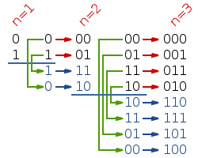
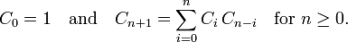

==== 在旋转有序数组中搜索之二

----
Follow up for "Search in Rotated Sorted Array":
What if duplicates are allowed?

Would this affect the run-time complexity? How and why?

Write a function to determine if a given target is in the array.
----

这道是之前那道 Search in Rotated Sorted Array 在旋转有序数组中搜索 的延伸，现在数组中允许出现重复数字，这个也会影响我们选择哪半边继续搜索，由于之前那道题不存在相同值，我们在比较中间值和最右值时就完全符合之前所说的规律：如果中间的数小于最右边的数，则右半段是有序的，若中间数大于最右边数，则左半段是有序的。而如果可以有重复值，就会出现来面两种情况，[3 1 1] 和 [1 1 3 1]，对于这两种情况中间值等于最右值时，目标值3既可以在左边又可以在右边，那怎么办么，对于这种情况其实处理非常简单，只要把最右值向左一位即可继续循环，如果还相同则继续移，直到移到不同值为止，然后其他部分还采用 Search in Rotated Sorted Array 在旋转有序数组中搜索 中的方法，可以得到代码如下： +

[source, cpp, linenums]
----
class Solution {
public:
    bool search(int A[], int n, int target) {
        if (n == 0) return false;
        int left = 0, right = n - 1;
        while (left <= right) {
            int mid = (left + right) / 2;
            if (A[mid] == target) return true;
            else if (A[mid] < A[right]) {
                if (A[mid] < target && A[right] >= target) left = mid + 1;
                else right = mid - 1;
            } else if (A[mid] > A[right]){
                if (A[left] <= target && A[mid] > target) right = mid - 1;
                else left = mid + 1;
            } else --right;
        }
        return false;
    }
};
----

==== 移除有序链表中的重复项之二

----
Given a sorted linked list, delete all nodes that have duplicate numbers, leaving only distinct numbers from the original list.

For example,
Given 1->2->3->3->4->4->5, return 1->2->5.
Given 1->1->1->2->3, return 2->3.
----

和之前那道 ( http://www.cnblogs.com/grandyang/p/4066453.html ) 不同的地方是这里要删掉所有的重复项，由于链表开头可能会有重复项，被删掉的话头指针会改变，而最终却还需要返回链表的头指针。所以需要定义一个新的节点，然后链上原链表，然后定义一个前驱指针和一个现指针，每当前驱指针指向新建的节点，现指针从下一个位置开始往下遍历，遇到相同的则继续往下，直到遇到不同项时，把前驱指针的next指向下面那个不同的元素。如果现指针遍历的第一个元素就不相同，则把前驱指针向下移一位。代码如下： +

[source, cpp, linenums]
----
class Solution {
public:
    ListNode *deleteDuplicates(ListNode *head) {
        if (!head || !head->next) return head;

        ListNode *start = new ListNode(0);
        start->next = head;
        ListNode *pre = start;
        while (pre->next) {
            ListNode *cur = pre->next;
            while (cur->next && cur->next->val == cur->val) cur = cur->next;
            if (cur != pre->next) pre->next = cur->next;
            else pre = pre->next;
        }
        return start->next;
    }
};
----

==== 移除有序链表中的重复项

----
Given a sorted linked list, delete all duplicates such that each element appear only once.

For example,
Given 1->1->2, return 1->2.
Given 1->1->2->3->3, return 1->2->3.
----

移除有序链表中的重复项需要定义个指针指向该链表的第一个元素，然后第一个元素和第二个元素比较，如果重复了，则删掉第二个元素，如果不重复，指针指向第二个元素。这样遍历完整个链表，则剩下的元素没有重复项。代码如下： +

[source, cpp, linenums]
----
class Solution {
public:
    ListNode *deleteDuplicates(ListNode *head) {
        if (!head || !head->next) return head;

        ListNode *start = head;
        while (start && start->next) {
            if (start->val == start->next->val) {
                ListNode *tmp = start->next;
                start->next = start->next->next;
                delete tmp;
            } else start = start->next;
        }
        return head;
    }
};
----

==== 直方图中最大的矩形

----
Given n non-negative integers representing the histogram's bar height where the width of each bar is 1, find the area of largest rectangle in the histogram.
----

image::images/question_84_1.png[width="30%", height="35%"]

Above is a histogram where width of each bar is 1, given height = [2,1,5,6,2,3]. +

image::images/question_84_2.png[width="30%", height="35%"]

----
The largest rectangle is shown in the shaded area, which has area = 10 unit.

For example,
Given height = [2,1,5,6,2,3],
return 10.
----

这道题让求直方图中最大的矩形，刚开始看到求极值问题以为要用DP来做，可是想不出递推式，只得作罢。这道题如果用暴力搜索法估计肯定没法通过OJ，但是我也没想出好的优化方法，在网上搜到了网友水中的鱼的博客，发现他想出了一种很好的优化方法，就是遍历数组，每找到一个局部峰值，然后向前遍历所有的值，算出共同的矩形面积，每次对比保留最大值，代码如下： +

**解法1:** +
[source, cpp, linenums]
----
class Solution {
public:
    int largestRectangleArea(vector<int> &height) {
        int res = 0;
        for (int i = 0; i < height.size(); ++i) {
            if (i + 1 < height.size() && height[i] <= height[i + 1]) {
                continue;
            }
            int minH = height[i];
            for (int j = i; j >= 0; --j) {
                minH = min(minH, height[j]);
                int area = minH * (i - j + 1);
                res = max(res, area);
            }
        }
        return res;
    }
};
----

后来又在网上发现一种比较流行的解法，是利用栈来解，可参见网友实验室小纸贴校外版的博客，但是经过仔细研究，其核心思想跟上面那种剪枝的方法有异曲同工之妙，这里维护一个栈，用来保存递增序列，相当于上面那种方法的找局部峰值。我们可以看到，直方图矩形面积要最大的话，需要尽可能的使得连续的矩形多，并且最低一块的高度要高。有点像木桶原理一样，总是最低的那块板子决定桶的装水量。那么既然需要用单调栈来做，首先要考虑到底用递增栈，还是用递减栈来做。我们想啊，递增栈是维护递增的顺序，当遇到小于栈顶元素的数就开始处理，而递减栈正好相反，维护递减的顺序，当遇到大于栈顶元素的数开始处理。那么根据这道题的特点，我们需要按从高板子到低板子的顺序处理，先处理最高的板子，宽度为1，然后再处理旁边矮一些的板子，此时长度为2，因为之前的高板子可组成矮板子的矩形 ，因此我们需要一个递增栈，当遇到大的数字直接进栈，而当遇到小于栈顶元素的数字时，就要取出栈顶元素进行处理了，那取出的顺序就是从高板子到矮板子了，于是乎遇到的较小的数字只是一个触发，表示现在需要开始计算矩形面积了，为了使得最后一块板子也被处理，这里用了个小trick，在高度数组最后面加上一个0，这样原先的最后一个板子也可以被处理了。由于栈顶元素是矩形的高度，那么关键就是求出来宽度，那么跟之前那道Trapping Rain Water一样，单调栈中不能放高度，而是需要放坐标。由于我们先取出栈中最高的板子，那么就可以先算出长度为1的矩形面积了，然后再取下一个板子，此时根据矮板子的高度算长度为2的矩形面积，以此类推，知道数字大于栈顶元素为止，再次进栈，巧妙的一比！关于单调栈问题可以参见博主的一篇总结帖LeetCode Monotonous Stack Summary 单调栈小结，代码如下： +

**解法2:** +
[source, cpp, linenums]
----
class Solution {
public:
    int largestRectangleArea(vector<int> &height) {
        int res = 0;
        stack<int> st;
        height.push_back(0);
        for (int i = 0; i < height.size(); ++i) {
            if (st.empty() || height[st.top()] < height[i]) {
                st.push(i);
            } else {
                int cur = st.top(); st.pop();
                res = max(res, height[cur] * (st.empty() ? i : (i - st.top() - 1)));
                --i;
            }
        }
        return res;
    }
};
----

我们可以将上面的方法稍作修改，使其更加简洁一些： +
**解法3:** +

[source, cpp, linenums]
----
class Solution {
public:
    int largestRectangleArea(vector<int>& heights) {
        int res = 0;
        stack<int> st;
        heights.push_back(0);
        for (int i = 0; i < heights.size(); ++i) {
            while (!st.empty() && heights[st.top()] >= heights[i]) {
                int cur = st.top(); st.pop();
                res = max(res, heights[cur] * (st.empty() ? i : (i - st.top() - 1)));
            }
            st.push(i);
        }
        return res;
    }
};
----

==== 最大矩形

Given a 2D binary matrix filled with 0's and 1's, find the largest rectangle containing all ones and return its area. +

此题是之前那道的 Largest Rectangle in Histogram 直方图中最大的矩形 的扩展，这道题的二维矩阵每一层向上都可以看做一个直方图，输入矩阵有多少行，就可以形成多少个直方图，对每个直方图都调用 Largest Rectangle in Histogram 直方图中最大的矩形 中的方法，就可以得到最大的矩形面积。那么这道题唯一要做的就是将每一层构成直方图，由于题目限定了输入矩阵的字符只有 '0' 和 '1' 两种，所以处理起来也相对简单。方法是，对于每一个点，如果是‘0’，则赋0，如果是 ‘1’，就赋 之前的height值加上1。具体参见代码如下： +

**解法1:** +
[source, cpp, linenums]
----
class Solution {
public:
    int maximalRectangle(vector<vector<char> > &matrix) {
        int res = 0;
        vector<int> height;
        for (int i = 0; i < matrix.size(); ++i) {
            height.resize(matrix[i].size());
            for (int j = 0; j < matrix[i].size(); ++j) {
                height[j] = matrix[i][j] == '0' ? 0 : (1 + height[j]);
            }
            res = max(res, largestRectangleArea(height));
        }
        return res;
    }
    int largestRectangleArea(vector<int> &height) {
        int res = 0;
        stack<int> s;
        height.push_back(0);
        for (int i = 0; i < height.size(); ++i) {
            if (s.empty() || height[s.top()] <= height[i]) s.push(i);
            else {
                int tmp = s.top();
                s.pop();
                res = max(res, height[tmp] * (s.empty() ? i : (i - s.top() - 1)));
                --i;
            }
        }
        return res;
    }
};
----

我们也可以在一个函数内完成，这样代码看起来更加简洁一些： +

**解法2:** +
[source, cpp, linenums]
----
class Solution {
public:
    int maximalRectangle(vector<vector<char>>& matrix) {
        if (matrix.empty() || matrix[0].empty()) return 0;
        int res = 0, m = matrix.size(), n = matrix[0].size();
        vector<int> height(n + 1, 0);
        for (int i = 0; i < m; ++i) {
            stack<int> s;
            for (int j = 0; j < n + 1; ++j) {
                if (j < n) {
                    height[j] = matrix[i][j] == '1' ? height[j] + 1 : 0;
                }
                while (!s.empty() && height[s.top()] >= height[j]) {
                    int cur = s.top(); s.pop();
                    res = max(res, height[cur] * (s.empty() ? j : (j - s.top() - 1)));
                }
                s.push(j);
            }
        }
        return res;
    }
};
----

下面这种方法的思路很巧妙，height数组和上面一样，这里的left数组表示左边界是1的位置，right数组表示右边界是1的位置，那么对于任意一行的第j个位置，矩形为(right[j] - left[j]) * height[j]，我们举个例子来说明，比如给定矩阵为： +
----
[
  [1, 1, 0, 0, 1],
  [0, 1, 0, 0, 1],
  [0, 0, 1, 1, 1],
  [0, 0, 1, 1, 1],
  [0, 0, 0, 0, 1]
]
----

第0行： +
----
h: 1 1 0 0 1
l: 0 0 0 0 4
r: 2 2 5 5 5
----

第1行： +
----
h: 1 1 0 0 1
l: 0 0 0 0 4
r: 2 2 5 5 5
----

第2行： +
----
h: 0 0 1 1 3
l: 0 0 2 2 4
r: 5 5 5 5 5
----

第3行： +
----
h: 0 0 2 2 4
l: 0 0 2 2 4
r: 5 5 5 5 5
----

第4行： +
----
h: 0 0 0 0 5
l: 0 0 0 0 4
r: 5 5 5 5 5
----

**解法3:** +
[source, cpp, linenums]
----
class Solution {
public:
    int maximalRectangle(vector<vector<char>>& matrix) {
        if (matrix.empty() || matrix[0].empty()) return 0;
        int res = 0, m = matrix.size(), n = matrix[0].size();
        vector<int> height(n, 0), left(n, 0), right(n, n);
        for (int i = 0; i < m; ++i) {
            int cur_left = 0, cur_right = n;
            for (int j = 0; j < n; ++j) {
                if (matrix[i][j] == '1') ++height[j];
                else height[j] = 0;
            }
            for (int j = 0; j < n; ++j) {
                if (matrix[i][j] == '1') left[j] = max(left[j], cur_left);
                else {left[j] = 0; cur_left = j + 1;}
            }
            for (int j = n - 1; j >= 0; --j) {
                if (matrix[i][j] == '1') right[j] = min(right[j], cur_right);
                else {right[j] = n; cur_right = j;}
            }
            for (int j = 0; j < n; ++j) {
                res = max(res, (right[j] - left[j]) * height[j]);
            }
        }
        return res;
    }
};
----

我们也可以通过合并一些for循环，使得运算速度更快一些： +
**解法4:** +
[source, cpp, linenums]
----
class Solution {
public:
    int maximalRectangle(vector<vector<char>>& matrix) {
        if (matrix.empty() || matrix[0].empty()) return 0;
        int res = 0, m = matrix.size(), n = matrix[0].size();
        vector<int> height(n, 0), left(n, 0), right(n, n);
        for (int i = 0; i < m; ++i) {
            int cur_left = 0, cur_right = n;
            for (int j = 0; j < n; ++j) {
                if (matrix[i][j] == '1') {
                    ++height[j];
                    left[j] = max(left[j], cur_left);
                } else {
                    height[j] = 0;
                    left[j] = 0;
                    cur_left = j + 1;
                }
            }
            for (int j = n - 1; j >= 0; --j) {
                if (matrix[i][j] == '1') {
                    right[j] = min(right[j], cur_right);
                } else {
                    right[j] = n;
                    cur_right = j;
                }
                res = max(res, (right[j] - left[j]) * height[j]);
            }
        }
        return res;
    }
};
----

==== 划分链表

----
Given a linked list and a value x, partition it such that all nodes less than x come before nodes greater than or equal to x.

You should preserve the original relative order of the nodes in each of the two partitions.

For example,
Given 1->4->3->2->5->2 and x = 3,
return 1->2->2->4->3->5.
----

这道题要求我们划分链表，把所有小于给定值的节点都移到前面，大于该值的节点顺序不变，相当于一个局部排序的问题。那么可以想到的一种解法是首先找到第一个大于或等于给定值的节点，用题目中给的例子来说就是先找到4，然后再找小于3的值，每找到一个就将其取出置于4之前即可，代码如下： +

**解法1:** +
[source, cpp, linenums]
----
class Solution {
public:
    ListNode *partition(ListNode *head, int x) {
        ListNode *dummy = new ListNode(-1);
        dummy->next = head;
        ListNode *pre = dummy, *cur = head;;
        while (pre->next && pre->next->val < x) pre = pre->next;
        cur = pre;
        while (cur->next) {
            if (cur->next->val < x) {
                ListNode *tmp = cur->next;
                cur->next = tmp->next;
                tmp->next = pre->next;
                pre->next = tmp;
                pre = pre->next;
            } else {
                cur = cur->next;
            }
        }
        return dummy->next;
    }
};
----

----
这种解法的链表变化顺序为：

1 -> 4 -> 3 -> 2 -> 5 -> 2

1 -> 2 -> 4 -> 3 -> 5 -> 2

1 -> 2 -> 2 -> 4 -> 3 -> 5

此题还有一种解法，就是将所有小于给定值的节点取出组成一个新的链表，此时原链表中剩余的节点的值都大于或等于给定值，只要将原链表直接接在新链表后即可，代码如下：
----

**解法2:** +
[source, cpp, linenums]
----
class Solution {
public:
    ListNode *partition(ListNode *head, int x) {
        if (!head) return head;
        ListNode *dummy = new ListNode(-1);
        ListNode *newDummy = new ListNode(-1);
        dummy->next = head;
        ListNode *cur = dummy, *p = newDummy;
        while (cur->next) {
            if (cur->next->val < x) {
                p->next = cur->next;
                p = p->next;
                cur->next = cur->next->next;
                p->next = NULL;
            } else {
                cur = cur->next;
            }
        }
        p->next = dummy->next;
        return newDummy->next;
    }
};
----

----
此种解法链表变化顺序为：

Original: 1 -> 4 -> 3 -> 2 -> 5 -> 2

New:

Original: 4 -> 3 -> 2 -> 5 -> 2

New:　  1

Original: 4 -> 3 -> 5 -> 2

New:　  1 -> 2

Original: 4 -> 3 -> 5

New:　  1 -> 2 -> 2

Original:

New:　  1 -> 2 -> 2 -> 4 -> 3 -> 5
----

==== 爬行字符串

----
Given a string s1, we may represent it as a binary tree by partitioning it to two non-empty substrings recursively.

Below is one possible representation of s1 = "great":

    great
   /    \
  gr    eat
 / \    /  \
g   r  e   at
           / \
          a   t
To scramble the string, we may choose any non-leaf node and swap its two children.

For example, if we choose the node "gr" and swap its two children, it produces a scrambled string"rgeat".

    rgeat
   /    \
  rg    eat
 / \    /  \
r   g  e   at
           / \
          a   t
We say that "rgeat" is a scrambled string of "great".

Similarly, if we continue to swap the children of nodes "eat" and "at", it produces a scrambled string"rgtae".

    rgtae
   /    \
  rg    tae
 / \    /  \
r   g  ta  e
       / \
      t   a
We say that "rgtae" is a scrambled string of "great".

Given two strings s1 and s2 of the same length, determine if s2 is a scrambled string of s1.
----

这道题定义了一种爬行字符串，就是说假如把一个字符串当做一个二叉树的根，然后它的非空子字符串是它的子节点，然后交换某个子字符串的两个子节点，重新爬行回去形成一个新的字符串，这个新字符串和原来的字符串互为爬行字符串。这道题可以用递归Recursion或是动态规划Dynamic Programming来做，我们先来看递归的解法，参见网友uniEagle的博客，简单的说，就是s1和s2是scramble的话，那么必然存在一个在s1上的长度l1，将s1分成s11和s12两段，同样有s21和s22.那么要么s11和s21是scramble的并且s12和s22是scramble的；要么s11和s22是scramble的并且s12和s21是scramble的。就拿题目中的例子 rgeat 和 great 来说，rgeat 可分成 rg 和 eat 两段， great 可分成 gr 和 eat 两段，rg 和 gr 是scrambled的， eat 和 eat 当然是scrambled。根据这点，我们可以写出代码如下： +

**解法1:** +
[source, cpp, linenums]
----
class Solution {
public:
    bool isScramble(string s1, string s2) {
        if (s1.size() != s2.size()) return false;
        if (s1 == s2) return true;
        string str1 = s1, str2 = s2;
        sort(str1.begin(), str1.end());
        sort(str2.begin(), str2.end());
        if (str1 != str2) return false;
        for (int i = 1; i < s1.size(); ++i) {
            string s11 = s1.substr(0, i);
            string s12 = s1.substr(i);
            string s21 = s2.substr(0, i);
            string s22 = s2.substr(i);
            if (isScramble(s11, s21) && isScramble(s12, s22)) return true;
            s21 = s2.substr(s1.size() - i);
            s22 = s2.substr(0, s1.size() - i);
            if (isScramble(s11, s21) && isScramble(s12, s22)) return true;
        }
        return false;
    }
};
----

当然，这道题也可以用动态规划Dynamic Programming，根据以往的经验来说，根字符串有关的题十有八九可以用DP来做，那么难点就在于如何找出递推公式。参见网友Code Ganker的博客，这其实是一道三维动态规划的题目，我们提出维护量res[i][j][n]，其中i是s1的起始字符，j是s2的起始字符，而n是当前的字符串长度，res[i][j][len]表示的是以i和j分别为s1和s2起点的长度为len的字符串是不是互为scramble。 +
有了维护量我们接下来看看递推式，也就是怎么根据历史信息来得到res[i][j][len]。判断这个是不是满足，其实我们首先是把当前s1[i...i+len-1]字符串劈一刀分成两部分，然后分两种情况：第一种是左边和s2[j...j+len-1]左边部分是不是scramble，以及右边和s2[j...j+len-1]右边部分是不是scramble；第二种情况是左边和s2[j...j+len-1]右边部分是不是scramble，以及右边和s2[j...j+len-1]左边部分是不是scramble。如果以上两种情况有一种成立，说明s1[i...i+len-1]和s2[j...j+len-1]是scramble的。而对于判断这些左右部分是不是scramble我们是有历史信息的，因为长度小于n的所有情况我们都在前面求解过了（也就是长度是最外层循环）。 +
上面说的是劈一刀的情况，对于s1[i...i+len-1]我们有len-1种劈法，在这些劈法中只要有一种成立，那么两个串就是scramble的。 +
总结起来递推式是res[i][j][len] = || (res[i][j][k]&&res[i+k][j+k][len-k] || res[i][j+len-k][k]&&res[i+k][j][len-k]) 对于所有1<=k<len，也就是对于所有len-1种劈法的结果求或运算。因为信息都是计算过的，对于每种劈法只需要常量操作即可完成，因此求解递推式是需要O(len)（因为len-1种劈法）。 +
如此总时间复杂度因为是三维动态规划，需要三层循环，加上每一步需要线行时间求解递推式，所以是O(n^4 )。虽然已经比较高了，但是至少不是指数量级的，动态规划还是有很大优势的，空间复杂度是O(n^3)。代码如下： +

**解法2:** +
[source, cpp, linenums]
----
class Solution {
public:
    bool isScramble(string s1, string s2) {
        if (s1.size() != s2.size()) return false;
        if (s1 == s2) return true;
        int n = s1.size();
        vector<vector<vector<bool> > > dp (n, vector<vector<bool> >(n, vector<bool>(n + 1, false)));
        for (int i = 0; i < n; ++i) {
            for (int j = 0; j < n; ++j) {
                dp[i][j][1] = s1[i] == s2[j];
            }
        }
        for (int len = 2; len <= n; ++len) {
            for (int i = 0; i <= n - len; ++i) {
                for (int j = 0; j <= n - len; ++j) {
                    for (int k = 1; k < len; ++k) {
                        if ((dp[i][j][k] && dp[i + k][j + k][len - k]) || (dp[i + k][j][len - k] && dp[i][j + len - k][k])) {
                            dp[i][j][len] = true;
                        }
                    }
                }
            }
        }
        return dp[0][0][n];
    }
};
----

上面的代码的实现过程如下，首先按单个字符比较，判断它们之间是否是scrambled的。在更新第二个表中第一个值(gr和rg是否为scrambled的)时，比较了第一个表中的两种构成，一种是 g与r, r与g，另一种是 g与g, r与r，其中后者是真，只要其中一个为真，则将该值赋真。其实这个原理和之前递归的原理很像，在判断某两个字符串是否为scrambled时，比较它们所有可能的拆分方法的子字符串是否是scrambled的，只要有一个种拆分方法为真，则比较的两个字符串一定是scrambled的。比较 rge 和 gre 的实现过程如下所示： +

----
     r    g    e
g    x    √    x
r    √    x    x
e    x    x    √

      rg    ge
gr    √    x
re    x    x

     rge
gre   √
----

DP的另一种写法，参考网友加载中..的博客，思路都一样，代码如下： +

**解法3:** +
[source, cpp, linenums]
----
class Solution {
public:
    bool isScramble(string s1, string s2) {
        if (s1.size() != s2.size()) return false;
        if (s1 == s2) return true;
        int n = s1.size();
        vector<vector<vector<bool> > > dp (n, vector<vector<bool> >(n, vector<bool>(n + 1, false)));
        for (int i = n - 1; i >= 0; --i) {
            for (int j = n - 1; j >= 0; --j) {
                for (int k = 1; k <= n - max(i, j); ++k) {
                    if (s1.substr(i, k) == s2.substr(j, k)) {
                        dp[i][j][k] = true;
                    } else {
                        for (int t = 1; t < k; ++t) {
                            if ((dp[i][j][t] && dp[i + t][j + t][k - t]) || (dp[i][j + k - t][t] && dp[i + t][j][k - t])) {
                                dp[i][j][k] = true;
                                break;
                            }
                        }
                    }
                }
            }
        }
        return dp[0][0][n];
    }
};
----

下面这种解法和第一个解法思路相同，只不过没有用排序算法，而是采用了类似于求异构词的方法，用一个数组来保存每个字母出现的次数，后面判断Scramble字符串的方法和之前的没有区别： +

**解法4:** +
[source, cpp, linenums]
----
class Solution {
public:
    bool isScramble(string s1, string s2) {
        if (s1 == s2) return true;
        if (s1.size() != s2.size()) return false;
        int n = s1.size(), m[26] = {0};
        for (int i = 0; i < n; ++i) {
            ++m[s1[i] - 'a'];
            --m[s2[i] - 'a'];
        }
        for (int i = 0; i < 26; ++i) {
            if (m[i] != 0) return false;
        }
        for (int i = 1; i < n; ++i) {
            if ((isScramble(s1.substr(0, i), s2.substr(0, i)) && isScramble(s1.substr(i), s2.substr(i))) || (isScramble(s1.substr(0, i), s2.substr(n - i)) && isScramble(s1.substr(i), s2.substr(0, n - i)))) {
                return true;
            }
        }
        return false;
    }
};
----

下面这种解法实际上是解法二的递归形式，我们用了memo数组来减少了大量的运算，注意这里的memo数组一定要有三种状态，初始化为-1，区域内为scramble是1，不是scramble是0，这样就避免了已经算过了某个区间，但由于不是scramble，从而又进行一次计算，从而会TLE，感谢网友bambu的提供的思路，参见代码如下： +

**解法5:** +
[source, cpp, linenums]
----
class Solution {
public:
    bool isScramble(string s1, string s2) {
        if (s1 == s2) return true;
        if (s1.size() != s2.size()) return false;
        int n = s1.size();
        vector<vector<vector<int>>> memo(n, vector<vector<int>>(n, vector<int>(n + 1, -1)));
        return helper(s1, s2, 0, 0, n, memo);
    }
    bool helper(string& s1, string& s2, int idx1, int idx2, int len, vector<vector<vector<int>>>& memo) {
        if (len == 0) return true;
        if (len == 1) memo[idx1][idx2][len] = s1[idx1] == s2[idx2];
        if (memo[idx1][idx2][len] != -1) return memo[idx1][idx2][len];
        for (int k = 1; k < len; ++k) {
            if ((helper(s1, s2, idx1, idx2, k, memo) && helper(s1, s2, idx1 + k, idx2 + k, len - k, memo)) || (helper(s1, s2, idx1, idx2 + len - k, k, memo) && helper(s1, s2, idx1 + k, idx2, len - k, memo))) {
                return memo[idx1][idx2][len] = 1;
            }
        }
        return memo[idx1][idx2][len] = 0;
    }
};
----

==== 混合插入有序数组

----
Given two sorted integer arrays A and B, merge B into A as one sorted array.

Note:
You may assume that A has enough space (size that is greater or equal to m + n) to hold additional elements from B. The number of elements initialized in A and B are m andn respectively.
----

混合插入有序数组，由于两个数组都是有序的，所有只要按顺序比较大小即可。最先想到的方法是建立一个m+n大小的新数组，然后逐个从A和B数组中取出元素比较，把较小的加入新数组，然后在考虑A数组有剩余和B数组有剩余的两种情况，最后在把新数组的元素重新赋值到A数组中即可。代码如下： +

**解法1:** +
[source, cpp, linenums]
----
class Solution {
public:
    void merge(int A[], int m, int B[], int n) {
        if (m <= 0 && n <= 0) return;
        int a = 0, b = 0;
        int C[m + n];
        for (int i = 0; i < m + n; ++i) {
            if (a < m && b < n) {
                if (A[a] < B[b]) {
                    C[i] = A[a];
                    ++a;
                }
                else {
                    C[i] = B[b];
                    ++b;
                }
            }
            else if (a < m && b >= n) {
                C[i] = A[a];
                ++a;
            }
            else if (a >= m && b < n) {
                C[i] = B[b];
                ++b;
            }
            else return;
        }
        for (int i = 0; i < m + n; ++i) A[i] = C[i];
    }
};
----

这样固然没错，但是还有更简洁的方法，而且不用申请新变量。算法思想是：由于合并后A数组的大小必定是m+n，所以从最后面开始往前赋值，先比较A和B中最后一个元素的大小，把较大的那个插入到m+n-1的位置上，再依次向前推。如果A中所有的元素都比B小，那么前m个还是A原来的内容，没有改变。如果A中的数组比B大的，当A循环完了，B中还有元素没加入A，直接用个循环把B中所有的元素覆盖到A剩下的位置。代码如下: +

**解法2:** +
[source, cpp, linenums]
----
class Solution {
public:
    void merge(int A[], int m, int B[], int n) {
        int count = m + n - 1;
        --m; --n;
        while (m >= 0 && n >= 0) A[count--] = A[m] > B[n] ? A[m--] : B[n--];
        while (n >= 0) A[count--] = B[n--];
    }
};
----

==== 格雷码

----
The gray code is a binary numeral system where two successive values differ in only one bit.

Given a non-negative integer n representing the total number of bits in the code, print the sequence of gray code. A gray code sequence must begin with 0.

For example, given n = 2, return [0,1,3,2]. Its gray code sequence is:

00 - 0
01 - 1
11 - 3
10 - 2
Note:
For a given n, a gray code sequence is not uniquely defined.

For example, [0,2,3,1] is also a valid gray code sequence according to the above definition.

For now, the judge is able to judge based on one instance of gray code sequence. Sorry about that.
----

这道题是关于格雷码的，猛地一看感觉完全没接触过格雷码，但是看了维基百科后，隐约的感觉原来好像哪门可提到过，哎全还给老师了。这道题如果不了解格雷码，还真不太好做，幸亏脑补了维基百科，上面说格雷码是一种循环二进制单位距离码，主要特点是两个相邻数的代码只有一位二进制数不同的编码，格雷码的处理主要是位操作 Bit Operation，LeetCode中关于位操作的题也挺常见，比如 Repeated DNA Sequences 求重复的DNA序列， Single Number 单独的数字, 和  Single Number II 单独的数字之二 等等。三位的格雷码和二进制数如下： +

----
Int    Grey Code    Binary
 0  　　  000        000
 1  　　  001        001
 2   　 　011        010
 3   　 　010        011
 4   　 　110        100
 5   　 　111        101
 6   　 　101        110
 7   　　 100        111
----

其实这道题还有多种解法。首先来看一种最简单的，是用到格雷码和二进制数之间的相互转化，可参见我之前的博客 Convertion of grey code and binary 格雷码和二进制数之间的转换 ，明白了转换方法后，这道题完全没有难度，代码如下： +

**解法1:** +
[source, cpp, linenums]
----
class Solution {
public:
    vector<int> grayCode(int n) {
        vector<int> res;
        for (int i = 0; i < pow(2,n); ++i) {
            res.push_back((i >> 1) ^ i);
        }
        return res;
    }
};
----

然后我们来看看其他的解法，参考维基百科上关于格雷码的性质，有一条是说镜面排列的，n位元的格雷码可以从n-1位元的格雷码以上下镜射后加上新位元的方式快速的得到，如下图所示一般。 +

有了这条性质，我们很容易的写出代码如下： +

**解法2:** +
[source, cpp, linenums]
----
class Solution {
public:
    vector<int> grayCode(int n) {
        vector<int> res{0};
        for (int i = 0; i < n; ++i) {
            int size = res.size();
            for (int j = size - 1; j >= 0; --j) {
                res.push_back(res[j] | (1 << i));
            }
        }
        return res;
    }
};
----

维基百科上还有一条格雷码的性质是直接排列，以二进制为0值的格雷码为第零项，第一项改变最右边的位元，第二项改变右起第一个为1的位元的左边位元，第三、四项方法同第一、二项，如此反复，即可排列出n个位元的格雷码。根据这条性质也可以写出代码，不过相比前面的略微复杂，代码如下： +
----
0 0 0
0 0 1
0 1 1
0 1 0
1 1 0
1 1 1
1 0 1
1 0 0
----

**解法3:** +
[source, cpp, linenums]
----
class Solution {
public:
    vector<int> grayCode(int n) {
        vector<int> res{0};
        int len = pow(2, n);
        for (int i = 1; i < len; ++i) {
            int pre = res.back();
            if (i % 2 == 1) {
                pre = (pre & (len - 2)) | ((~pre) & 1);
            } else {
                int cnt = 1, t = pre;
                while ((t & 1) != 1) {
                    ++cnt;
                    t >>= 1;
                }
                if ((pre & (1 << cnt)) == 0) pre |= (1 << cnt);
                else pre &= ~(1 << cnt);
            }
            res.push_back(pre);
        }
        return res;
    }
};
----

上面三种解法都需要事先了解格雷码及其性质，假如我们之前并没有接触过格雷码，那么我们其实也可以用比较笨的方法来找出结果，比如下面这种方法用到了一个set来保存已经产生的结果，我们从0开始，遍历其二进制每一位，对其取反，然后看其是否在set中出现过，如果没有，我们将其加入set和结果res中，然后再对这个数的每一位进行遍历，以此类推就可以找出所有的格雷码了，参见代码如下： +

**解法4:** +
[source, cpp, linenums]
----
class Solution {
public:
    vector<int> grayCode(int n) {
        vector<int> res;
        unordered_set<int> s;
        helper(n, s, 0, res);
        return res;
    }
    void helper(int n, unordered_set<int>& s, int out, vector<int>& res) {
        if (!s.count(out)) {
            s.insert(out);
            res.push_back(out);
        }
        for (int i = 0; i < n; ++i) {
            int t = out;
            if ((t & (1 << i)) == 0) t |= (1 << i);
            else t &= ~(1 << i);
            if (s.count(t)) continue;
            helper(n, s, t, res);
            break;
        }
    }
};
----

既然递归方法可以实现，那么就有对应的迭代的写法，当然需要用stack来辅助，参见代码如下：  +

**解法5:** +
[source, cpp, linenums]
----
class Solution {
public:
    vector<int> grayCode(int n) {
        vector<int> res{0};
        unordered_set<int> s;
        stack<int> st;
        st.push(0);
        s.insert(0);
        while (!st.empty()) {
            int t = st.top(); st.pop();
            for (int i = 0; i < n; ++i) {
                int k = t;
                if ((k & (1 << i)) == 0) k |= (1 << i);
                else k &= ~(1 << i);
                if (s.count(k)) continue;
                s.insert(k);
                st.push(k);
                res.push_back(k);
                break;
            }
        }
        return res;
    }
};
----

==== 子集合之二

----
Given a collection of integers that might contain duplicates, S, return all possible subsets.

Note:

Elements in a subset must be in non-descending order.
The solution set must not contain duplicate subsets.

For example,
If S = [1,2,2], a solution is:

[
  [2],
  [1],
  [1,2,2],
  [2,2],
  [1,2],
  []
]
----

这道子集合之二是之前那道 Subsets 子集合 的延伸，这次输入数组允许有重复项，其他条件都不变，只需要在之前那道题解法的基础上稍加改动便可以做出来，我们先来看非递归解法，拿题目中的例子[1 2 2]来分析，根据之前 Subsets 子集合 里的分析可知，当处理到第一个2时，此时的子集合为[], [1], [2], [1, 2]，而这时再处理第二个2时，如果在[]和[1]后直接加2会产生重复，所以只能在上一个循环生成的后两个子集合后面加2，发现了这一点，题目就可以做了，我们用last来记录上一个处理的数字，然后判定当前的数字和上面的是否相同，若不同，则循环还是从0到当前子集的个数，若相同，则新子集个数减去之前循环时子集的个数当做起点来循环，这样就不会产生重复了，代码如下： +

**解法1:** +
[source, cpp, linenums]
----
class Solution {
public:
    vector<vector<int>> subsetsWithDup(vector<int> &S) {
        if (S.empty()) return {};
        vector<vector<int>> res(1);
        sort(S.begin(), S.end());
        int size = 1, last = S[0];
        for (int i = 0; i < S.size(); ++i) {
            if (last != S[i]) {
                last = S[i];
                size = res.size();
            }
            int newSize = res.size();
            for (int j = newSize - size; j < newSize; ++j) {
                res.push_back(res[j]);
                res.back().push_back(S[i]);
            }
        }
        return res;
    }
};
----

----
整个添加的顺序为：

[]
[1]
[2]
[1 2]
[2 2]
[1 2 2]

对于递归的解法，根据之前 Subsets 子集合 里的构建树的方法，在处理到第二个2时，由于前面已经处理了一次2，这次我们只在添加过2的[2] 和 [1 2]后面添加2，其他的都不添加，那么这样构成的二叉树如下图所示：
----

----
                      []
                 /          \
                /            \
               /              \
            [1]                []
         /       \           /    \
        /         \         /      \
     [1 2]       [1]       [2]     []
    /     \     /   \     /   \    / \
[1 2 2] [1 2]  X   [1]  [2 2] [2] X  []
----

代码只需在原有的基础上增加一句话，while (S[i] == S[i + 1]) ++i; 这句话的作用是跳过树中为X的叶节点，因为它们是重复的子集，应被抛弃。代码如下： +

**解法2:** +
[source, cpp, linenums]
----
class Solution {
public:
    vector<vector<int>> subsetsWithDup(vector<int> &S) {
        if (S.empty()) return {};
        vector<vector<int>> res;
        vector<int> out;
        sort(S.begin(), S.end());
        getSubsets(S, 0, out, res);
        return res;
    }
    void getSubsets(vector<int> &S, int pos, vector<int> &out, vector<vector<int>> &res) {
        res.push_back(out);
        for (int i = pos; i < S.size(); ++i) {
            out.push_back(S[i]);
            getSubsets(S, i + 1, out, res);
            out.pop_back();
            while (i + 1 < S.size() && S[i] == S[i + 1]) ++i;
        }
    }
};
----

----
整个添加的顺序为：

[]
[1]
[1 2]
[1 2 2]
[2]
[2 2]
----

==== 解码方法

----
A message containing letters from A-Z is being encoded to numbers using the following mapping:

'A' -> 1
'B' -> 2
...
'Z' -> 26
Given an encoded message containing digits, determine the total number of ways to decode it.

For example,
Given encoded message "12", it could be decoded as "AB" (1 2) or "L" (12).

The number of ways decoding "12" is 2.
----

这道题要求解码方法，跟之前那道 Climbing Stairs 爬梯子问题 非常的相似，但是还有一些其他的限制条件，比如说一位数时不能为0，两位数不能大于26，其十位上的数也不能为0，出去这些限制条件，根爬梯子基本没啥区别，也勉强算特殊的斐波那契数列，当然需要用动态规划Dynamci Programming来解。建立一位dp数组，长度比输入数组长多多2，全部初始化为1，因为斐波那契数列的前两项也为1，然后从第三个数开始更新，对应数组的第一个数。对每个数组首先判断其是否为0，若是将改为dp赋0，若不是，赋上一个dp值，此时相当如加上了dp[i - 1], 然后看数组前一位是否存在，如果存在且满足前一位不是0，且和当前为一起组成的两位数不大于26，则当前dp值加上dp[i - 2], 至此可以看出来跟斐波那契数组的递推式一样，代码如下： +

**解法1:** +
[source, cpp, linenums]
----
class Solution {
public:
    int numDecodings(string s) {
        if (s.empty() || (s.size() > 1 && s[0] == '0')) return 0;
        vector<int> dp(s.size() + 1, 0);
        dp[0] = 1;
        for (int i = 1; i < dp.size(); ++i) {
            dp[i] = (s[i - 1] == '0') ? 0 : dp[i - 1];
            if (i > 1 && (s[i - 2] == '1' || (s[i - 2] == '2' && s[i - 1] <= '6'))) {
                dp[i] += dp[i - 2];
            }
        }
        return dp.back();
    }
};
----

下面这种方法跟上面的方法的思路一样，只是写法略有不同： +

**解法2:** +
[source, cpp, linenums]
----
class Solution {
public:
    int numDecodings(string s) {
        if (s.empty()) return 0;
        vector<int> dp(s.size() + 1, 0);
        dp[0] = 1;
        for (int i = 1; i < dp.size(); ++i) {
            if (s[i - 1] != '0') dp[i] += dp[i - 1];
            if (i >= 2 && s.substr(i - 2, 2) <= "26" && s.substr(i - 2, 2) >= "10") {
                dp[i] += dp[i - 2];
            }
        }
        return dp.back();
    }
};
----

我们再来看一种空间复杂度为O(1)的解法，我们用两个变量c1, c2来分别表示s[i-1]和s[i-2]的解码方法，然后我们从i=1开始遍历，也就是字符串的第二个字符，我们判断如果当前字符为'0'，说明当前字符不能单独拆分出来，只能和前一个字符一起，我们先将c1赋为0，然后我们看前面的字符，如果前面的字符是1或者2时，我们就可以更新c1 = c1 + c2，然后c2 = c1 - c2，其实c2赋值为之前的c1，如果不满足这些条件的话，那么c2 = c1，参见代码如下： +

**解法3:** +
[source, cpp, linenums]
----
class Solution {
public:
    int numDecodings(string s) {
        if (s.empty() || s.front() == '0') return 0;
        int c1 = 1, c2 = 1;
        for (int i = 1; i < s.size(); ++i) {
            if (s[i] == '0') c1 = 0;
            if (s[i - 1] == '1' || (s[i - 1] == '2' && s[i] <= '6')) {
                c1 = c1 + c2;
                c2 = c1 - c2;
            } else {
                c2 = c1;
            }
        }
        return c1;
    }
};
----

==== 倒置链表之二

----
Reverse a linked list from position m to n. Do it in-place and in one-pass.

For example:
Given 1->2->3->4->5->NULL, m = 2 and n = 4,

return 1->4->3->2->5->NULL.

Note:
Given m, n satisfy the following condition:
1 ≤ m ≤ n ≤ length of list.
----

很奇怪为何没有倒置链表之一，就来了这个倒置链表之二，不过猜也能猜得到之一就是单纯的倒置整个链表，而这道作为延伸的地方就是倒置其中的某一小段。对于链表的问题，根据以往的经验一般都是要建一个dummy node，连上原链表的头结点，这样的话就算头结点变动了，我们还可以通过dummy->next来获得新链表的头结点。这道题的要求是只通过一次遍历完成，就拿题目中的例子来说，变换的是2,3,4这三个点，那么我们可以先取出2，用front指针指向2，然后当取出3的时候，我们把3加到2的前面，把front指针前移到3，依次类推，到4后停止，这样我们得到一个新链表4->3->2, front指针指向4。对于原链表连说，有两个点的位置很重要，需要用指针记录下来，分别是1和5，因为当2,3,4被取走时，原链表就变成了1->5->NULL，要把新链表插入的时候需要这两个点的位置。1的位置很好找，因为知道m的值，我们用pre指针记录1的位置，5的位置最后才能记录，当4结点被取走后，5的位置需要记下来，这样我们就可以把倒置后的那一小段链表加入到原链表中。代码如下： +

[source, cpp, linenums]
----
class Solution {
public:
    ListNode *reverseBetween(ListNode *head, int m, int n) {
        ListNode *dummy = new ListNode(-1);
        dummy->next = head;
        ListNode *cur = dummy;
        ListNode *pre, *front, *last;
        for (int i = 1; i <= m - 1; ++i) cur = cur->next;
        pre = cur;
        last = cur->next;
        for (int i = m; i <= n; ++i) {
            cur = pre->next;
            pre->next = cur->next;
            cur->next = front;
            front = cur;
        }
        cur = pre->next;
        pre->next = front;
        last->next = cur;
        return dummy->next;
    }
};
----

==== 复原IP地址

----
Given a string containing only digits, restore it by returning all possible valid IP address combinations.

For example:
Given "25525511135",

return ["255.255.11.135", "255.255.111.35"]. (Order does not matter)
----

这道题要求是复原IP地址，IP地址对我们并不陌生，就算我们不是学CS的，只要我们是广大网友之一，就应该对其并不陌生。IP地址由32位二进制数组成，为便于使用，常以XXX.XXX.XXX.XXX形式表现，每组XXX代表小于或等于255的10进制数。所以说IP地址总共有四段，每一段可能有一位，两位或者三位，范围是[0, 255]，题目明确指出输入字符串只含有数字，所以当某段是三位时，我们要判断其是否越界（>255)，还有一点很重要的是，当只有一位时，0可以成某一段，如果有两位或三位时，像 00， 01， 001， 011， 000等都是不合法的，所以我们还是需要有一个判定函数来判断某个字符串是否合法。这道题其实也可以看做是字符串的分段问题，在输入字符串中加入三个点，将字符串分为四段，每一段必须合法，求所有可能的情况。根据目前刷了这么多题，得出了两个经验，一是只要遇到字符串的子序列或配准问题首先考虑动态规划DP，二是只要遇到需要求出所有可能情况首先考虑用递归。这道题并非是求字符串的子序列或配准问题，更符合第二种情况，所以我们要用递归来解。我们用k来表示当前还需要分的段数，如果k = 0，则表示三个点已经加入完成，四段已经形成，若这时字符串刚好为空，则将当前分好的结果保存。若k != 0, 则对于每一段，我们分别用一位，两位，三位来尝试，分别判断其合不合法，如果合法，则调用递归继续分剩下的字符串，最终和求出所有合法组合，代码如下： +

**解法1:** +
[source, cpp, linenums]
----
class Solution {
public:
    vector<string> restoreIpAddresses(string s) {
        vector<string> res;
        restore(s, 4, "", res);
        return res;
    }
    void restore(string s, int k, string out, vector<string> &res) {
        if (k == 0) {
            if (s.empty()) res.push_back(out);
        }
        else {
            for (int i = 1; i <= 3; ++i) {
                if (s.size() >= i && isValid(s.substr(0, i))) {
                    if (k == 1) restore(s.substr(i), k - 1, out + s.substr(0, i), res);
                    else restore(s.substr(i), k - 1, out + s.substr(0, i) + ".", res);
                }
            }
        }
    }
    bool isValid(string s) {
        if (s.empty() || s.size() > 3 || (s.size() > 1 && s[0] == '0')) return false;
        int res = atoi(s.c_str());
        return res <= 255 && res >= 0;
    }
};
----

我们也可以省掉isValid函数，直接在调用递归之前用if语句来滤掉不符合题意的情况，这里面用了k != std::to_string(val).size()，其实并不难理解，比如当k=3时，说明应该是个三位数，但如果字符是"010"，那么转为整型val=10，再转回字符串就是"10"，此时的长度和k值不同了，这样就可以找出不合要求的情况了，参见代码如下: +

**解法2:** +
[source, cpp, linenums]
----
class Solution {
public:
    vector<string> restoreIpAddresses(string s) {
        vector<string> res;
        helper(s, 0, "", res);
        return res;
    }
    void helper(string s, int n, string out, vector<string>& res) {
        if (n == 4) {
            if (s.empty()) res.push_back(out);
        } else {
            for (int k = 1; k < 4; ++k) {
                if (s.size() < k) break;
                int val = atoi(s.substr(0, k).c_str());
                if (val > 255 || k != std::to_string(val).size()) continue;
                helper(s.substr(k), n + 1, out + s.substr(0, k) + (n == 3 ? "" : "."), res);
            }
        }
    }
};
----

由于每段数字最多只能有三位，而且只能分为四段，所以情况并不是很多，我们可以使用暴力搜索的方法，每一段都循环1到3，然后当4段位数之和等于原字符串长度时，我们进一步判断每段数字是否不大于255，然后滤去不合要求的数字，加入结果中即可，参见代码如下: +

**解法3:** +
[source, cpp, linenums]
----
class Solution {
public:
    vector<string> restoreIpAddresses(string s) {
        vector<string> res;
        for (int a = 1; a < 4; ++a)
        for (int b = 1; b < 4; ++b)
        for (int c = 1; c < 4; ++c)
        for (int d = 1; d < 4; ++d)
            if (a + b + c + d == s.size()) {
                int A = stoi(s.substr(0, a));
                int B = stoi(s.substr(a, b));
                int C = stoi(s.substr(a + b, c));
                int D = stoi(s.substr(a + b + c, d));
                if (A <= 255 && B <= 255 && C <= 255 && D <= 255) {
                    string t = to_string(A) + "." + to_string(B) + "." + to_string(C) + "." + to_string(D);
                    if (t.size() == s.size() + 3) res.push_back(t);
                }
            }
        return res;
    }
};
----

==== 二叉树的中序遍历

----
Given a binary tree, return the inorder traversal of its nodes' values.

For example:
Given binary tree {1,#,2,3},

   1
    \
     2
    /
   3

return [1,3,2].

Note: Recursive solution is trivial, could you do it iteratively?

confused what "{1,#,2,3}" means? > read more on how binary tree is serialized on OJ.
----

二叉树的中序遍历顺序为左-根-右，可以有递归和非递归来解，其中非递归解法又分为两种，一种是使用栈来接，另一种不需要使用栈。我们先来看递归方法，十分直接，对左子结点调用递归函数，根节点访问值，右子节点再调用递归函数，代码如下： +

**解法1:** +
[source, cpp, linenums]
----
class Solution {
public:
    vector<int> inorderTraversal(TreeNode *root) {
        vector<int> res;
        inorder(root, res);
        return res;
    }
    void inorder(TreeNode *root, vector<int> &res) {
        if (!root) return;
        if (root->left) inorder(root->left, res);
        res.push_back(root->val);
        if (root->right) inorder(root->right, res);
    }
};
----

下面我们再来看非递归使用栈的解法，也是符合本题要求使用的解法之一，需要用栈来做，思路是从根节点开始，先将根节点压入栈，然后再将其所有左子结点压入栈，然后取出栈顶节点，保存节点值，再将当前指针移到其右子节点上，若存在右子节点，则在下次循环时又可将其所有左子结点压入栈中。这样就保证了访问顺序为左-根-右，代码如下： +

**解法2:** +
[source, cpp, linenums]
----
class Solution {
public:
    vector<int> inorderTraversal(TreeNode *root) {
        vector<int> res;
        stack<TreeNode*> s;
        TreeNode *p = root;
        while (p || !s.empty()) {
            while (p) {
                s.push(p);
                p = p->left;
            }
            p = s.top();
            s.pop();
            res.push_back(p->val);
            p = p->right;
        }
        return res;
    }
};
----

下面这种解法跟Binary Tree Preorder Traversal中的解法二几乎一样，就是把结点值加入结果res的步骤从if中移动到了else中，因为中序遍历的顺序是左-根-右，参见代码如下： +

**解法3:** +
[source, cpp, linenums]
----
class Solution {
public:
    vector<int> inorderTraversal(TreeNode* root) {
        vector<int> res;
        stack<TreeNode*> s;
        TreeNode *p = root;
        while (!s.empty() || p) {
            if (p) {
                s.push(p);
                p = p->left;
            } else {
                TreeNode *t = s.top(); s.pop();
                res.push_back(t->val);
                p = t->right;
            }
        }
        return res;
    }
};
----

下面我们来看另一种很巧妙的解法，这种方法不需要使用栈，所以空间复杂度为常量，这种非递归不用栈的遍历方法有个专门的名字，叫Morris Traversal，在介绍这种方法之前，我们先来引入一种新型树，叫 Threaded binary tree，这个还不太好翻译，我第一眼看上去以为是叫线程二叉树，但是感觉好像又跟线程没啥关系，后来看到网上有人翻译为螺纹二叉树，但本人认为这翻译也不太敢直视，很容易让人联想到为计划生育做出突出贡献的某世界著名品牌，但是苦于找不到更合理的翻译方法，就暂且叫螺纹二叉树吧。我们先来看看维基百科上关于它的英文定义： +

A binary tree is threaded by making all right child pointers that would normally be null point to the inorder successor of the node (if it exists), and all left child pointers that would normally be null point to the inorder predecessor of the node. +

就是说螺纹二叉树实际上是把所有原本为空的右子节点指向了中序遍历顺序之后的那个节点，把所有原本为空的左子节点都指向了中序遍历之前的那个节点，具体例子可以点击这里。那么这道题跟这个螺纹二叉树又有啥关系呢？由于我们既不能用递归，又不能用栈，那我们如何保证访问顺序是中序遍历的左-根-右呢。原来我们需要构建一个螺纹二叉树，我们需要将所有为空的右子节点指向中序遍历的下一个节点，这样我们中序遍历完左子结点后，就能顺利的回到其根节点继续遍历了。具体算法如下： +

----
1. 初始化指针cur指向root

2. 当cur不为空时

　 - 如果cur没有左子结点

　     a) 打印出cur的值

　　  b) 将cur指针指向其右子节点

　 - 反之

　    将pre指针指向cur的左子树中的最右子节点　

　　　  * 若pre不存在右子节点

　　　       a) 将其右子节点指回cur

　　　　    b) cur指向其左子节点

　　　  * 反之

　　　　　 a) 将pre的右子节点置空

　　　　　 b) 打印cur的值

　　　　　 c) 将cur指针指向其右子节点
----

**解法4:** +
[source, cpp, linenums]
----
class Solution {
public:
    vector<int> inorderTraversal(TreeNode *root) {
        vector<int> res;
        if (!root) return res;
        TreeNode *cur, *pre;
        cur = root;
        while (cur) {
            if (!cur->left) {
                res.push_back(cur->val);
                cur = cur->right;
            } else {
                pre = cur->left;
                while (pre->right && pre->right != cur) pre = pre->right;
                if (!pre->right) {
                    pre->right = cur;
                    cur = cur->left;
                } else {
                    pre->right = NULL;
                    res.push_back(cur->val);
                    cur = cur->right;
                }
            }
        }
        return res;
    }
};
----

其实Morris遍历不仅仅对中序遍历有用，对先序和后序同样有用，具体可参见网友NOALGO博客，和 Annie Kim's Blog的博客。所以对二叉树的三种常见遍历顺序(先序，中序，后序)就有三种解法(递归，非递归，Morris遍历)，总共有九段代码呀，熟练掌握这九种写法才算初步掌握了树的遍历挖~~ 至于二叉树的层序遍历也有递归和非递归解法，至于有没有Morris遍历的解法还有待大神们的解答，若真有也请劳烦告知博主一声~~ +

==== 独一无二的二叉搜索树之二

----
Given n, generate all structurally unique BST's (binary search trees) that store values 1...n.

For example,
Given n = 3, your program should return all 5 unique BST's shown below.

   1         3     3      2      1
    \       /     /      / \      \
     3     2     1      1   3      2
    /     /       \                 \
   2     1         2                 3

confused what "{1,#,2,3}" means? > read more on how binary tree is serialized on OJ.

OJ's Binary Tree Serialization:
The serialization of a binary tree follows a level order traversal, where '#' signifies a path terminator where no node exists below.

Here's an example:

   1
  / \
 2   3
    /
   4
    \
     5
The above binary tree is serialized as "{1,2,3,#,#,4,#,#,5}".
----

这道题是之前的 Unique Binary Search Trees 独一无二的二叉搜索树的延伸，之前那个只要求算出所有不同的二叉搜索树的个数，这道题让把那些二叉树都建立出来。这种建树问题一般来说都是用递归来解，这道题也不例外，划分左右子树，递归构造。至于递归函数中为啥都用的是指针，是参考了网友水中的鱼的博客，若不用指针，全部实例化的话会存在大量的对象拷贝，要调用拷贝构造函数，具体我也不太懂，反正感觉挺有道理的，不明觉厉啊-.-!!! +

[source, cpp, linenums]
----

class Solution {
public:
    vector<TreeNode *> generateTrees(int n) {
        if (n == 0) return {};
        return *generateTreesDFS(1, n);
    }
    vector<TreeNode*> *generateTreesDFS(int start, int end) {
        vector<TreeNode*> *subTree = new vector<TreeNode*>();
        if (start > end) subTree->push_back(NULL);
        else {
            for (int i = start; i <= end; ++i) {
                vector<TreeNode*> *leftSubTree = generateTreesDFS(start, i - 1);
                vector<TreeNode*> *rightSubTree = generateTreesDFS(i + 1, end);
                for (int j = 0; j < leftSubTree->size(); ++j) {
                    for (int k = 0; k < rightSubTree->size(); ++k) {
                        TreeNode *node = new TreeNode(i);
                        node->left = (*leftSubTree)[j];
                        node->right = (*rightSubTree)[k];
                        subTree->push_back(node);
                    }
                }
            }
        }
        return subTree;
    }
};
----

==== 独一无二的二叉搜索树

----
Given n, how many structurally unique BST's (binary search trees) that store values 1...n?

For example,
Given n = 3, there are a total of 5 unique BST's.

   1         3     3      2      1
    \       /     /      / \      \
     3     2     1      1   3      2
    /     /       \                 \
   2     1         2                 3
----

这道题实际上是 Catalan Number卡塔兰数的一个例子，如果对卡塔兰数不熟悉的童鞋可能真不太好做。话说其实我也是今天才知道的好嘛-.-|||，为啥我以前都不知道捏？！为啥卡塔兰数不像斐波那契数那样人尽皆知呢，是我太孤陋寡闻么？！不过今天知道也不晚，不断的学习新的东西，这才是刷题的意义所在嘛! 好了，废话不多说了，赶紧回到题目上来吧。我们先来看当 n = 1的情况，只能形成唯一的一棵二叉搜索树，n分别为1,2,3的情况如下所示： +

----
              1                        n = 1

          2        1                   n = 2
         /          \
        1            2

1         3     3      2      1           n = 3
\       /     /      / \      \
3     2     1      1   3      2
/     /       \                 \
2     1         2                 3
----

----
就跟斐波那契数列一样，我们把n = 0 时赋为1，因为空树也算一种二叉搜索树，那么n = 1时的情况可以看做是其左子树个数乘以右子树的个数，左右字数都是空树，所以1乘1还是1。那么n = 2时，由于1和2都可以为跟，分别算出来，再把它们加起来即可。n = 2的情况可由下面式子算出：

dp[2] =  dp[0] * dp[1]　　　(1为根的情况)

　　　　+ dp[1] * dp[0]　　  (2为根的情况)

同理可写出 n = 3 的计算方法：

dp[3] =  dp[0] * dp[2]　　　(1为根的情况)

　　　　+ dp[1] * dp[1]　　  (2为根的情况)

 　　　  + dp[2] * dp[0]　　  (3为根的情况)

由此可以得出卡塔兰数列的递推式为：
----

我们根据以上的分析，可以写出代码如下： +

[source, cpp, linenums]
----
class Solution {
public:
    int numTrees(int n) {
        vector<int> dp(n + 1, 0);
        dp[0] = 1;
        dp[1] = 1;
        for (int i = 2; i <= n; ++i) {
            for (int j = 0; j < i; ++j) {
                dp[i] += dp[j] * dp[i - j - 1];
            }
        }
        return dp[n];
    }
};
----

==== 交织相错的字符串

----
Given s1, s2, s3, find whether s3 is formed by the interleaving of s1 and s2.

For example,
Given:
s1 = "aabcc",
s2 = "dbbca",

When s3 = "aadbbcbcac", return true.
When s3 = "aadbbbaccc", return false.
----

这道求交织相错的字符串和之前那道 Word Break 拆分词句 的题很类似，就想我之前说的只要是遇到字符串的子序列或是匹配问题直接就上动态规划Dynamic Programming，其他的都不要考虑，什么递归呀的都是浮云，千辛万苦的写了递归结果拿到OJ上妥妥Time Limit Exceeded，能把人气昏了，所以还是直接就考虑DP解法省事些。一般来说字符串匹配问题都是更新一个二维dp数组，核心就在于找出递推公式。那么我们还是从题目中给的例子出发吧，手动写出二维数组dp如下： +

----
  Ø d b b c a
Ø T F F F F F
a T F F F F F
a T T T T T F
b F T T F T F
c F F T T T T
c F F F T F T
----

----
首先，这道题的大前提是字符串s1和s2的长度和必须等于s3的长度，如果不等于，肯定返回false。那么当s1和s2是空串的时候，s3必然是空串，则返回true。所以直接给dp[0][0]赋值true，然后若s1和s2其中的一个为空串的话，那么另一个肯定和s3的长度相等，则按位比较，若相同且上一个位置为True，赋True，其余情况都赋False，这样的二维数组dp的边缘就初始化好了。下面只需要找出递推公式来更新整个数组即可，我们发现，在任意非边缘位置dp[i][j]时，它的左边或上边有可能为True或是False，两边都可以更新过来，只要有一条路通着，那么这个点就可以为True。那么我们得分别来看，如果左边的为True，那么我们去除当前对应的s2中的字符串s2[j - 1] 和 s3中对应的位置的字符相比（计算对应位置时还要考虑已匹配的s1中的字符），为s3[j - 1 + i], 如果相等，则赋True，反之赋False。 而上边为True的情况也类似，所以可以求出递推公式为：

dp[i][j] = (dp[i - 1][j] && s1[i - 1] == s3[i - 1 + j]) || (dp[i][j - 1] && s2[j - 1] == s3[j - 1 + i]);

其中dp[i][j] 表示的是 s2 的前 i 个字符和 s1 的前 j 个字符是否匹配 s3 的前 i+j 个字符，根据以上分析，可写出代码如下：
----

**解法1:** +
[source, cpp, linenums]
----
class Solution {
public:
    bool isInterleave(string s1, string s2, string s3) {
        if (s1.size() + s2.size() != s3.size()) return false;
        int n1 = s1.size();
        int n2 = s2.size();
        vector<vector<bool> > dp(n1 + 1, vector<bool> (n2 + 1, false));
        dp[0][0] = true;
        for (int i = 1; i <= n1; ++i) {
            dp[i][0] = dp[i - 1][0] && (s1[i - 1] == s3[i - 1]);
        }
        for (int i = 1; i <= n2; ++i) {
            dp[0][i] = dp[0][i - 1] && (s2[i - 1] == s3[i - 1]);
        }
        for (int i = 1; i <= n1; ++i) {
            for (int j = 1; j <= n2; ++j) {
                dp[i][j] = (dp[i - 1][j] && s1[i - 1] == s3[i - 1 + j]) || (dp[i][j - 1] && s2[j - 1] == s3[j - 1 + i]);
            }
        }
        return dp[n1][n2];
    }
};
----

我们也可以把for循环合并到一起，用if条件来处理边界情况，整体思路和上面的解法没有太大的区别，参见代码如下： +

**解法2:** +
[source, cpp, linenums]
----
class Solution {
public:
    bool isInterleave(string s1, string s2, string s3) {
        if (s1.size() + s2.size() != s3.size()) return false;
        int n1 = s1.size(), n2 = s2.size();
        vector<vector<bool> > dp(n1 + 1, vector<bool> (n2 + 1, false));
        for (int i = 0; i <= n1; ++i) {
            for (int j = 0; j <= n2; ++j) {
                if (i == 0 && j == 0) {
                    dp[i][j] = true;
                } else if (i == 0) {
                    dp[i][j] = dp[i][j - 1] && s2[j - 1] == s3[i + j - 1];
                } else if (j == 0) {
                    dp[i][j] = dp[i - 1][j] && s1[i - 1] == s3[i + j - 1];
                } else {
                    dp[i][j] = (dp[i - 1][j] && s1[i - 1] == s3[i + j - 1]) || (dp[i][j - 1] && s2[j - 1] == s3[i + j - 1]);
                }
            }
        }
        return dp[n1][n2];
    }
};
----

这道题也可以使用带优化的DFS来做，我们使用一个哈希集合，用来保存匹配失败的情况，我们分别用变量i，j，和k来记录字符串s1，s2，和s3匹配到的位置，初始化的时候都传入0。在递归函数中，首先根据i和j，算出key值，由于我们的哈希集合中只能放一个数字，而我们要encode两个数字i和j，所以通过用i乘以s3的长度再加上j来得到key，此时我们看，如果key已经在集合中，直接返回false，因为集合中存的是无法匹配的情况。然后先来处理corner case的情况，如果i等于s1的长度了，说明s1的字符都匹配完了，此时s2剩下的字符和s3剩下的字符可以直接进行匹配了，所以我们直接返回两者是否能匹配的bool值。同理，如果j等于s2的长度了，说明s2的字符都匹配完了，此时s1剩下的字符和s3剩下的字符可以直接进行匹配了，所以我们直接返回两者是否能匹配的bool值。如果s1和s2都有剩余字符，那么当s1的当前字符等于s3的当前字符，那么调用递归函数，注意i和k都加上1，如果递归函数返回true，则当前函数也返回true；还有一种情况是，当s2的当前字符等于s3的当前字符，那么调用递归函数，注意j和k都加上1，如果递归函数返回true，那么当前函数也返回true。如果匹配失败了，则将key加入集合中，并返回false即可，参见代码如下： +

**解法3:** +
[source, cpp, linenums]
----
class Solution {
public:
    bool isInterleave(string s1, string s2, string s3) {
        if (s1.size() + s2.size() != s3.size()) return false;
        unordered_set<int> s;
        return helper(s1, 0, s2, 0, s3, 0, s);
    }
    bool helper(string& s1, int i, string& s2, int j, string& s3, int k, unordered_set<int>& s) {
        int key = i * s3.size() + j;
        if (s.count(key)) return false;
        if (i == s1.size()) return s2.substr(j) == s3.substr(k);
        if (j == s2.size()) return s1.substr(i) == s3.substr(k);
        if ((s1[i] == s3[k] && helper(s1, i + 1, s2, j, s3, k + 1, s)) ||
            (s2[j] == s3[k] && helper(s1, i, s2, j + 1, s3, k + 1, s))) return true;
        s.insert(key);
        return false;
    }
};
----

既然DFS可以，那么BFS也就坐不住了，也要出来浪一波。这里我们需要用队列queue来辅助运算，如果将解法一讲解中的那个二维dp数组列出来的TF图当作一个迷宫的话，那么BFS的目的就是要从(0, 0)位置找一条都是T的路径通到(n1, n2)位置，这里我们还要使用哈希集合，不过此时保存到是已经遍历过的位置，队列中还是存key值，key值的encode方法跟上面DFS解法的相同，初识时放个0进去。然后我们进行while循环，循环条件除了q不为空，还有一个是k小于n3，因为匹配完s3中所有的字符就结束了。然后由于是一层层的遍历，所以要直接循环queue中元素个数的次数，在for循环中，对队首元素进行解码，得到i和j值，如果i小于n1，说明s1还有剩余字符，如果s1当前字符等于s3当前字符，那么把s1的下一个位置i+1跟j一起加码算出key值，如果该key值不在于集合中，则加入集合，同时加入队列queue中；同理，如果j小于n2，说明s2还有剩余字符，如果s2当前字符等于s3当前字符，那么把s2的下一个位置j+1跟i一起加码算出key值，如果该key值不在于集合中，则加入集合，同时加入队列queue中。for循环结束后，k自增1。最后如果匹配成功的话，那么queue中应该只有一个(n1, n2)的key值，且k此时等于n3，所以当queue为空或者k不等于n3的时候都要返回false，参见代码如下： +

**解法4:** +
[source, cpp, linenums]
----
class Solution {
public:
    bool isInterleave(string s1, string s2, string s3) {
        if (s1.size() + s2.size() != s3.size()) return false;
        int n1 = s1.size(), n2 = s2.size(), n3 = s3.size(), k = 0;
        unordered_set<int> s;
        queue<int> q{{0}};
        while (!q.empty() && k < n3) {
            int len = q.size();
            for (int t = 0; t < len; ++t) {
                int i = q.front() / n3, j = q.front() % n3; q.pop();
                if (i < n1 && s1[i] == s3[k]) {
                    int key = (i + 1) * n3 + j;
                    if (!s.count(key)) {
                        s.insert(key);
                        q.push(key);
                    }
                }
                if (j < n2 && s2[j] == s3[k]) {
                    int key = i * n3 + j + 1;
                    if (!s.count(key)) {
                        s.insert(key);
                        q.push(key);
                    }
                }
            }
            ++k;
        }
        return !q.empty() && k == n3;
    }
};
----

==== 验证二叉搜索树

----
Given a binary tree, determine if it is a valid binary search tree (BST).

Assume a BST is defined as follows:

The left subtree of a node contains only nodes with keys less than the node's key.
The right subtree of a node contains only nodes with keys greater than the node's key.
Both the left and right subtrees must also be binary search trees.
confused what "{1,#,2,3}" means? > read more on how binary tree is serialized on OJ.
----

这道验证二叉搜索树有很多种解法，可以利用它本身的性质来做，即左<根<右，也可以通过利用中序遍历结果为有序数列来做，下面我们先来看最简单的一种，就是利用其本身性质来做，初始化时带入系统最大值和最小值，在递归过程中换成它们自己的节点值，用long代替int就是为了包括int的边界条件，代码如下： +

**解法1:** +
[source, cpp, linenums]
----
class Solution {
public:
    bool isValidBST(TreeNode *root) {
        return isValidBST(root, LONG_MIN, LONG_MAX);
    }
    bool isValidBST(TreeNode *root, long mn, long mx) {
        if (!root) return true;
        if (root->val <= mn || root->val >= mx) return false;
        return isValidBST(root->left, mn, root->val) && isValidBST(root->right, root->val, mx);
    }
};
----

----
这题实际上简化了难度，因为一般的二叉搜索树是左<=根<右，而这道题设定为左<根<右，那么就可以用中序遍历来做。因为如果不去掉左=根这个条件的话，那么下边两个数用中序遍历无法区分：

   20       20
   /           \
 20           20

它们的中序遍历结果都一样，但是左边的是BST，右边的不是BST。去掉等号的条件则相当于去掉了这种限制条件。下面我们来看使用中序遍历来做，这种方法思路很直接，通过中序遍历将所有的节点值存到一个数组里，然后再来判断这个数组是不是有序的，代码如下：
----

**解法2:** +
[source, cpp, linenums]
----
class Solution {
public:
    bool isValidBST(TreeNode *root) {
        if (!root) return true;
        vector<int> vals;
        inorder(root, vals);
        for (int i = 0; i < vals.size() - 1; ++i) {
            if (vals[i] >= vals[i + 1]) return false;
        }
        return true;
    }
    void inorder(TreeNode *root, vector<int> &vals) {
        if (!root) return;
        inorder(root->left, vals);
        vals.push_back(root->val);
        inorder(root->right, vals);
    }
};
----

下面这种解法跟上面那个很类似，都是用递归的中序遍历，但不同之处是不将遍历结果存入一个数组遍历完成再比较，而是每当遍历到一个新节点时和其上一个节点比较，如果不大于上一个节点那么则返回false，全部遍历完成后返回true。代码如下： +

**解法3:** +
[source, cpp, linenums]
----
class Solution {
public:
    TreeNode *pre;
    bool isValidBST(TreeNode *root) {
        int res = 1;
        pre = NULL;
        inorder(root, res);
        if (res == 1) return true;
        else false;
    }
    void inorder(TreeNode *root, int &res) {
        if (!root) return;
        inorder(root->left, res);
        if (!pre) pre = root;
        else {
            if (root->val <= pre->val) res = 0;
            pre = root;
        }
        inorder(root->right, res);
    }
};
----

当然这道题也可以用非递归来做，需要用到栈，因为中序遍历可以非递归来实现，所以只要在其上面稍加改动便可，代码如下： +

**解法4:** +
[source, cpp, linenums]
----
class Solution {
public:
    bool isValidBST(TreeNode* root) {
        stack<TreeNode*> s;
        TreeNode *p = root, *pre = NULL;
        while (p || !s.empty()) {
            while (p) {
                s.push(p);
                p = p->left;
            }
            TreeNode *t = s.top(); s.pop();
            if (pre && t->val <= pre->val) return false;
            pre = t;
            p = t->right;
        }
        return true;
    }
};
----

最后还有一种方法，由于中序遍历还有非递归且无栈的实现方法，称之为Morris遍历，可以参考我之前的博客 Binary Tree Inorder Traversal，这种实现方法虽然写起来比递归版本要复杂的多，但是好处在于是O(1)空间复杂度，参见代码如下： +

**解法5:** +
[source, cpp, linenums]
----
class Solution {
public:
    bool isValidBST(TreeNode *root) {
        if (!root) return true;
        TreeNode *cur = root, *pre, *parent = NULL;
        bool res = true;
        while (cur) {
            if (!cur->left) {
                if (parent && parent->val >= cur->val) res = false;
                parent = cur;
                cur = cur->right;
            } else {
                pre = cur->left;
                while (pre->right && pre->right != cur) pre = pre->right;
                if (!pre->right) {
                    pre->right = cur;
                    cur = cur->left;
                } else {
                    pre->right = NULL;
                    if (parent->val >= cur->val) res = false;
                    parent = cur;
                    cur = cur->right;
                }
            }
        }
        return res;
    }
};
----

==== 复原二叉搜索树

----
Two elements of a binary search tree (BST) are swapped by mistake.

Recover the tree without changing its structure.

Note:
A solution using O(n) space is pretty straight forward. Could you devise a constant space solution?

confused what "{1,#,2,3}" means? > read more on how binary tree is serialized on OJ.
----

这道题要求我们复原一个二叉搜索树，说是其中有两个的顺序被调换了，题目要求上说O(n)的解法很直观，这种解法需要用到递归，用中序遍历树，并将所有节点存到一个一维向量中，把所有节点值存到另一个一维向量中，然后对存节点值的一维向量排序，在将排好的数组按顺序赋给节点。这种最一般的解法可针对任意个数目的节点错乱的情况，这里先贴上此种解法： +

**解法1:** +
[source, cpp, linenums]
----
class Solution {
public:
    void recoverTree(TreeNode *root) {
        vector<TreeNode*> list;
        vector<int> vals;
        inorder(root, list, vals);
        sort(vals.begin(), vals.end());
        for (int i = 0; i < list.size(); ++i) {
            list[i]->val = vals[i];
        }
    }
    void inorder(TreeNode *root, vector<TreeNode*> &list, vector<int> &vals) {
        if (!root) return;
        inorder(root->left, list, vals);
        list.push_back(root);
        vals.push_back(root->val);
        inorder(root->right, list, vals);
    }
};
----

然后我上网搜了许多其他解法，看到另一种是用双指针来代替一维向量的，但是这种方法用到了递归，也不是O(1)空间复杂度的解法，这里需要三个指针，first，second分别表示第一个和第二个错乱位置的节点，pre指向当前节点的中序遍历的前一个节点。这里用传统的中序遍历递归来做，不过再应该输出节点值的地方，换成了判断pre和当前节点值的大小，如果pre的大，若first为空，则将first指向pre指的节点，把second指向当前节点。这样中序遍历完整个树，若first和second都存在，则交换它们的节点值即可。这个算法的空间复杂度仍为O(n)，n为树的高度，代码如下： +

**解法2:** +
[source, cpp, linenums]
----
class Solution {
public:
    TreeNode *pre;
    TreeNode *first;
    TreeNode *second;
    void recoverTree(TreeNode *root) {
        pre = NULL;
        first = NULL;
        second = NULL;
        inorder(root);
        if (first && second) swap(first->val, second->val);
    }
    void inorder(TreeNode *root) {
        if (!root) return;
        inorder(root->left);
        if (!pre) pre = root;
        else {
            if (pre->val > root->val) {
                if (!first) first = pre;
                second = root;
            }
            pre = root;
        }
        inorder(root->right);
    }
};
----

这道题的真正符合要求的解法应该用的Morris遍历，这是一种非递归且不使用栈，空间复杂度为O(1)的遍历方法，可参见我之前的博客Binary Tree Inorder Traversal 二叉树的中序遍历，在其基础上做些修改，加入first, second和parent指针，来比较当前节点值和中序遍历的前一节点值的大小，跟上面递归算法的思路相似，代码如下： +

**解法3:** +
[source, cpp, linenums]
----
class Solution {
public:
    void recoverTree(TreeNode *root) {
        TreeNode *first = NULL, *second = NULL, *parent = NULL;
        TreeNode *cur, *pre;
        cur = root;
        while (cur) {
            if (!cur->left) {
                if (parent && parent->val > cur->val) {
                    if (!first) first = parent;
                    second = cur;
                }
                parent = cur;
                cur = cur->right;
            } else {
                pre = cur->left;
                while (pre->right && pre->right != cur) pre = pre->right;
                if (!pre->right) {
                    pre->right = cur;
                    cur = cur->left;
                } else {
                    pre->right = NULL;
                    if (parent->val > cur->val) {
                        if (!first) first = parent;
                        second = cur;
                    }
                    parent = cur;
                    cur = cur->right;
                }
            }
        }
        if (first && second) swap(first->val, second->val);
    }
};
----

==== 判断相同树

----
Given two binary trees, write a function to check if they are equal or not.

Two binary trees are considered equal if they are structurally identical and the nodes have the same value.
----

判断两棵树是否相同和之前的判断两棵树是否对称都是一样的原理，利用深度优先搜索DFS来递归。代码如下： +

**解法1:** +
[source, cpp, linenums]
----
class Solution {
public:
    bool isSameTree(TreeNode *p, TreeNode *q) {
        if (!p && !q) return true;
        if ((p && !q) || (!p && q) || (p->val != q->val)) return false;
        return isSameTree(p->left, q->left) && isSameTree(p->right, q->right);
    }
};
----

这道题还有非递归的解法，因为二叉树的四种遍历(层序，先序，中序，后序)均有各自的迭代和递归的写法，这里我们先来看先序的迭代写法，相当于同时遍历两个数，然后每个节点都进行比较，参见代码如下： +

**解法2:** +
[source, cpp, linenums]
----
class Solution {
public:
    bool isSameTree(TreeNode* p, TreeNode* q) {
        stack<TreeNode*> s1, s2;
        if (p) s1.push(p);
        if (q) s2.push(q);
        while (!s1.empty() && !s2.empty()) {
            TreeNode *t1 = s1.top(); s1.pop();
            TreeNode *t2 = s2.top(); s2.pop();
            if (t1->val != t2->val) return false;
            if (t1->left) s1.push(t1->left);
            if (t2->left) s2.push(t2->left);
            if (s1.size() != s2.size()) return false;
            if (t1->right) s1.push(t1->right);
            if (t2->right) s2.push(t2->right);
            if (s1.size() != s2.size()) return false;
        }
        return s1.size() == s2.size();
    }
};
----
