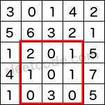

==== 移除非法括号

----
Remove the minimum number of invalid parentheses in order to make the input string valid. Return all possible results.

Note: The input string may contain letters other than the parentheses ( and ).

Examples:
"()())()" -> ["()()()", "(())()"]
"(a)())()" -> ["(a)()()", "(a())()"]
")(" -> [""]
----

这道题让我们移除最少的括号使得给定字符串为一个合法的含有括号的字符串，我们从小数学里就有括号，所以应该对合法的含有括号的字符串并不陌生，字符串中的左右括号数应该相同，而且每个右括号左边一定有其对应的左括号，而且题目中给的例子也说明了去除方法不唯一，我们需要找出所有合法的取法。参考了网上大神的解法，这道题首先可以用BFS来解，我们先把给定字符串排入队中，然后取出检测其是否合法，若合法直接返回，不合法的话，我们对其进行遍历，对于遇到的左右括号的字符，我们去掉括号字符生成一个新的字符串，如果这个字符串之前没有遇到过，将其排入队中，我们用哈希集合记录一个字符串是否出现过。我们对队列中的每个元素都进行相同的操作，直到队列为空还没找到合法的字符串的话，那就返回空集，参见代码如下： +

**解法1:** +
[source, cpp, linenums]
----
class Solution {
public:
    vector<string> removeInvalidParentheses(string s) {
        vector<string> res;
        unordered_set<string> visited{{s}};
        queue<string> q{{s}};
        bool found = false;
        while (!q.empty()) {
            string t = q.front(); q.pop();
            if (isValid(t)) {
                res.push_back(t);
                found = true;
            }
            if (found) continue;
            for (int i = 0; i < t.size(); ++i) {
                if (t[i] != '(' && t[i] != ')') continue;
                string str = t.substr(0, i) + t.substr(i + 1);
                if (!visited.count(str)) {
                    q.push(str);
                    visited.insert(str);
                }
            }
        }
        return res;
    }
    bool isValid(string t) {
        int cnt = 0;
        for (int i = 0; i < t.size(); ++i) {
            if (t[i] == '(') ++cnt;
            else if (t[i] == ')' && --cnt < 0) return false;
        }
        return cnt == 0;
    }
};
----

下面来看一种递归解法，这种解法首先统计了多余的半括号的数量，用cnt1表示多余的左括号，cnt2表示多余的右括号，因为给定字符串左右括号要么一样多，要么左括号多，要么右括号多，也可能左右括号都多，比如")("。所以cnt1和cnt2要么都为0，要么都大于0，要么一个为0，另一个大于0。好，下面进入我们的递归函数，首先判断，如果当cnt1和cnt2都为0时，说明此时左右括号个数相等了，我们调用isValid子函数来判断是否正确，正确的话加入结果res中并返回即可。否则从start开始遍历，这里的变量start表示当前递归开始的位置，我们不需要每次都从头开始，会有大量重复计算。而且对于多个相同的半括号在一起，我们只删除第一个，比如"())"，这里有两个右括号，我们不管删第一个还是删第二个右括号都会得到"()"，没有区别，所以只用算一次就行了，我们通过和上一个字符比较，如果不相同，说明是第一个右括号，如果相同则直接跳过。此时来看如果cnt1大于0，说明此时左括号多，而如果当前字符正好是左括号的时候，我们可以删掉当前左括号，继续调用递归，此时cnt1的值就应该减1，因为已经删掉了一个左括号。同理，如果cnt2大于0，说明此时右括号多，而如果当前字符正好是右括号的时候，我们可以删掉当前右括号，继续调用递归，此时cnt2的值就应该减1，因为已经删掉了一个右括号。参见代码如下： +

**解法2:** +
[source, cpp, linenums]
----
class Solution {
public:
    vector<string> removeInvalidParentheses(string s) {
        vector<string> res;
        int cnt1 = 0, cnt2 = 0;
        for (char c : s) {
            cnt1 += (c == '(');
            if (cnt1 == 0) cnt2 += (c == ')');
            else cnt1 -= (c == ')');
        }
        helper(s, 0, cnt1, cnt2, res);
        return res;
    }
    void helper(string s, int start, int cnt1, int cnt2, vector<string>& res) {
        if (cnt1 == 0 && cnt2 == 0) {
            if (isValid(s)) res.push_back(s);
            return;
        }
        for (int i = start; i < s.size(); ++i) {
            if (i != start && s[i] == s[i - 1]) continue;
            if (cnt1 > 0 && s[i] == '(') {
                helper(s.substr(0, i) + s.substr(i + 1), i, cnt1 - 1, cnt2, res);
            }
            if (cnt2 > 0 && s[i] == ')') {
                helper(s.substr(0, i) + s.substr(i + 1), i, cnt1, cnt2 - 1, res);
            }
        }
    }
    bool isValid(string t) {
        int cnt = 0;
        for (int i = 0; i < t.size(); ++i) {
            if (t[i] == '(') ++cnt;
            else if (t[i] == ')' && --cnt < 0) return false;
        }
        return cnt == 0;
    }
};
----

下面这种解法是论坛上的高票解法，思路确实很巧妙。递归函数的参数中，last_i表示当前遍历到的位置，相当上面解法中的start，last_j表示上一个删除的位置，这样可以避免重复计算。然后有个括号字符数组，初始化时放入左括号和右括号，博主认为这个字符数组是此解法最精髓的地方，因为其顺序可以改变，可以变成反向括号，这个就比较叼了，后面再讲它到底有多叼吧。我们在递归函数中，从last_i开始遍历，在找正向括号的时候，用变量cnt表示括号数组中的左括号出现的次数，遇到左括号自增1，遇到右括号自减1。当左括号大于等于右括号的时候，我们直接跳过。这个循环的目的是要删除多余的右括号，所以当cnt小于0的时候，我们从上一个删除位置last_j开始遍历，如果当前是右括号，且是第一个右括号（关于这块可以参见上面解法中的分析），我们删除当前右括号，并调用递归函数。注意这个for循环结束后要直接返回，因为进这个for循环的都是右括号多的，删到最后最多是删成和左括号一样多，不需要再去翻转删左括号。好，最后来说这个最叼的翻转，当字符串的左括号个数大于等于右括号的时候，不会进入第二个for循环，自然也不会return。那么由于左括号的个数可能会要大于右括号，所以我们还要删除多余的左括号，所以我们将字符串反转一下，比如"(()"，反转变成")(("，此时虽然我们还是要删除多余的左括号，但是反转后就没有合法的括号了，所以变成了找反向括号")("，那么还是可以删除多余的左括号，然后我们判断此时括号数组的状态，如果是正向括号，说明此时正要删除左括号，那么就调用递归函数，last_i和last_j均重置为0，括号数组初始化为反向括号。如果此时已经是反向括号了，说明之前的左括号已经删掉了变成了")("，然后又反转了一下，变回来了"()"，那么就可以直接加入结果res了，参见代码如下： +

**解法3:** +
[source, cpp, linenums]
----
class Solution {
public:
    vector<string> removeInvalidParentheses(string s) {
        vector<string> res;
        helper(s, 0, 0, {'(', ')'}, res);
        return res;
    }
    void helper(string s, int last_i, int last_j, vector<char> p, vector<string>& res) {
        int cnt = 0;
        for (int i = last_i; i < s.size(); ++i) {
            if (s[i] == p[0]) ++cnt;
            else if (s[i] == p[1]) --cnt;
            if (cnt >= 0) continue;
            for (int j = last_j; j <= i; ++j) {
                if (s[j] == p[1] && (j == last_j || s[j] != s[j - 1])) {
                    helper(s.substr(0, j) + s.substr(j + 1), i, j, p, res);
                }
            }
            return;
        }
        string rev = string(s.rbegin(), s.rend());
        if (p[0] == '(') helper(rev, 0, 0, {')', '('}, res);
        else res.push_back(rev);
    }
};
----

==== 包含黑像素的最小矩阵

----
An image is represented by a binary matrix with 0 as a white pixel and 1 as a black pixel. The black pixels are connected, i.e., there is only one black region. Pixels are connected horizontally and vertically. Given the location (x, y) of one of the black pixels, return the area of the smallest (axis-aligned) rectangle that encloses all black pixels.

For example, given the following image:

[
  "0010",
  "0110",
  "0100"
]
and x = 0, y = 2,

Return 6.
----

这道题给我们一个二维矩阵，表示一个图片的数据，其中1代表黑像素，0代表白像素，现在让我们找出一个最小的矩阵可以包括所有的黑像素，还给了我们一个黑像素的坐标，我们先来看Brute Force的方法，这种方法的效率不高，遍历了整个数组，如果遇到了1，就更新矩形的返回，参见代码如下： +

**解法1:** +
[source, cpp, linenums]
----
class Solution {
public:
    int minArea(vector<vector<char>>& image, int x, int y) {
        int left = y, right = y, up = x, down = x;
        for (int i = 0; i < image.size(); ++i) {
            for (int j = 0; j < image[i].size(); ++j) {
                if (image[i][j] == '1') {
                    left = min(left, j);
                    right = max(right, j);
                    up = min(up, i);
                    down = max(down, i);
                }
            }
        }
        return (right - left + 1) * (down - up + 1);
    }
};
----

下面这种解法是解法一的递归写法，本质上来说跟上面的解法没有啥区别，也没有任何的优化，所以仍然可以认为是暴力搜索法，参见代码如下： +

**解法2:** +
[source, cpp, linenums]
----
class Solution {
public:
    int minArea(vector<vector<char>>& image, int x, int y) {
        int left = y, right = y, up = x, down = x;
        dfs(image, x, y, left, right, up, down);
        return (right - left + 1) * (down - up + 1);
    }
    void dfs(vector<vector<char>> &image, int x, int y, int &left, int &right, int &up, int &down) {
        if (x < 0 || x >= image.size() || y < 0 || y >= image[0].size() || image[x][y] != '1') return;
        left = min(left, y);
        right = max(right, y);
        up = min(up, x);
        down = max(down, x);
        image[x][y] = '2';
        dfs(image, x + 1, y, left, right, up, down);
        dfs(image, x - 1, y, left, right, up, down);
        dfs(image, x, y + 1, left, right, up, down);
        dfs(image, x, y - 1, left, right, up, down);
    }
};
----
我们再来看一种优化了时间复杂度的解法，这是一种二分搜索法，以给定的一个黑像素(x, y)为中心，分别用二分法快速找到整个黑色区域的上下左右的临界点，然后直接算出面积。首先我们来看上边界怎么找，既然是以(x, y)为中心，而且上边界又是某个行数，那么其范围肯定在[0, x]之间，能成为上边界的条件是该行中至少有一个点是1，那么其列数的范围就在[0, n]之间，我们在进行二分搜索的时候，先根据i, j算出中间行mid，然后列数从0开始遍历，直到找到为1的点，或者越界位置，然后我们判断列数是否越界，越界的话，说明当前行没有1，此时更新i为mid+1，如果找到了1，那么更新j为mid。找下边界也是同样的道理，但是跟上边界稍微又些不同的地方是，如果当前行找到了1，我们应该再往下找，那么i应该更新为mid+1；如果没找到，就应该往上找，靠近(x, y)点；所以两种情况只是在二分法更新范围的地方正好想法，所以我们可以用一个bool型的变量opt来决定还如何更新行数。 +

下面我们来看如何确定左边界和右边界，其实跟确定上下边界大同小异。左边界是列数，若以(x, y)点为中心，那么其范围便是[0, y]，因为我们之前已经确定了上下边界up和down了，所以左边界点的行数范围就是[up, down]，那么同理，当我们通过i, j求出了中间列mid时，我们就要遍历该列，找到为1的点，所以此时我们是用image[k][mid]，而在找上下边界时，我们用的是image[mid][k]，还是顺序不一样，我们可以用另外一个bool型变量h来控制，h表示horizontal，就是水平遍历的意思。这样我们通过两个bool型变量就可以用一个函数来涵盖四种情况的二分搜索，是不是很叼？下面更新i或j的时候参考上下边界的分析，应该不难理解，参见代码如下： +

**解法3:** +
[source, cpp, linenums]
----
class Solution {
public:
    int minArea(vector<vector<char>>& image, int x, int y) {
        int m = image.size(), n = image[0].size();
        int up = binary_search(image, true, 0, x, 0, n, true);
        int down = binary_search(image, true, x + 1, m, 0, n, false);
        int left = binary_search(image, false, 0, y, up, down, true);
        int right = binary_search(image, false, y + 1, n, up, down, false);
        return (right - left) * (down - up);
    }
    int binary_search(vector<vector<char>> &image, bool h, int i, int j, int low, int high, bool opt) {
        while (i < j) {
            int k = low, mid = (i + j) / 2;
            while (k < high && (h ? image[mid][k] : image[k][mid]) == '0') ++k;
            if (k < high == opt) j = mid;
            else i = mid + 1;
        }
        return i;
    }
};
----

==== 区域和检索 - 不可变

----
Given an integer array nums, find the sum of the elements between indices i and j (i ≤ j), inclusive.

Example:
Given nums = [-2, 0, 3, -5, 2, -1]

sumRange(0, 2) -> 1
sumRange(2, 5) -> -1
sumRange(0, 5) -> -3
Note:
You may assume that the array does not change.
There are many calls to sumRange function.
----

这道题让我们检索一个数组的某个区间的所有数字之和，题目中给了两条条件，首先数组内容不会变化，其次有很多的区间和检索。那么我们用传统的遍历相加来求每次区间和检索，十分的不高效，而且无法通过OJ。所以这道题的难点就在于是否能想到来用建立累计直方图的思想来建立一个累计和的数组dp，其中dp[i]表示[0, i]区间的数字之和，那么[i,j]就可以表示为dp[j]-dp[i-1]，这里要注意一下当i=0时，直接返回dp[j]即可，参见代码如下： +

**解法1:** +
[source, cpp, linenums]
----
class NumArray {
public:
    NumArray(vector<int> &nums) {
        dp = nums;
        for (int i = 1; i < nums.size(); ++i) {
            dp[i] += dp[i - 1];
        }
    }
    int sumRange(int i, int j) {
        return i == 0? dp[j] : dp[j] - dp[i - 1];
    }
private:
    vector<int> dp;
};
----

当然，我们也可以通过增加一位dp的长度，来避免在sumRange中检测i是否为0，参见代码如下： +

**解法2:** +
[source, cpp, linenums]
----
class NumArray {
public:
    NumArray(vector<int> &nums) {
        dp.resize(nums.size() + 1, 0);
        for (int i = 1; i <= nums.size(); ++i) {
            dp[i] = dp[i - 1] + nums[i - 1];
        }
    }
    int sumRange(int i, int j) {
        return dp[j + 1] - dp[i];
    }

private:
    vector<int> dp;
};
----

==== 二维区域和检索 - 不可变

Given a 2D matrix matrix, find the sum of the elements inside the rectangle defined by its upper left corner (row1, col1) and lower right corner (row2, col2). +

----
The above rectangle (with the red border) is defined by (row1, col1) = (2, 1) and (row2, col2) = (4, 3), which contains sum = 8.

Example:
Given matrix = [
  [3, 0, 1, 4, 2],
  [5, 6, 3, 2, 1],
  [1, 2, 0, 1, 5],
  [4, 1, 0, 1, 7],
  [1, 0, 3, 0, 5]
]

sumRegion(2, 1, 4, 3) -> 8
sumRegion(1, 1, 2, 2) -> 11
sumRegion(1, 2, 2, 4) -> 12
Note:
You may assume that the matrix does not change.
There are many calls to sumRegion function.
You may assume that row1 ≤ row2 and col1 ≤ col2.
----

这道题让我们求一个二维区域和的检索，是之前那道题Range Sum Query - Immutable 区域和检索的延伸。有了之前那道题的基础，
我们知道这道题其实也是换汤不换药，还是要建立一个累计区域和的数组，然后根据边界值的加减法来快速求出给定区域之和。
这里我们维护一个二维数组dp，其中dp[i][j]表示累计区间(0, 0)到(i, j)这个矩形区间所有的数字之和，
那么此时如果我们想要快速求出(r1, c1)到(r2, c2)的矩形区间时，只需dp[r2][c2] - dp[r2][c1 - 1] - dp[r1 - 1][c2] + dp[r1 - 1][c1 - 1]即可，
下面的代码中我们由于用了辅助列和辅助行，所以下标会有些变化，参见代码如下： +

[source, cpp, linenums]
----
class NumMatrix {
public:
    NumMatrix(vector<vector<int> > &matrix) {
        if (matrix.empty() || matrix[0].empty()) return;
        dp.resize(matrix.size() + 1, vector<int>(matrix[0].size() + 1, 0));
        for (int i = 1; i <= matrix.size(); ++i) {
            for (int j = 1; j <= matrix[0].size(); ++j) {
                dp[i][j] = dp[i][j - 1] + dp[i - 1][j] - dp[i - 1][j - 1] + matrix[i - 1][j - 1];
            }
        }
    }
    int sumRegion(int row1, int col1, int row2, int col2) {
        return dp[row2 + 1][col2 + 1] - dp[row1][col2 + 1] - dp[row2 + 1][col1] + dp[row1][col1];
    }

private:
    vector<vector<int> > dp;
};
----

==== 岛屿的数量之二

----
A 2d grid map of m rows and n columns is initially filled with water. We may perform an addLand operation which turns the water at position (row, col) into a land. Given a list of positions to operate, count the number of islands after each addLand operation. An island is surrounded by water and is formed by connecting adjacent lands horizontally or vertically. You may assume all four edges of the grid are all surrounded by water.

Example:

Given m = 3, n = 3, positions = [[0,0], [0,1], [1,2], [2,1]].
Initially, the 2d grid grid is filled with water. (Assume 0 represents water and 1 represents land).

0 0 0
0 0 0
0 0 0
Operation #1: addLand(0, 0) turns the water at grid[0][0] into a land.

1 0 0
0 0 0   Number of islands = 1
0 0 0
Operation #2: addLand(0, 1) turns the water at grid[0][1] into a land.

1 1 0
0 0 0   Number of islands = 1
0 0 0
Operation #3: addLand(1, 2) turns the water at grid[1][2] into a land.

1 1 0
0 0 1   Number of islands = 2
0 0 0
Operation #4: addLand(2, 1) turns the water at grid[2][1] into a land.

1 1 0
0 0 1   Number of islands = 3
0 1 0
We return the result as an array: [1, 1, 2, 3]

Challenge:

Can you do it in time complexity O(k log mn), where k is the length of the positions?
----

----
这道题是之前那道Number of Islands的拓展，难度增加了不少，因为这次是一个点一个点的增加，每增加一个点，都要统一一下现在总共的岛屿个数，最开始初始化时没有陆地，如下：

0 0 0
0 0 0
0 0 0

假如我们在(0, 0)的位置增加一个陆地，那么此时岛屿数量为1：

1 0 0
0 0 0
0 0 0

假如我们再在(0, 2)的位置增加一个陆地，那么此时岛屿数量为2：

1 0 1
0 0 0
0 0 0

假如我们再在(0, 1)的位置增加一个陆地，那么此时岛屿数量却又变为1：

1 1 1
0 0 0
0 0 0

假如我们再在(1, 1)的位置增加一个陆地，那么此时岛屿数量仍为1：

1 1 1
0 1 0
0 0 0
----

那么我们为了解决这种陆地之间会合并的情况，最好能够将每个陆地都标记出其属于哪个岛屿，这样就会方便我们统计岛屿个数。这种群组类问题，很适合使用联合查找 Union Find 来做，又叫并查集 Disjoint Set，LeetCode中使用这种解法的题目还不少呢，比如Friend Circles，Graph Valid Tree，Redundant Connection II 等等。一般来说，UF算法的思路是每个个体先初始化为不同的群组，然后遍历有关联的两个个体，如果发现其getRoot函数的返回值不同，则手动将二者加入一个群组，然后总群组数自减1。这里就要分别说一下root数组，和getRoot函数。两个同群组的个体，通过getRoot函数一定会返回相同的值，但是其在root 数组中的值不一定相同，我们可以类比成getRoot函数返回的是祖先，如果两个人的祖先相同，那么其是属于一个家族的（这里不是指人类共同的祖先哈）。root可以用数组或者HashMap来表示，如果个体是数字的话，那么数组就OK，如果个体是字符串的话，可能就需要用HashMap了。root数组的初始化可以有两种，可以均初始化为-1，或者都初始化为不同的数字，博主一般喜欢初始化为不同的数字。getRoot函数的写法也可用递归或者迭代的方式，可参见博主之前的帖子Redundant Connection II中的讨论部分。这么一说感觉UF算法的东西还蛮多的，啥时候博主写个UF总结贴吧。 +

那么具体来看这道题吧，此题跟经典的UF使用场景有一点点的区别，因为一般的场景中两个个体之间只有两种关系，属于一个群组或者不属于同一个群组，而这道题里面由于water的存在，就多了一种情况，我们只需要事先检测一下当前位置是不是岛屿就行了，总之问题不大。一般来说我们的root数组都是使用一维数组，方便一些，那么这里就可以将二维数组encode为一维的，于是我们需要一个长度为m*n的一维数组来标记各个位置属于哪个岛屿，我们假设每个位置都是一个单独岛屿，岛屿编号可以用其坐标位置表示，但是我们初始化时将其都赋为-1，这样方便我们知道哪些位置尚未变成岛屿。然后我们开始遍历陆地数组，将其岛屿编号设置为其坐标位置，然后岛屿计数加1，我们此时开始遍历其上下左右的位置，遇到越界或者岛屿标号为-1的情况直接跳过，现在知道我们初始化为-1的好处了吧，遇到是water的地方直接跳过。否则我们用getRoot来查找邻居位置的岛屿编号，同时也用getRoot来查找当前点的编号，这一步就是经典的UF算法的操作了，因为当前这两个land是相邻的，它们是属于一个岛屿，所以其getRoot函数的返回值suppose应该是相等的，但是如果返回值不同，说明我们需要合并岛屿，将两个返回值建立关联，并将岛屿计数cnt减1。当我们遍历完当前点的所有邻居时，该合并的都合并完了，将此时的岛屿计数cnt存入结果中，参见代码如下： +

[source, cpp, linenums]
----
class Solution {
public:
    vector<int> numIslands2(int m, int n, vector<pair<int, int>>& positions) {
        vector<int> res;
        int cnt = 0;
        vector<int> roots(m * n, -1);
        vector<vector<int>> dirs{{0, -1}, {-1, 0}, {0, 1}, {1, 0}};
        for (auto a : positions) {
            int id = n * a.first + a.second;
            if (roots[id] == -1) {
                roots[id] = id;
                ++cnt;
            }
            for (auto dir : dirs) {
                int x = a.first + dir[0], y = a.second + dir[1], cur_id = n * x + y;
                if (x < 0 || x >= m || y < 0 || y >= n || roots[cur_id] == -1) continue;
                int p = findRoot(roots, cur_id), q = findRoot(roots, id);
                if (p != q) {
                    roots[p] = q;
                    --cnt;
                }
            }
            res.push_back(cnt);
        }
        return res;
    }
    int findRoot(vector<int>& roots, int id) {
        return (id == roots[id]) ? id : findRoot(roots, roots[id]);
    }
};
----

==== 加法数

----
Additive number is a positive integer whose digits can form additive sequence.

A valid additive sequence should contain at least three numbers. Except for the first two numbers, each subsequent number in the sequence must be the sum of the preceding two.

For example:
"112358" is an additive number because the digits can form an additive sequence: 1, 1, 2, 3, 5, 8.

1 + 1 = 2, 1 + 2 = 3, 2 + 3 = 5, 3 + 5 = 8
"199100199" is also an additive number, the additive sequence is: 1, 99, 100, 199.

1 + 99 = 100, 99 + 100 = 199
Note: Numbers in the additive sequence cannot have leading zeros, so sequence 1, 2, 03 or 1, 02, 3 is invalid.

Given a string represents an integer, write a function to determine if it's an additive number.

Follow up:
How would you handle overflow for very large input integers?
----

这道题定义了一种加法数，就是至少含有三个数字，除去前两个数外，每个数字都是前面两个数字的和，题目中给了许多例子，也限定了一些不合法的情况，比如两位数以上不能以0开头等等，让我们来判断一个数是否是加法数。开始我还想是否能用动态规划来解，可是发现不会写递推式，只得作罢。其实这题可用Brute Force的思想来解，我们让第一个数字先从一位开始，第二个数字从一位，两位，往高位开始搜索，前两个数字确定了，相加得到第三位数字，三个数组排列起来形成一个字符串，和原字符串长度相比，如果小于原长度，那么取出上一次计算的第二个和第三个数，当做新一次计算的前两个数，用相同的方法得到第三个数，再加入当前字符串，再和原字符串长度相比，以此类推，直到当前字符串长度不小于原字符串长度，比较两者是否相同，相同返回true，不相同则继续循环。如果所有情况都遍历完了还是没有返回true，则说明不是Additive Number，返回false，参见代码如下： +

[source, cpp, linenums]
----
class Solution {
public:
    bool isAdditiveNumber(string num) {
        for (int i = 1; i < num.size(); ++i) {
            for (int j = i + 1; j < num.size(); ++j) {
                string s1 = num.substr(0, i);
                string s2 = num.substr(i, j - i);
                long long d1 = atoll(s1.c_str()), d2 = atoll(s2.c_str());
                if ((s1.size() > 1 && s1[0] == '0') || (s2.size() > 1 && s2[0] == '0')) continue;
                long long next = d1 + d2;
                string nexts = to_string(next);
                string now = s1 + s2 + nexts;
                while (now.size() < num.size()) {
                    d1 = d2;
                    d2 = next;
                    next = d1 + d2;
                    nexts = to_string(next);
                    now += nexts;
                }
                if (now == num) return true;
            }
        }
        return false;
    }
};
----

==== 区域和检索 - 可变

----
Given an integer array nums, find the sum of the elements between indices i and j (i ≤ j), inclusive.

The update(i, val) function modifies nums by updating the element at index i to val.

Example:
Given nums = [1, 3, 5]

sumRange(0, 2) -> 9
update(1, 2)
sumRange(0, 2) -> 8
Note:
The array is only modifiable by the update function.
You may assume the number of calls to update and sumRange function is distributed evenly.
----

这道题是之前那道Range Sum Query - Immutable 区域和检索 - 不可变的延伸，之前那道题由于数组的内容不会改变，所以我们只需要建立一个累计数组就可以支持快速的计算区间值了，而这道题说数组的内容会改变，如果我们还是用之前的方法建立累计和数组，那么每改变一个数字，之后所有位置的数字都要改变，这样如果有很多更新操作的话，就会十分不高效。这道题我们要使用一种新的数据结构，叫做树状数组Binary Indexed Tree，又称Fenwick Tree，这是一种查询和修改复杂度均为O(logn)的数据结构。这个树状数组比较有意思，所有的奇数位置的数字和原数组对应位置的相同，偶数位置是原数组若干位置之和，假如原数组A(a1, a2, a3, a4 ...)，和其对应的树状数组C(c1, c2, c3, c4 ...)有如下关系： +

image::images/question_307.jpeg[width="30%", height="35%"]

----
C1 = A1
C2 = A1 + A2
C3 = A3
C4 = A1 + A2 + A3 + A4
C5 = A5
C6 = A5 + A6
C7 = A7
C8 = A1 + A2 + A3 + A4 + A5 + A6 + A7 + A8
...
那么是如何确定某个位置到底是有几个数组成的呢，原来是根据坐标的最低位Low Bit来决定的，所谓的最低位，就是二进制数的最右边的一个1开始，加上后面的0(如果有的话)组成的数字，例如1到8的最低位如下面所示：

坐标          二进制          最低位

1               0001          1

2               0010          2

3               0011          1

4               0100          4

5               0101          1

6               0110          2

7               0111          1

8               1000          8

...

最低位的计算方法有两种，一种是x&(x^(x–1))，另一种是利用补码特性x&-x。
----

这道题我们先根据给定输入数组建立一个树状数组bit，然后更新某一位数字时，根据最低位的值来更新后面含有这一位数字的地方，一般只需要更新部分偶数位置的值即可，在计算某一位置的前缀和时，利用树状数组的性质也能高效的算出来，参见代码如下： +

[source, cpp, linenums]
----
class NumArray {
public:
    NumArray(vector<int> &nums) {
        num.resize(nums.size() + 1);
        bit.resize(nums.size() + 1);
        for (int i = 0; i < nums.size(); ++i) {
            update(i, nums[i]);
        }
    }
    void update(int i, int val) {
        int diff = val - num[i + 1];
        for (int j = i + 1; j < num.size(); j += (j&-j)) {
            bit[j] += diff;
        }
        num[i + 1] = val;
    }
    int sumRange(int i, int j) {
        return getSum(j + 1) - getSum(i);
    }
    int getSum(int i) {
        int res = 0;
        for (int j = i; j > 0; j -= (j&-j)) {
            res += bit[j];
        }
        return res;
    }

private:
    vector<int> num;
    vector<int> bit;
};
----

==== 二维区域和检索 - 可变

Given a 2D matrix matrix, find the sum of the elements inside the rectangle defined by its upper left corner (row1, col1) and lower right corner (row2, col2). +

image::images/question_308.png[width="30%", height="35%"]

----
The above rectangle (with the red border) is defined by (row1, col1) = (2, 1) and (row2, col2) = (4, 3), which contains sum = 8.

Example:
Given matrix = [
  [3, 0, 1, 4, 2],
  [5, 6, 3, 2, 1],
  [1, 2, 0, 1, 5],
  [4, 1, 0, 1, 7],
  [1, 0, 3, 0, 5]
]

sumRegion(2, 1, 4, 3) -> 8
update(3, 2, 2)
sumRegion(2, 1, 4, 3) -> 10
Note:
The matrix is only modifiable by the update function.
You may assume the number of calls to update and sumRegion function is distributed evenly.
You may assume that row1 ≤ row2 and col1 ≤ col2.
----

这道题让我们求二维区域和检索，而且告诉我们数组中的值可能变化，这是之前那道Range Sum Query 2D - Immutable的拓展，
由于我们之前做过一维数组的可变和不可变的情况Range Sum Query - Mutable和Range Sum Query - Immutable，
那么为了能够通过OJ，我们还是需要用到树状数组Binary Indexed Tree(参见Range Sum Query - Mutable)，
其查询和修改的复杂度均为O(logn)，那么我们还是要建立树状数组，我们根据数组中的每一个位置，建立一个二维的树状数组，
然后还需要一个getSum函数，以便求得从(0, 0)到(i, j)的区间的数字和，然后在求某一个区间和时，
就利用其四个顶点的区间和关系可以快速求出，参见代码如下： +

**解法1:** +
[source, cpp, linenums]
----
class NumMatrix {
public:
    NumMatrix(vector<vector<int>> &matrix) {
        if (matrix.empty() || matrix[0].empty()) return;
        mat.resize(matrix.size() + 1, vector<int>(matrix[0].size() + 1, 0));
        bit.resize(matrix.size() + 1, vector<int>(matrix[0].size() + 1, 0));
        for (int i = 0; i < matrix.size(); ++i) {
            for (int j = 0; j < matrix[i].size(); ++j) {
                update(i, j, matrix[i][j]);
            }
        }
    }

    void update(int row, int col, int val) {
        int diff = val - mat[row + 1][col + 1];
        for (int i = row + 1; i < mat.size(); i += i&-i) {
            for (int j = col + 1; j < mat[i].size(); j += j&-j) {
                bit[i][j] += diff;
            }
        }
        mat[row + 1][col + 1] = val;
    }

    int sumRegion(int row1, int col1, int row2, int col2) {
        return getSum(row2 + 1, col2 + 1) - getSum(row1, col2 + 1) - getSum(row2 + 1, col1) + getSum(row1, col1);
    }

    int getSum(int row, int col) {
        int res = 0;
        for (int i = row; i > 0; i -= i&-i) {
            for (int j = col; j > 0; j -= j&-j) {
                res += bit[i][j];
            }
        }
        return res;
    }

private:
    vector<vector<int>> mat;
    vector<vector<int>> bit;
};
----

我在网上还看到了另一种解法，这种解法并没有用到树状数组，而是利用了列之和，所谓列之和，就是(i, j)就是(0, j) + (1, j) + ... + (i, j) 之和，相当于把很多个一维的区间之和拼到了一起，那么我们在构造函数中需要建立起这样一个列之和矩阵，然后再更新某一个位置时，我们只需要将该列中改变的位置下面的所有数字更新一下即可，而在求某个区间和时，只要将相差的各列中对应的起始和结束的行上的值的差值累加起来即可，参见代码如下： +

**解法2:** +
[source, cpp, linenums]
----
class NumMatrix {
public:
    NumMatrix(vector<vector<int>> &matrix) {
        if (matrix.empty() || matrix[0].empty()) return;
        mat = matrix;
        colSum.resize(matrix.size() + 1, vector<int>(matrix[0].size(), 0));
        for (int i = 1; i < colSum.size(); ++i) {
            for (int j = 0; j < colSum[0].size(); ++j) {
                colSum[i][j] = colSum[i - 1][j] + matrix[i - 1][j];
            }
        }
    }

    void update(int row, int col, int val) {
        for (int i = row + 1; i < colSum.size(); ++i) {
            colSum[i][col] += val - mat[row][col];
        }
        mat[row][col] = val;
    }

    int sumRegion(int row1, int col1, int row2, int col2) {
        int res = 0;
        for (int j = col1; j <= col2; ++j) {
            res += colSum[row2 + 1][j] - colSum[row1][j];
        }
        return res;
    }

private:
    vector<vector<int>> mat;
    vector<vector<int>> colSum;
};
----

==== 买股票的最佳时间含冷冻期

----
Say you have an array for which the ith element is the price of a given stock on day i.

Design an algorithm to find the maximum profit. You may complete as many transactions as you like (ie, buy one and sell one share of the stock multiple times) with the following restrictions:

You may not engage in multiple transactions at the same time (ie, you must sell the stock before you buy again).
After you sell your stock, you cannot buy stock on next day. (ie, cooldown 1 day)
Example:

prices = [1, 2, 3, 0, 2]
maxProfit = 3
transactions = [buy, sell, cooldown, buy, sell]
----

----
这道题又是关于买卖股票的问题，之前有四道类似的题目Best Time to Buy and Sell Stock 买卖股票的最佳时间，Best Time to Buy and Sell Stock II 买股票的最佳时间之二， Best Time to Buy and Sell Stock III 买股票的最佳时间之三和Best Time to Buy and Sell Stock IV 买卖股票的最佳时间之四。而这道题与上面这些不同之处在于加入了一个冷冻期Cooldown之说，就是如果某天卖了股票，那么第二天不能买股票，有一天的冷冻期。这道题我不太会，于是看到了网上大神的解法，点这里。根据他的解法，此题需要维护三个一维数组buy, sell，和rest。其中：

buy[i]表示在第i天之前最后一个操作是买，此时的最大收益。

sell[i]表示在第i天之前最后一个操作是卖，此时的最大收益。

rest[i]表示在第i天之前最后一个操作是冷冻期，此时的最大收益。

我们写出递推式为：

buy[i]  = max(rest[i-1] - price, buy[i-1])
sell[i] = max(buy[i-1] + price, sell[i-1])
rest[i] = max(sell[i-1], buy[i-1], rest[i-1])

上述递推式很好的表示了在买之前有冷冻期，买之前要卖掉之前的股票。一个小技巧是如何保证[buy, rest, buy]的情况不会出现，这是由于buy[i] <= rest[i]， 即rest[i] = max(sell[i-1], rest[i-1])，这保证了[buy, rest, buy]不会出现。

另外，由于冷冻期的存在，我们可以得出rest[i] = sell[i-1]，这样，我们可以将上面三个递推式精简到两个：

buy[i]  = max(sell[i-2] - price, buy[i-1])
sell[i] = max(buy[i-1] + price, sell[i-1])
----

我们还可以做进一步优化，由于i只依赖于i-1和i-2，所以我们可以在O(1)的空间复杂度完成算法，参见代码如下： +

[source, cpp, linenums]
----
class Solution {
public:
    int maxProfit(vector<int>& prices) {
        int buy = INT_MIN, pre_buy = 0, sell = 0, pre_sell = 0;
        for (int price : prices) {
            pre_buy = buy;
            buy = max(pre_sell - price, pre_buy);
            pre_sell = sell;
            sell = max(pre_buy + price, pre_sell);
        }
        return sell;
    }
};
----

==== 最小高度树

----
For a undirected graph with tree characteristics, we can choose any node as the root. The result graph is then a rooted tree. Among all possible rooted trees, those with minimum height are called minimum height trees (MHTs). Given such a graph, write a function to find all the MHTs and return a list of their root labels.

Format
The graph contains n nodes which are labeled from 0 to n - 1. You will be given the number n and a list of undirected edges (each edge is a pair of labels).

You can assume that no duplicate edges will appear in edges. Since all edges are undirected, [0, 1] is the same as [1, 0] and thus will not appear together in edges.
----

这道题虽然是树的题目，但是跟其最接近的题目是Course Schedule 课程清单和Course Schedule II 课程清单之二。由于LeetCode中的树的题目主要都是针对于二叉树的，而这道题虽说是树但其实本质是想考察图的知识，这道题刚开始在拿到的时候，我最先想到的解法是遍历的点，以每个点都当做根节点，算出高度，然后找出最小的，但是一时半会又写不出程序来，于是上网看看大家的解法，发现大家推崇的方法是一个类似剥洋葱的方法，就是一层一层的褪去叶节点，最后剩下的一个或两个节点就是我们要求的最小高度树的根节点，这种思路非常的巧妙，而且实现起来也不难，跟之前那到课程清单的题一样，我们需要建立一个图g，是一个二维数组，其中g[i]是一个一维数组，保存了i节点可以到达的所有节点。我们开始将所有只有一个连接边的节点(叶节点)都存入到一个队列queue中，然后我们遍历每一个叶节点，通过图来找到和其相连的节点，并且在其相连节点的集合中将该叶节点删去，如果删完后此节点也也变成一个叶节点了，加入队列中，再下一轮删除。那么我们删到什么时候呢，当节点数小于等于2时候停止，此时剩下的一个或两个节点就是我们要求的最小高度树的根节点啦，参见代码如下： +

[source, cpp, linenums]
----
class Solution {
public:
    vector<int> findMinHeightTrees(int n, vector<pair<int, int> >& edges) {
        if (n == 1) return {0};
        vector<int> res;
        vector<unordered_set<int>> adj(n);
        queue<int> q;
        for (auto edge : edges) {
            adj[edge.first].insert(edge.second);
            adj[edge.second].insert(edge.first);
        }
        for (int i = 0; i < n; ++i) {
            if (adj[i].size() == 1) q.push(i);
        }
        while (n > 2) {
            int size = q.size();
            n -= size;
            for (int i = 0; i < size; ++i) {
                int t = q.front(); q.pop();
                for (auto a : adj[t]) {
                    adj[a].erase(t);
                    if (adj[a].size() == 1) q.push(a);
                }
            }
        }
        while (!q.empty()) {
            res.push_back(q.front()); q.pop();
        }
        return res;
    }
};
----

==== 稀疏矩阵相乘

----
Given two sparse matrices A and B, return the result of AB.

You may assume that A's column number is equal to B's row number.

Example:

A = [
  [ 1, 0, 0],
  [-1, 0, 3]
]

B = [
  [ 7, 0, 0 ],
  [ 0, 0, 0 ],
  [ 0, 0, 1 ]
]

     |  1 0 0 |   | 7 0 0 |   |  7 0 0 |
AB = | -1 0 3 | x | 0 0 0 | = | -7 0 3 |
                  | 0 0 1 |
----

这道题让我们实现稀疏矩阵相乘，稀疏矩阵的特点是矩阵中绝大多数的元素为0，而相乘的结果是还应该是稀疏矩阵，即还是大多数元素为0，那么我们使用传统的矩阵相乘的算法肯定会处理大量的0乘0的无用功，所以我们需要适当的优化算法，使其可以顺利通过OJ，我们知道一个 i x k 的矩阵A乘以一个 k x j 的矩阵B会得到一个 i x j 大小的矩阵C，那么我们来看结果矩阵中的某个元素C[i][j]是怎么来的，起始是A[i][0]*B[0][j] + A[i][1]*B[1][j] + ... + A[i][k]*B[k][j]，那么为了不重复计算0乘0，我们首先遍历A数组，要确保A[i][k]不为0，才继续计算，然后我们遍历B矩阵的第k行，如果B[K][J]不为0，我们累加结果矩阵res[i][j] += A[i][k] * B[k][j]; 这样我们就能高效的算出稀疏矩阵的乘法，参见代码如下： +

**解法1:** +
[source, cpp, linenums]
----
class Solution {
public:
    vector<vector<int>> multiply(vector<vector<int>>& A, vector<vector<int>>& B) {
        vector<vector<int>> res(A.size(), vector<int>(B[0].size()));
        for (int i = 0; i < A.size(); ++i) {
            for (int k = 0; k < A[0].size(); ++k) {
                if (A[i][k] != 0) {
                    for (int j = 0; j < B[0].size(); ++j) {
                        if (B[k][j] != 0) res[i][j] += A[i][k] * B[k][j];
                    }
                }
            }
        }
        return res;
    }
};
----

再来看另一种方法，这种方法其实核心思想跟上面那种方法相同，稍有不同的是我们用一个二维矩阵矩阵来记录每一行中，各个位置中不为0的列数和其对应的值，然后我们遍历这个二维矩阵，取出每行中不为零的列数和值，然后遍历B中对应行进行累加相乘，参见代码如下： +

**解法2:** +
[source, cpp, linenums]
----
class Solution {
public:
    vector<vector<int>> multiply(vector<vector<int>>& A, vector<vector<int>>& B) {
        vector<vector<int>> res(A.size(), vector<int>(B[0].size()));
        vector<vector<pair<int, int>>> v(A.size(), vector<pair<int,int>>());
        for (int i = 0; i < A.size(); ++i) {
            for (int k = 0; k < A[i].size(); ++k) {
                if (A[i][k] != 0) v[i].push_back({k, A[i][k]});
            }
        }
        for (int i = 0; i < A.size(); ++i) {
            for (int k = 0; k < v[i].size(); ++k) {
                int col = v[i][k].first;
                int val = v[i][k].second;
                for (int j = 0; j < B[0].size(); ++j) {
                    res[i][j] += val * B[col][j];
                }
            }
        }
        return res;
    }
};
----

==== 打气球游戏

----
Given n balloons, indexed from 0 to n-1. Each balloon is painted with a number on it represented by array nums. You are asked to burst all the balloons. If the you burst balloon i you will get nums[left] * nums[i] * nums[right] coins. Here left and right are adjacent indices of i. After the burst, the left and right then becomes adjacent.

Find the maximum coins you can collect by bursting the balloons wisely.

Note:
(1) You may imagine nums[-1] = nums[n] = 1. They are not real therefore you can not burst them.
(2) 0 ≤ n ≤ 500, 0 ≤ nums[i] ≤ 100

Example:

Given [3, 1, 5, 8]

Return 167

    nums = [3,1,5,8] --> [3,5,8] -->   [3,8]   -->  [8]  --> []
   coins =  3*1*5      +  3*5*8    +  1*3*8      + 1*8*1   = 167
----

----
这道题提出了一种打气球的游戏，每个气球都对应着一个数字，我们每次打爆一个气球，得到的金币数是被打爆的气球的数字和其两边的气球上的数字相乘，如果旁边没有气球了，则按1算，以此类推，求能得到的最多金币数。像这种求极值问题，我们一般都要考虑用动态规划Dynamic Programming来做，我们维护一个二维动态数组dp，其中dp[i][j]表示打爆区间[i,j]中的所有气球能得到的最多金币。题目中说明了边界情况，当气球周围没有气球的时候，旁边的数字按1算，这样我们可以在原数组两边各填充一个1，这样方便于计算。这道题的最难点就是找递归式，如下所示：

dp[i][j] = max(dp[i][j], nums[i - 1]*nums[k]*nums[j + 1] + dp[i][k - 1] + dp[k + 1][j])                 ( i ≤ k ≤ j )

有了递推式，我们可以写代码，我们其实只是更新了dp数组的右上三角区域，我们最终要返回的值存在dp[1][n]中，其中n是两端添加1之前数组nums的个数。参见代码如下：
----

**解法1:** +
[source, cpp, linenums]
----
class Solution {
public:
    int maxCoins(vector<int>& nums) {
        int n = nums.size();
        nums.insert(nums.begin(), 1);
        nums.push_back(1);
        vector<vector<int> > dp(nums.size(), vector<int>(nums.size() , 0));
        for (int len = 1; len <= n; ++len) {
            for (int left = 1; left <= n - len + 1; ++left) {
                int right = left + len - 1;
                for (int k = left; k <= right; ++k) {
                    dp[left][right] = max(dp[left][right], nums[left - 1] * nums[k] * nums[right + 1] + dp[left][k - 1] + dp[k + 1][right]);
                }
            }
        }
        return dp[1][n];
    }
};
----

----
对于题目中的例子[3, 1, 5, 8]，得到的dp数组如下：

0    0    0    0    0    0
0    3    30   159  167  0
0    0    15   135  159  0
0    0    0    40   48   0
0    0    0    0    40   0
0    0    0    0    0    0

这题还有递归解法，思路都一样，就是写法略有不同，参见代码如下：
----

**解法2:** +
[source, cpp, linenums]
----
class Solution {
public:
    int maxCoins(vector<int>& nums) {
        int n = nums.size();
        nums.insert(nums.begin(), 1);
        nums.push_back(1);
        vector<vector<int> > dp(nums.size(), vector<int>(nums.size() , 0));
        return burst(nums, dp, 1 , n);
    }
    int burst(vector<int> &nums, vector<vector<int> > &dp, int left, int right) {
        if (left > right) return 0;
        if (dp[left][right] > 0) return dp[left][right];
        int res = 0;
        for (int k = left; k <= right; ++k) {
            res = max(res, nums[left - 1] * nums[k] * nums[right + 1] + burst(nums, dp, left, k - 1) + burst(nums, dp, k + 1, right));
        }
        dp[left][right] = res;
        return res;
    }
};
----

==== 超级丑陋数

----
Write a program to find the nth super ugly number.

Super ugly numbers are positive numbers whose all prime factors are in the given prime list primes of sizek. For example, [1, 2, 4, 7, 8, 13, 14, 16, 19, 26, 28, 32] is the sequence of the first 12 super ugly numbers given primes = [2, 7, 13, 19] of size 4.

Note:
(1) 1 is a super ugly number for any given primes.
(2) The given numbers in primes are in ascending order.
(3) 0 < k ≤ 100, 0 < n ≤ 106, 0 < primes[i] < 1000.
----

这道题让我们求超级丑陋数，是之前那两道Ugly Number 丑陋数和Ugly Number II 丑陋数之二的延伸，质数集合可以任意给定，这就增加了难度。但是本质上和Ugly Number II 丑陋数之二没有什么区别，由于我们不知道质数的个数，我们可以用一个idx数组来保存当前的位置，然后我们从每个子链中取出一个数，找出其中最小值，然后更新idx数组对应位置，注意有可能最小值不止一个，要更新所有最小值的位置，参见代码如下： +

**解法1:** +
[source, cpp, linenums]
----
class Solution {
public:
    int nthSuperUglyNumber(int n, vector<int>& primes) {
        vector<int> res(1, 1), idx(primes.size(), 0);
        while (res.size() < n) {
            vector<int> tmp;
            int mn = INT_MAX;
            for (int i = 0; i < primes.size(); ++i) {
                tmp.push_back(res[idx[i]] * primes[i]);
            }
            for (int i = 0; i < primes.size(); ++i) {
                mn = min(mn, tmp[i]);
            }
            for (int i = 0; i < primes.size(); ++i) {
                if (mn == tmp[i]) ++idx[i];
            }
            res.push_back(mn);
        }
        return res.back();
    }
};
----

上述代码可以稍稍改写一下，变得更简洁一些，原理完全相同，参见代码如下： +

**解法2:** +
[source, cpp, linenums]
----
class Solution {
public:
    int nthSuperUglyNumber(int n, vector<int>& primes) {
        vector<int> dp(n, 1), idx(primes.size(), 0);
        for (int i = 1; i < n; ++i) {
            dp[i] = INT_MAX;
            for (int j = 0; j < primes.size(); ++j) {
                dp[i] = min(dp[i], dp[idx[j]] * primes[j]);
            }
            for (int j = 0; j < primes.size(); ++j) {
                if (dp[i] == dp[idx[j]] * primes[j]) {
                    ++idx[j];
                }
            }
        }
        return dp.back();
    }
};
----

==== 二叉树的竖直遍历

----
Given a binary tree, return the vertical order traversal of its nodes' values. (ie, from top to bottom, column by column).

If two nodes are in the same row and column, the order should be from left to right.

Examples:
Given binary tree [3,9,20,null,null,15,7],
    3
   / \
  9  20
    /  \
   15   7
return its vertical order traversal as:
[
  [9],
  [3,15],
  [20],
  [7]
]
----

这道题让我们竖直遍历二叉树，并把每一列存入一个二维数组，我们看题目中给的第一个例子，3和15属于同一列，3在前，第二个例子中，3,5,2在同一列，3在前，5和2紧随其后，那么我们隐约的可以感觉到好像是一种层序遍历的前后顺序，那么我们如何来确定列的顺序呢，我们可以把根节点给个序号0，然后开始层序遍历，凡是左子节点则序号减1，右子节点序号加1，这样我们可以通过序号来把相同列的节点值放到一起，我们用一个TreeMap来建立序号和其对应的节点值的映射，用TreeMap的另一个好处是其自动排序功能可以让我们的列从左到右，由于层序遍历需要用到queue，我们此时queue里不能只存节点，而是要存序号和节点组成的pair，这样我们每次取出就可以操作序号，而且排入队中的节点也赋上其正确的序号，代码如下： +

[source, cpp, linenums]
----
class Solution {
public:
    vector<vector<int>> verticalOrder(TreeNode* root) {
        vector<vector<int>> res;
        if (!root) return res;
        map<int, vector<int>> m;
        queue<pair<int, TreeNode*>> q;
        q.push({0, root});
        while (!q.empty()) {
            auto a = q.front(); q.pop();
            m[a.first].push_back(a.second->val);
            if (a.second->left) q.push({a.first - 1, a.second->left});
            if (a.second->right) q.push({a.first + 1, a.second->right});
        }
        for (auto a : m) {
            res.push_back(a.second);
        }
        return res;
    }
};
----

==== 计算后面较小数字的个数

----
You are given an integer array nums and you have to return a new counts array. The counts array has the property where counts[i] is the number of smaller elements to the right of nums[i].

Example:

Given nums = [5, 2, 6, 1]

To the right of 5 there are 2 smaller elements (2 and 1).
To the right of 2 there is only 1 smaller element (1).
To the right of 6 there is 1 smaller element (1).
To the right of 1 there is 0 smaller element.
Return the array [2, 1, 1, 0].
----

这道题给定我们一个数组，让我们计算每个数字右边所有小于这个数字的个数，目测我们不能用brute force，OJ肯定不答应，那么我们为了提高运算效率，首先可以使用用二分搜索法，思路是将给定数组从最后一个开始，用二分法插入到一个新的数组，这样新数组就是有序的，那么此时该数字在新数组中的坐标就是原数组中其右边所有较小数字的个数，参见代码如下： +

**解法1:** +
[source, cpp, linenums]
----
class Solution {
public:
    vector<int> countSmaller(vector<int>& nums) {
        vector<int> t, res(nums.size());
        for (int i = nums.size() - 1; i >= 0; --i) {
            int left = 0, right = t.size();
            while (left < right) {
                int mid = left + (right - left) / 2;
                if (t[mid] >= nums[i]) right = mid;
                else left = mid + 1;
            }
            res[i] = right;
            t.insert(t.begin() + right, nums[i]);
        }
        return res;
    }
};
----

上面使用二分搜索法是一种插入排序的做法，我们还可以用C++中的STL的一些自带的函数来帮助我们，比如求距离distance，或是求第一个不小于当前数字的函数lower_bound，这里利用这两个函数代替了上一种方法中的二分搜索的部分，两种方法的核心思想都是相同的，构造有序数组，找出新加进来的数组在有序数组中对应的位置存入结果中即可，参见代码如下：  +

**解法2:** +
[source, cpp, linenums]
----
class Solution {
public:
    vector<int> countSmaller(vector<int>& nums) {
        vector<int> t, res(nums.size());
        for (int i = nums.size() - 1; i >= 0; --i) {
            int d = distance(t.begin(), lower_bound(t.begin(), t.end(), nums[i]));
            res[i] = d;
            t.insert(t.begin() + d, nums[i]);
        }
        return res;
    }
};
----

再来看一种利用二分搜索树来解的方法，我们来构造一棵二分搜索树，稍有不同的地方是我们需要加一个变量smaller来记录比当前节点值小的所有节点的个数，我们每插入一个节点，会判断其和根节点的大小，如果新的节点值小于根节点值，则其会插入到左子树中，我们此时要增加根节点的smaller，并继续递归调用左子节点的insert。如果节点值大于根节点值，则需要递归调用右子节点的insert并加上根节点的smaller，并加1，参见代码如下： +

**解法3:** +
[source, cpp, linenums]
----
class Solution {
public:
    struct Node {
        int val, smaller;
        Node *left, *right;
        Node(int v, int s) : val(v), smaller(s), left(NULL), right(NULL) {}
    };
    int insert(Node *&root, int v) {
        if (!root) return (root = new Node(v, 0)), 0;
        if (root->val > v) return root->smaller++, insert(root->left, v);
        else return insert(root->right, v) + root->smaller + (root->val < v ? 1 : 0);
    }
    vector<int> countSmaller(vector<int>& nums) {
        vector<int> res(nums.size());
        Node *root = NULL;
        for (int i = nums.size() - 1; i >= 0; --i) {
            res[i] = insert(root, nums[i]);
        }
        return res;
    }
};
----

==== 移除重复字母

----
Given a string which contains only lowercase letters, remove duplicate letters so that every letter appear once and only once. You must make sure your result is the smallest in lexicographical order among all possible results.

Example:

Given "bcabc"
Return "abc"

Given "cbacdcbc"
Return "acdb"
----

这道题让我们移除重复字母，使得每个字符只能出现一次，而且结果要按字母顺序排，前提是不能打乱其原本的相对位置。我们的解题思路是：先建立一个哈希表来统计每个字母出现的次数，还需要一个visited数字来纪录每个字母是否被访问过，我们遍历整个字符串，对于遍历到的字符，先在哈希表中将其值减一，然后看visited中是否被访问过，若访问过则继续循环，说明该字母已经出现在结果中并且位置已经安排妥当。如果没访问过，我们和结果中最后一个字母比较，如果该字母的ASCII码小并且结果中的最后一个字母在哈希表中的值不为0(说明后面还会出现这个字母)，那么我们此时就要在结果中删去最后一个字母且将其标记为未访问，然后加上当前遍历到的字母，并且将其标记为已访问，以此类推直至遍历完整个字符串s，此时结果里的字符串即为所求。这里有个小技巧，我们一开始给结果字符串res中放个"0"，就是为了在第一次比较时方便，如果为空就没法和res中的最后一个字符比较了，而‘0’的ASCII码要小于任意一个字母的，所以不会有问题。最后我们返回结果时再去掉开头那个‘0’即可，参见代码如下： +

[source, cpp, linenums]
----
class Solution {
public:
    string removeDuplicateLetters(string s) {
        int m[256] = {0}, visited[256] = {0};
        string res = "0";
        for (auto a : s) ++m[a];
        for (auto a : s) {
            --m[a];
            if (visited[a]) continue;
            while (a < res.back() && m[res.back()]) {
                visited[res.back()] = 0;
                res.pop_back();
            }
            res += a;
            visited[a] = 1;
        }
        return res.substr(1);
    }
};
----

==== 建筑物的最短距离

----
You want to build a house on an empty land which reaches all buildings in the shortest amount of distance. You can only move up, down, left and right. You are given a 2D grid of values 0, 1 or 2, where:

Each 0 marks an empty land which you can pass by freely.
Each 1 marks a building which you cannot pass through.
Each 2 marks an obstacle which you cannot pass through.
For example, given three buildings at (0,0), (0,4), (2,2), and an obstacle at (0,2):

1 - 0 - 2 - 0 - 1
|   |   |   |   |
0 - 0 - 0 - 0 - 0
|   |   |   |   |
0 - 0 - 1 - 0 - 0
The point (1,2) is an ideal empty land to build a house, as the total travel distance of 3+3+1=7 is minimal. So return 7.

Note:
There will be at least one building. If it is not possible to build such house according to the above rules, return -1.
----

这道题给我们了一些建筑物的坐标和一些障碍物的坐标，让我们找一个位置，使其到所有建筑物的曼哈顿距离之和最小，起初我觉得这题应该算Best Meeting Point那道题的拓展，不同之处在于这道题有了障碍物的存在，这样就使得直接使用曼哈顿距离的计算公式变得不可行，因为在有些情况下，障碍物完全封死了某个建筑物，那么这时候应该返回-1。所以这道题只能使用遍历迷宫的思想来解，那么这题就和之前那道Walls and Gates很类似，但是这道题用DFS就会很麻烦，因为我们的目标是要建立Distance Map，所以BFS的特性使得其非常适合建立距离场，而DFS由于是沿着一个方向一股脑的搜索，然后会面临着更新距离的问题，只有当递归函数都调用结束后，距离场才建立好，那么我们累加距离场时又得整个遍历一遍，非常不高效。主要原因还是由于DFS的搜索方式不适合距离场，因为BFS遍历完一个点后，不会再来更改这个点的值，而DFS会反复的更改同一个点的值，我强行用DFS写出的方法无法通过OJ最后一个大集合，所以这道题还是老老实实地用BFS来解题吧，还是需要借助queue来遍历，我们对于每一个建筑的位置都进行一次全图的BFS遍历，每次都建立一个dist的距离场，由于我们BFS遍历需要标记应经访问过的位置，而我们并不想建立一个visit的二维矩阵，那么怎么办呢，这里用一个小trick，我们第一遍历的时候，都是找0的位置，遍历完后，我们将其赋为-1，这样下一轮遍历我们就找-1的位置，然后将其都赋为-2，以此类推直至遍历完所有的建筑物，然后在遍历的过程中更新dist和sum的值，注意我们的dist算是个局部变量，每次都初始化为grid，真正的距离场累加在sum中，由于建筑的位置在grid中是1，所以dist中初始化也是1，累加到sum中就需要减1，我们用sum中的值来更新结果res的值，最后根据res的值看是否要返回-1，参见代码如下： +

**解法1:** +
[source, cpp, linenums]
----
class Solution {
public:
    int shortestDistance(vector<vector<int>>& grid) {
        int res = INT_MAX, val = 0, m = grid.size(), n = grid[0].size();
        vector<vector<int>> sum = grid;
        vector<vector<int>> dirs{{0,-1},{-1,0},{0,1},{1,0}};
        for (int i = 0; i < grid.size(); ++i) {
            for (int j = 0; j < grid[i].size(); ++j) {
                if (grid[i][j] == 1) {
                    res = INT_MAX;
                    vector<vector<int>> dist = grid;
                    queue<pair<int, int>> q;
                    q.push({i, j});
                    while (!q.empty()) {
                        int a = q.front().first, b = q.front().second; q.pop();
                        for (int k = 0; k < dirs.size(); ++k) {
                            int x = a + dirs[k][0], y = b + dirs[k][1];
                            if (x >= 0 && x < m && y >= 0 && y < n && grid[x][y] == val) {
                                --grid[x][y];
                                dist[x][y] = dist[a][b] + 1;
                                sum[x][y] += dist[x][y] - 1;
                                q.push({x, y});
                                res = min(res, sum[x][y]);
                            }
                        }
                    }
                    --val;
                }
            }
        }
        return res == INT_MAX ? -1 : res;
    }
};
----

下面这种方法也是网上比较流行的解法，我们还是用BFS来做，其中dist是累加距离场，cnt表示某个位置已经计算过的建筑数，变量buildingCnt为建筑的总数，我们还是用queue来辅助计算，注意这里的dist的更新方式跟上面那种方法的不同，这里的dist由于是累积距离场，所以不能用dist其他位置的值来更新，而是需要直接加上和建筑物之间的距离，这里用level来表示，每遍历一层，level自增1，这样我们就需要所加个for循环，来控制每一层中的level值是相等的，参见代码如下： +

**解法2:** +
[source, cpp, linenums]
----
class Solution {
public:
    int shortestDistance(vector<vector<int>>& grid) {
        int res = INT_MAX, buildingCnt = 0, m = grid.size(), n = grid[0].size();
        vector<vector<int>> dist(m, vector<int>(n, 0)), cnt = dist;
        vector<vector<int>> dirs{{0,-1},{-1,0},{0,1},{1,0}};
        for (int i = 0; i < m; ++i) {
            for (int j = 0; j < n; ++j) {
                if (grid[i][j] == 1) {
                    ++buildingCnt;
                    queue<pair<int, int>> q;
                    q.push({i, j});
                    vector<vector<bool>> visited(m, vector<bool>(n, false));
                    int level = 1;
                    while (!q.empty()) {
                        int size = q.size();
                        for (int s = 0; s < size; ++s) {
                            int a = q.front().first, b = q.front().second; q.pop();
                            for (int k = 0; k < dirs.size(); ++k) {
                                int x = a + dirs[k][0], y = b + dirs[k][1];
                                if (x >= 0 && x < m && y >= 0 && y < n && grid[x][y] == 0 && !visited[x][y]) {
                                    dist[x][y] += level;
                                    ++cnt[x][y];
                                    visited[x][y] = true;
                                    q.push({x, y});
                                }
                            }
                        }
                        ++level;
                    }
                }
            }
        }
        for (int i = 0; i < m; ++i) {
            for (int j = 0; j < n; ++j) {
                if (grid[i][j] == 0 && cnt[i][j] == buildingCnt) {
                    res = min(res, dist[i][j]);
                }
            }
        }
        return res == INT_MAX ? -1 : res;
    }
};
----

==== 单词长度的最大积

----
Given a string array words, find the maximum value of length(word[i]) * length(word[j]) where the two words do not share common letters. You may assume that each word will contain only lower case letters. If no such two words exist, return 0.

Example 1:

Given ["abcw", "baz", "foo", "bar", "xtfn", "abcdef"]
Return 16
The two words can be "abcw", "xtfn".
----

这道题给我们了一个单词数组，让我们求两个没有相同字母的单词的长度之积的最大值。我开始想的方法是每两个单词先比较，如果没有相同字母，则计算其长度之积，然后每次更新结果就能找到最大值。但是我开始想的两个单词比较的方法是利用哈希表先将一个单词的所有出现的字母存入哈希表，然后检查另一个单词的各个字母是否在哈希表出现过，若都没出现过，则说明两个单词没有相同字母，则计算两个单词长度之积并更新结果。但是这种判断方法无法通过OJ的大数据集，上网搜大神们的解法，都是用了mask，因为题目中说都是小写字母，那么只有26位，一个整型数int有32位，我们可以用后26位来对应26个字母，若为1，说明该对应位置的字母出现过，那么每个单词的都可由一个int数字表示，两个单词没有共同字母的条件是这两个int数想与为0，用这个判断方法可以通过OJ，参见代码如下： +

**解法1:** +
[source, cpp, linenums]
----
class Solution {
public:
    int maxProduct(vector<string>& words) {
        int res = 0;
        vector<int> mask(words.size(), 0);
        for (int i = 0; i < words.size(); ++i) {
            for (char c : words[i]) {
                mask[i] |= 1 << (c - 'a');
            }
            for (int j = 0; j < i; ++j) {
                if (!(mask[i] & mask[j])) {
                    res = max(res, int(words[i].size() * words[j].size()));
                }
            }
        }
        return res;
    }
};
----

还有一种写法，借助哈希表，映射每个mask的值和其单词的长度，每算出一个单词的mask，遍历哈希表里的值，如果和其中的mask值相与为0，则将当前单词的长度和哈希表中存的单词长度相乘并更新结果，参见代码如下： +

**解法2:** +
[source, cpp, linenums]
----
class Solution {
public:
    int maxProduct(vector<string>& words) {
        int res = 0;
        unordered_map<int, int> m;
        for (string word : words) {
            int mask = 0;
            for (char c : word) {
                mask |= 1 << (c - 'a');
            }
            m[mask] = max(m[mask], int(word.size()));
            for (auto a : m) {
                if (!(mask & a.first)) {
                    res = max(res, (int)word.size() * a.second);
                }
            }
        }
        return res;
    }
};
----

==== 灯泡开关

----
There are n bulbs that are initially off. You first turn on all the bulbs. Then, you turn off every second bulb. On the third round, you toggle every third bulb (turning on if it's off or turning off if it's on). For the nth round, you only toggle the last bulb. Find how many bulbs are on after n rounds.

Example:

Given n = 3.

At first, the three bulbs are [off, off, off].
After first round, the three bulbs are [on, on, on].
After second round, the three bulbs are [on, off, on].
After third round, the three bulbs are [on, off, off].

So you should return 1, because there is only one bulb is on.
----

----
这道题给了我们n个灯泡，第一次打开所有的灯泡，第二次每两个更改灯泡的状态，第三次每三个更改灯泡的状态，以此类推，第n次每n个更改灯泡的状态。让我们求n次后，所有亮的灯泡的个数。此题是CareerCup 6.6 Toggle Lockers 切换锁的状态。

那么我们来看这道题吧，还是先枚举个小例子来分析下，比如只有5个灯泡的情况，'X'表示灭，‘√’表示亮，如下所示：

初始状态：    X    X    X    X    X

第一次：      √    √    √    √    √

第二次：      √     X    √    X    √

第三次：      √     X    X    X    √

第四次：      √     X    X    √    √

第五次：      √     X    X    √    X

那么最后我们发现五次遍历后，只有1号和4号灯泡是亮的，而且很巧的是它们都是平方数，是巧合吗，还是其中有什么玄机。我们仔细想想，对于第n个灯泡，只有当次数是n的因子的之后，才能改变灯泡的状态，即n能被当前次数整除，比如当n为36时，它的因数有(1,36), (2,18), (3,12), (4,9), (6,6), 可以看到前四个括号里成对出现的因数各不相同，括号中前面的数改变了灯泡状态，后面的数又变回去了，等于灯泡的状态没有发生变化，只有最后那个(6,6)，在次数6的时候改变了一次状态，没有对应其它的状态能将其变回去了，所以灯泡就一直是点亮状态的。所以所有平方数都有这么一个相等的因数对，即所有平方数的灯泡都将会是点亮的状态。

那么问题就简化为了求1到n之间完全平方数的个数，我们可以用force brute来比较从1开始的完全平方数和n的大小，参见代码如下：
----

**解法1:** +
[source, cpp, linenums]
----
class Solution {
public:
    int bulbSwitch(int n) {
        int res = 1;
        while (res * res <= n) ++res;
        return res - 1;
    }
};
----

还有一种方法更简单，我们直接对n开方，在C++里的sqrt函数返回的是一个整型数，这个整型数的平方最接近于n，即为n包含的所有完全平方数的个数，参见代码如下： +

**解法2:** +
[source, cpp, linenums]
----
class Solution {
public:
    int bulbSwitch(int n) {
        return sqrt(n);
    }
};
----

讨论：这道题有个follow up就是，如果我们toggle的顺序不是1，2，3，4...，而是1，3，5，7...，或者是2，4，6，8... 的话，还怎么做？博主没有想出像解法二那样简便的方法，只是大概想了想，如果各位大神有更好的方法，请一定要在下方留言啊。博主想的是，比如对于1，3，5，7...，那么就是先把所有的灯点亮，然后关掉3，6，9，12，15...等的灯，然后toggle的是5，10，15...等等，然后再toggle的是7，14，21...，我们发现，纯2的倍数的灯永远不会被改变，比如2，4，8，16... 这些灯状态不会变，有些灯只会变一次，比如3，6，9等，而有些灯会变两次，比如15（3x5），21（3x7），35（5x7）等，有些灯会变三次，比如105（3x5x7），那么我们可以观察出规律了，toggle的次数跟奇数因子的数字有关（注意这里的奇数因子不包括1），只要有奇数个奇因子，那么灯就是灭的，只要有偶数个奇因子，那么灯就是亮的。 +

==== 通用简写

----
Write a function to generate the generalized abbreviations of a word.

Example:

Given word = "word", return the following list (order does not matter):

["word", "1ord", "w1rd", "wo1d", "wor1", "2rd", "w2d", "wo2", "1o1d", "1or1", "w1r1", "1o2", "2r1", "3d", "w3", "4"]
----

----
这道题让我们对一个单词进行部分简写，简写的规则是若干个字母可以用数字来表示，但是不能有两个相邻的数字，具体可以参考题目中给的例子，根据我以往的经验，这种列举所有情况的必定是要用DFS来写的，但是我一时半会又没想到该咋递归，后来我数了一下题目中给的例子的所有情况的个数，是16个，而word有4个字母，刚好是2的4次方，这是巧合吗，当然不是，后来我又发现如果把0到15的二进制写出来，每一个可以对应一种情况，如下所示：

0000 word
0001 wor1
0010 wo1d
0011 wo2
0100 w1rd
0101 w1r1
0110 w2d
0111 w3
1000 1ord
1001 1or1
1010 1o1d
1011 1o2
1100 2rd
1101 2r1
1110 3d
1111 4
----

那么我们就可以观察出规律，凡是0的地方都是原来的字母，单独的1还是1，如果是若干个1连在一起的话，就要求出1的个数，用这个数字来替换对应的字母，既然规律找出来了，那么代码就很好写了，如下所示： +

**解法1:** +
[source, cpp, linenums]
----
class Solution {
public:
    vector<string> generateAbbreviations(string word) {
        vector<string> res;
        for (int i = 0; i < pow(2, word.size()); ++i) {
            string out = "";
            int cnt = 0, t = i;
            for (int j = 0; j < word.size(); ++j) {
                if (t & 1 == 1) {
                    ++cnt;
                    if (j == word.size() - 1) out += to_string(cnt);
                } else {
                    if (cnt != 0) {
                        out += to_string(cnt);
                        cnt = 0;
                    }
                    out += word[j];
                }
                t >>= 1;
            }
            res.push_back(out);
        }
        return res;
    }
};
----

上述方法返回结果的顺序为： +

["word","1ord","w1rd","2rd","wo1d","1o1d","w2d","3d","wor1","1or1","w1r1","2r1","wo2","1o2","w3","4"] +

我们可以对上面代码稍稍改写一下，变的稍微简洁一点：  +

**解法2:** +
[source, cpp, linenums]
----
class Solution {
public:
    vector<string> generateAbbreviations(string word) {
        vector<string> res;
        for (int i = 0; i < pow(2, word.size()); ++i) {
            string out = "";
            int cnt = 0;
            for (int j = 0; j < word.size(); ++j) {
                if ((i >> j) & 1) ++cnt;
                else {
                    if (cnt != 0) {
                        out += to_string(cnt);
                        cnt = 0;
                    }
                    out += word[j];
                }
            }
            if (cnt > 0) out += to_string(cnt);
            res.push_back(out);
        }
        return res;
    }
};
----

那么迭代的写法看完了，来考虑一些递归的写法吧，上网搜了一下，发现下面三种写法比较容易理解. +

**解法3:** +
[source, cpp, linenums]
----
class Solution {
public:
    vector<string> generateAbbreviations(string word) {
        vector<string> res{word};
        helper(word, 0, res);
        return res;
    }
    void helper(string word, int pos, vector<string> &res) {
        for (int i = pos; i < word.size(); ++i) {
            for (int j = 1; i + j <= word.size(); ++j) {
                string t = word.substr(0, i);
                t += to_string(j) + word.substr(i + j);
                res.push_back(t);
                helper(t, i + 1 + to_string(j).size(), res);
            }
        }
    }
};
----

上述方法返回结果的顺序为： +

["word","1ord","1o1d","1o2","1or1","2rd","2r1","3d","4","w1rd","w1r1","w2d","w3","wo1d","wo2","wor1"] +

**解法4:** +
[source, cpp, linenums]
----
class Solution {
public:
    vector<string> generateAbbreviations(string word) {
        vector<string> res;
        helper(word, 0, 0, "", res);
        return res;
    }
    void helper(string word, int pos, int cnt, string out, vector<string> &res) {
        if (pos == word.size()) {
            if (cnt > 0) out += to_string(cnt);
            res.push_back(out);
        } else {
            helper(word, pos + 1, cnt + 1, out, res);
            helper(word, pos + 1, 0, out + (cnt > 0 ? to_string(cnt) : "") + word[pos], res);
        }
    }
};
----

上述方法返回结果的顺序为： +

["4","3d","2r1","2rd","1o2","1o1d","1or1","1ord","w3","w2d","w1r1","w1rd","wo2","wo1d","wor1","word"] +

**解法5:** +
[source, cpp, linenums]
----
class Solution {
public:
    vector<string> generateAbbreviations(string word) {
        vector<string> res;
        res.push_back(word.size() == 0 ? "" : to_string(word.size()));
        for (int i = 0; i < word.size(); ++i) {
            for (auto a : generateAbbreviations(word.substr(i + 1))) {
                string left = i > 0 ? to_string(i) : "";
                res.push_back(left + word.substr(i, 1) + a);
            }
        }
        return res;
    }
};
----

上述方法返回结果的顺序为： +

["4","w3","wo2","wor1","word","wo1d","w1r1","w1rd","w2d","1o2","1or1","1ord","1o1d","2r1","2rd","3d"] +
