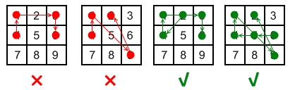

==== 压平嵌套链表迭代器
----
Given a nested list of integers, implement an iterator to flatten it.

Each element is either an integer, or a list -- whose elements may also be integers or other lists.

Example 1:
Given the list [[1,1],2,[1,1]],

By calling next repeatedly until hasNext returns false, the order of elements returned by next should be: [1,1,2,1,1].
----

这道题让我们建立压平嵌套链表的迭代器，关于嵌套链表的数据结构最早出现在Nested List Weight Sum中，而那道题是用的递归的方法来解的，而迭代器一般都是用迭代的方法来解的，而递归一般都需用栈来辅助遍历，由于栈的后进先出的特性，我们在对向量遍历的时候，从后往前把对象压入栈中，那么第一个对象最后压入栈就会第一个取出来处理，我们的hasNext()函数需要遍历栈，并进行处理，如果栈顶元素是整数，直接返回true，如果不是，那么移除栈顶元素，并开始遍历这个取出的list，还是从后往前压入栈，循环停止条件是栈为空，返回false，参见代码如下： +

**解法1:** +
[source, cpp, linenums]
----
class NestedIterator {
public:
    NestedIterator(vector<NestedInteger> &nestedList) {
        for (int i = nestedList.size() - 1; i >= 0; --i) {
            s.push(nestedList[i]);
        }
    }

    int next() {
        NestedInteger t = s.top(); s.pop();
        return t.getInteger();
    }

    bool hasNext() {
        while (!s.empty()) {
            NestedInteger t = s.top();
            if (t.isInteger()) return true;
            s.pop();
            for (int i = t.getList().size() - 1; i >= 0; --i) {
                s.push(t.getList()[i]);
            }
        }
        return false;
    }

private:
    stack<NestedInteger> s;
};
----

我们也可以使用deque来代替stack，实现思路和上面完全一样，参见代码如下: +

**解法2:** +
[source, cpp, linenums]
----
class NestedIterator {
public:
    NestedIterator(vector<NestedInteger> &nestedList) {
        for (auto a : nestedList) {
            d.push_back(a);
        }
    }

    int next() {
        NestedInteger t = d.front(); d.pop_front();
        return t.getInteger();
    }

    bool hasNext() {
        while (!d.empty()) {
            NestedInteger t = d.front();
            if (t.isInteger()) return true;
            d.pop_front();
            for (int i = 0; i < t.getList().size(); ++i) {
                d.insert(d.begin() + i, t.getList()[i]);
            }
        }
        return false;
    }

private:
    deque<NestedInteger> d;
};
----

虽说迭代器是要用迭代的方法，但是我们可以强行使用递归来解，怎么个强行法呢，就是我们使用一个队列queue，在构造函数的时候就利用迭代的方法把这个嵌套链表全部压平展开，然后在调用hasNext()和next()就很简单了： +

**解法3:** +
[source, cpp, linenums]
----
class NestedIterator {
public:
    NestedIterator(vector<NestedInteger> &nestedList) {
        make_queue(nestedList);
    }

    int next() {
        int t = q.front(); q.pop();
        return t;
    }

    bool hasNext() {
        return !q.empty();
    }

private:
    queue<int> q;
    void make_queue(vector<NestedInteger> &nestedList) {
        for (auto a : nestedList) {
            if (a.isInteger()) q.push(a.getInteger());
            else make_queue(a.getList());
        }
    }
};
----

==== 判断4的次方数
----
Given an integer (signed 32 bits), write a function to check whether it is a power of 4.

Example:
Given num = 16, return true. Given num = 5, return false.

Follow up: Could you solve it without loops/recursion?
----

这道题让我们判断一个数是否为4的次方数，那么最直接的方法就是不停的除以4，看最终结果是否为1，参见代码如下： +

**解法1:** +
[source, cpp, linenums]
----
class Solution {
public:
    bool isPowerOfFour(int num) {
        while (num && (num % 4 == 0)) {
            num /= 4;
        }
        return num == 1;
    }
};
----
还有一种方法是跟Power of Three中的解法三一样，使用换底公式来做，讲解请参见之前那篇博客： +

**解法2:** +
[source, cpp, linenums]
----
class Solution {
public:
    bool isPowerOfFour(int num) {
        return num > 0 && int(log10(num) / log10(4)) - log10(num) / log10(4) == 0;
    }
};
----

下面这种方法是网上比较流行的一种解法，思路很巧妙，首先根据Power of Two中的解法二，我们知道num & (num - 1)可以用来判断一个数是否为2的次方数，更进一步说，就是二进制表示下，只有最高位是1，那么由于是2的次方数，不一定是4的次方数，比如8，所以我们还要其他的限定条件，我们仔细观察可以发现，4的次方数的最高位的1都是计数位，那么我们只需与上一个数(0x55555555) <==> 1010101010101010101010101010101，如果得到的数还是其本身，则可以肯定其为4的次方数： +

**解法3:** +
[source, cpp, linenums]
----
class Solution {
public:
    bool isPowerOfFour(int num) {
        return num > 0 && !(num & (num - 1)) && (num & 0x55555555) == num;
    }
};
----

或者我们在确定其是2的次方数了之后，发现只要是4的次方数，减1之后可以被3整除，所以可以写出代码如下： +

**解法4:** +
[source, cpp, linenums]
----
class Solution {
public:
    bool isPowerOfFour(int num) {
        return num > 0 && !(num & (num - 1)) && (num - 1) % 3 == 0;
    }
};
----

==== 整数拆分

----
Given a positive integer n, break it into the sum of at least two positive integers and maximize the product of those integers. Return the maximum product you can get.

For example, given n = 2, return 1 (2 = 1 + 1); given n = 10, return 36 (10 = 3 + 3 + 4).

Note: you may assume that n is not less than 2.

Hint:

There is a simple O(n) solution to this problem.
You may check the breaking results of n ranging from 7 to 10 to discover the regularities.
----

----
这道题给了我们一个正整数n，让我们拆分成至少两个正整数之和，使其乘积最大，题目提示中让我们用O(n)来解题，而且告诉我们找7到10之间的规律，那么我们一点一点的来分析：

正整数从1开始，但是1不能拆分成两个正整数之和，所以不能当输出。

那么2只能拆成1+1，所以乘积也为1。

数字3可以拆分成2+1或1+1+1，显然第一种拆分方法乘积大为2。

数字4拆成2+2，乘积最大，为4。

数字5拆成3+2，乘积最大，为6。

数字6拆成3+3，乘积最大，为9。

数字7拆为3+4，乘积最大，为12。

数字8拆为3+3+2，乘积最大，为18。

数字9拆为3+3+3，乘积最大，为27。

数字10拆为3+3+4，乘积最大，为36。

....
----

那么通过观察上面的规律，我们可以看出从5开始，数字都需要先拆出所有的3，一直拆到剩下一个数为2或者4，因为剩4就不用再拆了，拆成两个2和不拆没有意义，而且4不能拆出一个3剩一个1，这样会比拆成2+2的乘积小。那么这样我们就可以写代码了，先预处理n为2和3的情况，然后先将结果res初始化为1，然后当n大于4开始循环，我们结果自乘3，n自减3，根据之前的分析，当跳出循环时，n只能是2或者4，再乘以res返回即可： +

**解法1:** +
[source, cpp, linenums]
----
class Solution {
public:
    int integerBreak(int n) {
        if (n == 2 || n == 3) return n - 1;
        int res = 1;
        while (n > 4) {
            res *= 3;
            n -= 3;
        }
        return res * n;
    }
};
----

我们再来观察上面列出的10之前数字的规律，我们还可以发现数字7拆分结果是数字4的三倍，而7比4正好大三，数字8拆分结果是数字5的三倍，而8比5大3，后面都是这样的规律，那么我们可以把数字6之前的拆分结果都列举出来，然后之后的数通过查表都能计算出来，参见代码如下: +

**解法2:** +
[source, cpp, linenums]
----
class Solution {
public:
    int integerBreak(int n) {
        vector<int> dp{0, 0, 1, 2, 4, 6, 9};
        for (int i = 7; i <= n; ++i) {
            dp.push_back(3 * dp[i - 3]);
        }
        return dp[n];
    }
};
----

下面这种解法是热心网友留言告诉博主的，感觉很叼，故而补充上来。是解法一的一种变形写法，不再使用while循环了，而是直接分别算出能拆出3的个数和最后剩下的余数2或者4，然后直接相乘得到结果，参见代码如下： +

**解法3:** +
[source, cpp, linenums]
----
class Solution {
public:
    int integerBreak(int n) {
        if (n == 2 || n == 3) return n - 1;
        if (n == 4) return 4;
        n -= 5;
        return (int)pow(3, (n / 3 + 1)) * (n % 3 + 2);
    }
};
----

==== 翻转字符串

----
Write a function that takes a string as input and returns the string reversed.

Example:
Given s = "hello", return "olleh".
----

这道题没什么难度，直接从两头往中间走，同时交换两边的字符即可，参见代码如下： +

**解法1:** +
[source, cpp, linenums]
----
class Solution {
public:
    string reverseString(string s) {
        int left = 0, right = s.size() - 1;
        while (left < right) {
            char t = s[left];
            s[left++] = s[right];
            s[right--] = t;
        }
        return s;
    }
};
----

我们也可以用swap函数来帮助我们翻转： +

**解法2:** +
[source, cpp, linenums]
----
class Solution {
public:
    string reverseString(string s) {
        int left = 0, right = s.size() - 1;
        while (left < right) {
            swap(s[left++], s[right--]);
        }
        return s;
    }
};
----

==== 翻转字符串中的元音字母

----
Write a function that takes a string as input and reverse only the vowels of a string.

Example 1:
Given s = "hello", return "holle".

Example 2:
Given s = "leetcode", return "leotcede".
----

这道题让我们翻转字符串中的元音字母，元音字母有五个a,e,i,o,u，需要注意的是大写的也算，所以总共有十个字母。我们写一个isVowel的函数来判断当前字符是否为元音字母，如果两边都是元音字母，那么我们交换，如果左边的不是，向右移动一位，如果右边的不是，则向左移动一位，参见代码如下： +
**解法1:** +
[source, cpp, linenums]
----
class Solution {
public:
    string reverseVowels(string s) {
        int left = 0, right= s.size() - 1;
        while (left < right) {
            if (isVowel(s[left]) && isVowel(s[right])) {
                swap(s[left++], s[right--]);
            } else if (isVowel(s[left])) {
                --right;
            } else {
                ++left;
            }
        }
        return s;
    }
    bool isVowel(char c) {
        return c == 'a' || c == 'e' || c == 'i' || c == 'o' || c == 'u' || c == 'A' || c == 'E' || c == 'I' || c == 'O' || c == 'U';
    }
};
----

或者我们也可以用自带函数find_first_of和find_last_of来找出包含给定字符串中任意一个字符的下一个位置进行交换即可： +

**解法2:** +
[source, cpp, linenums]
----
class Solution {
public:
    string reverseVowels(string s) {
        int left = 0, right = s.size() - 1;
        while (left < right) {
            left = s.find_first_of("aeiouAEIOU", left);
            right = s.find_last_of("aeiouAEIOU", right);
            if (left < right) {
                swap(s[left++], s[right--]);
            }
        }
        return s;
    }
};
----

我们也可以把元音字母都存在一个字符串里，然后每遇到一个字符，就到元音字符串里去找，如果存在就说明当前字符是元音字符，参见代码如下： +

**解法3:** +
[source, cpp, linenums]
----
class Solution {
public:
    string reverseVowels(string s) {
        int left = 0, right = s.size() - 1;
        string t = "aeiouAEIOU";
        while (left < right) {
            if (t.find(s[left]) == string::npos) ++left;
            else if (t.find(s[right]) == string::npos) --right;
            else swap(s[left++], s[right--]);
        }
        return s;
    }
};
----

==== 从数据流中移动平均值

----
Given a stream of integers and a window size, calculate the moving average of all integers in the sliding window.

For example,
MovingAverage m = new MovingAverage(3);
m.next(1) = 1
m.next(10) = (1 + 10) / 2
m.next(3) = (1 + 10 + 3) / 3
m.next(5) = (10 + 3 + 5) / 3
----

这道题定义了一个MovingAverage类，里面可以存固定个数字，然后我们每次读入一个数字，如果加上这个数字后总个数大于限制的个数，那么我们移除最早进入的数字，然后返回更新后的平均数，这种先进先出的特性最适合使用队列queue来做，而且我们还需要一个double型的变量sum来记录当前所有数字之和，这样有新数字进入后，如果没有超出限制个数，则sum加上这个数字，如果超出了，那么sum先减去最早的数字，再加上这个数字，然后返回sum除以queue的个数即可： +

[source, cpp, linenums]
----
class MovingAverage {
public:
    MovingAverage(int size) {
        this->size = size;
        sum = 0;
    }

    double next(int val) {
        if (q.size() >= size) {
            sum -= q.front(); q.pop();
        }
        q.push(val);
        sum += val;
        return sum / q.size();
    }

private:
    queue<int> q;
    int size;
    double sum;
};
----

==== 前K个高频元素
----
Given a non-empty array of integers, return the k most frequent elements.

Example 1:

Input: nums = [1,1,1,2,2,3], k = 2
Output: [1,2]
----

这道题给了我们一个数组，让我们统计前k个高频的数字，那么对于这类的统计数字的问题，首先应该考虑用HashMap来做，建立数字和其出现次数的映射，然后再按照出现次数进行排序。我们可以用堆排序来做，使用一个最大堆来按照映射次数从大到小排列，在C++中使用priority_queue来实现，默认是最大堆，参见代码如下: +

**解法1:** +
[source, cpp, linenums]
----
class Solution {
public:
    vector<int> topKFrequent(vector<int>& nums, int k) {
        unordered_map<int, int> m;
        priority_queue<pair<int, int>> q;
        vector<int> res;
        for (auto a : nums) ++m[a];
        for (auto it : m) q.push({it.second, it.first});
        for (int i = 0; i < k; ++i) {
            res.push_back(q.top().second); q.pop();
        }
        return res;
    }
};
----

当然，既然可以使用最大堆，还有一种可以自动排序的数据结构TreeMap，也是可以的，这里就不写了，因为跟上面的写法基本没啥区别，就是换了一个数据结构。 +

我们还可以使用桶排序，在建立好数字和其出现次数的映射后，我们按照其出现次数将数字放到对应的位置中去，这样我们从桶的后面向前面遍历，最先得到的就是出现次数最多的数字，我们找到k个后返回即可，参见代码如下： +

**解法2:** +
[source, cpp, linenums]
----
class Solution {
public:
    vector<int> topKFrequent(vector<int>& nums, int k) {
        unordered_map<int, int> m;
        vector<vector<int>> bucket(nums.size() + 1);
        vector<int> res;
        for (auto a : nums) ++m[a];
        for (auto it : m) {
            bucket[it.second].push_back(it.first);
        }
        for (int i = nums.size(); i >= 0; --i) {
            for (int j = 0; j < bucket[i].size(); ++j) {
                res.push_back(bucket[i][j]);
                if (res.size() == k) return res;
            }
        }
        return res;
    }
};
----

==== 设计井字棋游戏

----
Design a Tic-tac-toe game that is played between two players on a n x n grid.

You may assume the following rules:

A move is guaranteed to be valid and is placed on an empty block.
Once a winning condition is reached, no more moves is allowed.
A player who succeeds in placing n of their marks in a horizontal, vertical, or diagonal row wins the game.
Example:
Given n = 3, assume that player 1 is "X" and player 2 is "O" in the board.

TicTacToe toe = new TicTacToe(3);

toe.move(0, 0, 1); -> Returns 0 (no one wins)
|X| | |
| | | | // Player 1 makes a move at (0, 0).
| | | |

toe.move(0, 2, 2); -> Returns 0 (no one wins)
|X| |O|
| | | | // Player 2 makes a move at (0, 2).
| | | |
----

CareerCup上的原题，请参见我之前的博客17.2 Tic Tac Toe。我们首先来O(n2)的解法，这种方法的思路很straightforward，就是建立一个nxn大小的board，其中0表示该位置没有棋子，1表示玩家1放的子，2表示玩家2。那么棋盘上每增加一个子，我们都扫描当前行列，对角线，和逆对角线，看看是否有三子相连的情况，有的话则返回对应的玩家，没有则返回0，参见代码如下： +

**解法1:** +
[source, cpp, linenums]
----
class TicTacToe {
public:
    /** Initialize your data structure here. */
    TicTacToe(int n) {
        board.resize(n, vector<int>(n, 0));
    }

    int move(int row, int col, int player) {
        board[row][col] = player;
        int i = 0, j = 0, n = board.size();
        for (j = 1; j < n; ++j) {
            if (board[row][j] != board[row][j - 1]) break;
        }
        if (j == n) return player;
        for (i = 1; i < n; ++i) {
            if (board[i][col] != board[i - 1][col]) break;
        }
        if (i == n) return player;
        if (row == col) {
            for (i = 1; i < n; ++i) {
                if (board[i][i] != board[i - 1][i - 1]) break;
            }
            if (i == n) return player;
        }
        if (row + col == n - 1) {
            for (i = 1; i < n; ++i) {
                if (board[n - i - 1][i] != board[n - i][i - 1]) break;
            }
            if (i == n) return player;
        }
        return 0;
    }

private:
    vector<vector<int>> board;
};
----

Follow up中让我们用更高效的方法，那么根据提示中的，我们建立一个大小为n的一维数组rows和cols，还有变量对角线diag和逆对角线rev_diag，这种方法的思路是，如果玩家1在第一行某一列放了一个子，那么rows[0]自增1，如果玩家2在第一行某一列放了一个子，则rows[0]自减1，那么只有当rows[0]等于n或者-n的时候，表示第一行的子都是一个玩家放的，则游戏结束返回该玩家即可，其他各行各列，对角线和逆对角线都是这种思路，参见代码如下： +

**解法2:** +
[source, cpp, linenums]
----
class TicTacToe {
public:
    /** Initialize your data structure here. */
    TicTacToe(int n): rows(n), cols(n), N(n), diag(0), rev_diag(0) {}

    int move(int row, int col, int player) {
        int add = player == 1 ? 1 : -1;
        rows[row] += add;
        cols[col] += add;
        diag += (row == col ? add : 0);
        rev_diag += (row == N - col - 1 ? add : 0);
        return (abs(rows[row]) == N || abs(cols[col]) == N || abs(diag) == N || abs(rev_diag) == N) ? player : 0;
    }

private:
    vector<int> rows, cols;
    int diag, rev_diag, N;
};
----

====  两个数组相交
----
Given two arrays, write a function to compute their intersection.

Example:
Given nums1 = [1, 2, 2, 1], nums2 = [2, 2], return [2].

Note:

Each element in the result must be unique.
The result can be in any order.
----

这道题让我们找两个数组交集的部分（不包含重复数字），难度不算大，我们可以用个set把nums1都放进去，然后遍历nums2的元素，如果在set中存在，说明是交集的部分，加入结果的set中，最后再把结果转为vector的形式即可： +

**解法1:** +
[source, cpp, linenums]
----
class Solution {
public:
    vector<int> intersection(vector<int>& nums1, vector<int>& nums2) {
        set<int> s(nums1.begin(), nums1.end()), res;
        for (auto a : nums2) {
            if (s.count(a)) res.insert(a);
        }
        return vector<int>(res.begin(), res.end());
    }
};
----

我们还可以使用两个指针来做，先给两个数组排序，然后用两个指针分别指向两个数组的开头，然后比较两个数组的大小，把小的数字的指针向后移，如果两个指针指的数字相等，那么看结果res是否为空，如果为空或者是最后一个数字和当前数字不等的话，将该数字加入结果res中，参见代码如下： +
**解法2:** +
[source, cpp, linenums]
----
class Solution {
public:
    vector<int> intersection(vector<int>& nums1, vector<int>& nums2) {
        vector<int> res;
        int i = 0, j = 0;
        sort(nums1.begin(), nums1.end());
        sort(nums2.begin(), nums2.end());
        while (i < nums1.size() && j < nums2.size()) {
            if (nums1[i] < nums2[j]) ++i;
            else if (nums1[i] > nums2[j]) ++j;
            else {
                if (res.empty() || res.back() != nums1[i]) {
                    res.push_back(nums1[i]);
                }
                ++i; ++j;
            }
        }
        return res;
    }
};
----

我们还可以使用二分查找法来做，思路是将一个数组排序，然后遍历另一个数组，把遍历到的每个数字在排序号的数组中用二分查找法搜索，如果能找到则放入结果set中，这里我们用到了set的去重复的特性，最后我们将set转为vector即可： +

**解法3:** +
[source, cpp, linenums]
----
class Solution {
public:
    vector<int> intersection(vector<int>& nums1, vector<int>& nums2) {
        set<int> res;
        sort(nums2.begin(), nums2.end());
        for (auto a : nums1) {
            if (binarySearch(nums2, a)) {
                res.insert(a);
            }
        }
        return vector<int>(res.begin(), res.end());
    }
    bool binarySearch(vector<int> &nums, int target) {
        int left = 0, right = nums.size();
        while (left < right) {
            int mid = left + (right - left) / 2;
            if (nums[mid] == target) return true;
            else if (nums[mid] < target) left = mid + 1;
            else right = mid;
        }
        return false;
    }
};
----

或者我们也可以使用STL的set_intersection函数来找出共同元素，很方便： +

**解法4:** +
[source, cpp, linenums]
----
class Solution {
public:
    vector<int> intersection(vector<int>& nums1, vector<int>& nums2) {
        set<int> s1(nums1.begin(), nums1.end()), s2(nums2.begin(), nums2.end()), res;
        set_intersection(s1.begin(), s1.end(), s2.begin(), s2.end(), inserter(res, res.begin()));
        return vector<int>(res.begin(), res.end());
    }
};
----

==== 两个数组相交之二

----
Given two arrays, write a function to compute their intersection.

Example 1:

Input: nums1 = [1,2,2,1], nums2 = [2,2]
Output: [2,2]

Note:
Each element in the result should appear as many times as it shows in both arrays.
The result can be in any order.
Follow up:
What if the given array is already sorted? How would you optimize your algorithm?
What if nums1's size is small compared to nums2's size? Which algorithm is better?
What if elements of nums2 are stored on disk, and the memory is limited such that you cannot load all elements into the memory at once?
----
这道题是之前那道Intersection of Two Arrays的拓展，不同之处在于这道题允许我们返回重复的数字，而且是尽可能多的返回，之前那道题是说有重复的数字只返回一个就行。那么这道题我们用哈希表来建立nums1中字符和其出现个数之间的映射, 然后遍历nums2数组，如果当前字符在哈希表中的个数大于0，则将此字符加入结果res中，然后哈希表的对应值自减1，参见代码如下： +
**解法1:** +
[source, cpp, linenums]
----
class Solution {
public:
    vector<int> intersect(vector<int>& nums1, vector<int>& nums2) {
        unordered_map<int, int> m;
        vector<int> res;
        for (auto a : nums1) ++m[a];
        for (auto a : nums2) {
            if (m[a]-- > 0) res.push_back(a);
        }
        return res;
    }
};
----

再来看一种方法，这种方法先给两个数组排序，然后用两个指针分别指向两个数组的起始位置，如果两个指针指的数字相等，则存入结果中，两个指针均自增1，如果第一个指针指的数字大，则第二个指针自增1，反之亦然，参见代码如下： +

**解法2:** +
[source, cpp, linenums]
----
class Solution {
public:
    vector<int> intersect(vector<int>& nums1, vector<int>& nums2) {
        vector<int> res;
        int i = 0, j = 0;
        sort(nums1.begin(), nums1.end());
        sort(nums2.begin(), nums2.end());
        while (i < nums1.size() && j < nums2.size()) {
            if (nums1[i] == nums2[j]) {
                res.push_back(nums1[i]);
                ++i; ++j;
            } else if (nums1[i] > nums2[j]) {
                ++j;
            } else {
                ++i;
            }
        }
        return res;
    }
};
----

==== 安卓解锁模式

----
Given an Android 3x3 key lock screen and two integers m and n, where 1 ≤ m ≤ n ≤ 9, count the total number of unlock patterns of the Android lock screen, which consist of minimum of m keys and maximum n keys.

Rules for a valid pattern:

Each pattern must connect at least m keys and at most n keys.
All the keys must be distinct.
If the line connecting two consecutive keys in the pattern passes through any other keys, the other keys must have previously selected in the pattern. No jumps through non selected key is allowed.
The order of keys used matters.
----

----
Explanation:

| 1 | 2 | 3 |
| 4 | 5 | 6 |
| 7 | 8 | 9 |

Invalid move: 4 - 1 - 3 - 6
Line 1 - 3 passes through key 2 which had not been selected in the pattern.

Invalid move: 4 - 1 - 9 - 2
Line 1 - 9 passes through key 5 which had not been selected in the pattern.

Valid move: 2 - 4 - 1 - 3 - 6
Line 1 - 3 is valid because it passes through key 2, which had been selected in the pattern

Valid move: 6 - 5 - 4 - 1 - 9 - 2
Line 1 - 9 is valid because it passes through key 5, which had been selected in the pattern.

Example:
Given m = 1, n = 1, return 9.
----

这道题乍一看题目这么长以为是一个设计题，其实不是，这道题还是比较有意思的，起码跟实际结合的比较紧密。这道题说的是安卓机子的解锁方法，有9个数字键，如果密码的长度范围在[m, n]之间，问所有的解锁模式共有多少种，注意题目中给出的一些非法的滑动模式。那么我们先来看一下哪些是非法的，首先1不能直接到3，必须经过2，同理的有4到6，7到9，1到7，2到8，3到9，还有就是对角线必须经过5，例如1到9，3到7等。我们建立一个二维数组jumps，用来记录两个数字键之间是否有中间键，然后再用一个一位数组visited来记录某个键是否被访问过，然后我们用递归来解，我们先对1调用递归函数，在递归函数中，我们遍历1到9每个数字next，然后找他们之间是否有jump数字，如果next没被访问过，并且jump为0，或者jump被访问过，我们对next调用递归函数。数字1的模式个数算出来后，由于1,3,7,9是对称的，所以我们乘4即可，然后再对数字2调用递归函数，2,4,6,9也是对称的，再乘4，最后单独对5调用一次，然后把所有的加起来就是最终结果了，参见代码如下： +

**解法1:** +
[source, cpp, linenums]
----
class Solution {
public:
    int numberOfPatterns(int m, int n) {
        int res = 0;
        vector<bool> visited(10, false);
        vector<vector<int>> jumps(10, vector<int>(10, 0));
        jumps[1][3] = jumps[3][1] = 2;
        jumps[4][6] = jumps[6][4] = 5;
        jumps[7][9] = jumps[9][7] = 8;
        jumps[1][7] = jumps[7][1] = 4;
        jumps[2][8] = jumps[8][2] = 5;
        jumps[3][9] = jumps[9][3] = 6;
        jumps[1][9] = jumps[9][1] = jumps[3][7] = jumps[7][3] = 5;
        res += helper(1, 1, 0, m, n, jumps, visited) * 4;
        res += helper(2, 1, 0, m, n, jumps, visited) * 4;
        res += helper(5, 1, 0, m, n, jumps, visited);
        return res;
    }
    int helper(int num, int len, int res, int m, int n, vector<vector<int>> &jumps, vector<bool> &visited) {
        if (len >= m) ++res;
        ++len;
        if (len > n) return res;
        visited[num] = true;
        for (int next = 1; next <= 9; ++next) {
            int jump = jumps[num][next];
            if (!visited[next] && (jump == 0 || visited[jump])) {
                res = helper(next, len, res, m, n, jumps, visited);
            }
        }
        visited[num] = false;
        return res;
    }
};
----

下面这种方法很简洁，但是不容易理解，讲解请看这个帖子。其中used是一个9位的mask，每位对应一个数字，如果为1表示存在，0表示不存在，(i1, j1)是之前的位置，(i, j)是当前的位置，所以滑动是从(i1, j1)到(i, j)，中间点为((i1+i)/2, (j1+j)/2), 这里的I和J分别为i1+i和j1+j，还没有除以2，所以I和J都是整数。如果I%2或者J%2不为0，说明中间点的坐标不是整数，即中间点不存在，如果中间点存在，如果中间点被使用了，则这条线也是成立的，可以调用递归，参见代码如下： +

**解法2:** +
[source, cpp, linenums]
----
class Solution {
public:
    int numberOfPatterns(int m, int n) {
        return count(m, n, 0, 1, 1);
    }
    int count(int m, int n, int used, int i1, int j1) {
        int res = m <= 0;
        if (!n) return 1;
        for (int i = 0; i < 3; ++i) {
            for (int j = 0; j < 3; ++j) {
                int I = i1 + i, J = j1 + j, used2 = used | (1 << (i * 3 + j));
                if (used2 > used && (I % 2 || J % 2 || used2 & (1 << (I / 2 * 3 + J / 2)))) {
                    res += count(m - 1, n - 1, used2, i, j);
                }
            }
        }
        return res;
    }
};
----

==== 分离区间的数据流
----
Given a data stream input of non-negative integers a1, a2, ..., an, ..., summarize the numbers seen so far as a list of disjoint intervals.

For example, suppose the integers from the data stream are 1, 3, 7, 2, 6, ..., then the summary will be:

[1, 1]
[1, 1], [3, 3]
[1, 1], [3, 3], [7, 7]
[1, 3], [7, 7]
[1, 3], [6, 7]
Follow up:
What if there are lots of merges and the number of disjoint intervals are small compared to the data stream's size?
----

这道题说有个数据流每次提供一个数字，然后让我们组成一系列分离的区间，这道题跟之前那道Insert Interval很像，思路也很像，每进来一个新的数字val，我们都生成一个新的区间[val, val]，然后将其插入到当前的区间里，注意分情况讨论，无重叠，相邻，和有重叠分开讨论处理，参见代码如下: +

[source, cpp, linenums]
----
class SummaryRanges {
public:
    /** Initialize your data structure here. */
    SummaryRanges() {}

    void addNum(int val) {
        Interval cur(val, val);
        vector<Interval> res;
        int pos = 0;
        for (auto a : v) {
            if (cur.end + 1 < a.start) {
                res.push_back(a);
            } else if (cur.start > a.end + 1) {
                res.push_back(a);
                ++pos;
            } else {
                cur.start = min(cur.start, a.start);
                cur.end = max(cur.end, a.end);
            }
        }
        res.insert(res.begin() + pos, cur);
        v = res;
    }

    vector<Interval> getIntervals() {
        return v;
    }

private:
    vector<Interval> v;
};
----

==== 设计贪吃蛇游戏

----
Design a Snake game that is played on a device with screen size = width x height. Play the game online if you are not familiar with the game.

The snake is initially positioned at the top left corner (0,0) with length = 1 unit.

You are given a list of food's positions in row-column order. When a snake eats the food, its length and the game's score both increase by 1.

Each food appears one by one on the screen. For example, the second food will not appear until the first food was eaten by the snake.

When a food does appear on the screen, it is guaranteed that it will not appear on a block occupied by the snake.

Example:
Given width = 3, height = 2, and food = [[1,2],[0,1]].

Snake snake = new Snake(width, height, food);

Initially the snake appears at position (0,0) and the food at (1,2).

|S| | |
| | |F|

snake.move("R"); -> Returns 0
----

感觉最近LeetCode经常出一些design类的题目啊，难道算法类的题目都出完了吗，这道题让我们设计一个贪吃蛇的游戏，这是个简化版的，但是游戏规则还是保持不变，蛇可以往上下左右四个方向走，吃到食物就会变长1个，如果碰到墙壁或者自己的躯体，游戏就会结束。我们需要一个一维数组来保存蛇身的位置，由于蛇移动的过程的蛇头向前走一步，蛇尾也跟着往前，中间的躯体还在原来的位置，所以移动的结果就是，蛇头变到新位置，去掉蛇尾的位置即可。需要注意的是去掉蛇尾的位置是在检测和蛇身的碰撞之前还是之后，如果是之后则无法通过这个test case：[[3,3,[[2,0],[0,0]]],["D"],["D"],["U"]]，如果是之前就没有问题了，检测蛇头和蛇身是否碰撞使用的是count(snake.begin(), snake.end(), head)，总体来说不算一道难题，参见代码如下： +

[source, cpp, linenums]
----
class SnakeGame {
public:
    /** Initialize your data structure here.
        @param width - screen width
        @param height - screen height
        @param food - A list of food positions
        E.g food = [[1,1], [1,0]] means the first food is positioned at [1,1], the second is at [1,0]. */
    SnakeGame(int width, int height, vector<pair<int, int>> food) {
        this->width = width;
        this->height = height;
        this->food = food;
        score = 0;
        snake.push_back({0, 0});
    }

    /** Moves the snake.
        @param direction - 'U' = Up, 'L' = Left, 'R' = Right, 'D' = Down
        @return The game's score after the move. Return -1 if game over.
        Game over when snake crosses the screen boundary or bites its body. */
    int move(string direction) {
        auto head = snake.front(), tail = snake.back();
        snake.pop_back();
        if (direction == "U") --head.first;
        else if (direction == "L") --head.second;
        else if (direction == "R") ++head.second;
        else if (direction == "D") ++head.first;
        if (count(snake.begin(), snake.end(), head) || head.first < 0 || head.first >= height || head.second < 0 || head.second >= width) {
            return -1;
        }
        snake.insert(snake.begin(), head);
        if (!food.empty() && head == food.front()) {
            food.erase(food.begin());
            snake.push_back(tail);
            ++score;
        }
        return score;
    }

private:
    int width, height, score;
    vector<pair<int, int>> food, snake;
};
----

==== 俄罗斯娃娃信封

----
You have a number of envelopes with widths and heights given as a pair of integers (w, h). One envelope can fit into another if and only if both the width and height of one envelope is greater than the width and height of the other envelope.

What is the maximum number of envelopes can you Russian doll? (put one inside other)

Example:
Given envelopes = [[5,4],[6,4],[6,7],[2,3]], the maximum number of envelopes you can Russian doll is 3 ([2,3] => [5,4] => [6,7])
----

这道题给了我们一堆大小不一的信封，让我们像套俄罗斯娃娃那样把这些信封都给套起来，这道题实际上是之前那道Longest Increasing Subsequence的具体应用，而且难度增加了，从一维变成了两维，但是万变不离其宗，解法还是一样的，首先来看DP的解法，这是一种brute force的解法，首先要给所有的信封按从小到大排序，首先根据宽度从小到大排，如果宽度相同，那么高度小的再前面，这是STL里面sort的默认排法，所以我们不用写其他的comparator，直接排就可以了，然后我们开始遍历，对于每一个信封，我们都遍历其前面所有的信封，如果当前信封的长和宽都比前面那个信封的大，那么我们更新dp数组，通过dp[i] = max(dp[i], dp[j] + 1)。然后我们每遍历完一个信封，都更新一下结果res，参见代码如下: +

**解法1:** +
[source, cpp, linenums]
----
class Solution {
public:
    int maxEnvelopes(vector<pair<int, int>>& envelopes) {
        int res = 0, n = envelopes.size();
        vector<int> dp(n, 1);
        sort(envelopes.begin(), envelopes.end());
        for (int i = 0; i < n; ++i) {
            for (int j = 0; j < i; ++j) {
                if (envelopes[i].first > envelopes[j].first && envelopes[i].second > envelopes[j].second) {
                    dp[i] = max(dp[i], dp[j] + 1);
                }
            }
            res = max(res, dp[i]);
        }
        return res;
    }
};
----

我们还可以使用二分查找法来优化速度，我们首先要做的还是给信封排序，但是这次排序和上面有些不同，信封的宽度还是从小到大排，但是宽度相等时，我们让高度大的在前面。那么现在问题就简化了成了找高度数字中的LIS，完全就和之前那道Longest Increasing Subsequence一样了，所以我们还是使用之前那题解法来做，参见代码如下： +

**解法2:** +
[source, cpp, linenums]
----
class Solution {
public:
    int maxEnvelopes(vector<pair<int, int>>& envelopes) {
        vector<int> dp;
        sort(envelopes.begin(), envelopes.end(), {
            if (a.first == b.first) return a.second > b.second;
            return a.first < b.first;
        });
        for (int i = 0; i < envelopes.size(); ++i) {
            int left = 0, right = dp.size(), t= envelopes[i].second;
            while (left < right) {
                int mid = left + (right - left) / 2;
                if (dp[mid] < t) left = mid + 1;
                else right = mid;
            }
            if (right >= dp.size()) dp.push_back(t);
            else dp[right] = t;
        }
        return dp.size();
    }
};
----

既然可以用二分查找法，那么使用STL的自带函数lower_bound也没啥问题了，参见代码如下： +

**解法3:** +
[source, cpp, linenums]
----
class Solution {
public:
    int maxEnvelopes(vector<pair<int, int>>& envelopes) {
        vector<int> dp;
        sort(envelopes.begin(), envelopes.end(), {
            if (a.first == b.first) return a.second > b.second;
            return a.first < b.first;
        });
        for (int i = 0; i < envelopes.size(); ++i) {
            auto it = lower_bound(dp.begin(), dp.end(), envelopes[i].second);
            if (it == dp.end()) dp.push_back(envelopes[i].second);
            else *it = envelopes[i].second;
        }
        return dp.size();
    }
};
----

讨论：这道题的一个follow up是信封可以旋转，怎么的最长序列？答案是<3,4>加入，然后<4,3>也加入，再找最长序列。 +

==== 设计推特
----
Design a simplified version of Twitter where users can post tweets, follow/unfollow another user and is able to see the 10 most recent tweets in the user's news feed. Your design should support the following methods:

postTweet(userId, tweetId): Compose a new tweet.
getNewsFeed(userId): Retrieve the 10 most recent tweet ids in the user's news feed. Each item in the news feed must be posted by users who the user followed or by the user herself. Tweets must be ordered from most recent to least recent.
follow(followerId, followeeId): Follower follows a followee.
unfollow(followerId, followeeId): Follower unfollows a followee.
Example:

Twitter twitter = new Twitter();

// User 1 posts a new tweet (id = 5).
twitter.postTweet(1, 5);

// User 1's news feed should return a list with 1 tweet id -> [5].
twitter.getNewsFeed(1);
----

这道题让我们设计个简单的推特，具有发布消息，获得新鲜事，添加关注和取消关注等功能。我们需要用两个哈希表来做，第一个是建立用户和其所有好友之间的映射，另一个是建立用户和其所有消息之间的映射。由于获得新鲜事是需要按时间顺序排列的，那么我们可以用一个整型变量cnt来模拟时间点，每发一个消息，cnt自增1，那么我们就知道cnt大的是最近发的。那么我们在建立用户和其所有消息之间的映射时，还需要建立每个消息和其时间点cnt之间的映射。这道题的主要难点在于实现getNewsFeed()函数，这个函数获取自己和好友的最近10条消息，我们的做法是用户也添加到自己的好友列表中，然后遍历该用户的所有好友，遍历每个好友的所有消息，维护一个大小为10的哈希表，如果新遍历到的消息比哈希表中最早的消息要晚，那么将这个消息加入，然后删除掉最早的那个消息，这样我们就可以找出最近10条消息了，参见代码如下： +

**解法1:** +
[source, cpp, linenums]
----
class Twitter {
public:
    /** Initialize your data structure here. */
    Twitter() {
        cnt = 0;
    }

    /** Compose a new tweet. */
    void postTweet(int userId, int tweetId) {
        follow(userId, userId);
        tweets[userId].insert({cnt++, tweetId});
    }

    /** Retrieve the 10 most recent tweet ids in the user's news feed. Each item in the news feed must be posted by users who the user followed or by the user herself. Tweets must be ordered from most recent to least recent. */
    vector<int> getNewsFeed(int userId) {
        vector<int> res;
        map<int, int> top10;
        for (auto it = friends[userId].begin(); it != friends[userId].end(); ++it) {
            int t = *it;
            for (auto a = tweets[t].begin(); a != tweets[t].end(); ++a) {
                top10.insert({a->first, a->second});
                if (top10.size() > 10) top10.erase(top10.begin());
            }
        }
        for (auto it = top10.rbegin(); it != top10.rend(); ++it) {
            res.push_back(it->second);
        }
        return res;
    }

    /** Follower follows a followee. If the operation is invalid, it should be a no-op. */
    void follow(int followerId, int followeeId) {
        friends[followerId].insert(followeeId);
    }

    /** Follower unfollows a followee. If the operation is invalid, it should be a no-op. */
    void unfollow(int followerId, int followeeId) {
        if (followerId != followeeId) {
            friends[followerId].erase(followeeId);
        }
    }

private:
    int cnt;
    unordered_map<int, set<int>> friends;
    unordered_map<int, map<int, int>> tweets;
};
----

下面这种方法和上面的基本一样，就是在保存用户所有消息的时候，用的是vector<pair<int, int>>，这样我们可以用priority_queue来帮助我们找出最新10条消息，参见代码如下： +

**解法2:** +
[source, cpp, linenums]
----
class Twitter {
public:
    /** Initialize your data structure here. */
    Twitter() {
        cnt = 0;
    }

    /** Compose a new tweet. */
    void postTweet(int userId, int tweetId) {
        follow(userId, userId);
        tweets[userId].push_back({cnt++, tweetId});
    }

    /** Retrieve the 10 most recent tweet ids in the user's news feed. Each item in the news feed must be posted by users who the user followed or by the user herself. Tweets must be ordered from most recent to least recent. */
    vector<int> getNewsFeed(int userId) {
        vector<int> res;
        priority_queue<pair<int, int>, vector<pair<int, int>>, greater<pair<int, int>>> q;
        for (auto it = friends[userId].begin(); it != friends[userId].end(); ++it) {
            for (auto a = tweets[*it].begin(); a != tweets[*it].end(); ++a) {
                if (q.size() > 0 && q.top().first > a->first && q.size() > 10) break;
                q.push(*a);
                if (q.size() > 10) q.pop();
            }
        }
        while (!q.empty()) {
            res.push_back(q.top().second);
            q.pop();
        }
        reverse(res.begin(), res.end());
        return res;
    }

    /** Follower follows a followee. If the operation is invalid, it should be a no-op. */
    void follow(int followerId, int followeeId) {
        friends[followerId].insert(followeeId);
    }

    /** Follower unfollows a followee. If the operation is invalid, it should be a no-op. */
    void unfollow(int followerId, int followeeId) {
        if (followerId != followeeId) {
            friends[followerId].erase(followeeId);
        }
    }

private:
    int cnt;
    unordered_map<int, set<int>> friends;
    unordered_map<int, vector<pair<int, int>>> tweets;
};
----

==== 直线对称
----
Given n points on a 2D plane, find if there is such a line parallel to y-axis that reflect the given set of points.

Example 1:
Given points = [[1,1],[-1,1]], return true.

Example 2:
Given points = [[1,1],[-1,-1]], return false.

Follow up:
Could you do better than O(n2)?

Hint:

Find the smallest and largest x-value for all points.
If there is a line then it should be at y = (minX + maxX) / 2.
For each point, make sure that it has a reflected point in the opposite side.
----

这道题给了我们一堆点，问我们存不存在一条平行于y轴的直线，使得所有的点关于该直线对称。题目中的提示给的相当充分，我们只要按照提示的步骤来做就可以解题了。首先我们找到所有点的横坐标的最大值和最小值，那么二者的平均值就是中间直线的横坐标，然后我们遍历每个点，如果都能找到直线对称的另一个点，则返回true，反之返回false，参见代码如下： +

**解法1:** +
[source, cpp, linenums]
----
class Solution {
public:
    bool isReflected(vector<pair<int, int>>& points) {
        unordered_map<int, set<int>> m;
        int mx = INT_MIN, mn = INT_MAX;
        for (auto a : points) {
            mx = max(mx, a.first);
            mn = min(mn, a.first);
            m[a.first].insert(a.second);
        }
        double y = (double)(mx + mn) / 2;
        for (auto a : points) {
            int t = 2 * y - a.first;
            if (!m.count(t) || !m[t].count(a.second)) {
                return false;
            }
        }
        return true;
    }
};
----

下面这种解法没有求最大值和最小值，而是把所有的横坐标累加起来，然后求平均数，基本思路都相同，参见代码如下： +

**解法2:** +
[source, cpp, linenums]
----
class Solution {
public:
    bool isReflected(vector<pair<int, int>>& points) {
        if (points.empty()) return true;
        set<pair<int, int>> pts;
        double y = 0;
        for (auto a : points) {
            pts.insert(a);
            y += a.first;
        }
        y /= points.size();
        for (auto a : pts) {
            if (!pts.count({y * 2 - a.first, a.second})) {
                return false;
            }
        }
        return true;
    }
};
----

==== 计算各位不相同的数字个数

----
Given a non-negative integer n, count all numbers with unique digits, x, where 0 ≤ x < 10n.

Example:
Given n = 2, return 91. (The answer should be the total numbers in the range of 0 ≤ x < 100, excluding [11,22,33,44,55,66,77,88,99])

Hint:

A direct way is to use the backtracking approach.
Backtracking should contains three states which are (the current number, number of steps to get that number and a bitmask which represent which number is marked as visited so far in the current number). Start with state (0,0,0) and count all valid number till we reach number of steps equals to 10n.
This problem can also be solved using a dynamic programming approach and some knowledge of combinatorics.
Let f(k) = count of numbers with unique digits with length equals k.
f(1) = 10, ..., f(k) = 9 * 9 * 8 * ... (9 - k + 2) [The first factor is 9 because a number cannot start with 0].
----

这道题让我们找一个范围内的各位上不相同的数字，比如123就是各位不相同的数字，而11,121,222就不是这样的数字。那么我们根据提示中的最后一条可以知道，一位数的满足要求的数字是10个(0到9)，二位数的满足题意的是81个，[10 - 99]这90个数字中去掉[11,22,33,44,55,66,77,88,99]这9个数字，还剩81个。通项公式为f(k) = 9 * 9 * 8 * ... (9 - k + 2)，那么我们就可以根据n的大小，把[1, n]区间位数通过通项公式算出来累加起来即可，参见代码如下： +

**解法1:** +
[source, cpp, linenums]
----
class Solution {
public:
    int countNumbersWithUniqueDigits(int n) {
        if (n == 0) return 1;
        int res = 0;
        for (int i = 1; i <= n; ++i) {
            res += count(i);
        }
        return res;
    }
    int count(int k) {
        if (k < 1) return 0;
        if (k == 1) return 10;
        int res = 1;
        for (int i = 9; i >= (11 - k); --i) {
            res *= i;
        }
        return res * 9;
    }
};
----

下面这种方法是上面方法的精简版，思路完全一样： +

**解法2:** +
[source, cpp, linenums]
----
class Solution {
public:
    int countNumbersWithUniqueDigits(int n) {
        if (n == 0) return 1;
        int res = 10, cnt = 9;
        for (int i = 2; i <= n; ++i) {
            cnt *= (11 - i);
            res += cnt;
        }
        return res;
    }
};
----

最后我们来看题目提示中所说的回溯的方法，我们需要一个变量used，其二进制第i位为1表示数字i出现过，刚开始我们遍历1到9，对于每个遍历到的数字，现在used中标记已经出现过，然后在调用递归函数。在递归函数中，如果这个数字小于最大值，则结果res自增1，否则返回res。然后遍历0到9，如果当前数字没有在used中出现过，此时在used中标记，然后给当前数字乘以10加上i，再继续调用递归函数，这样我们可以遍历到所有的情况，参见代码如下： +

**解法3:** +
[source, cpp, linenums]
----
class Solution {
public:
    int countNumbersWithUniqueDigits(int n) {
        int res = 1, max = pow(10, n), used = 0;
        for (int i = 1; i < 10; ++i) {
            used |= (1 << i);
            res += search(i, max, used);
            used &= ~(1 << i);
        }
        return res;
    }
    int search(int pre, int max, int used) {
        int res = 0;
        if (pre < max) ++res;
        else return res;
        for (int i = 0; i < 10; ++i) {
            if (!(used & (1 << i))) {
                used |= (1 << i);
                int cur = 10 * pre + i;
                res += search(cur, max, used);
                used &= ~(1 << i);
            }
        }
        return res;
    }
};
----

==== 按距离为k隔离重排字符串

----
Given a non-empty string str and an integer k, rearrange the string such that the same characters are at least distance k from each other.

All input strings are given in lowercase letters. If it is not possible to rearrange the string, return an empty string "".

Example 1:
str = "aabbcc", k = 3

Result: "abcabc"

The same letters are at least distance 3 from each other.
----

这道题给了我们一个字符串str，和一个整数k，让我们对字符串str重新排序，使得其中相同的字符之间的距离不小于k，这道题的难度标为Hard，看来不是省油的灯。的确，这道题的解法用到了哈希表，堆，和贪婪算法。这道题我最开始想的算法没有通过OJ的大集合超时了，下面的方法是参考网上大神的解法，发现十分的巧妙。我们需要一个哈希表来建立字符和其出现次数之间的映射，然后需要一个堆来保存这每一堆映射，按照出现次数来排序。然后如果堆不为空我们就开始循环，我们找出k和str长度之间的较小值，然后从0遍历到这个较小值，对于每个遍历到的值，如果此时堆为空了，说明此位置没法填入字符了，返回空字符串，否则我们从堆顶取出一对映射，然后把字母加入结果res中，此时映射的个数减1，如果减1后的个数仍大于0，则我们将此映射加入临时集合v中，同时str的个数len减1，遍历完一次，我们把临时集合中的映射对由加入堆中，参见代码如下： +

[source, cpp, linenums]
----
class Solution {
public:
    string rearrangeString(string str, int k) {
        if (k == 0) return str;
        string res;
        int len = (int)str.size();
        unordered_map<char, int> m;
        priority_queue<pair<int, char>> q;
        for (auto a : str) ++m[a];
        for (auto it = m.begin(); it != m.end(); ++it) {
            q.push({it->second, it->first});
        }
        while (!q.empty()) {
            vector<pair<int, int>> v;
            int cnt = min(k, len);
            for (int i = 0; i < cnt; ++i) {
                if (q.empty()) return "";
                auto t = q.top(); q.pop();
                res.push_back(t.second);
                if (--t.first > 0) v.push_back(t);
                --len;
            }
            for (auto a : v) q.push(a);
        }
        return res;
    }
};
----

==== 记录速率限制器

----
Design a logger system that receive stream of messages along with its timestamps, each message should be printed if and only if it is not printed in the last 10 seconds.

Given a message and a timestamp (in seconds granularity), return true if the message should be printed in the given timestamp, otherwise returns false.

It is possible that several messages arrive roughly at the same time.

Example:

Logger logger = new Logger();

// logging string "foo" at timestamp 1
logger.shouldPrintMessage(1, "foo"); returns true;
----

这道题让我们设计一个记录系统每次接受信息并保存时间戳，然后让我们打印出该消息，前提是最近10秒内没有打印出这个消息。这不是一道难题，我们可以用哈希表来做，建立消息和时间戳之间的映射，如果某个消息不再哈希表表，我们建立其和时间戳的映射，并返回true。如果应经在哈希表里了，我们看当前时间戳是否比哈希表中保存的时间戳大10，如果是，更新哈希表，并返回true，反之返回false，参见代码如下： +

**解法1:** +
[source, cpp, linenums]
----
class Logger {
public:
    Logger() {}

    bool shouldPrintMessage(int timestamp, string message) {
        if (!m.count(message)) {
            m[message] = timestamp;
            return true;
        }
        if (timestamp - m[message] >= 10) {
            m[message] = timestamp;
            return true;
        }
        return false;
    }

private:
    unordered_map<string, int> m;
};
----

我们还可以写的更精简一些，如下所示： +

**解法2:** +
[source, cpp, linenums]
----
class Logger {
public:
    Logger() {}

    bool shouldPrintMessage(int timestamp, string message) {
        if (timestamp < m[message]) return false;
        m[message] = timestamp + 10;
        return true;
    }

private:
    unordered_map<string, int> m;
};
----

==== 变换数组排序

----
Given a sorted array of integers nums and integer values a, b and c. Apply a function of the form f(x) = ax2 + bx + c to each element x in the array.

The returned array must be in sorted order.

Expected time complexity: O(n)

Example:
nums = [-4, -2, 2, 4], a = 1, b = 3, c = 5,

Result: [3, 9, 15, 33]

nums = [-4, -2, 2, 4], a = -1, b = 3, c = 5

Result: [-23, -5, 1, 7]
----

这道题给了我们一个数组，又给了我们一个抛物线的三个系数，让我们求带入抛物线方程后求出的数组成的有序数组。那么我们首先来看O(nlgn)的解法，这个解法没啥可说的，就是每个算出来再排序，这里我们用了最小堆来帮助我们排序，参见代码如下： +

**解法1:** +
[source, cpp, linenums]
----
class Solution {
public:
    vector<int> sortTransformedArray(vector<int>& nums, int a, int b, int c) {
        vector<int> res;
        priority_queue<int, vector<int>, greater<int>> q;
        for (auto d : nums) {
            q.push(a * d * d + b * d + c);
        }
        while (!q.empty()) {
            res.push_back(q.top()); q.pop();
        }
        return res;
    }
};
----
但是题目中的要求让我们在O(n)中实现，那么我们只能另辟蹊径。其实这道题用到了大量的高中所学的关于抛物线的数学知识，我们知道，对于一个方程f(x) = ax2 + bx + c 来说，如果a>0，则抛物线开口朝上，那么两端的值比中间的大，而如果a<0，则抛物线开口朝下，则两端的值比中间的小。而当a=0时，则为直线方法，是单调递增或递减的。那么我们可以利用这个性质来解题，题目中说明了给定数组nums是有序的，如果不是有序的，我想很难有O(n)的解法。正因为输入数组是有序的，我们可以根据a来分情况讨论： +

当a>0，说明两端的值比中间的值大，那么此时我们从结果res后往前填数，用两个指针分别指向nums数组的开头和结尾，指向的两个数就是抛物线两端的数，将它们之中较大的数先存入res的末尾，然后指针向中间移，重复比较过程，直到把res都填满。 +

当a<0，说明两端的值比中间的小，那么我们从res的前面往后填，用两个指针分别指向nums数组的开头和结尾，指向的两个数就是抛物线两端的数，将它们之中较小的数先存入res的开头，然后指针向中间移，重复比较过程，直到把res都填满。 +

当a=0，函数是单调递增或递减的，那么从前往后填和从后往前填都可以，我们可以将这种情况和a>0合并。 +

**解法2:** +
[source, cpp, linenums]
----
class Solution {
public:
    vector<int> sortTransformedArray(vector<int>& nums, int a, int b, int c) {
        int n = nums.size(), i = 0, j = n - 1;
        vector<int> res(n);
        int idx = a >= 0 ? n - 1 : 0;
        while (i <= j) {
            if (a >= 0) {
                res[idx--] = cal(nums[i], a, b, c) >= cal(nums[j], a, b, c) ? cal(nums[i++], a, b, c) : cal(nums[j--], a, b, c);
            } else {
                res[idx++] = cal(nums[i], a, b, c) >= cal(nums[j], a, b, c) ? cal(nums[j--], a, b, c) : cal(nums[i++], a, b, c);
            }
        }
        return res;
    }
    int cal(int x, int a, int b, int c) {
        return a * x * x + b * x + c;
    }
};
----
