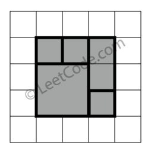

==== 常数时间内插入删除和获得随机数 - 允许重复

----
Design a data structure that supports all following operations in average O(1) time.

Note: Duplicate elements are allowed.

insert(val): Inserts an item val to the collection.
remove(val): Removes an item val from the collection if present.
getRandom: Returns a random element from current collection of elements. The probability of each element being returned is linearly related to the number of same value the collection contains.
----

这题是之前那道Insert Delete GetRandom O(1)的拓展，与其不同的是，之前那道题不能有重复数字，而这道题可以有，那么就不能像之前那道题那样建立每个数字和其坐标的映射了，但是我们可以建立数字和其所有出现位置的集合之间的映射，虽然写法略有不同，但是思路和之前那题完全一样，都是将数组最后一个位置的元素和要删除的元素交换位置，然后删掉最后一个位置上的元素。对于insert函数，我们将要插入的数字在nums中的位置加入m[val]数组的末尾，然后在数组nums末尾加入val，我们判断是否有重复只要看m[val]数组只有刚加的val一个值还是有多个值。remove函数是这题的难点，我们首先看哈希表中有没有val，没有的话直接返回false。然后我们取出nums的尾元素，把尾元素哈希表中的位置数组中的最后一个位置更新为m[val]的尾元素，这样我们就可以删掉m[val]的尾元素了，如果m[val]只有一个元素，那么我们把这个映射直接删除。然后我们将nums数组中的尾元素删除，并把尾元素赋给val所在的位置，注意我们在建立哈希表的映射的时候需要用堆而不是普通的vector数组，因为我们每次remove操作后都会移除nums数组的尾元素，如果我们用vector来保存数字的坐标，而且只移出末尾数字的话，有可能出现前面的坐标大小超过了此时nums的大小的情况，就会出错，所以我们用优先队列对所有的相同数字的坐标进行自动排序，每次把最大位置的坐标移出即可，参见代码如下： +

**解法1:** +
[source, cpp, linenums]
----
class RandomizedCollection {
public:
    /** Initialize your data structure here. */
    RandomizedCollection() {}

    /** Inserts a value to the collection. Returns true if the collection did not already contain the specified element. */
    bool insert(int val) {
        m[val].push(nums.size());
        nums.push_back(val);
        return m[val].size() == 1;
    }

    /** Removes a value from the collection. Returns true if the collection contained the specified element. */
    bool remove(int val) {
        if (m[val].empty()) return false;
        int idx = m[val].top();
        m[val].pop();
        if (nums.size() - 1 != idx) {
            int t = nums.back();
            nums[idx] = t;
            m[t].pop();
            m[t].push(idx);
        }
        nums.pop_back();
        return true;
    }

    /** Get a random element from the collection. */
    int getRandom() {
        return nums[rand() % nums.size()];
    }
private:
    vector<int> nums;
    unordered_map<int, priority_queue<int>> m;
};
----

有网友指出上面的方法其实不是真正的O(1)时间复杂度，因为优先队列的push不是常数级的，博主一看果然是这样的，为了严格的遵守O(1)的时间复杂度，我们将优先队列换成unordered_set，其插入删除的操作都是常数量级的，其他部分基本不用变，参见代码如下： +

**解法2:** +
[source, cpp, linenums]
----

class RandomizedCollection {
public:
    /** Initialize your data structure here. */
    RandomizedCollection() {}

    /** Inserts a value to the collection. Returns true if the collection did not already contain the specified element. */
    bool insert(int val) {
        m[val].insert(nums.size());
        nums.push_back(val);
        return m[val].size() == 1;
    }

    /** Removes a value from the collection. Returns true if the collection contained the specified element. */
    bool remove(int val) {
        if (m[val].empty()) return false;
        int idx = *m[val].begin();
        m[val].erase(idx);
        if (nums.size() - 1 != idx) {
            int t = nums.back();
            nums[idx] = t;
            m[t].erase(nums.size() - 1);
            m[t].insert(idx);
        }
        nums.pop_back();
        return true;
    }

    /** Get a random element from the collection. */
    int getRandom() {
        return nums[rand() % nums.size()];
    }

private:
    vector<int> nums;
    unordered_map<int, unordered_set<int>> m;
};
----

==== 链表随机节点

----
Given a singly linked list, return a random node's value from the linked list. Each node must have the same probability of being chosen.

Follow up:
What if the linked list is extremely large and its length is unknown to you? Could you solve this efficiently without using extra space?
----

这道题给了我们一个链表，让我们随机返回一个节点，那么最直接的方法就是先统计出链表的长度，然后根据长度随机生成一个位置，然后从开头遍历到这个位置即可，参见代码如下： +

**解法1:** +
[source, cpp, linenums]
----
class Solution {
public:
    /** @param head The linked list's head. Note that the head is guanranteed to be not null, so it contains at least one node. */
    Solution(ListNode* head) {
        len = 0;
        ListNode *cur = head;
        this->head = head;
        while (cur) {
            ++len;
            cur = cur->next;
        }
    }

    /** Returns a random node's value. */
    int getRandom() {
        int t = rand() % len;
        ListNode *cur = head;
        while (t) {
            --t;
            cur = cur->next;
        }
        return cur->val;
    }
private:
    int len;
    ListNode *head;
};
----

Follow up中说链表可能很长，我们没法提前知道长度，这里用到了著名了水塘抽样Reservoir Sampling的思路，由于限定了head一定存在，所以我们先让返回值res等于head的节点值，然后让cur指向head的下一个节点，定义一个变量i，初始化为2，若cur不为空我们开始循环，我们在[0, i - 1]中取一个随机数，如果取出来0，那么我们更新res为当前的cur的节点值，然后此时i自增一，cur指向其下一个位置，这里其实相当于我们维护了一个大小为1的水塘，然后我们随机数生成为0的话，我们交换水塘中的值和当前遍历到的值，这样可以保证每个数字的概率相等，参见代码如下： +

**解法2:** +
[source, cpp, linenums]
----

class Solution {
public:
    /** @param head The linked list's head. Note that the head is guanranteed to be not null, so it contains at least one node. */
    Solution(ListNode* head) {
        this->head = head;
    }

    /** Returns a random node's value. */
    int getRandom() {
        int res = head->val, i = 2;
        ListNode *cur = head->next;
        while (cur) {
            int j = rand() % i;
            if (j == 0) res = cur->val;
            ++i;
            cur = cur->next;
        }
        return res;
    }
private:
    ListNode *head;
};
----

==== 赎金条
----
Given
 an
arbitrary
 ransom
 note
 string and
nother sring
otaining lters from
 all
h magaznes,
 write a
uno
ha wil rrn
re
 e rnom noecan bcnstrted
rom the
aane ;
otewis, i
i rn e



Each
letter
 in
 the
 magazine string
an
 only b
 used
ne
 in
 your rnom
 note.

Note:
You may assume that both strings contain only lowercase letters.

canConstruct("a", "b") -> false
canConstruct("aa", "ab") -> false
canConstruct("aa", "aab") -> true
----
非常简单的一道题，就是用哈希Map统计字符的个数，参见代码如下： +

[source, cpp, linenums]
----
class Solution {
public:
    bool canConstruct(string ransomNote, string magazine) {
        unordered_map<char, int> m;
        for (char c : magazine) ++m[c];
        for (char c : ransomNote) {
            if (--m[c] < 0) return false;
        }
        return true;
    }
};
----

==== 数组洗牌

Shuffle a set of numbers without duplicates. +

这道题让我们给数组洗牌，也就是随机打乱顺序，那么由于之前那道题Linked List Random Node我们接触到了水塘抽样Reservoir Sampling的思想，这道题实际上这道题也是用类似的思路，我们遍历数组每个位置，每次都随机生成一个坐标位置，然后交换当前遍历位置和随机生成的坐标位置的数字，这样如果数组有n个数字，那么我们也随机交换了n组位置，从而达到了洗牌的目的，这里需要注意的是i + rand() % (res.size() - i)不能写成rand() % res.size()，虽然也能通过OJ，但是根据这个帖子的最后部分的概率图表，前面那种写法不是真正的随机分布，应该使用Knuth shuffle算法，感谢热心网友们的留言，参见代码如下： +

[source, cpp, linenums]
----
class Solution {
public:
    Solution(vector<int> nums): v(nums) {}

    /** Resets the array to its original configuration and return it. */
    vector<int> reset() {
        return v;
    }

    /** Returns a random shuffling of the array. */
    vector<int> shuffle() {
        vector<int> res = v;
        for (int i = 0; i < res.size(); ++i) {
            int t = i + rand() % (res.size() - i);
            swap(res[i], res[t]);
        }
        return res;
    }

private:
    vector<int> v;
};
----

==== 迷你解析器

----
Given a nested list of integers represented as a string, implement a parser to deserialize it.

Each element is either an integer, or a list -- whose elements may also be integers or other lists.

Note: You may assume that the string is well-formed:

String is non-empty.
String does not contain white spaces.
String contains only digits 0-9, [, - ,, ].
----

这道题让我们实现一个迷你解析器用来把一个字符串解析成NestInteger类，关于这个嵌套链表类的题我们之前做过三道，Nested List Weight Sum II，Flatten Nested List Iterator，和Nested List Weight Sum。应该对这个类并不陌生了，我们可以先用递归来做，思路是，首先判断s是否为空，为空直接返回，不为空的话看首字符是否为'['，不是的话说明s为一个整数，我们直接返回结果。如果首字符是'['，且s长度小于等于2，说明没有内容，直接返回结果。反之如果s长度大于2，我们从i=1开始遍历，我们需要一个变量start来记录某一层的其实位置，用cnt来记录跟其实位置是否为同一深度，cnt=0表示同一深度，由于中间每段都是由逗号隔开，所以当我们判断当cnt为0，且当前字符是逗号或者已经到字符串末尾了，我们把start到当前位置之间的字符串取出来递归调用函数，把返回结果加入res中，然后start更新为i+1。如果遇到'['，计数器cnt自增1，若遇到']'，计数器cnt自减1。参见代码如下： +

**解法1:** +
[source, cpp, linenums]
----
class Solution {
public:
    NestedInteger deserialize(string s) {
        if (s.empty()) return NestedInteger();
        if (s[0] != '[') return NestedInteger(stoi(s));
        if (s.size() <= 2) return NestedInteger();
        NestedInteger res;
        int start = 1, cnt = 0;
        for (int i = 1; i < s.size(); ++i) {
            if (cnt == 0 && (s[i] == ',' || i == s.size() - 1)) {
                res.add(deserialize(s.substr(start, i - start)));
                start = i + 1;
            } else if (s[i] == '[') ++cnt;
            else if (s[i] == ']') --cnt;
        }
        return res;
    }
};
----

我们也可以使用迭代的方法来做，这样就需要使用栈来辅助，变量start记录起始位置，我们遍历字符串，如果遇到'['，我们给栈中加上一个空的NestInteger，如果遇到的字符数逗号或者']'，如果i>start，那么我们给栈顶元素调用add来新加一个NestInteger，初始化参数传入start到i之间的子字符串转为的整数，然后更新start=i+1，当遇到的']'时，如果此时栈中元素多于1个，那么我们将栈顶元素取出，加入新的栈顶元素中通过调用add函数，参见代码如下： +

**解法2:** +
[source, cpp, linenums]
----
class Solution {
public:
    NestedInteger deserialize(string s) {
        if (s.empty()) return NestedInteger();
        if (s[0] != '[') return NestedInteger(stoi(s));
        stack<NestedInteger> st;
        int start = 1;
        for (int i = 0; i < s.size(); ++i) {
            if (s[i] == '[') {
                st.push(NestedInteger());
                start = i + 1;
            } else if (s[i] == ',' || s[i] == ']') {
                if (i > start) {
                    st.top().add(NestedInteger(stoi(s.substr(start, i - start))));
                }
                start = i + 1;
                if (s[i] == ']') {
                    if (st.size() > 1) {
                        NestedInteger t = st.top(); st.pop();
                        st.top().add(t);
                    }
                }
            }
        }
        return st.top();
    }
};
----

还有一种方法是利用C++ STL中的字符串流处理类istringstream，我们需要对几个函数有些了解，比如clear()是重置字符流中的字符串，get()是获得下一个字符，peek()是返回首字符，>>num是读取出合法的整数，如果无法读取出整数，需要调用clear()来重置字符串，否则调用get()会出错。思路跟上面的递归解法相同，参见代码如下： +

**解法3:** +
[source, cpp, linenums]
----
class Solution {
public:
    NestedInteger deserialize(string s) {
        istringstream in(s);
        return deserialize(in);
    }
    NestedInteger deserialize(istringstream& in) {
        int num;
        if (in >> num) return NestedInteger(num);
        in.clear();
        in.get();
        NestedInteger list;
        while (in.peek() != ']') {
            list.add(deserialize(in));
            if (in.peek() == ',') {
                in.get();
            }
        }
        in.get();
        return list;
    }
};
----

==== 字典顺序的数字

----
Given an integer n, return 1 - n in lexicographical order.

For example, given 13, return: [1,10,11,12,13,2,3,4,5,6,7,8,9].

Please optimize your algorithm to use less time and space. The input size may be as large as 5,000,000.
----

这道题给了我们一个整数n，让我们把区间[1,n]的所有数字按照字典顺序来排列，题目中也给了我们字典顺序的例子。那么我们需要重新排序，我最开始想到的方法是重写sort方法的comparator，思路是把所有数字都转为字符串，然后两个字符串按位相比，然后排好序后再转回数字，这种方法通过不了OJ的大集合，说明本题不是想考我们这种方法。我在论坛里看到大家普遍使用的是下面这种方法，学习了一下，感觉思路十分巧妙，估计我自己肯定想不出来。这种思路是按个位数遍历，在遍历下一个个位数之前，先遍历十位数，十位数的高位为之前的个位数，只要这个多位数并没有超过n，就可以一直往后遍历，如果超过了，我们除以10，然后再加1，如果加1后末尾形成了很多0，那么我们要用个while循环把0都去掉，然后继续运算，参见代码如下： +

**解法1:** +
[source, cpp, linenums]
----
class Solution {
public:
    vector<int> lexicalOrder(int n) {
        vector<int> res(n);
        int cur = 1;
        for (int i = 0; i < n; ++i) {
            res[i] = cur;
            if (cur * 10 <= n) {
                cur *= 10;
            } else {
                if (cur >= n) cur /= 10;
                cur += 1;
                while (cur % 10 == 0) cur /= 10;
            }
        }
        return res;
    }
};
----

下面这种方法是上面解法的递归形式，思路并没有什么不同，参见代码如下： +
**解法2:** +
[source, cpp, linenums]
----
class Solution {
public:
    vector<int> lexicalOrder(int n) {
        vector<int> res;
        for (int i = 1; i <= 9; ++i) {
            helper(i, n, res);
        }
        return res;
    }
    void helper(int cur, int n, vector<int>& res) {
        if (cur > n) return;
        res.push_back(cur);
        for (int i = 0; i <= 9; ++i) {
            if (cur * 10 + i <= n) {
                helper(cur * 10 + i, n, res);
            } else break;
        }
    }
};
----

==== 字符串第一个不同字符

----
Given a string, find the first non-repeating character in it and return it's index. If it doesn't exist, return -1.

Examples:

s = "leetcode"
return 0.
----

这道题确实没有什么难度，我们只要用哈希表建立每个字符和其出现次数的映射，然后按顺序遍历字符串，找到第一个出现次数为1的字符，返回其位置即可，参见代码如下： +

[source, cpp, linenums]
----
class Solution {
public:
    int firstUniqChar(string s) {
        unordered_map<char, int> m;
        for (char c : s) ++m[c];
        for (int i = 0; i < s.size(); ++i) {
            if (m[s[i]] == 1) return i;
        }
        return -1;
    }
};
----

==== 最长的绝对文件路径

----
Suppose we abstract our file system by a string in the following manner:

The string "dir\n\tsubdir1\n\tsubdir2\n\t\tfile.ext" represents:

dir
    subdir1
    subdir2
        file.ext
The directory dir contains an empty sub-directory subdir1 and a sub-directory subdir2 containing a file file.ext.

The string "dir\n\tsubdir1\n\t\tfile1.ext\n\t\tsubsubdir1\n\tsubdir2\n\t\tsubsubdir2\n\t\t\tfile2.ext" represents:

dir
    subdir1
        file1.ext
        subsubdir1
    subdir2
        subsubdir2
            file2.ext
The directory dir contains two sub-directories subdir1 and subdir2. subdir1 contains a file file1.ext and an empty second-level sub-directorysubsubdir1. subdir2 contains a second-level sub-directory subsubdir2 containing a file file2.ext.

We are interested in finding the longest (number of characters) absolute path to a file within our file system. For example, in the second example above, the longest absolute path is "dir/subdir2/subsubdir2/file2.ext", and its length is 32 (not including the double quotes).

Given a string representing the file system in the above format, return the length of the longest absolute path to file in the abstracted file system. If there is no file in the system, return 0.
----

这道题给了我们一个字符串，里面包含\n和\t这种表示回车和空格的特殊字符，让我们找到某一个最长的绝对文件路径，要注意的是，最长绝对文件路径不一定是要最深的路径，我们可以用哈希表来建立深度和当前深度的绝对路径长度之间的映射，那么当前深度下的文件的绝对路径就是文件名长度加上哈希表中当前深度对应的长度，我们的思路是遍历整个字符串，遇到\n或者\t就停下来，然后我们判断，如果遇到的是回车，我们把这段文件名提取出来，如果里面包含'.'，说明是文件，我们更新res长度，如果不包含点，说明是文件夹，我们深度level自增1，然后建立当前深度和总长度之间的映射，然后我们将深度level重置为0。之前如果遇到的是空格\t，那么我们深度加一，通过累加\t的个数，我们可以得知当前文件或文件夹的深度，然后做对应的处理，参见代码如下： +

**解法1:** +
[source, cpp, linenums]
----
class Solution {
public:
    int lengthLongestPath(string input) {
        int res = 0, n = input.size(), level = 0;
        unordered_map<int, int> m {{0, 0}};
        for (int i = 0; i < n; ++i) {
            int start = i;
            while (i < n && input[i] != '\n' && input[i] != '\t') ++i;
            if (i >= n || input[i] == '\n') {
                string t = input.substr(start, i - start);
                if (t.find('.') != string::npos) {
                    res = max(res, m[level] + (int)t.size());
                } else {
                    ++level;
                    m[level] = m[level - 1] + (int)t.size() + 1;
                }
                level = 0;
            } else {
                ++level;
            }
        }
        return res;
    }
};
----

下面这种方法用到了字符串流机制，通过getline函数可以一行一行的获取数据，实际上相当于根据回车符\n把每段分割开了，然后对于每一行，我们找最后一个空格符\t的位置，然后可以得到文件或文件夹的名字，然后我们判断其是文件还是文件夹，如果是文件就更新res，如果是文件夹就更新哈希表的映射，参见代码如下： +

**解法2:** +
[source, cpp, linenums]
----
class Solution {
public:
    int lengthLongestPath(string input) {
        int res = 0;
        istringstream ss(input);
        unordered_map<int, int> m{{0, 0}};
        string line = "";
        while (getline(ss, line)) {
            int level = line.find_last_of('\t') + 1;
            int len = line.substr(level).size();
            if (line.find('.') != string::npos) {
                res = max(res, m[level] + len);
            } else {
                m[level + 1] = m[level] + len + 1;
            }
        }
        return res;
    }
};
----

==== 寻找不同
----
Given two strings s and t which consist of only lowercase letters.

String t is generated by random shuffling string s and then add one more letter at a random position.

Find the letter that was added in t.

Example:

Input:
s = "abcd"
t = "abcde"

Output:
e
----

这道题给了我们两个字符串s和t，t是在s的任意一个地方加上了一个字符，让我们找出新加上的那个字符。这道题确实不是一道难题，首先第一反应的方法就是用哈希表来建立字符和个数之间的映射，如果在遍历t的时候某个映射值小于0了，那么返回该字符即可，参见代码如下： +

**解法1:** +
[source, cpp, linenums]
----
class Solution {
public:
    char findTheDifference(string s, string t) {
        unordered_map<char, int> m;
        for (char c : s) ++m[c];
        for (char c : t) {
            if (--m[c] < 0) return c;
        }
        return 0;
    }
};
----

我们也可以使用位操作Bit Manipulation来做，利用异或的性质，相同位返回0，这样相同的字符都抵消了，剩下的就是后加的那个字符，参见代码如下： +

**解法2:** +
[source, cpp, linenums]
----
class Solution {
public:
    char findTheDifference(string s, string t) {
        char res = 0;
        for (char c : s) res ^= c;
        for (char c : t) res ^= c;
        return res;
    }
};
----

我们也可以直接用加和减，相同的字符一减一加也抵消了，剩下的就是后加的那个字符，参见代码如下： +

**解法3:** +
[source, cpp, linenums]
----
class Solution {
public:
    char findTheDifference(string s, string t) {
        char res = 0;
        for (char c : s) res -= c;
        for (char c : t) res += c;
        return res;
    }
};
----

下面这种方法是史蒂芬大神提出来的，利用了STL的accumulate函数，实际上是上面解法二的改写，一行就写完了真是丧心病狂啊，参见代码如下： +

**解法4:** +
[source, cpp, linenums]
----
class Solution {
public:
    char findTheDifference(string s, string t) {
        return accumulate(begin(s), end(s += t), 0, bit_xor<int>());
    }
};
----

==== 淘汰游戏

----
There is a list of sorted integers from 1 to n. Starting from left to right, remove the first number and every other number afterward until you reach the end of the list.

Repeat the previous step again, but this time from right to left, remove the right most number and every other number from the remaining numbers.

We keep repeating the steps again, alternating left to right and right to left, until a single number remains.

Find the last number that remains starting with a list of length n.

Example:

Input:
n = 9,
1 2 3 4 5 6 7 8 9
2 4 6 8
2 6
6

Output:
6
----

这道题是LeetCode第二次编程比赛的题，然而博主并没有做出来，博主用的方法是那种最笨的方法，用一个数组把n个数组都存起来，然后根据循环的奇偶来决定是从左还是从右删除，结果不幸超时TLE了。后来通过想大神请教和上网搜索，发现这道题用递归来做很简单，我们用一个bool型变量left2right，为true表示从左往右，为false表示从右往左遍历。当n为1时，不论从左往右还是从右往左都返回1。如果n大于1，且是从左往右的话，我们返回2倍的对n/2的从右往左的遍历；如果是从右往左的话，稍稍麻烦一些，我们肯定还是要对n/2调用递归函数的，但是要分奇偶情况，如果n为奇数，返回2倍的对n/2的从左往右的遍历的值；如果n为偶数，2倍的对n/2的从左往右的遍历的值，再减去1。具体这样的原因，楼主还在研究中，也不是太清楚： +

**解法1:** +
[source, cpp, linenums]
----
class Solution {
public:
    int lastRemaining(int n) {
        return help(n, true);
    }
    int help(int n, bool left2right) {
        if (n == 1) return 1;
        if (left2right) {
            return 2 * help(n / 2, false);
        } else {
            return 2 * help(n / 2, true) - 1 + n % 2;
        }
    }
};
----

下面这种方法相当的叼，一行就搞定了简直丧心病狂啊。第一次从左往右删除的时候，奇数都被删掉了，剩下的都是偶数。如果我们对所有数都除以2，那么得到一个1到n/2的新数列。下一次我们从右往左删出，那么返回的结果应该是调用递归的结果lastRemaining(n / 2)在数组1到n/2之间的镜像。何为镜像，比如1, 2, 3, 4这个数字，2的镜像就是3, 1的镜像是4，参见代码如下： +

**解法2:** +
[source, cpp, linenums]
----
class Solution {
public:
    int lastRemaining(int n) {
        return n == 1 ? 1 : 2 * (1 + n / 2 - lastRemaining(n / 2));
    }
};
----

----
下面这种迭代的解法是我请教另一位大神的方法，个人感觉也非常叼，膜拜大神中。我们先来看两个简单的例子：

n = 8
1 2 3 4 5 6 7 8
   2    4    6   8
   2          6
               6

n = 7
1 2 3 4 5 6 7
   2    4    6
         4

如果我们仔细观察，我们可以发现从左往右删的时候，每次都是删掉第一个数字，而从右往左删的时候，则有可能删掉第一个或者第二个数字，而且每删一次，数字之间的距离会变为之前的两倍。我们要做的是每次记录当前数组的第一个数字，而且我们再通过观察可以看出，从右往左删时，如果剩下的数字个数是偶数个时，删掉的是第二个数字；如果是奇数个的时候，删掉的是第一个数字。总结出了上述规律，就可以写出代码如下：
----
**解法3:** +
[source, cpp, linenums]
----
class Solution {
public:
    int lastRemaining(int n) {
        int base = 1, res = 1;
        while (base * 2 <= n) {
            res += base;
            base *= 2;
            if (base * 2 > n) break;
            if ((n / base) % 2 == 1) res += base;
            base *= 2;
        }
        return res;
    }
};
----

====  完美矩形

----
Given N axis-aligned rectangles where N > 0, determine if they all together form an exact cover of a rectangular region.

Each rectangle is represented as a bottom-left point and a top-right point. For example, a unit square is represented as [1,1,2,2]. (coordinate of bottom-left point is (1, 1) and top-right point is (2, 2)).
----

这道题是LeetCode第二周编程比赛的压轴题目，然而我并没有做出来，我想了两种方法都无法通过OJ的大数据集合，第一种方法是对于每一个矩形，我将其拆分为多个面积为1的单位矩形，然后以其左下方的点为标记，用一个哈希表建立每一个单位矩形和遍历到的矩形的映射，因为每个单位矩形只能属于一个矩形，否则就会有重叠，我感觉这种思路应该没错，但是由于把每一个遍历到的矩形拆分为单位矩形再建立映射很费时间，尤其是当矩形很大的时候，TLE就很正常了，后来我试的第二种方法是对于遍历到的每个矩形都和其他所有矩形检测一遍是否重叠，这种方法也是毫无悬念的TLE。 +

博主能力有限，只能去论坛中找各位大神的解法，发现下面两种方法比较fancy，也比较好理解。首先来看第一种方法，这种方法的设计思路很巧妙，利用了mask，也就是位操作Bit Manipulation的一些技巧，下面这张图来自这个帖子： +

image::images/question_391_2.gif[width="20%", height="25%"]

所有的矩形的四个顶点只会有下面蓝，绿，红三种情况，其中蓝表示该顶点周围没有其他矩形，T型的绿点表示两个矩形并排相邻，红点表示四个矩形相邻，那么在一个完美矩形中，蓝色的点只能有四个，这是个很重要的判断条件。我们再来看矩形的四个顶点，我们按照左下，左上，右上，右下的顺序来给顶点标号为1，2，4，8，为啥不是1，2，3，4呢，我们注意它们的二进制1(0001)，2(0010)，4(0100)，8(1000)，这样便于我们与和或的操作，我们还需要知道的一个判定条件是，当一个点是某一个矩形的左下顶点时，这个点就不能是其他矩形的左下顶点了，这个条件对于这四种顶点都要成立，那么对于每一个点，如果它是某个矩形的四个顶点之一，我们记录下来，如果在别的矩形中它又是相同的顶点，那么直接返回false即可，这样就体现了我们标记为1，2，4，8的好处，我们可以按位检查1。如果每个点的属性没有冲突，那么我们来验证每个点的mask是否合理，通过上面的分析，我们知道每个点只能是蓝，绿，红三种情况的一种，其中蓝的情况是mask的四位中只有一个1，分别就是1(0001)，2(0010)，4(0100)，8(1000)，而且蓝点只能有四个；那么对于T型的绿点，mask的四位中有两个1，那么就有六种情况，分别是12(1100), 10(1010), 9(1001), 6(0110), 5(0101), 3(0011)；而对于红点，mask的四位都是1，只有一种情况15(1111)，那么我们可以通过直接找mask是1，2，4，8的个数，也可以间接通过找不是绿点和红点的个数，看是否是四个。最后一个判定条件是每个矩形面积累加和要等于最后的大矩形的面积，那么大矩形的面积我们通过计算最小左下点和最大右上点来计算出来即可， 参见代码如下： +

**解法1:** +
[source, cpp, linenums]
----
class Solution {
public:
    bool isRectangleCover(vector<vector<int>>& rectangles) {
        unordered_map<string, int> m;
        int min_x = INT_MAX, min_y = INT_MAX, max_x = INT_MIN, max_y = INT_MIN, area = 0, cnt = 0;
        for (auto rect : rectangles) {
            min_x = min(min_x, rect[0]);
            min_y = min(min_y, rect[1]);
            max_x = max(max_x, rect[2]);
            max_y = max(max_y, rect[3]);
            area += (rect[2] - rect[0]) * (rect[3] - rect[1]);
            if (!isValid(m, to_string(rect[0]) + "_" + to_string(rect[1]), 1)) return false; // bottom-left
            if (!isValid(m, to_string(rect[0]) + "_" + to_string(rect[3]), 2)) return false; // top-left
            if (!isValid(m, to_string(rect[2]) + "_" + to_string(rect[3]), 4)) return false; // top-right
            if (!isValid(m, to_string(rect[2]) + "_" + to_string(rect[1]), 8)) return false; // bottom-right
        }
        for (auto it = m.begin(); it != m.end(); ++it) {
            int t = it->second;
            if (t != 15 && t != 12 && t != 10 && t != 9 && t != 6 && t != 5 && t!= 3) {
                ++cnt;
            }
        }
        return cnt == 4 && area == (max_x - min_x) * (max_y - min_y);
    }
    bool isValid(unordered_map<string, int>& m, string corner, int type) {
        int& val = m[corner];
        if (val & type) return false;
        val |= type;
        return true;
    }
};
----

下面这种方法也相当的巧妙， 提出这种算法的大神细心的发现了每种点的规律，每个绿点其实都是两个顶点的重合，每个红点都是四个顶点的重合，而每个蓝点只有一个顶点，有了这条神奇的性质就不用再去判断“每个点最多只能是一个矩形的左下，左上，右上，或右下顶点”这条性质了，我们直接用一个set，对于遍历到的任意一个顶点，如果set中已经存在了，则删去这个点，如果没有就加上，这样最后会把绿点和红点都滤去，剩下的都是蓝点，我们只要看蓝点的个数是否为四个，再加上检测每个矩形面积累加和要等于最后的大矩形的面积即可，参见代码如下： +

**解法2:** +
[source,cpp, linenums]
----
class Solution {
public:
    bool isRectangleCover(vector<vector<int>>& rectangles) {
        unordered_set<string> st;
        int min_x = INT_MAX, min_y = INT_MAX, max_x = INT_MIN, max_y = INT_MIN, area = 0;
        for (auto rect : rectangles) {
            min_x = min(min_x, rect[0]);
            min_y = min(min_y, rect[1]);
            max_x = max(max_x, rect[2]);
            max_y = max(max_y, rect[3]);
            area += (rect[2] - rect[0]) * (rect[3] - rect[1]);
            string s1 = to_string(rect[0]) + "_" + to_string(rect[1]); // bottom-left
            string s2 = to_string(rect[0]) + "_" + to_string(rect[3]); // top-left
            string s3 = to_string(rect[2]) + "_" + to_string(rect[3]); // top-right
            string s4 = to_string(rect[2]) + "_" + to_string(rect[1]); // bottom-right
            if (st.count(s1)) st.erase(s1);
            else st.insert(s1);
            if (st.count(s2)) st.erase(s2);
            else st.insert(s2);
            if (st.count(s3)) st.erase(s3);
            else st.insert(s3);
            if (st.count(s4)) st.erase(s4);
            else st.insert(s4);
        }
        string t1 = to_string(min_x) + "_" + to_string(min_y);
        string t2 = to_string(min_x) + "_" + to_string(max_y);
        string t3 = to_string(max_x) + "_" + to_string(max_y);
        string t4 = to_string(max_x) + "_" + to_string(min_y);
        if (!st.count(t1) || !st.count(t2) || !st.count(t3) || !st.count(t4) || st.size() != 4) return false;
        return area == (max_x - min_x) * (max_y - min_y);
    }
};
----

==== 是子序列

----
Given a string s and a string t, check if s is subsequence of t.

You may assume that there is only lower case English letters in both s and t. t is potentially a very long (length ~= 500,000) string, and s is a short string (<=100).

A subsequence of a string is a new string which is formed from the original string by deleting some (can be none) of the characters without disturbing the relative positions of the remaining characters. (ie, "ace" is a subsequence of "abcde" while "aec" is not).

Example 1:
s = "abc", t = "ahbgdc"

Return true.
----

这道题算比较简单的一种，我们可以用两个指针分别指向字符串s和t，然后如果字符相等，则i和j自增1，反之只有j自增1，最后看i是否等于s的长度，等于说明s已经遍历完了，而且字符都有在t中出现过，参见代码如下： +

**解法1:** +
[source, cpp, linenums]
----
class Solution {
public:
    bool isSubsequence(string s, string t) {
        if (s.empty()) return true;
        int i = 0, j = 0;
        while (i < s.size() && j < t.size()) {
            if (s[i] == t[j]) {
                ++i; ++j;
            } else {
                ++j;
            }
        }
        return i == s.size();
    }
};
----

下面这种写法稍稍简洁了一些，但是思路并没有什么不同，参见代码如下： +

**解法2:** +
[source, cpp, linenums]
----
class Solution {
public:
    bool isSubsequence(string s, string t) {
        if (s.empty()) return true;
        int i = 0, j = 0;
        while (i < s.size() && j < t.size()) {
            if (s[i] == t[j]) ++i;
            ++j;
        }
        return i == s.size();
    }
};
----

==== 编码验证

----
A character in UTF8 can be from 1 to 4 bytes long, subjected to the following rules:

For 1-byte character, the first bit is a 0, followed by its unicode code.
For n-bytes character, the first n-bits are all one's, the n+1 bit is 0, followed by n-1 bytes with most significant 2 bits being 10.
This is how the UTF-8 encoding would work:

   Char. number range  |        UTF-8 octet sequence
      (hexadecimal)    |              (binary)
   --------------------+---------------------------------------------
   0000 0000-0000 007F | 0xxxxxxx
   0000 0080-0000 07FF | 110xxxxx 10xxxxxx
   0000 0800-0000 FFFF | 1110xxxx 10xxxxxx 10xxxxxx
   0001 0000-0010 FFFF | 11110xxx 10xxxxxx 10xxxxxx 10xxxxxx
Given an array of integers representing the data, return whether it is a valid utf-8 encoding.

Note:
The input is an array of integers. Only the least significant 8 bits of each integer is used to store the data. This means each integer represents only 1 byte of data.
----

----
这道题考察我们UTF-8编码，这种互联网所采用的通用的编码格式的产生是为了解决ASCII只能表示英文字符的局限性，和统一Unicode的实现方式。下面这段摘自维基百科UTF-8编码：

对于UTF-8编码中的任意字节B，如果B的第一位为0，则B独立的表示一个字符(ASCII码)；
如果B的第一位为1，第二位为0，则B为一个多字节字符中的一个字节(非ASCII字符)；
如果B的前两位为1，第三位为0，则B为两个字节表示的字符中的第一个字节；
如果B的前三位为1，第四位为0，则B为三个字节表示的字符中的第一个字节；
如果B的前四位为1，第五位为0，则B为四个字节表示的字符中的第一个字节；
因此，对UTF-8编码中的任意字节，根据第一位，可判断是否为ASCII字符；根据前二位，可判断该字节是否为一个字符编码的第一个字节；根据前四位（如果前两位均为1），可确定该字节为字符编码的第一个字节，并且可判断对应的字符由几个字节表示；根据前五位（如果前四位为1），可判断编码是否有错误或数据传输过程中是否有错误。

那么根据上面的描述，我们可以先来判断第一位，如果是0的话，则说明是ASCII码，我们直接跳过，判断方法是只要比二进制数10000000小的数第一位肯定是0，然后我们来处理第一位是1的情况，由于第一位的1只是个标识符，后面连续跟的1的个数才是表示后面的字节的个数，我们可以统一从第一位开始连续1的个数，然后减去1就是后面的字节的个数，我想的办法是如果该数字大于等于128，则表示第一位是1，然后减去128，如果得到的数大于等于64，则表示第二位是1，依次类推就可以得到连续的个数，我们要注意10000000这个数是不合法的，遇到了直接返回false。我们得到了cnt的个数，只要验证后面的字节是否是以10开头的数即可，验证方法也很简单，只要这个数在10000000 ~ 10111111范围之间，则一定是10开头的，参见代码如下：
----

**解法1:** +
[source, cpp, linenums]
----
class Solution {
public:
    bool validUtf8(vector<int>& data) {
        for (int i = 0; i < data.size(); ++i) {
            if (data[i] < 0b10000000) {
                continue;
            } else {
                int cnt = 0, val = data[i];
                for (int j = 7; j >= 1; --j) {
                    if (val >= pow(2, j)) ++cnt;
                    else break;
                    val -= pow(2, j);
                }
                if (cnt == 1) return false;
                for (int j = i + 1; j < i + cnt; ++j) {
                    if (data[j] > 0b10111111 || data[j] < 0b10000000) return false;
                }
                i += cnt - 1;
            }
        }
        return true;
    }
};
----

在论坛里看到了一种非常简洁的方法，大神就是大神啊，这种方法也是要记连续1的个数，如果是标识字节，先将其向右平移五位，如果得到110，则说明后面跟了一个字节，否则向右平移四位，如果得到1110，则说明后面跟了两个字节，否则向右平移三位，如果得到11110，则说明后面跟了三个字节，否则向右平移七位，如果为1的话，说明是10000000这种情况，不能当标识字节，直接返回false。在非标识字节中，向右平移六位，如果得到的不是10，则说明不是以10开头的，直接返回false，否则cnt自减1，成功完成遍历返回true，参见代码如下： +

**解法2:** +
[source, cpp, linenums]
----
class Solution {
public:
    bool validUtf8(vector<int>& data) {
        int cnt = 0;
        for (int d : data) {
            if (cnt == 0) {
                if ((d >> 5) == 0b110) cnt = 1;
                else if ((d >> 4) == 0b1110) cnt = 2;
                else if ((d >> 3) == 0b11110) cnt = 3;
                else if (d >> 7) return false;
            } else {
                if ((d >> 6) != 0b10) return false;
                --cnt;
            }
        }
        return cnt == 0;
    }
};
----

==== 解码字符串

----
Given an encoded string, return it's decoded string.

The encoding rule is: k[encoded_string], where the encoded_string inside the square brackets is being repeated exactly k times. Note that k is guaranteed to be a positive integer.

You may assume that the input string is always valid; No extra white spaces, square brackets are well-formed, etc.

Furthermore, you may assume that the original data does not contain any digits and that digits are only for those repeat numbers, k. For example, there won't be input like 3a or 2[4].

Examples:

s = "3[a]2[bc]", return "aaabcbc".
----

这道题让我们把一个按一定规则编码后的字符串解码成其原来的模样，编码的方法很简单，就是把重复的字符串放在一个中括号里，把重复的次数放在中括号的前面，注意中括号里面有可能会嵌套中括号，这题可以用递归和迭代两种方法来解，我们首先来看递归的解法，我们把一个中括号中的所有内容看做一个整体，一次递归函数返回一对中括号中解码后的字符串。给定的编码字符串实际上只有四种字符，数字，字母，左中括号，和右中括号。那么我们开始用一个变量i从0开始遍历到字符串的末尾，由于左中括号都是跟在数字后面，所以我们首先遇到的字符只能是数字或者字母，如果是字母，我们直接存入结果中，如果是数字，我们循环读入所有的数字，并正确转换，那么下一位非数字的字符一定是左中括号，我们指针右移跳过左中括号，对之后的内容调用递归函数求解，注意我们循环的停止条件是遍历到末尾和遇到右中括号，由于递归调用的函数返回了子中括号里解码后的字符串，而我们之前把次数也已经求出来了，那么循环添加到结果中即可，参见代码如下： +

**解法1:** +
[source, cpp, linenums]
----
class Solution {
public:
    string decodeString(string s) {
        int i = 0;
        return decode(s, i);
    }
    string decode(string s, int& i) {
        string res = "";
        int n = s.size();
        while (i < n && s[i] != ']') {
            if (s[i] < '0' || s[i] > '9') {
                res += s[i++];
            } else {
                int cnt = 0;
                while (i < n && s[i] >= '0' && s[i] <= '9') {
                    cnt = cnt * 10 + s[i++] - '0';
                }
                ++i;
                string t = decode(s, i);
                ++i;
                while (cnt-- > 0) {
                    res += t;
                }
            }
        }
        return res;
    }
};
----

我们也可以用迭代的方法写出来，当然需要用stack来辅助运算，我们用两个stack，一个用来保存个数，一个用来保存字符串，我们遍历输入字符串，如果遇到数字，我们更新计数变量cnt；如果遇到左中括号，我们把当前cnt压入数字栈中，把当前t压入字符串栈中；如果遇到右中括号时，我们取出数字栈中顶元素，存入变量k，然后给字符串栈的顶元素循环加上k个t字符串，然后取出顶元素存入字符串t中；如果遇到字母，我们直接加入字符串t中即可，参见代码如下： +

**解法2:** +
[source, cpp, linenums]
----
class Solution {
public:
    string decodeString(string s) {
        string res = "", t = "";
        stack<int> s_num;
        stack<string> s_str;
        int cnt = 0;
        for (int i = 0; i < s.size(); ++i) {
            if (s[i] >= '0' && s[i] <= '9') {
                cnt = 10 * cnt + s[i] - '0';
            } else if (s[i] == '[') {
                s_num.push(cnt);
                s_str.push(t);
                cnt = 0; t.clear();
            } else if (s[i] == ']') {
                int k = s_num.top(); s_num.pop();
                for (int j = 0; j < k; ++j) s_str.top() += t;
                t = s_str.top(); s_str.pop();
            } else {
                t += s[i];
            }
        }
        return s_str.empty() ? t : s_str.top();
    }
};
----

==== 至少有K个重复字符的最长子字符串

----
Find the length of the longest substring T of a given string (consists of lowercase letters only) such that every character in T appears no less than k times.

Example 1:

Input:
s = "aaabb", k = 3

Output:
3

The longest substring is "aaa", as 'a' is repeated 3 times.
----

这道题给了我们一个字符串s和一个正整数k，让我们求一个最大子字符串并且每个字符必须至少出现k次。作为LeetCode第三次编程比赛的压轴题目，博主再一次没有做出来，虽然难度标识只是Medium。后来在网上膜拜学习了大神们的解法，发现我当时的没做出来的原因主要是卡在了如何快速的判断某一个字符串是否所有的元素都已经满足了至少出现k次这个条件，虽然我也用哈希表建立了字符和其出现次数之间的映射，但是如果每一次都要遍历哈希表中的所有字符看其出现次数是否大于k，未免有些不高效。而用mask就很好的解决了这个问题，由于字母只有26个，而整型mask有32位，足够用了，每一位代表一个字母，如果为1，表示该字母不够k次，如果为0就表示已经出现了k次，这种思路真是太聪明了，隐约记得这种用法在之前的题目中也用过，但是博主并不能举一反三(沮丧脸:()，还得继续努力啊。我们遍历字符串，对于每一个字符，我们都将其视为起点，然后遍历到末尾，我们增加哈希表中字母的出现次数，如果其小于k，我们将mask的对应位改为1，如果大于等于k，将mask对应位改为0。然后看mask是否为0，是的话就更新res结果，然后把当前满足要求的子字符串的起始位置j保存到max_idx中，等内层循环结束后，将外层循环变量i赋值为max_idx+1，继续循环直至结束，参见代码如下： +

**解法1:** +
[source, cpp, linenums]
----
class Solution {
public:
    int longestSubstring(string s, int k) {
        int res = 0, i = 0, n = s.size();
        while (i + k <= n) {
            int m[26] = {0}, mask = 0, max_idx = i;
            for (int j = i; j < n; ++j) {
                int t = s[j] - 'a';
                ++m[t];
                if (m[t] < k) mask |= (1 << t);
                else mask &= (~(1 << t));
                if (mask == 0) {
                    res = max(res, j - i + 1);
                    max_idx = j;
                }
            }
            i = max_idx + 1;
        }
        return res;
    }
};
----

下面这种写法是上面的解法的递归写法，看起来简洁了不少，但是个人感觉比较难想，参见代码如下： +

**解法2:** +
[source, cpp, linenums]
----
class Solution {
public:
    int longestSubstring(string s, int k) {
        int n = s.size(), max_idx = 0, res = 0;
        int m[128] = {0};
        bool ok = true;
        for (char c : s) ++m[c];
        for (int i = 0; i < n; ++i) {
            if (m[s[i]] < k) {
                res = max(res, longestSubstring(s.substr(max_idx, i - max_idx), k));
                ok = false;
                max_idx = i + 1;
            }
        }
        return ok ? n : max(res, longestSubstring(s.substr(max_idx, n - max_idx), k));
    }
};
----

==== 旋转函数

----
Given an array of integers A and let n to be its length.

Assume Bk to be an array obtained by rotating the array A k positions clock-wise, we define a "rotation function" F on A as follow:

F(k) = 0 * Bk[0] + 1 * Bk[1] + ... + (n-1) * Bk[n-1].

Calculate the maximum value of F(0), F(1), ..., F(n-1).

Note:
n is guaranteed to be less than 105.

Example:

A = [4, 3, 2, 6]

F(0) = (0 * 4) + (1 * 3) + (2 * 2) + (3 * 6) = 0 + 3 + 4 + 18 = 25
F(1) = (0 * 6) + (1 * 4) + (2 * 3) + (3 * 2) = 0 + 4 + 6 + 6 = 16
F(2) = (0 * 2) + (1 * 6) + (2 * 4) + (3 * 3) = 0 + 6 + 8 + 9 = 23
F(3) = (0 * 3) + (1 * 2) + (2 * 6) + (3 * 4) = 0 + 2 + 12 + 12 = 26

So the maximum value of F(0), F(1), F(2), F(3) is F(3) = 26.
----

----
这道题是LeetCode第四次比赛的第一道题，博主第一道题就没有做出来，博主写了个O(n2)的方法并不能通过OJ的大数据集合，后来网上看大家的解法都是很好的找到了规律，可以在O(n)时间内完成。现在想想找规律的能力真的挺重要，比如之前那道Elimination Game也靠找规律，而用傻方法肯定超时，然后博主发现自己脑子不够活，很难想到正确的方法，说出来全是泪啊T.T。好了，来解题吧，我们为了找规律，先把具体的数字抽象为A,B,C,D，那么我们可以得到：

F(0) = 0A + 1B + 2C +3D

F(1) = 0D + 1A + 2B +3C

F(2) = 0C + 1D + 2A +3B

F(3) = 0B + 1C + 2D +3A

那么，我们通过仔细观察，我们可以得出下面的规律：

F(1) = F(0) + sum - 4D

F(2) = F(1) + sum - 4C

F(3) = F(2) + sum - 4B

那么我们就找到规律了, F(i) = F(i-1) + sum - n*A[n-i]，可以写出代码如下：
----

[source, cpp, linenums]
----
class Solution {
public:
    int maxRotateFunction(vector<int>& A) {
        int t = 0, sum = 0, n = A.size();
        for (int i = 0; i < n; ++i) {
            sum += A[i];
            t += i * A[i];
        }
        int res = t;
        for (int i = 1; i < n; ++i) {
            t = t + sum - n * A[n - i];
            res = max(res, t);
        }
        return res;
    }
};
----

==== 整数替换

----
Given a positive integer n and you can do operations as follow:

If n is even, replace n with n/2.
If n is odd, you can replace n with either n + 1 or n - 1.

What is the minimum number of replacements needed for n to become 1?

Example 1:

Input:
8

Output:
3

Explanation:
8 -> 4 -> 2 -> 1
----
这道题给了我们一个整数n，然后让我们通过变换变为1，如果n是偶数，我们变为n/2，如果是奇数，我们可以变为n+1或n-1，让我们求变为1的最少步骤。那么一看道题的要求，就会感觉应该用递归很合适，我们直接按照规则写出递归即可，注意由于有n+1的操作，所以当n为INT_MAX的时候，就有可能溢出，所以我们可以先将n转为长整型，然后再进行运算，参见代码如下： +

**解法1:** +
[source, cpp, linenums]
----
class Solution {
public:
    int integerReplacement(int n) {
        if (n == 1) return 0;
        if (n % 2 == 0) return 1 + integerReplacement(n / 2);
        else {
            long long t = n;
            return 2 + min(integerReplacement((t + 1) / 2), integerReplacement((t - 1) / 2));
        }
    }
};
----

----
我们也可以使用迭代的解法，那么这里就有小技巧了，当n为奇数的时候，我们什么时候应该加1，什么时候应该减1呢，通过观察来说，除了3和7意外，所有加1就变成4的倍数的奇数，适合加1运算，比如15:

15 -> 16 -> 8 -> 4 -> 2 -> 1

15 -> 14 -> 7 -> 6 -> 3 -> 2 -> 1

对于7来说，加1和减1的结果相同，我们可以不用管，对于3来说，减1的步骤小，所以我们需要去掉这种情况。那么我们如何知道某个数字加1后是否是4的倍数呢，我们可以用个小技巧，由于我们之前判定其是奇数了，那么最右边一位肯定是1，如果其右边第二位也是1的话，那么进行加1运算，进位后右边肯定会出现两个0，则一定是4的倍数，搞定。如果之前判定是偶数，那么除以2即可，参见代码如下：
----

**解法2:** +
[source, cpp, linenums]
----
class Solution {
public:
    int integerReplacement(int n) {
        long long t = n;
        int cnt = 0;
        while (t > 1) {
            ++cnt;
            if (t & 1) {
                if ((t & 2) && (t != 3)) ++t;
                else --t;
            } else {
                t >>= 1;
            }
        }
        return cnt;
    }
};
----

==== 随机拾取序列

----
Given an array of integers with possible duplicates, randomly output the index of a given target number. You can assume that the given target number must exist in the array.

Note:
The array size can be very large. Solution that uses too much extra space will not pass the judge.
----

这道题指明了我们不能用太多的空间，那么省空间的随机方法只有水塘抽样Reservoir Sampling了，LeetCode之前有过两道需要用这种方法的题目Shuffle an Array和Linked List Random Node。那么如果了解了水塘抽样，这道题就不算一道难题了，我们定义两个变量，计数器cnt和返回结果res，我们遍历整个数组，如果数组的值不等于target，直接跳过；如果等于target，计数器加1，然后我们在[0,cnt)范围内随机生成一个数字，如果这个数字是0，我们将res赋值为i即可，参见代码如下： +

[source, cpp, linenums]
----
class Solution {
public:
    Solution(vector<int> nums): v(nums) {}

    int pick(int target) {
        int cnt = 0, res = -1;
        for (int i = 0; i < v.size(); ++i) {
            if (v[i] != target) continue;
            ++cnt;
            if (rand() % cnt == 0) res = i;
        }
        return res;
    }
private:
    vector<int> v;
};
----

==== 求除法表达式的值

----
Equations are given in the format A / B = k, where A and B are variables represented as strings, and k is a real number (floating point number). Given some queries, return the answers. If the answer does not exist, return -1.0.

Example:
Given a / b = 2.0, b / c = 3.0.
queries are: a / c = ?, b / a = ?, a / e = ?, a / a = ?, x / x = ? .
return [6.0, 0.5, -1.0, 1.0, -1.0 ].

The input is: vector<pair<string, string>> equations, vector<double>& values, vector<pair<string, string>> queries , whereequations.size() == values.size(), and the values are positive. This represents the equations. Return vector<double>.

According to the example above:

equations = [ ["a", "b"], ["b", "c"] ],
values = [2.0, 3.0],
queries = [ ["a", "c"], ["b", "a"], ["a", "e"], ["a", "a"], ["x", "x"] ].
----

----
这道题作为第四次编程比赛的压轴题，感觉还是挺有难度的，个人感觉难度应该设为hard比较合理。这道题已知条件中给了一些除法等式，然后给了另外一些除法等式，问我们能不能根据已知条件求出结果，不能的用-1表示。问题本身是很简单的数学问题，但是写代码来自动实现就需要我们用正确的数据结构和算法，通过观察题目中的例子，我们可以看出如果需要分析的除法式的除数和被除数如果其中任意一个没有在已知条件中出现过，那么返回结果-1，所以我们在分析已知条件的时候，可以使用set来记录所有出现过的字符串，然后我们在分析其他除法式的时候，可以使用递归来做。通过分析得出，不能直接由已知条件得到的情况主要有下面三种：

1) 已知: a / b = 2, b / c = 3， 求 a / c
2) 已知: a / c = 2, b / c = 3， 求 a / b
3) 已知: a / b = 2, a / c = 3， 求 b / c

在递归函数中，我们有一个需要分析的除法表达式，我们遍历所有的已知条件，如果跟某一个已知表达式相等，直接返回结果，或者跟某一个已知表达式正好相反，那么返回已知表达式结果的倒数即可。如果都没有的话，那么就需要间接寻找了，我们需要一个vector来记录已经访问过的表达式，我们先看待求表达式的被除数和当前遍历到的已知表达式的被除数是否相同如果相同，那么就是上面的第一种情况，我们就可以把待求表达式的被输出换成已知表达式的除数，比如要求a/c就换成了求b/c，而求b/c的过程就可以调用递归函数来求解，结果要乘以a/b的值。如果算出来是正数我们直接返回，如果是非正数说明没有找到。对于上面的第一种情况，如果我们要求c/a，那么上面的方法就没法开始查找，所以我们同时也要看待求表达式的除数和当前遍历到的已知表达式的被除数是否相同，后面的处理方法都相同，参见代码如下：
----

**解法1:** +
[source, cpp, linenums]
----
class Solution {
public:
    vector<double> calcEquation(vector<pair<string, string>> equations, vector<double>& values, vector<pair<string, string>> queries) {
        vector<double> res(queries.size(), -1);
        set<string> s;
        for (auto a : equations) {
            s.insert(a.first);
            s.insert(a.second);
        }
        for (int i = 0; i < queries.size(); ++i) {
            vector<string> query{queries[i].first, queries[i].second};
            if (s.count(query[0]) && s.count(query[1])) {
                vector<int> v;
                res[i] = helper(equations, values, query, v);
            }
        }
        return res;
    }
    double helper(vector<pair<string, string>> equations, vector<double>& values, vector<string> query, vector<int>& v) {
        for (int i = 0; i < equations.size(); ++i) {
            if (equations[i].first == query[0] && equations[i].second == query[1]) return values[i];
            if (equations[i].first == query[1] && equations[i].second == query[0]) return 1.0 / values[i];
        }
        for (int i = 0; i < equations.size(); ++i) {
            if (find(v.begin(), v.end(), i) == v.end() && equations[i].first == query[0]) {
                v.push_back(i);
                double t = values[i] * helper(equations, values, {equations[i].second, query[1]}, v);
                if (t > 0) return t;
                else v.pop_back();
            }
            if (find(v.begin(), v.end(), i) == v.end() && equations[i].second == query[0]) {
                v.push_back(i);
                double t = helper(equations, values, {equations[i].first, query[1]}, v) / values[i];
                if (t > 0) return t;
                else v.pop_back();
            }
        }
        return -1.0;
    }
};
----

此题还有迭代的写法，用邻接列表的表示方法建立了一个图，然后进行bfs搜索，需要用queue来辅助运算，参见代码如下： +

**解法2:** +
[source, cpp, linenums]
----
class Solution {
public:
    vector<double> calcEquation(vector<pair<string, string>> equations, vector<double>& values, vector<pair<string, string>> queries) {
        vector<double> res;
        unordered_map<string, unordered_map<string, double>> g;
        for (int i = 0; i < equations.size(); ++i) {
            g[equations[i].first].emplace(equations[i].second, values[i]);
            g[equations[i].first].emplace(equations[i].first, 1.0);
            g[equations[i].second].emplace(equations[i].first, 1.0 / values[i]);
            g[equations[i].second].emplace(equations[i].second, 1.0);
        }
        for (auto query : queries) {
            if (!g.count(query.first) || !g.count(query.second)) res.push_back(-1.0);
            else {
                queue<pair<string, double>> q;
                unordered_set<string> used{query.first};
                bool find = false;
                q.push({query.first, 1.0});
                while (!q.empty() && !find) {
                    queue<pair<string, double>> next;
                    while (!q.empty() && !find) {
                        pair<string, double> t = q.front(); q.pop();
                        if (t.first == query.second) {
                            find = true;
                            res.push_back(t.second);
                            break;
                        }
                        for (auto a : g[t.first]) {
                            if (!used.count(a.first)) {
                                a.second *= t.second;
                                next.push(a);
                                used.insert(a.first);
                            }
                        }
                    }
                    q = next;
                }
                if (!find) res.push_back(-1.0);
            }
        }
        return res;
    }
};
----

==== 第N位
----
Find the nth digit of the infinite integer sequence 1, 2, 3, 4, 5, 6, 7, 8, 9, 10, 11, ...

Note:
n is positive and will fit within the range of a 32-bit signed integer (n < 231).

Example 1:
Input:
3
Output:
3
----

这道题还是蛮有创意的一道题，是说自然数序列看成一个长字符串，问我们第N位上的数字是什么。那么这道题的关键就是要找出第N位所在的数字，然后可以把数字转为字符串，这样直接可以访问任何一位。那么我们首先来分析自然数序列和其位数的关系，前九个数都是1位的，然后10到99总共90个数字都是两位的，100到999这900个数都是三位的，那么这就很有规律了，我们可以定义个变量cnt，初始化为9，然后每次循环扩大10倍，再用一个变量len记录当前循环区间数字的位数，另外再需要一个变量start用来记录当前循环区间的第一个数字，我们n每次循环都减去len*cnt (区间总位数)，当n落到某一个确定的区间里了，那么(n-1)/len就是目标数字在该区间里的坐标，加上start就是得到了目标数字，然后我们将目标数字start转为字符串，(n-1)%len就是所要求的目标位，最后别忘了考虑int溢出问题，我们干脆把所有变量都申请为长整型的好了，参见代码如下: +

[source, cpp, linenums]
----
class Solution {
public:
    int findNthDigit(int n) {
        long long len = 1, cnt = 9, start = 1;
        while (n > len * cnt) {
            n -= len * cnt;
            ++len;
            cnt *= 10;
            start *= 10;
        }
        start += (n - 1) / len;
        string t = to_string(start);
        return t[(n - 1) % len] - '0';
    }
};
----

==== 二进制表

----
A binary watch has 4 LEDs on the top which represent the hours (0-11), and the 6 LEDs on the bottom represent the minutes (0-59).

Each LED represents a zero or one, with the least significant bit on the right.

For example, the above binary watch reads "3:25".

Given a non-negative integer n which represents the number of LEDs that are currently on, return all possible times the watch could represent.

Example:

Input: n = 1
Return: ["1:00", "2:00", "4:00", "8:00", "0:01", "0:02", "0:04", "0:08", "0:16", "0:32"]
----

这道题考察我们二进制表，说实话，博主对二进制表无感，感觉除了装b没啥其他的作用，谁会看个时间还要算半天啊，但是这并不影响我们做题，我们首先来看一种写法很简洁的解法，这种解法利用到了bitset这个类，可以将任意进制数转为二进制，而且又用到了count函数，用来统计1的个数。那么时针从0遍历到11，分针从0遍历到59，然后我们把时针的数组左移6位加上分针的数值，然后统计1的个数，即为亮灯的个数，我们遍历所有的情况，当其等于num的时候，存入结果res中，参见代码如下：  +

**解法1:** +
[source, cpp, linenums]
----
class Solution {
public:
    vector<string> readBinaryWatch(int num) {
        vector<string> res;
        for (int h = 0; h < 12; ++h) {
            for (int m = 0; m < 60; ++m) {
                if (bitset<10>((h << 6) + m).count() == num) {
                    res.push_back(to_string(h) + (m < 10 ? ":0" : ":") + to_string(m));
                }
            }
        }
        return res;
    }
};
----

上面的方法之所以那么简洁是因为用了bitset这个类，如果我们不用这个类，那么应该怎么做呢？这个灯亮问题的本质其实就是在n个数字中取出k个，那么就跟之前的那道Combinations一样，我们可以借鉴那道题的解法，那么思路是，如果总共要取num个，我们在小时集合里取i个，算出和，然后在分钟集合里去num-i个求和，如果两个都符合题意，那么加入结果中即可，参见代码如下： +

**解法2:** +
[source, cpp, linenums]
----
class Solution {
public:
    vector<string> readBinaryWatch(int num) {
        vector<string> res;
        vector<int> hour{8, 4, 2, 1}, minute{32, 16, 8, 4, 2, 1};
        for (int i = 0; i <= num; ++i) {
            vector<int> hours = generate(hour, i);
            vector<int> minutes = generate(minute, num - i);
            for (int h : hours) {
                if (h > 11) continue;
                for (int m : minutes) {
                    if (m > 59) continue;
                    res.push_back(to_string(h) + (m < 10 ? ":0" : ":") + to_string(m));
                }
            }
        }
        return res;
    }
    vector<int> generate(vector<int>& nums, int cnt) {
        vector<int> res;
        helper(nums, cnt, 0, 0, res);
        return res;
    }
    void helper(vector<int>& nums, int cnt, int pos, int out, vector<int>& res) {
        if (cnt == 0) {
            res.push_back(out);
            return;
        }
        for (int i = pos; i < nums.size(); ++i) {
            helper(nums, cnt - 1, i + 1, out + nums[i], res);
        }
    }
};
----

下面这种方法就比较搞笑了，是博主在没法想出上面两种方法的情况下万般无奈使用的，你个二进制表再叼也就72种情况，全给你列出来，然后采用跟上面那种解法相同的思路，时针集合取k个，分针集合取num-k个，然后存入结果中即可，参见代码如下： +
**解法3:** +
[source, cpp, linenums]
----
class Solution {
public:
    vector<string> readBinaryWatch(int num) {
        vector<vector<int>> hours{{0},{1,2,4,8},{3,5,9,6,10},{7,11}};
        vector<vector<int>> minutes{{0},{1,2,4,8,16,32},{3,5,9,17,33,6,10,18,34,12,20,36,24,40,48},{7,11,19,35,13,21,37,25,41,49,14,22,38,26,42,50,28,44,52,56},{15,23,39,27,43,51,29,45,53,57,30,46,54,58},{31,47,55,59}};
        vector<string> res;
        for (int k = 0; k <= num; ++k) {
            int t = num - k;
            if (k > 3 || t > 5) continue;
            for (int i = 0; i < hours[k].size(); ++i) {
                for (int j = 0; j < minutes[t].size(); ++j) {
                    string str = minutes[t][j] < 10 ? "0" + to_string(minutes[t][j]) : to_string(minutes[t][j]);
                    res.push_back(to_string(hours[k][i]) + ":" + str);
                }
            }
        }
        return res;
    }
};
----

==== 去掉K位数字

----
Given a non-negative integer num represented as a string, remove k digits from the number so that the new number is the smallest possible.

Note:

The length of num is less than 10002 and will be ≥ k.
The given num does not contain any leading zero.
----
这道题让我们将给定的数字去掉k位，要使得留下来的数字最小，这题跟LeetCode上之前那道Create Maximum Number有些类似，可以借鉴其中的思路，如果n是num的长度，我们要去除k个，那么需要剩下n-k个，我们开始遍历给定数字num的每一位，对于当前遍历到的数字c，进行如下while循环，如果res不为空，且k大于0，且res的最后一位大于c，那么我们应该将res的最后一位移去，且k自减1。当跳出while循环后，我们将c加入res中，最后我们将res的大小重设为n-k。根据题目中的描述，可能会出现"0200"这样不符合要求的情况，所以我们用一个while循环来去掉前面的所有0，然后返回时判断是否为空，为空则返回“0”，参见代码如下： +

[source, cpp, linenums]
----
class Solution {
public:
    string removeKdigits(string num, int k) {
        string res = "";
        int n = num.size(), keep = n - k;
        for (char c : num) {
            while (k && res.size() && res.back() > c) {
                res.pop_back();
                --k;
            }
            res.push_back(c);
        }
        res.resize(keep);
        while (!res.empty() && res[0] == '0') res.erase(res.begin());
        return res.empty() ? "0" : res;
    }
};
----

==== 青蛙过河

----
A frog is crossing a river. The river is divided into x units and at each unit there may or may not exist a stone. The frog can jump on a stone, but it must not jump into the water.

Given a list of stones' positions (in units) in sorted ascending order, determine if the frog is able to cross the river by landing on the last stone. Initially, the frog is on the first stone and assume the first jump must be 1 unit.

If the frog's last jump was k units, then its next jump must be either k - 1, k, or k + 1 units. Note that the frog can only jump in the forward direction.

Note:

The number of stones is ≥ 2 and is < 1,100.
Each stone's position will be a non-negative integer < 231.
The first stone's position is always 0.
----

终于等到青蛙过河问题了，一颗赛艇。题目中说青蛙如果上一次跳了k距离，那么下一次只能跳k-1, k, 或k+1的距离，那么青蛙跳到某个石头上可能有多种跳法，由于这道题只是让我们判断青蛙是否能跳到最后一个石头上，并没有让我们返回所有的路径，这样就降低了一些难度。我们可以用递归来做，我们维护一个哈希表，建立青蛙在pos位置和拥有jump跳跃能力时是否能跳到对岸。为了能用一个变量同时表示pos和jump，我们可以将jump左移很多位并或上pos，由于题目中对于位置大小有限制，所以不会产生冲突。我们还是首先判断pos是否已经到最后一个石头了，是的话直接返回true；然后看当前这种情况是否已经出现在哈希表中，是的话直接从哈希表中取结果。如果没有，我们就遍历余下的所有石头，对于遍历到的石头，我们计算到当前石头的距离dist，如果距离小于jump-1，我们接着遍历下一块石头；如果dist大于jump+1，说明无法跳到下一块石头，m[key]赋值为false，并返回false；如果在青蛙能跳到的范围中，我们调用递归函数，以新位置i为pos，距离dist为jump，如果返回true了，我们给m[key]赋值为true，并返回true。如果结束遍历我们给m[key]赋值为false，并返回false，参加代码如下： +

**解法1:** +
[source, cpp, linenums]
----
class Solution {
public:
    bool canCross(vector<int>& stones) {
        unordered_map<int, bool> m;
        return helper(stones, 0, 0, m);
    }
    bool helper(vector<int>& stones, int pos, int jump, unordered_map<int, bool>& m) {
        int n = stones.size(), key = pos | jump << 11;
        if (pos >= n - 1) return true;
        if (m.count(key)) return m[key];
        for (int i = pos + 1; i < n; ++i) {
            int dist = stones[i] - stones[pos];
            if (dist < jump - 1) continue;
            if (dist > jump + 1) return m[key] = false;
            if (helper(stones, i, dist, m)) return m[key] = true;
        }
        return m[key] = false;
    }
};
----

我们也可以用迭代的方法来解，用一个哈希表来建立每个石头和在该位置上能跳的距离之间的映射，建立一个一维dp数组，其中dp[i]表示在位置为i的石头青蛙的弹跳力(只有青蛙能跳到该石头上，dp[i]才大于0)，由于题目中规定了第一个石头上青蛙跳的距离必须是1，为了跟后面的统一，我们对青蛙在第一块石头上的弹跳力初始化为0(虽然为0，但是由于题目上说青蛙最远能到其弹跳力+1的距离，所以仍然可以到达第二块石头)。我们用变量k表示当前石头，然后开始遍历剩余的石头，对于遍历到的石头i，我们来找到刚好能跳到i上的石头k，如果i和k的距离大于青蛙在k上的弹跳力+1，则说明青蛙在k上到不了i，则k自增1。我们从k遍历到i，如果青蛙能从中间某个石头上跳到i上，我们更新石头i上的弹跳力和最大弹跳力。这样当循环完成后，我们只要检查最后一个石头上青蛙的最大弹跳力是否大于0即可，参见代码如下： +

**解法2:** +
[source, cpp, linenums]
----
class Solution {
public:
    bool canCross(vector<int>& stones) {
        unordered_map<int, unordered_set<int>> m;
        vector<int> dp(stones.size(), 0);
        m[0].insert(0);
        int k = 0;
        for (int i = 1; i < stones.size(); ++i) {
            while (dp[k] + 1 < stones[i] - stones[k]) ++k;
            for (int j = k; j < i; ++j) {
                int t = stones[i] - stones[j];
                if (m[j].count(t - 1) || m[j].count(t) || m[j].count(t + 1)) {
                    m[i].insert(t);
                    dp[i] = max(dp[i], t);
                }
            }
        }
        return dp.back() > 0;
    }
};
----

==== 左子叶之和

----
Find the sum of all left leaves in a given binary tree.

Example:

    3
   / \
  9  20
    /  \
   15   7

There are two left leaves in the binary tree, with values 9 and 15 respectively. Return 24.
----

这道题让我们求一棵二叉树的所有左子叶的和，那么看到这道题我们知道这肯定是考二叉树的遍历问题，那么最简洁的写法肯定是用递归，由于我们只需要累加左子叶之和，那么我们在进入递归函数的时候需要知道当前结点是否是左子节点，如果是左子节点，而且该左子节点再没有子节点了说明其是左子叶，那么我们将其值加入结果res中，我们用一个bool型的变量，如果为true说明当前结点是左子节点，若为false则说明是右子节点，不做特殊处理，整个来说就是个递归的先序遍历的写法，参见代码如下： +

**解法1:** +
[source, cpp, linenums]
----
class Solution {
public:
    int sumOfLeftLeaves(TreeNode* root) {
        if (!root || (!root->left && !root->right)) return 0;
        int res = 0;
        helper(root->left, true, res);
        helper(root->right, false, res);
        return res;
    }
    void helper(TreeNode* node, bool left, int& res) {
        if (!node) return;
        if (!node->left && !node->right && left) res += node->val;
        helper(node->left, true, res);
        helper(node->right, false, res);
    }
};
----
我们还可以写的更简洁一些，不需要写其他的函数，直接在原函数中检查当前节点的左子节点是否是左子叶，如果是的话，则返回左子叶的值加上对当前结点的右子节点调用递归的结果；如果不是的话，我们对左右子节点分别调用递归函数，返回二者之和，参见代码如下： +

**解法2:** +
[source, cpp, linenums]
----
class Solution {
public:
    int sumOfLeftLeaves(TreeNode* root) {
        if (!root) return 0;
        if (root->left && !root->left->left && !root->left->right) {
            return root->left->val + sumOfLeftLeaves(root->right);
        }
        return sumOfLeftLeaves(root->left) + sumOfLeftLeaves(root->right);
    }
};
----
我们也可以使用迭代来解，因为这道题的本质是遍历二叉树，所以我们可以用层序遍历的迭代写法，利用queue来辅助，注意对左子叶的判断和处理，参见代码如下： +

**解法3:** +
[source,cpp, linenums]
----
class Solution {
public:
    int sumOfLeftLeaves(TreeNode* root) {
        if (!root || (!root->left && !root->right)) return 0;
        int res = 0;
        queue<TreeNode*> q;
        q.push(root);
        while (!q.empty()) {
            TreeNode *t = q.front(); q.pop();
            if (t->left && !t->left->left && !t->left->right) res += t->left->val;
            if (t->left) q.push(t->left);
            if (t->right) q.push(t->right);
        }
        return res;
    }
};
----

我们也可以用stack来辅助，对比上面的解法，我们发现几乎一模一样，只是把queue换成了stack，但实际上遍历的顺序不同，这种方法是先序遍历的迭代写法，参见代码如下： +

**解法4:** +
[source, cpp, linenums]
----
class Solution {
public:
    int sumOfLeftLeaves(TreeNode* root) {
        if (!root || (!root->left && !root->right)) return 0;
        int res = 0;
        stack<TreeNode*> s;
        s.push(root);
        while (!s.empty()) {
            TreeNode *t = s.top(); s.pop();
            if (t->left && !t->left->left && !t->left->right) res += t->left->val;
            if (t->left) s.push(t->left);
            if (t->right) s.push(t->right);
        }
        return res;
    }
};
----

==== 数字转为十六进制

----
Given an integer, write an algorithm to convert it to hexadecimal. For negative integer, two’s complement method is used.

Note:

All letters in hexadecimal (a-f) must be in lowercase.
The hexadecimal string must not contain extra leading 0s. If the number is zero, it is represented by a single zero character '0'; otherwise, the first character in the hexadecimal string will not be the zero character.
The given number is guaranteed to fit within the range of a 32-bit signed integer.
You must not use any method provided by the library which converts/formats the number to hex directly.
----

这道题给了我们一个数字，让我们转化为十六进制，抛开题目，我们应该都会把一个十进制数转为十六进制数，比如50，转为十六进制数，我们先对50除以16，商3余2，那么转为十六进制数就是32。所以我们就按照这个思路来写代码，由于输入数字的大小限制为int型，我们对于负数的处理方法是用其补码来运算，那么数字范围就是0到UINT_MAX，即为16^8-1，那么最高位就是16^7，我们首先除以这个数字，如果商大于等于10，我们用字母代替，否则就是用数字代替，然后对其余数进行同样的处理，一直到当前数字为0停止，最后我们还要补齐末尾的0，方法根据n的值，比-1大多少就补多少个0。由于题目中说明了最高位不能有多余的0，所以我们将起始0移除，如果res为空了，我们就返回0即可，参见代码如下： +

**解法1:** +
[source, cpp, linenums]
----
class Solution {
public:
    string toHex(int num) {
        string res = "";
        vector<string> v{"a","b","c","d","e","f"};
        int n = 7;
        unsigned int x = num;
        if (num < 0) x = UINT_MAX + num + 1;
        while (x > 0) {
            int t = pow(16, n);
            int d = x / t;
            if (d >= 10) res += v[d - 10];
            else if (d >= 0) res += to_string(d);
            x %= t;
            --n;
        }
        while (n-- >= 0) res += to_string(0);
        while (!res.empty() && res[0] == '0') res.erase(res.begin());
        return res.empty() ? "0" : res;
    }
};
----

上述方法稍稍复杂一些，我们来看一种更简洁的方法，我们采取位操作的思路，每次取出最右边四位，如果其大于等于10，找到对应的字母加入结果，反之则将对应的数字加入结果，然后num像右平移四位，循环停止的条件是num为0，或者是已经循环了7次，参见代码如下： +

**解法2:** +
[source, cpp, linenums]
----
class Solution {
public:
    string toHex(int num) {
        string res = "";
        for (int i = 0; num && i < 8; ++i) {
            int t = num & 0xf;
            if (t >= 10) res = char('a' + t - 10) + res;
            else res = char('0' + t) + res;
            num >>= 4;
        }
        return res.empty() ? "0" : res;
    }
};
----

下面这种写法更加简洁一些，虽然思路跟解法二并没有什么区别，但是我们把要转换的十六进制的数字字母都放在一个字符串中，按位置直接取就可以了，参见代码如下： +

**解法3:** +
[source, cpp, linenums]
----
class Solution {
public:
    string toHex(int num) {
        string res = "", str = "0123456789abcdef";
        int cnt = 0;
        while (num != 0 && cnt++ < 8) {
            res = str[(num & 0xf)] + res;
            num >>= 4;
        }
        return res.empty() ? "0" : res;
    }
};
----

==== 根据高度重建队列

----
Suppose you have a random list of people standing in a queue. Each person is described by a pair of integers(h, k), where h is the height of the person and k is the number of people in front of this person who have a height greater than or equal to h. Write an algorithm to reconstruct the queue.

Note:
The number of people is less than 1,100.

Example

Input:
[[7,0], [4,4], [7,1], [5,0], [6,1], [5,2]]

Output:
[[5,0], [7,0], [5,2], [6,1], [4,4], [7,1]]
----

这道题给了我们一个队列，队列中的每个元素是一个pair，分别为身高和前面身高不低于当前身高的人的个数，让我们重新排列队列，使得每个pair的第二个参数都满足题意。首先我们来看一种超级简洁的方法，不得不膜拜想出这种解法的大神。首先我们给队列先排个序，按照身高高的排前面，如果身高相同，则第二个数小的排前面。然后我们新建一个空的数组，遍历之前排好序的数组，然后根据每个元素的第二个数字，将其插入到res数组中对应的位置，参见代码如下： +

**解法1:** +
[source, cpp, linenums]
----
class Solution {
public:
    vector<pair<int, int>> reconstructQueue(vector<pair<int, int>>& people) {
        sort(people.begin(), people.end(),  {
            return a.first > b.first || (a.first == b.first && a.second < b.second);
        });
        vector<pair<int, int>> res;
        for (auto a : people) {
            res.insert(res.begin() + a.second, a);
        }
        return res;
    }
};
----

----
上面那种方法是简洁，但是用到了额外空间，我们来看一种不使用额外空间的解法，这种方法没有没有使用vector自带的insert或者erase函数，而是通过一个变量cnt和k的关系来将元素向前移动到正确位置，移动到方法是通过每次跟前面的元素交换位置，使用题目中给的例子来演示过程：

[[7,0], [4,4], [7,1], [5,0], [6,1], [5,2]]

排序后：

[[7,0], [7,1], [6,1], [5,0], [5,2], [4,4]]

交换顺序：

[[7,0], [6,1], [7,1], [5,0], [5,2], [4,4]]

[[5,0], [7,0], [6,1], [7,1], [5,2], [4,4]]

[[5,0], [7,0], [5,2], [6,1], [7,1], [4,4]]

[[5,0], [7,0], [5,2], [6,1], [4,4], [7,1]]
----

**解法2:** +
[source, cpp, linenums]
----
class Solution {
public:
    vector<pair<int, int>> reconstructQueue(vector<pair<int, int>>& people) {
        sort(people.begin(), people.end(),  {
            return a.first > b.first || (a.first == b.first && a.second < b.second);
        });
        for (int i = 1; i < people.size(); ++i) {
            int cnt = 0;
            for (int j = 0; j < i; ++j) {
                if (cnt == people[i].second) {
                    pair<int, int> t = people[i];
                    for (int k = i - 1; k >= j; --k) {
                        people[k + 1] = people[k];
                    }
                    people[j] = t;
                    break;
                }
                if (people[j].first >= people[i].first) ++cnt;
            }
        }
        return people;
    }
};
----

下面这种解法跟解法一很相似，只不过没有使用额外空间，而是直接把位置不对的元素从原数组中删除，直接加入到正确的位置上，参见代码如下： +

**解法3:** +
[source, cpp, linenums]
----
class Solution {
public:
    vector<pair<int, int>> reconstructQueue(vector<pair<int, int>>& people) {
        sort(people.begin(), people.end(),  {
            return a.first > b.first || (a.first == b.first && a.second < b.second);
        });
        for (int i = 0; i < people.size(); i++) {
            auto p = people[i];
            if (p.second != i) {
                people.erase(people.begin() + i);
                people.insert(people.begin() + p.second, p);
            }
        }
        return people;
    }
};
----

==== 收集雨水之二
----
Given an m x n matrix of positive integers representing the height of each unit cell in a 2D elevation map, compute the volume of water it is able to trap after raining.

Note:
Both m and n are less than 110. The height of each unit cell is greater than 0 and is less than 20,000.
----

----
这道题是之前那道Trapping Rain Water的拓展，由2D变3D了，感觉很叼。但其实解法跟之前的完全不同了，之前那道题由于是二维的，我们可以用双指针来做，而这道三维的，我们需要用BFS来做，解法思路很巧妙，下面我们就以题目中的例子来进行分析讲解，多图预警，手机流量党慎入：

首先我们应该能分析出，能装水的底面肯定不能在边界上，因为边界上的点无法封闭，那么所有边界上的点都可以加入queue，当作BFS的启动点，同时我们需要一个二维数组来标记访问过的点，访问过的点我们用红色来表示，那么如下图所示：
----

我们再想想，怎么样可以成功的装进去水呢，是不是周围的高度都应该比当前的高度高，形成一个凹槽才能装水，而且装水量取决于周围最小的那个高度，有点像木桶原理的感觉，那么为了模拟这种方法，我们采用模拟海平面上升的方法来做，我们维护一个海平面高度mx，初始化为最小值，从1开始往上升，那么我们BFS遍历的时候就需要从高度最小的格子开始遍历，那么我们的queue就不能使用普通队列了，而是使用优先级队列，将高度小的放在队首，最先取出，这样我们就可以遍历高度为1的三个格子，用绿色标记出来了，如下图所示： +

如上图所示，向周围BFS搜索的条件是不能越界，且周围格子未被访问，那么可以看出上面的第一个和最后一个绿格子无法进一步搜索，只有第一行中间那个绿格子可以搜索，其周围有一个灰格子未被访问过，将其加入优先队列queue中，然后标记为红色，如下图所示： +

那么优先队列queue中高度为1的格子遍历完了，此时海平面上升1，变为2，此时我们遍历优先队列queue中高度为2的格子，有3个，如下图绿色标记所示： +

我们发现这三个绿格子周围的格子均已被访问过了，所以不做任何操作，海平面继续上升，变为4，遍历所有高度为4的格子，如下图绿色标记所示： +

由于我们没有特别声明高度相同的格子在优先队列queue中的顺序，所以应该是随机的，其实谁先遍历到都一样，对结果没啥影响，我们就假设第一行的两个绿格子先遍历到，那么那么周围各有一个灰格子可以遍历，这两个灰格子比海平面低了，可以存水了，把存水量算出来加入结果res中，如下图所示： +

上图中这两个遍历到的蓝格子会被加入优先队列queue中，由于它们的高度小，所以下一次从优先队列queue中取格子时，它们会被优先遍历到，那么左边的那个蓝格子进行BFS搜索，就会遍历到其左边的那个灰格子，由于其高度小于海平面，也可以存水，将存水量算出来加入结果res中，如下图所示： +

等两个绿格子遍历结束了，它们会被标记为红色，蓝格子遍历会先被标记红色，然后加入优先队列queue中，由于其周围格子全变成红色了，所有不会有任何操作，如下图所示： +

此时所有的格子都标记为红色了，海平面继续上升，继续遍历完优先队列queue中的格子，不过已经不会对结果有任何影响了，因为所有的格子都已经访问过了，此时等循环结束后返回res即可，参见代码如下： +
[source, cpp, linenums]
----
class Solution {
public:
    int trapRainWater(vector<vector<int>>& heightMap) {
        if (heightMap.empty()) return 0;
        int m = heightMap.size(), n = heightMap[0].size(), res = 0, mx = INT_MIN;
        priority_queue<pair<int, int>, vector<pair<int, int>>, greater<pair<int, int>>> q;
        vector<vector<bool>> visited(m, vector<bool>(n, false));
        vector<vector<int>> dir{{0,-1},{-1,0},{0,1},{1,0}};
        for (int i = 0; i < m; ++i) {
            for (int j = 0; j < n; ++j) {
                if (i == 0 || i == m - 1 || j == 0 || j == n - 1) {
                    q.push({heightMap[i][j], i * n + j});
                    visited[i][j] = true;
                }
            }
        }
        while (!q.empty()) {
            auto t = q.top(); q.pop();
            int h = t.first, r = t.second / n, c = t.second % n;
            mx = max(mx, h);
            for (int i = 0; i < dir.size(); ++i) {
                int x = r + dir[i][0], y = c + dir[i][1];
                if (x < 0 || x >= m || y < 0 || y >= n || visited[x][y]) continue;
                visited[x][y] = true;
                if (heightMap[x][y] < mx) res += mx - heightMap[x][y];
                q.push({heightMap[x][y], x * n + y});
            }
        }
        return res;
    }
};
----

==== 验证单词缩写

----
Given a non-empty string s and an abbreviation abbr, return whether the string matches with the given abbreviation.

A string such as "word" contains only the following valid abbreviations:

["word", "1ord", "w1rd", "wo1d", "wor1", "2rd", "w2d", "wo2", "1o1d", "1or1", "w1r1", "1o2", "2r1", "3d", "w3", "4"]
Notice that only the above abbreviations are valid abbreviations of the string "word". Any other string is not a valid abbreviation of "word".

Note:
Assume s contains only lowercase letters and abbr contains only lowercase letters and digits.
----

这道题让我们验证单词缩写，关于单词缩写LeetCode上还有两道相类似的题目Unique Word Abbreviation和Generalized Abbreviation。这道题给了我们一个单词和一个缩写形式，让我们验证这个缩写形式是否是正确的，由于题目中限定了单词中只有小写字母和数字，所以我们只要对这两种情况分别处理即可。我们使用双指针分别指向两个单词的开头，循环的条件是两个指针都没有到各自的末尾，如果指向缩写单词的指针指的是一个数字的话，如果当前数字是0，返回false，因为数字不能以0开头，然后我们要把该数字整体取出来，所以我们用一个while循环将数字整体取出来，然后指向原单词的指针也要对应的向后移动这么多位数。如果指向缩写单词的指针指的是一个字母的话，那么我们只要比两个指针指向的字母是否相同，不同则返回false，相同则两个指针均向后移动一位，参见代码如下： +

**解法1:** +
[source, cpp, linenums]
----
class Solution {
public:
    bool validWordAbbreviation(string word, string abbr) {
        int i = 0, j = 0, m = word.size(), n = abbr.size();
        while (i < m && j < n) {
            if (abbr[j] >= '0' && abbr[j] <= '9') {
                if (abbr[j] == '0') return false;
                int val = 0;
                while (j < n && abbr[j] >= '0' && abbr[j] <= '9') {
                    val = val * 10 + abbr[j++] - '0';
                }
                i += val;
            } else {
                if (word[i++] != abbr[j++]) return false;
            }
        }
        return i == m && j == n;
    }
};
----

下面这种方法和上面的方法稍有不同，这里是用了一个for循环来遍历缩写单词的所有字符，然后用一个指针p来指向与其对应的原单词的位置，然后cnt表示当前读取查出来的数字，如果读取的是数字，我们先排除首位是0的情况，然后cnt做累加；如果读取的是字母，那么指针p向后移动cnt位，如果p到超过范围了，或者p指向的字符和当前遍历到的缩写单词的字符不相等，则返回false，反之则给cnt置零继续循环，参见代码如下： +

**解法2:** +
[source, cpp, linenums]
----
class Solution {
public:
    bool validWordAbbreviation(string word, string abbr) {
        int m = word.size(), n = abbr.size(), p = 0, cnt = 0;
        for (int i = 0; i < abbr.size(); ++i) {
            if (abbr[i] >= '0' && abbr[i] <= '9') {
                if (cnt == 0 && abbr[i] == '0') return false;
                cnt = 10 * cnt + abbr[i] - '0';
            } else {
                p += cnt;
                if (p >= m || word[p++] != abbr[i]) return false;
                cnt = 0;
            }
        }
        return p + cnt == m;
    }
};
----

==== 最长回文串

----
Given a string which consists of lowercase or uppercase letters, find the length of the longest palindromes that can be built with those letters.

This is case sensitive, for example "Aa" is not considered a palindrome here.

Note:
Assume the length of given string will not exceed 1,010.

Example:

Input:
"abccccdd"

Output:
7
----

这又是一道关于回文字符串的问题，LeetCode上关于回文串的题有十来道呢，也算一个比较重要的知识点。但是这道题确实不算一道难题，给了我们一个字符串，让我们找出可以组成的最长的回文串的长度，由于字符顺序可以打乱，所以问题就转化为了求偶数个字符的个数，我们了解回文串的都知道，回文串主要有两种形式，一个是左右完全对称的，比如noon, 还有一种是以中间字符为中心，左右对称，比如bob，level等，那么我们统计出来所有偶数个字符的出现总和，然后如果有奇数个字符的话，我们取取出其最大偶数，然后最后结果加1即可，参见代码如下： +

**解法1:** +
[source, cpp, linenums]
----
class Solution {
public:
    int longestPalindrome(string s) {
        int res = 0;
        bool mid = false;
        unordered_map<char, int> m;
        for (char c : s) ++m[c];
        for (auto it = m.begin(); it != m.end(); ++it) {
            res += it->second;
            if (it->second % 2 == 1) {
                res -= 1;
                mid = true;
            }
        }
        return mid ? res + 1 : res;
    }
};
----
上面那种方法是通过哈希表来建立字符串和其出现次数的映射，这里我们可以换一种思路，来找出搜有奇数个的字符，我们采用的方法是使用一个set集合，如果遍历到的字符不在set中，那么就将其加入set，如果已经在set里了，就将其从set中删去，这样遍历完成后set中就是所有出现个数是奇数个的字符了，那么我们最后只要用s的长度减去0和set长度减一之间的较大值即可，为啥这样呢，我们想，如果没有出现个数是奇数个的字符，那么t的长度就是0，减1成了-1，那么s的长度只要减去0即可；如果有奇数个的字符，那么字符个数减1，就是不能组成回文串的字符，因为回文串最多允许一个不成对出现的字符，参见代码如下： +

**解法2:** +
[source, cpp, linenums]
----
class Solution {
public:
    int longestPalindrome(string s) {
        unordered_set<char> t;
        for (char c : s) {
            if (!t.count(c)) t.insert(c);
            else t.erase(c);
        }
        return s.size() - max(0, (int)t.size() - 1);
    }
};
----

最后这种方法利用到了STL中的count函数，就是找字符串中某个字符出现的个数，那么我们和1相与，就可以知道该个数是奇数还是偶数了，返回的写法和上面那种方法相同，参见代码如下： +

**解法3:** +
[source, cpp, linenums]
----
class Solution {
public:
    int longestPalindrome(string s) {
        int odds = 0;
        for (char c = 'A'; c <= 'z'; ++c) {
            odds += count(s.begin(), s.end(), c) & 1;
        }
        return s.size() - max(0, odds - 1);
    }
};
----

==== 分割数组的最大值

----
Given an array which consists of non-negative integers and an integer m, you can split the array into m non-empty continuous subarrays. Write an algorithm to minimize the largest sum among these m subarrays.

Note:
Given m satisfies the following constraint: 1 ≤ m ≤ length(nums) ≤ 14,000.

Examples:
Input:
nums = [7,2,5,10,8]
m = 2
Output:
18
----

这道题给了我们一个非负数的数组nums和一个整数m，让我们把数组分割成m个非空的连续子数组，让我们最小化m个子数组中的最大值。开始以为要用博弈论中的最小最大化算法，可是想了半天发现并不会做，于是后面决定采用无脑暴力破解，在nums中取出所有的m个子数组的情况都找一遍最大值，为了加快求子数组和的运算，还建立了累计和数组，可以还是TLE了，所以博主就没有办法了，只能上网参考大神们的解法，发现大家普遍使用了二分搜索法来做，感觉特别巧妙，原来二分搜索法还能这么用，厉害了我的哥。我们首先来分析，如果m和数组nums的个数相等，那么每个数组都是一个子数组，所以返回nums中最大的数字即可，如果m为1，那么整个nums数组就是一个子数组，返回nums所有数字之和，所以对于其他有效的m值，返回的值必定在上面两个值之间，所以我们可以用二分搜索法来做。我们用一个例子来分析，nums = [1, 2, 3, 4, 5], m = 3，我们将left设为数组中的最大值5，right设为数字之和15，然后我们算出中间数为10，我们接下来要做的是找出和最大且小于等于10的子数组的个数，[1, 2, 3, 4], [5]，可以看到我们无法分为3组，说明mid偏大，所以我们让right=mid，然后我们再次进行二分查找哦啊，算出mid=7，再次找出和最大且小于等于7的子数组的个数，[1,2,3], [4], [5]，我们成功的找出了三组，说明mid还可以进一步降低，我们让right=mid，然后我们再次进行二分查找哦啊，算出mid=6，再次找出和最大且小于等于6的子数组的个数，[1,2,3], [4], [5]，我们成功的找出了三组，我们尝试着继续降低mid，我们让right=mid，然后我们再次进行二分查找哦啊，算出mid=5，再次找出和最大且小于等于5的子数组的个数，[1,2], [3], [4], [5]，发现有4组，此时我们的mid太小了，应该增大mid，我们让left=mid+1，此时left=6，right=5，循环退出了，我们返回left即可，参见代码如下： +
**解法1:** +
[source, cpp, linenums]
----
class Solution {
public:
    int splitArray(vector<int>& nums, int m) {
        long long left = 0, right = 0;
        for (int i = 0; i < nums.size(); ++i) {
            left = max((int)left, nums[i]);
            right += nums[i];
        }
        while (left < right) {
            long long mid = left + (right - left) / 2;
            if (can_split(nums, m, mid)) right = mid;
            else left = mid + 1;
        }
        return left;
    }
    bool can_split(vector<int>& nums, int m, int sum) {
        int cnt = 1, curSum = 0;
        for (int i = 0; i < nums.size(); ++i) {
            curSum += nums[i];
            if (curSum > sum) {
                curSum = nums[i];
                ++cnt;
                if (cnt > m) return false;
            }
        }
        return true;
    }
};
----

上面的解法相对来说比较难想，在热心网友perthblank的提醒下，我们再来看一种DP的解法，相对来说，这种方法应该更容易理解一些。我们建立一个二维数组dp，其中dp[i][j]表示将数组中前j个数字分成i组所能得到的最小的各个子数组中最大值，初始化为整型最大值，如果无法分为i组，那么还是保持为整型最大值。为了能快速的算出子数组之和，我们还是要建立累计和数组，难点就是在于要求递推公式了。我们来分析，如果前j个数字要分成i组，那么i的范围是什么，由于只有j个数字，如果每个数字都是单独的一组，那么最多有j组；如果将整个数组看为一个整体，那么最少有1组，所以i的范围是[1, j]，所以我们要遍历这中间所有的情况，假如中间任意一个位置k，dp[i-1][k]表示数组中前k个数字分成i-1组所能得到的最小的各个子数组中最大值，而sums[j]-sums[k]就是后面的数字之和，我们取二者之间的较大值，然后和dp[i][j]原有值进行对比，更新dp[i][j]为二者之中的较小值，这样k在[1, j]的范围内扫过一遍，dp[i][j]就能更新到最小值，我们最终返回dp[m][n]即可，博主认为这道题所用的思想应该是之前那道题Reverse Pairs中解法二中总结的分割重现关系(Partition Recurrence Relation)，由此看来很多问题的本质都是一样，但是披上华丽的外衣，难免会让人有些眼花缭乱了，参见代码如下： +

**解法2:** +
[source, cpp, linenums]
----
class Solution {
public:
    int splitArray(vector<int>& nums, int m) {
        int n = nums.size();
        vector<int> sums(n + 1, 0);
        vector<vector<int>> dp(m + 1, vector<int>(n + 1, INT_MAX));
        dp[0][0] = 0;
        for (int i = 1; i <= n; ++i) {
            sums[i] = sums[i - 1] + nums[i - 1];
        }
        for (int i = 1; i <= m; ++i) {
            for (int j = 1; j <= n; ++j) {
                for (int k = i - 1; k < j; ++k) {
                    int val = max(dp[i - 1][k], sums[j] - sums[k]);
                    dp[i][j] = min(dp[i][j], val);
                }
            }
        }
        return dp[m][n];
    }
};
----

====  最短的独一无二的单词缩写

----
A string such as "word" contains the following abbreviations:

["word", "1ord", "w1rd", "wo1d", "wor1", "2rd", "w2d", "wo2", "1o1d", "1or1", "w1r1", "1o2", "2r1", "3d", "w3", "4"]
Given a target string and a set of strings in a dictionary, find an abbreviation of this target string with thesmallest possible length such that it does not conflict with abbreviations of the strings in the dictionary.

Each number or letter in the abbreviation is considered length = 1. For example, the abbreviation "a32bc" has length = 4.

Note:

In the case of multiple answers as shown in the second example below, you may return any one of them.
Assume length of target string = m, and dictionary size = n. You may assume that m ≤ 21, n ≤ 1000, and log2(n) + m ≤ 20.
----

这道题实际上是之前那两道Valid Word Abbreviation和Generalized Abbreviation的合体，我们的思路其实很简单，首先找出target的所有的单词缩写的形式，然后按照长度来排序，小的排前面，我们用优先队列来自动排序，里面存一个pair，保存单词缩写及其长度，然后我们从最短的单词缩写开始，跟dictionary中所有的单词一一进行验证，利用Valid Word Abbreviation中的方法，看其是否是合法的单词的缩写，如果是，说明有冲突，直接break，进行下一个单词缩写的验证，参见代码如下： +

[source, cpp, linenums]
----
class Solution {
public:
    string minAbbreviation(string target, vector<string>& dictionary) {
        if (dictionary.empty()) return to_string((int)target.size());
        priority_queue<pair<int, string>, vector<pair<int, string>>, greater<pair<int, string>>> q;
        q = generate(target);
        while (!q.empty()) {
            auto t = q.top(); q.pop();
            bool no_conflict = true;
            for (string word : dictionary) {
                if (valid(word, t.second)) {
                    no_conflict = false;
                    break;
                }
            }
            if (no_conflict) return t.second;
        }
        return "";
    }
    priority_queue<pair<int, string>, vector<pair<int, string>>, greater<pair<int, string>>> generate(string target) {
        priority_queue<pair<int, string>, vector<pair<int, string>>, greater<pair<int, string>>> res;
        for (int i = 0; i < pow(2, target.size()); ++i) {
            string out = "";
            int cnt = 0, size = 0;
            for (int j = 0; j < target.size(); ++j) {
                if ((i >> j) & 1) ++cnt;
                else {
                    if (cnt != 0) {
                        out += to_string(cnt);
                        cnt = 0;
                        ++size;
                    }
                    out += target[j];
                    ++size;
                }
            }
            if (cnt > 0) {
                out += to_string(cnt);
                ++size;
            }
            res.push({size, out});
        }
        return res;
    }
    bool valid(string word, string abbr) {
        int m = word.size(), n = abbr.size(), p = 0, cnt = 0;
        for (int i = 0; i < abbr.size(); ++i) {
            if (abbr[i] >= '0' && abbr[i] <= '9') {
                if (cnt == 0 && abbr[i] == '0') return false;
                cnt = 10 * cnt + abbr[i] - '0';
            } else {
                p += cnt;
                if (p >= m || word[p++] != abbr[i]) return false;
                cnt = 0;
            }
        }
        return p + cnt == m;
    }
};
----

==== 嘶嘶嗡嗡

----
Write a program that outputs the string representation of numbers from 1 to n.

But for multiples of three it should output “Fizz” instead of the number and for the multiples of five output “Buzz”. For numbers which are multiples of both three and five output “FizzBuzz”.

Example:

n = 15,

Return:
[
    "1",
    "2",
    "Fizz",
    "4",
    "Buzz",
    "Fizz",
    "7",
    "8",
    "Fizz",
    "Buzz",
    "11",
    "Fizz",
    "13",
    "14",
    "FizzBuzz"
]
----

这道题真心没有什么可讲的，就是分情况处理就行了。 +
[source, cpp, linenums]
----
class Solution {
public:
    vector<string> fizzBuzz(int n) {
        vector<string> res;
        for (int i = 1; i <= n; ++i) {
            if (i % 15 == 0) res.push_back("FizzBuzz");
            else if (i % 3 == 0) res.push_back("Fizz");
            else if (i % 5 == 0) res.push_back("Buzz");
            else res.push_back(to_string(i));
        }
        return res;
    }
};
----

==== 算数切片

----
A sequence of number is called arithmetic if it consists of at least three elements and if the difference between any two consecutive elements is the same.

For example, these are arithmetic sequence:

1, 3, 5, 7, 9
7, 7, 7, 7
3, -1, -5, -9
The following sequence is not arithmetic.

1, 1, 2, 5, 7

A zero-indexed array A consisting of N numbers is given. A slice of that array is any pair of integers (P, Q) such that 0 <= P < Q < N.

A slice (P, Q) of array A is called arithmetic if the sequence:
A[P], A[p + 1], ..., A[Q - 1], A[Q] is arithmetic. In particular, this means that P + 1 < Q.

The function should return the number of arithmetic slices in the array A.
----

----
这道题让我们算一种算数切片，说白了就是找等差数列，限定了等差数列的长度至少为3，那么[1,2,3,4]含有3个长度至少为3的算数切片，我们再来看[1,2,3,4,5]有多少个呢:
len = 3: [1,2,3], [2,3,4], [3,4,5]
len = 4: [1,2,3,4], [2,3,4,5]
len = 5: [1,2,3,4,5]
那么我们可以找出递推式，长度为n的等差数列中含有长度至少为3的算数切片的个数为(n-1)(n-2)/2，那么题目就变成了找原数组中等差数列的长度，然后带入公式去算个数即可，参见代码如下：
----

**解法1:** +
[source, cpp, linenums]
----
class Solution {
public:
    int numberOfArithmeticSlices(vector<int>& A) {
        int res = 0, len = 2, n = A.size();
        for (int i = 2; i < n; ++i) {
            if (A[i] - A[i - 1] == A[i - 1] - A[i - 2]) {
                ++len;
            } else {
                if (len > 2) res += (len - 1) * (len - 2) * 0.5;
                len = 2;
            }
        }
        if (len > 2) res += (len - 1) * (len - 2) * 0.5;
        return res;
    }
};
----
我们还可以用DP来做，定义一个一维dp数组，其中dp[i]表示，到i位置为止的算数切片的个数，那么我们从第三个数字开始遍历，如果当前数字和之前两个数字构成算数切片，那么我们更新dp[i]为dp[i-1]+1，然后res累加上dp[i]的值即可： +

**解法2:** +
[source, cpp, linenums]
----
class Solution {
public:
    int numberOfArithmeticSlices(vector<int>& A) {
        int res = 0, n = A.size();
        vector<int> dp(n, 0);
        for (int i = 2; i < n; ++i) {
            if (A[i] - A[i - 1] == A[i - 1] - A[i - 2]) {
                dp[i] = dp[i - 1] + 1;
            }
            res += dp[i];
        }
        return res;
    }
};
----

我们还可以进一步优化空间，用一个变量来代替上面的数组，原理都一样，参见代码如下： +

**解法3:** +
[source, cpp, linenums]
----
class Solution {
public:
    int numberOfArithmeticSlices(vector<int>& A) {
        int res = 0, cur = 0;
        for (int i = 2; i < A.size(); ++i) {
            if (A[i] - A[i - 1] == A[i - 1] - A[i - 2]) {
                cur += 1;
                res += cur;
            } else {
                cur = 0;
            }
        }
        return res;
    }
};
----

==== 第三大的数

----
Given a non-empty array of integers, return the third maximum number in this array. If it does not exist, return the maximum number. The time complexity must be in O(n).

Example 1:

Input: [3, 2, 1]

Output: 1

Explanation: The third maximum is 1.
----
这道题让我们求数组中第三大的数，如果不存在的话那么就返回最大的数，题目中说明了这里的第三大不能和第二大相同，必须是严格的小于，而并非小于等于。这道题并不是很难，如果知道怎么求第二大的数，那么求第三大的数的思路都是一样的。那么我们用三个变量first, second, third来分别保存第一大，第二大，和第三大的数，然后我们遍历数组，如果遍历到的数字大于当前第一大的数first，那么三个变量各自错位赋值，如果当前数字大于second，小于first，那么就更新second和third，如果当前数字大于third，小于second，那就只更新third，注意这里有个坑，就是初始化要用长整型long的最小值，否则当数组中有INT_MIN存在时，程序就不知道该返回INT_MIN还是最大值first了，参见代码如下： +

**解法1:** +
[source, cpp, linenums]
----
class Solution {
public:
    int thirdMax(vector<int>& nums) {
        long first = LONG_MIN, second = LONG_MIN, third = LONG_MIN;
        for (int num : nums) {
            if (num > first) {
                third = second;
                second = first;
                first = num;
            } else if (num > second && num < first) {
                third = second;
                second = num;
            } else if (num > third && num < second) {
                third = num;
            }
        }
        return (third == LONG_MIN || third == second) ? first : third;
    }
};
----
下面这种方法的时间复杂度是O(nlgn)，不符合题目要求，纯粹是拓宽下思路哈，利用了set的自动排序和自动去重复项的特性，很好的解决了问题，对于遍历到的数字，加入set中，重复项就自动去掉了，如果此时set大小大于3个了，那么我们把set的第一个元素去掉，也就是将第四大的数字去掉，那么就可以看出set始终维护的是最大的三个不同的数字，最后遍历结束后，我们看set的大小是否为3，是的话就返回首元素，不是的话就返回尾元素，参见代码如下： +

**解法2:** +
[source, cpp, linenums]
----
class Solution {
public:
    int thirdMax(vector<int>& nums) {
        set<int> s;
        for (int num : nums) {
            s.insert(num);
            if (s.size() > 3) {
                s.erase(s.begin());
            }
        }
        return s.size() == 3 ? *s.begin() : *s.rbegin();
    }
};
----

==== 字符串相加

----
Given two non-negative numbers num1 and num2 represented as string, return the sum of num1 and num2.

Note:

The length of both num1 and num2 is < 5100.
Both num1 and num2 contains only digits 0-9.
Both num1 and num2 does not contain any leading zero.
You must not use any built-in BigInteger library or convert the inputs to integer directly.
----

这道题让我们求两个字符串的相加，之前LeetCode出过几道类似的题目，比如二进制数相加，还有链表相加，或是字符串加1，基本思路很类似，都是一位一位相加，然后算和算进位，最后根据进位情况看需不需要补一个高位，难度不大，参见代码如下： +

[source, cpp, linenums]
----
class Solution {
public:
    string addStrings(string num1, string num2) {
        string res = "";
        int m = num1.size(), n = num2.size(), i = m - 1, j = n - 1, carry = 0;
        while (i >= 0 || j >= 0) {
            int a = i >= 0 ? num1[i--] - '0' : 0;
            int b = j >= 0 ? num2[j--] - '0' : 0;
            int sum = a + b + carry;
            res.insert(res.begin(), sum % 10 + '0');
            carry = sum / 10;
        }
        return carry ? "1" + res : res;
    }
};
----

==== 相同子集和分割

----
Given a non-empty array containing only positive integers, find if the array can be partitioned into two subsets such that the sum of elements in both subsets is equal.

Note:
Both the array size and each of the array element will not exceed 100.

Example 1:

Input: [1, 5, 11, 5]

Output: true

Explanation: The array can be partitioned as [1, 5, 5] and [11].
----

----
这道题给了我们一个数组，问我们这个数组能不能分成两个非空子集合，使得两个子集合的元素之和相同。那么我们想，原数组所有数字和一定是偶数，不然根本无法拆成两个和相同的子集合，那么我们只需要算出原数组的数字之和，然后除以2，就是我们的target，那么问题就转换为能不能找到一个非空子集合，使得其数字之和为target。开始我想的是遍历所有子集合，算和，但是这种方法无法通过OJ的大数据集合。于是乎，动态规划 Dynamic Programming 就是我们的不二之选。我们定义一个一维的dp数组，其中dp[i]表示数字i是否是原数组的任意个子集合之和，那么我们我们最后只需要返回dp[target]就行了。我们初始化dp[0]为true，由于题目中限制了所有数字为正数，那么我们就不用担心会出现和为0或者负数的情况。那么关键问题就是要找出状态转移方程了，我们需要遍历原数组中的数字，对于遍历到的每个数字nums[i]，我们需要更新dp数组，要更新[nums[i], target]之间的值，那么对于这个区间中的任意一个数字j，如果dp[j - nums[i]]为true的话，那么dp[j]就一定为true，于是状态转移方程如下：

dp[j] = dp[j] || dp[j - nums[i]]         (nums[i] <= j <= target)

有了状态转移方程，那么我们就可以写出代码了，这里需要特别注意的是，第二个for循环一定要从target遍历到nums[i]，而不能反过来，想想为什么呢？因为如果我们从nums[i]遍历到target的话，假如nums[i]=1的话，那么[1, target]中所有的dp值都是true，因为dp[0]是true，dp[1]会或上dp[0]，为true，dp[2]会或上dp[1]，为true，依此类推，完全使我们的dp数组失效了，参见代码如下：
----

**解法1:** +
[source, cpp, linenums]
----
class Solution {
public:
    bool canPartition(vector<int>& nums) {
        int sum = accumulate(nums.begin(), nums.end(), 0), target = sum >> 1;
        if (sum & 1) return false;
        vector<bool> dp(target + 1, false);
        dp[0] = true;
        for (int num : nums) {
            for (int i = target; i >= num; --i) {
                dp[i] = dp[i] || dp[i - num];
            }
        }
        return dp[target];
    }
};
----

这道题还可以用bitset来做，感觉也十分的巧妙，bisets的大小设为5001，为啥呢，因为题目中说了数组的长度和每个数字的大小都不会超过100，那么最大的和为10000，那么一半就是5000，前面再加上个0，就是5001了。我们初始化把最低位赋值为1，然后我们算出数组之和，然后我们遍历数字，对于遍历到的数字num，我们把bits向左平移num位，然后再或上原来的bits，这样所有的可能出现的和位置上都为1。举个例子来说吧，比如对于数组[2,3]来说，初始化bits为1，然后对于数字2，bits变为101，我们可以看出来bits[2]标记为了1，然后遍历到3，bits变为了101101，我们看到bits[5],bits[3],bits[2]都分别为1了，正好代表了可能的和2，3，5，这样我们遍历玩整个数组后，去看bits[sum >> 1]是否为1即可，参见代码如下： +

**解法2:** +
[source, cpp, linenums]
----
class Solution {
public:
    bool canPartition(vector<int>& nums) {
        bitset<5001> bits(1);
        int sum = accumulate(nums.begin(), nums.end(), 0);
        for (int num : nums) bits |= bits << num;
        return (sum % 2 == 0) && bits[sum >> 1];
    }
};
----

==== 太平洋大西洋水流
----
Given an m x n matrix of non-negative integers representing the height of each unit cell in a continent, the "Pacific ocean" touches the left and top edges of the matrix and the "Atlantic ocean" touches the right and bottom edges.

Water can only flow in four directions (up, down, left, or right) from a cell to another one with height equal or lower.

Find the list of grid coordinates where water can flow to both the Pacific and Atlantic ocean.

Note:
The order of returned grid coordinates does not matter.
Both m and n are less than 150.
Example:

Given the following 5x5 matrix:

  Pacific ~   ~   ~   ~   ~
       ~  1   2   2   3  (5) *
       ~  3   2   3  (4) (4) *
       ~  2   4  (5)  3   1  *
       ~ (6) (7)  1   4   5  *
       ~ (5)  1   1   2   4  *
          *   *   *   *   * Atlantic

Return:

[[0, 4], [1, 3], [1, 4], [2, 2], [3, 0], [3, 1], [4, 0]] (positions with parentheses in above matrix).

----

这道题给了我们一个二维数组，说是数组的左边和上边是太平洋，右边和下边是大西洋，假设水能从高处向低处流，问我们所有能流向两大洋的点的集合。刚开始我们没有理解题意，以为加括号的点是一条路径，连通两大洋的，但是看来看去感觉也不太对，后来终于明白了，是每一个点单独都路径来通向两大洋。那么就是典型的搜索问题，那么我最开始想的是对于每个点来搜索是否能到达边缘，只不过搜索的目标点不在是一个单点，而是所有的边缘点，找这种思路写出的代码无法通过OJ大数据集，那么我们就要想办法来优化我们的代码，优化的方法跟之前那道Surrounded Regions很类似，都是换一个方向考虑问题，既然从每个点像中间扩散会TLE，那么我们从边缘当作起点开始遍历搜索，然后标记能到达的点位true，分别标记出pacific和atlantic能到达的点，那么最终能返回的点就是二者均为true的点。我们可以先用DFS来遍历二维数组，参见代码如下： +

**解法1:** +
[source, cpp, linenums]
----
class Solution {
public:
    vector<pair<int, int>> pacificAtlantic(vector<vector<int>>& matrix) {
        if (matrix.empty() || matrix[0].empty()) return {};
        vector<pair<int, int>> res;
        int m = matrix.size(), n = matrix[0].size();
        vector<vector<bool>> pacific(m, vector<bool>(n, false));
        vector<vector<bool>> atlantic(m, vector<bool>(n, false));
        for (int i = 0; i < m; ++i) {
            dfs(matrix, pacific, INT_MIN, i, 0);
            dfs(matrix, atlantic, INT_MIN, i, n - 1);
        }
        for (int i = 0; i < n; ++i) {
            dfs(matrix, pacific, INT_MIN, 0, i);
            dfs(matrix, atlantic, INT_MIN, m - 1, i);
        }
        for (int i = 0; i < m; ++i) {
            for (int j = 0; j < n; ++j) {
                if (pacific[i][j] && atlantic[i][j]) {
                    res.push_back({i, j});
                }
            }
        }
        return res;
    }
    void dfs(vector<vector<int>>& matrix, vector<vector<bool>>& visited, int pre, int i, int j) {
        int m = matrix.size(), n = matrix[0].size();
        if (i < 0 || i >= m || j < 0 || j >= n || visited[i][j] || matrix[i][j] < pre) return;
        visited[i][j] = true;
        dfs(matrix, visited, matrix[i][j], i + 1, j);
        dfs(matrix, visited, matrix[i][j], i - 1, j);
        dfs(matrix, visited, matrix[i][j], i, j + 1);
        dfs(matrix, visited, matrix[i][j], i, j - 1);
    }
};
----

那么BFS的解法也可以做，用queue来辅助，开始把边上的点分别存入queue中，然后对应的map标记true，然后开始BFS遍历，遍历结束后还是找pacific和atlantic均标记为true的点加入res中返回即可，参见代码如下： +

**解法2:** +
[source, cpp, linenums]
----
class Solution {
public:
    vector<pair<int, int>> pacificAtlantic(vector<vector<int>>& matrix) {
        if (matrix.empty() || matrix[0].empty()) return {};
        vector<pair<int, int>> res;
        int m = matrix.size(), n = matrix[0].size();
        queue<pair<int, int>> q1, q2;
        vector<vector<bool>> pacific(m, vector<bool>(n, false)), atlantic = pacific;
        for (int i = 0; i < m; ++i) {
            q1.push({i, 0});
            q2.push({i, n - 1});
            pacific[i][0] = true;
            atlantic[i][n - 1] = true;
        }
        for (int i = 0; i < n; ++i) {
            q1.push({0, i});
            q2.push({m - 1, i});
            pacific[0][i] = true;
            atlantic[m - 1][i] = true;
        }
        bfs(matrix, pacific, q1);
        bfs(matrix, atlantic, q2);
        for (int i = 0; i < m; ++i) {
            for (int j = 0; j < n; ++j) {
                if (pacific[i][j] && atlantic[i][j]) {
                    res.push_back({i, j});
                }
            }
        }
        return res;
    }
    void bfs(vector<vector<int>>& matrix, vector<vector<bool>>& visited, queue<pair<int, int>>& q) {
        int m = matrix.size(), n = matrix[0].size();
        vector<vector<int>> dirs{{0,-1},{-1,0},{0,1},{1,0}};
        while (!q.empty()) {
            auto t = q.front(); q.pop();
            for (auto dir : dirs) {
                int x = t.first + dir[0], y = t.second + dir[1];
                if (x < 0 || x >= m || y < 0 || y >= n || visited[x][y] || matrix[x][y] < matrix[t.first][t.second]) continue;
                visited[x][y] = true;
                q.push({x, y});
            }
        }
    }
};
----

==== 调整屏幕上的句子

----
Given a rows x cols screen and a sentence represented by a list of words, find how many times the given sentence can be fitted on the screen.

Note:

A word cannot be split into two lines.
The order of words in the sentence must remain unchanged.
Two consecutive words in a line must be separated by a single space.
Total words in the sentence won't exceed 100.
Length of each word won't exceed 10.
1 ≤ rows, cols ≤ 20,000.
----
这道题给我们了一个句子，由若干个单词组成，然后给我们了一个空白屏幕区域，让我们填充单词，前提是单词和单词之间需要一个空格隔开，而且单词不能断开，如果当前行剩余位置放下不下某个单词，则必须将该单词整个移动到下一行。我刚开始想的是便利句子，每个单词分别处理，但是这种做法很不高效，因为有可能屏幕的宽度特别大，而单词可能就一两个，那么我们这样遍历的话就太浪费时间了，应该直接用宽度除以句子加上空格的长度之和，可以快速的得到能装下的个数。下面这种方法设计的很巧妙，思路是用start变量来记录下能装下的句子的总长度，最后除以一个句子的长度，就可以得到个数。而句子的总长度的求法时要在每个单词后面加上一个空格(包括最后一个单词)，我们遍历屏幕的每一行，然后每次start都加上宽度，然后看all[start%len]是否为空格，是的话就start加1，这样做的好处是可以处理末尾是没有空格的情况，比如宽度为1，只有一个单词a，那么我们都知道是这样放的 a ，start变为1，len是2，all[start%len]是空格，所以start自增1，变成2，这样我们用start/len就知道能放下几个了。对于all[start%len]不为空格的情况，如果all[(start-1)%len]也不为空格，那么start就自减1，进行while循环，直至其为空格为止。大家可以自己带例子尝试，个人觉得想出此方法的人真是太聪明了： +

**解法1:** +
[source, cpp, linenums]
----
class Solution {
public:
    int wordsTyping(vector<string>& sentence, int rows, int cols) {
        string all = "";
        for (string word : sentence) all += (word + " ");
        int start = 0, len = all.size();
        for (int i = 0; i < rows; ++i) {
            start += cols;
            if (all[start % len] == ' ') {
                ++start;
            } else {
                while (start > 0 && all[(start - 1) % len] != ' ') {
                    --start;
                }
            }
        }
        return start / len;
    }
};
----

下面这种方法也是很棒，同样也需要统计加空格的句子总长度，然后遍历每一行，初始化colsRemaining为cols，然后还需要一个变量idx，来记录当前单词的位置，如果colsRemaining大于0，就进行while循环，如果当前单词的长度小于等于colsRemaining，说明可以放下该单词，那么就减去该单词的长度就是剩余的空间，然后如果此时colsRemaining仍然大于0，则减去空格的长度1，然后idx自增1，如果idx此时超过单词个数的范围了，说明一整句可以放下，那么就有可能出现宽度远大于句子长度的情况，所以我们加上之前放好的一句之外，还要加上colsRemaining/len的个数，然后colsRemaining%len是剩余的位置，此时idx重置为0，参见代码如下： +

**解法2:** +
[source, cpp, linenums]
----
class Solution {
public:
    int wordsTyping(vector<string>& sentence, int rows, int cols) {
        string all = "";
        for (string word : sentence) all += (word + " ");
        int res = 0, idx = 0, n = sentence.size(), len = all.size();
        for (int i = 0; i < rows; ++i) {
            int colsRemaining = cols;
            while (colsRemaining > 0) {
                if (sentence[idx].size() <= colsRemaining) {
                    colsRemaining -= sentence[idx].size();
                    if (colsRemaining > 0) colsRemaining -= 1;
                    if (++idx >= n) {
                        res += (1 + colsRemaining / len);
                        colsRemaining %= len;
                        idx = 0;
                    }
                } else {
                    break;
                }
            }
        }
        return res;
    }
};
----

==== 平板上的战船

----
Given an 2D board, count how many different battleships are in it. The battleships are represented with 'X's, empty slots are represented with '.'s. You may assume the following rules:

You receive a valid board, made of only battleships or empty slots.
Battleships can only be placed horizontally or vertically. In other words, they can only be made of the shape 1xN (1 row, N columns) or Nx1 (N rows, 1 column), where N can be of any size.
At least one horizontal or vertical cell separates between two battleships - there are no adjacent battleships.
Example:

X..X
...X
...X
In the above board there are 2 battleships.

Invalid Example:

...X
XXXX
...X
This is not a valid board - as battleships will always have a cell separating between them.

Your algorithm should not modify the value of the board.
----

这道题好像之前在地里面见过，忘了是哪家公司的面试题了，现在被LeetCode收录了，感觉现在LeetCode更新越来越快了，感觉要成为第一大题库了，赞一个👍。这道题让我们求战舰的个数，所谓的战舰就是只能是一行或者一列，不能有拐弯。这道题降低了难度的做法是限定了不会有相邻的两个战舰的存在，有了这一点限制，那么我们只需要遍历一次二维数组就行了，只要找出战舰的起始点。所谓的战舰起始点，就是为X的点，而且该点的上方和左边的点不能为X，所以我们只要找出所有满足这个条件的点即可，参见代码如下： +

**解法1:** +
[source, cpp, linenums]
----
class Solution {
public:
    int countBattleships(vector<vector<char>>& board) {
        if (board.empty() || board[0].empty()) return 0;
        int res = 0, m = board.size(), n = board[0].size();
        for (int i = 0; i < m; ++i) {
            for (int j = 0; j < n; ++j) {
                if (board[i][j] == '.' || (i > 0 && board[i - 1][j] == 'X') || (j > 0 && board[i][j - 1] == 'X')) continue;
                ++res;
            }
        }
        return res;
    }
};
----

然而我自己在做的时候并没有注意到题目中限制了两艘战舰不能相邻的情况，我加上了处理方法，首先我算出来了所有连续X的区域的个数，方法跟之前那道Number of Islands一样，稍有不同的是，我分别记录下来每一个连续区域的i和j，把所有的点的横纵坐标分别或了起来，这样做的好处是如果是在一条直线上的战舰，那么所有点肯定是要么横坐标都相同，要么纵坐标都相同，所以最后我们检测如果横纵坐标的累积或都跟之前的i和j不同的话，那么一定不是题目中定义的战舰，那么我们就不累加结果res，参见代码如下： +

**解法2:** +
[source, cpp, linenums]
----
class Solution {
public:
    int countBattleships(vector<vector<char>>& board) {
        if (board.empty() || board[0].empty()) return 0;
        int m = board.size(), n = board[0].size(), res = 0;
        vector<vector<bool>> visited(m, vector<bool>(n, false));
        for (int i = 0; i < m; ++i) {
            for (int j = 0; j < n; ++j) {
                if (board[i][j] == 'X' && !visited[i][j]) {
                    int vertical = 0, horizontal = 0;
                    dfs(board, visited, vertical, horizontal, i, j);
                    if (vertical == i || horizontal == j) ++res;
                }
            }
        }
        return res;
    }
    void dfs(vector<vector<char>>& board, vector<vector<bool>>& visited, int& vertical, int& horizontal, int i, int j) {
        int m = board.size(), n = board[0].size();
        if (i < 0 || i >= m || j < 0 || j >= n || visited[i][j] || board[i][j] == '.') return;
        vertical |= i; horizontal |= j;
        visited[i][j] = true;
        dfs(board, visited, vertical, horizontal, i - 1, j);
        dfs(board, visited, vertical, horizontal, i + 1, j);
        dfs(board, visited, vertical, horizontal, i, j - 1);
        dfs(board, visited, vertical, horizontal, i, j + 1);
    }
};
----

既然DFS能实现，那么BFS就应该没啥问题，这里完全按题目的要求，默认两个战舰不会相邻，并没有添加解法二中的过滤条件，参见代码如下： +

**解法3:** +
[source, cpp, linenums]
----
class Solution {
public:
    int countBattleships(vector<vector<char>>& board) {
        if (board.empty() || board[0].empty()) return 0;
        int res = 0, m = board.size(), n = board[0].size();
        vector<vector<bool>> visited(m, vector<bool>(n, false));
        vector<vector<int>> dirs{{0,-1},{-1,0},{0,1},{1,0}};
        for (int i = 0; i < m; ++i) {
            for (int j = 0; j < n; ++j) {
                if (board[i][j] == 'X' && !visited[i][j]) {
                    ++res;
                    queue<pair<int, int>> q;
                    q.push({i, j});
                    while (!q.empty()) {
                        auto t = q.front(); q.pop();
                        visited[t.first][t.second] = true;
                        for (auto dir : dirs) {
                            int x = t.first + dir[0], y = t.second + dir[1];
                            if (x < 0 || x >= m || y < 0 || y >= n || visited[x][y] || board[x][y] == '.') continue;
                            q.push({x, y});
                        }
                    }
                }
            }
        }
        return res;
    }
};
----

==== 密码强度检查器

----
A password is considered strong if below conditions are all met:

It has at least 6 characters and at most 20 characters.
It must contain at least one lowercase letter, at least one uppercase letter, and at least one digit.
It must NOT contain three repeating characters in a row ("...aaa..." is weak, but "...aa...a..." is strong, assuming other conditions are met).
Write a function strongPasswordChecker(s), that takes a string s as input, and return the MINIMUM change required to make s a strong password. If s is already strong, return 0.

Insertion, deletion or replace of any one character are all considered as one change.
----

----
这道题给了我们一个密码串，让我们判断其需要多少步修改能变成一个强密码串，然后给定了强密码串的条件，长度为6到20之间，必须含有至少一个的小写字母，大写字母，数字，而且不能有连续三个相同的字符，给了我们三种修改方法，任意一个位置加入字符，删除字符，或者是置换任意一个字符，让我们修改最小的次数变成强密码串。这道题定义为Hard真是名副其实，博主光是看大神的帖子都看了好久，这里主要是参考了大神fun4LeetCode的帖子，个人感觉这个算是讲的十分清楚的了，这里就照搬过来吧。首先我们来看非强密码串主要有的三个问题：

1. 长度问题，当长度小于6的时候，我们要通过插入字符来补充长度，当长度超过20时，我们要删除字符。

2. 缺失字符或数字，当我们缺少大写，小写和数字的时候，我们可以通过插入字符或者替换字符的方式来补全。

3. 重复字符，这个也是本题最大的难点，因为插入，删除，或者置换都可以解决重复字符的问题，比如有一个字符串"aaaaa"，我们可以用一次置换，比如换掉中间的字符'a'；或者两次插入字符，在第二个a和第四个a后面分别插入一个非a字符；或者可以删除3个a来解决重复字符的问题。由于题目要求我们要用最少的步骤，那么显而易见置换是最高效的去重复字符的方法。

我们通过举例观察可以知道这三种情况并不是相互独立的，一个操作有时候可以解决多个问题，比如字符串"aaa1a"，我们在第二个a后面增加一个'B'，变为"aaBa1a",这样同时解决了三个问题，即增加了长度，又补充了缺失的大写字母，又去掉了重复，所以我们的目标就是尽可能的找出这种能解决多种问题的操作。由于情况三(重复字符)可以用三种操作来解决，所以我们分别来看能同时解决情况一和情况三，跟同时解决情况二和情况三的操作。对于同时解决情况一和情况二的操作如果原密码串长度小于6会有重叠出现，所以我们要分情况讨论：

当密码串长度小于6时，情况一和情况二的操作步骤可以完全覆盖情况三，这个不难理解，因为这种情况下重复字符个数的范围为[3,5]，如果有三个重复字符，那么增加三个字符的操作可以同时解决重复字符问题("aaa" -> "a1BCaa"；如果有四个重复字符，那么增加二个字符的操作也可以解决重复问题("aaaa" -> "aa1Baa")；如果有五个重复字符，那么增加和置换操作也同时解决重复问题("aaaaa" -> "aa1aaB")。所以我们就专心看最少多少步能同时解决情况一和情况二，首先我们计算出当前密码串需要补几个字符才能到6，补充字符的方法只能用插入字符操作，而插入字符操作也可以解决情况二，所以当情况二的缺失种类个数小于等于diff时，我们不用再增加操作，当diff不能完全覆盖缺失种类个数时，我们还应加上二者的差值。

当密码串长度大于等于6个的时候，这种情况就比较复杂了，由于目前字符串的长度只可能超标不可能不达标，所以我们尽量不要用插入字符操作，因为这有可能会使长度超过限制。由于长度的不确定性，所以可能会有大量的重复字符，那么解决情况三就变得很重要了，由于前面的分析，替换字符是最高效的解法，但是这种方法没法解决情况一，因为长度超标了的话，再怎么替换字符，也不会让长度减少，但是我们也不能无脑删除字符，这样不一定能保证是最少步骤，所以在解决情况三的时候还要综合考虑到情况一，这里用到了一个trick (很膜拜大神能想的出来)，对于重复字符个数k大于等于3的情况，我们并不是直接将其删除到2个，而是先将其删除到最近的(3m+2)个，那么如果k正好被3整除，那么我们直接变为k-1，如果k除以3余1，那么变为k-2。这样做的好处是3m+2个重复字符可以最高效的用替换m个字符来去除重复。那么下面我们来看具体的步骤，首先我们算出超过20个的个数over，我们先把over加到结果res中，因为无论如何这over个删除操作都是要做的。如果没超过，over就是0，用变量left表示解决重复字符最少需要替换的个数，初始化为0。然后我们遍历之前统计字符出现个数的数组，如果某个字符出现个数大于等于3，且此时over大于0，那么我们将个数减为最近的3m+2个，over也对应的减少，注意，一旦over小于等于0，不要再进行删除操作。如果所有重复个数都减为3m+2了，但是over仍大于0，那么我们还要进一步的进行删除操作，这回每次直接删除3m个，直到over小于等于0为止，剩下的如果还有重复个数大于3的字符，我们算出置换字符需要的个数直接加到left中即可，最后我们比较left和missing，取其中较大值加入结果res中即可，参见代码如下：
----

[source, cpp, linenums]
----
class Solution {
public:
    int strongPasswordChecker(string s) {
        int res = 0, n = s.size(), lower = 1, upper = 1, digit = 1;
        vector<int> v(n, 0);
        for (int i = 0; i < n;) {
            if (s[i] >= 'a' && s[i] <= 'z') lower = 0;
            if (s[i] >= 'A' && s[i] <= 'Z') upper = 0;
            if (s[i] >= '0' && s[i] <= '9') digit = 0;
            int j = i;
            while (i < n && s[i] == s[j]) ++i;
            v[j] = i - j;
        }
        int missing = (lower + upper + digit);
        if (n < 6) {
            int diff = 6 - n;
            res += diff + max(0, missing - diff);
        } else {
            int over = max(n - 20, 0), left = 0;
            res += over;
            for (int k = 1; k < 3; ++k) {
                for (int i = 0; i < n && over > 0; ++i) {
                    if (v[i] < 3 || v[i] % 3 != (k - 1)) continue;
                    v[i] -= k;
                    over -=k;
                }
            }
            for (int i = 0; i < n; ++i) {
                if (v[i] >= 3 && over > 0) {
                    int need = v[i] - 2;
                    v[i] -= over;
                    over -= need;
                }
                if (v[i] >= 3) left += v[i] / 3;
            }
            res += max(missing, left);
        }
        return res;
    }
};
----
