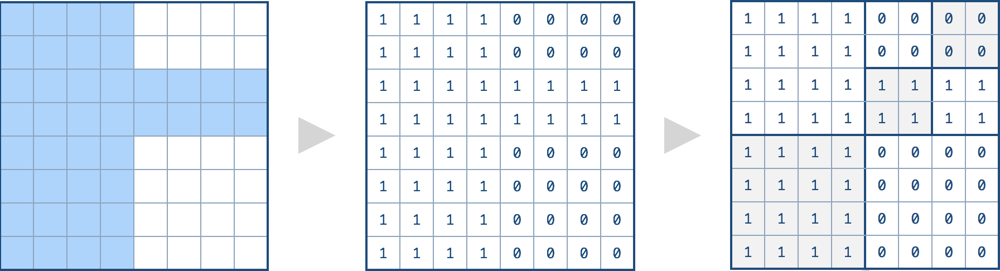

==== 数组中异或值最大的两个数字

----
Given a non-empty array of numbers, a0, a1, a2, … , an-1, where 0 ≤ ai < 231.

Find the maximum result of ai XOR aj, where 0 ≤ i, j < n.

Could you do this in O(n) runtime?

Example:

Input: [3, 10, 5, 25, 2, 8]

Output: 28

Explanation: The maximum result is 5 ^ 25 = 28.
----

----
这道题是一道典型的位操作Bit Manipulation的题目，我开始以为异或值最大的两个数一定包括数组的最大值，但是OJ给了另一个例子{10,23,20,18,28}，这个数组的异或最大值是10和20异或，得到30。那么只能另辟蹊径，正确的做法是按位遍历，题目中给定了数字的返回不会超过231,那么最多只能有32位，我们用一个从左往右的mask，用来提取数字的前缀，然后将其都存入HashSet中，我们用一个变量t，用来验证当前位为1再或上之前结果res，看结果和HashSet中的前缀异或之后在不在HashSet中，这里用到了一个性质，若a^b=c，那么a=b^c，因为t是我们要验证的当前最大值，所以我们遍历HashSet中的数时，和t异或后的结果仍在HashSet中，说明两个前缀可以异或出t的值，所以我们更新res为t，继续遍历，如果上述讲解不容易理解，那么建议自己带个例子一步一步试试，并把每次循环中HashSet中所有的数字都打印出来，基本应该就能理解了，算了，还是博主带着大家来看题目中给的例子吧：

3        10        5        25        2        8

11      1010     101     11001     10      1000

我们观察这些数字最大的为25，其二进制最高位在 i=4 时为1，那么我们的循环[31, 5]之间是取不到任何数字的，所以不会对结果res有任何影响。

当 i=4 时，我们此时mask为前28位为‘1’的二进制数，跟除25以外的任何数相‘与’，都会得到0。 然后跟25的二进制数10101相‘与’，得到二进制数10000，存入HashSet中，那么此时HashSet中就有0和16两个数字。此时我们的t为结果res（此时为0）‘或’上二进制数10000，得到二进制数10000。然后我们遍历HashSet，由于HashSet是无序的，所以我们会取出0和16中的其中一个，如果prefix取出的是0，那么t=16‘异或’上0，还等于16，而16是在HashSet中存在的，所以此时结果res更新为16，然后break掉遍历HashSet的循环。实际上prefix先取16的话也一样，那么t=16‘异或’上16，等于0，而0是在HashSet中存在的，所以此时结果res更新为16，然后break掉遍历HashSet的循环。

3        10        5        25        2        8

11      1010     101     11001     10      1000

当 i=3 时，我们此时mask为前29位为‘1’的二进制数，如上所示，跟数字3，5，2中任何一个相‘与’，都会得到0。然后跟10的二进制数1010，或跟8的二进制数1000相‘与’，都会得到二进制数1000，即8。跟25的二进制数11001相‘与’，会得到二进数11000，即24，存入HashSet中，那么此时HashSet中就有0，8，和24三个数字。此时我们的t为结果res（此时为16）‘或’上二进制数1000，得到二进制数11000，即24。此时遍历HashSet中的数，当prefix取出0，那么t=24‘异或’上0，还等于24，而24是在HashSet中存在的，所以此时结果res更新为24，然后break掉遍历HashSet的循环。大家可以尝试其他的数，当prefix取出24，其实也可以更新结果res为24的。但是8就不行啦，因为HashSet中没有16。不过无所谓了，我们只要有一个能更新结果res就可以了。

3        10        5        25        2        8

11      1010     101     11001     10      1000

当 i=2 时，我们此时mask为前30位为‘1’的二进制数，如上所示，跟3的二进制数11相‘与’，会得到二进制数0，即0。然后跟10的二进制数1010相‘与’，会得到二进制数1000，即8。然后跟5的二进制数101相‘与’，会得到二进制数100，即4。然后跟25的二进制数11001相‘与’，会得到二进制数11000，即24。跟数字2和8相‘与’，分别会得到0和8，跟前面重复了。所以最终HashSet中就有0，4，8，和24这四个数字。此时我们的t为结果res（此时为24）‘或’上二进制数100，得到二进制数11100，即28。那么就要验证结果res能否取到28。我们遍历HashSet，当prefix取出0，那么t=28‘异或’上0，还等于28，但是HashSet中没有28，所以不行。当prefix取出4，那么t=28‘异或’上二进制数100，等于24，在HashSet中存在，Bingo！结果res更新为28。其他的数可以不用试了。

3        10        5        25        2        8

11      1010     101     11001     10      1000

当 i=1 时，我们此时mask为前31位为‘1’的二进制数，如上所示，每个数与mask相‘与’后，我们HashSet中会有2，4，8，10，24这五个数。此时我们的t为结果res（此时为28）‘或’上二进制数10，得到二进制数11110，即30。那么就要验证结果res能否取到30。我们遍历HashSet，当prefix取出2，那么t=30‘异或’上2，等于28，但是HashSet中没有28，所以不行。当prefix取出4，那么t=30‘异或’上4，等于26，但是HashSet中没有26，所以不行。当prefix取出8，那么t=30‘异或’上8，等于22，但是HashSet中没有22，所以不行。当prefix取出10，那么t=30‘异或’上10，等于20，但是HashSet中没有20，所以不行。当prefix取出24，那么t=30‘异或’上24，等于6，但是HashSet中没有6，所以不行。遍历完了HashSet所有的数，结果res没有被更新，还是28。

3        10        5        25        2        8

11      1010     101     11001     10      1000

当 i=0 时，我们此时mask为前32位为‘1’的二进制数，如上所示，每个数与mask相‘与’后，我们HashSet中会有2，3，5，8，10，25这六个数。此时我们的t为结果res（此时为28）‘或’上二进制数1，得到二进制数11101，即29。那么就要验证结果res能否取到29。取出HashSet中每一个数字来验证，跟上面的验证方法相同，这里博主偷懒就不写了，最终可以发现，结果res无法被更新，还是28，所以最终的结果就是28。

综上所述，我们来分析一下这道题的核心。我们希望用二进制来拼出结果的数，最终结果28的二进制数为11100，里面有三个‘1’，我们来找一下都是谁贡献了这三个‘1’？在 i=4 时，数字25贡献了最高位的‘1’，在 i=3 时，数字25贡献了次高位的‘1’，在 i=2 时，数字5贡献了第三位的‘1’。而一旦某个数贡献了‘1’，那么之后在需要贡献‘1’的时候，此数就可以再继续贡献‘1’。而一旦有两个数贡献了‘1’后，那么之后的‘1’就基本上只跟这两个数有关了，其他数字有‘1’也贡献不出来。验证方法里使用了前面提到的性质，a ^ b = t，如果t是所求结果话，我们可以先假定一个t，然后验证，如果a ^ t = b成立，说明该t可以通过a和b‘异或’得到。参见代码如下：
----
[source, cpp, linenums]
----
class Solution {
public:
    int findMaximumXOR(vector<int>& nums) {
        int res = 0, mask = 0;
        for (int i = 31; i >= 0; --i) {
            mask |= (1 << i);
            unordered_set<int> s;
            for (int num : nums) {
                s.insert(num & mask);
            }
            int t = res | (1 << i);
            for (int prefix : s) {
                if (s.count(t ^ prefix)) {
                    res = t;
                    break;
                }
            }
        }
        return res;
    }
};
----

==== 验证单词平方

----
Given a sequence of words, check whether it forms a valid word square.

A sequence of words forms a valid word square if the kth row and column read the exact same string, where 0 ≤k < max(numRows, numColumns).

Note:

The number of words given is at least 1 and does not exceed 500.
Word length will be at least 1 and does not exceed 500.
Each word contains only lowercase English alphabet a-z.
----

这道题给了我们一个二位数组，每行每列都是一个单词，需要满足第k行的单词和第k列的单词要相等，这里不要求每一个单词的长度都一样，只要对应位置的单词一样即可。那么这里实际上也就是一个遍历二维数组，然后验证对应位上的字符是否相等的问题，由于各行的单词长度不一定相等，所以我们在找对应位置的字符时，要先判断是否越界，即对应位置是否有字符存在，遇到不符合要求的地方直接返回false，全部遍历结束后返回true，参见代码如下： +

[source, cpp, linenums]
----
class Solution {
public:
    bool validWordSquare(vector<string>& words) {
        if (words.empty()) return true;
        if (words.size() != words[0].size()) return false;
        for (int i = 0; i < words.size(); ++i) {
            for (int j = 0; j < words[i].size(); ++j) {
                if (j >= words.size() || i >= words[j].size() || words[i][j] != words[j][i]) {
                    return false;
                }
            }
        }
        return true;
    }
};
----

==== 从英文中重建数字

----
Given a non-empty string containing an out-of-order English representation of digits 0-9, output the digits in ascending order.

Note:

Input contains only lowercase English letters.
Input is guaranteed to be valid and can be transformed to its original digits. That means invalid inputs such as "abc" or "zerone" are not permitted.
Input length is less than 50,000.
----
这道题给了我们一串英文字符串，是由表示数字的英文单词组成的，不过字符顺序是打乱的，让我们重建出数字。那么这道题的思路是先要统计出各个字符出现的次数，然后算出每个单词出现的次数，然后就可以重建了。由于题目中限定了输入的字符串一定是有效的，那么不会出现无法成功重建的情况，这里需要用个trick。我们仔细观察这些表示数字的单词"zero", "one", "two", "three", "four", "five", "six", "seven", "eight", "nine"，我们可以发现有些的单词的字符是独一无二的，比如z，只出现在zero中，还有w，u，x，g这四个单词，分别只出现在two，four，six，eight中，那么这五个数字的个数就可以被确定了，由于含有o的单词有zero，two，four，one，其中前三个都被确定了，那么one的个数也就知道了；由于含有h的单词有eight，three，其中eight个数已知，那么three的个数就知道了；由于含有f的单词有four，five，其中four个数已知，那么five的个数就知道了；由于含有s的单词有six，seven，其中six个数已知，那么seven的个数就知道了；由于含有i的单词有six，eight，five，nine，其中前三个都被确定了，那么nine的个数就知道了，知道了这些问题就变的容易多了，我们按这个顺序"zero", "two", "four", "six", "eight", "one", "three", "five", "seven", "nine"就能找出所有的个数了，参见代码如下： +

**解法1** +
[source, cpp, linenums]
----
class Solution {
public:
    string originalDigits(string s) {
        string res = "";
        vector<string> words{"zero", "two", "four", "six", "eight", "one", "three", "five", "seven", "nine"};
        vector<int> nums{0, 2, 4, 6, 8, 1, 3, 5, 7, 9}, counts(26, 0);
        vector<char> chars{'z', 'w', 'u', 'x', 'g', 'o', 'h', 'f', 's', 'i'};
        for (char c : s) ++counts[c - 'a'];
        for (int i = 0; i < 10; ++i) {
            int cnt = counts[chars[i] - 'a'];
            for (int j = 0; j < words[i].size(); ++j) {
                counts[words[i][j] - 'a'] -= cnt;
            }
            while (cnt--) res += (nums[i] + '0');
        }
        sort(res.begin(), res.end());
        return res;
    }
};
----
另外我们也可以用更加简洁易懂的方法来快速的找出各个数字的个数，参见代码如下： +

**解法2:** +
[source, cpp, linenums]
----
class Solution {
public:
    string originalDigits(string s) {
        string res = "";
        vector<int> counts(128, 0), nums(10, 0);
        for (char c : s) ++counts[c];
        nums[0] = counts['z'];
        nums[2] = counts['w'];
        nums[4] = counts['u'];
        nums[6] = counts['x'];
        nums[8] = counts['g'];
        nums[1] = counts['o'] - nums[0] - nums[2] - nums[4];
        nums[3] = counts['h'] - nums[8];
        nums[5] = counts['f'] - nums[4];
        nums[7] = counts['s'] - nums[6];
        nums[9] = counts['i'] - nums[6] - nums[8] - nums[5];
        for (int i = 0; i < nums.size(); ++i) {
            for (int j = 0; j < nums[i]; ++j) {
                res += (i + '0');
            }
        }
        return res;
    }
};
----

==== 最长重复字符置换
----
Given a string that consists of only uppercase English letters, you can replace any letter in the string with another letter at most k times. Find the length of a longest substring containing all repeating letters you can get after performing the above operations.

Note:
Both the string's length and k will not exceed 104.

Example 1:

Input:
s = "ABAB", k = 2

Output:
4
----

这道题给我们了一个字符串，说我们有k次随意置换任意字符的机会，让我们找出最长的重复字符的字符串。这道题跟之前那道Longest Substring with At Most K Distinct Characters很像，都需要用滑动窗口Sliding Window来解。我们首先来想，如果没有k的限制，让我们求把字符串变成只有一个字符重复的字符串需要的最小置换次数，那么就是字符串的总长度减去出现次数最多的字符的个数。如果加上k的限制，我们其实就是求满足(子字符串的长度减去出现次数最多的字符个数)<=k的最大子字符串长度即可，搞清了这一点，我们也就应该知道怎么用滑动窗口来解了吧我们用一个变量start记录滑动窗口左边界，初始化为0，然后我们遍历字符串，每次累加出现字符的个数，然后更新出现最多字符的个数，然后我们判断当前滑动窗口是否满足之前说的那个条件，如果不满足，我们就把滑动窗口左边界向右移动一个，并注意去掉的字符要在counts里减一，直到满足条件，我们更新结果res即可，参见代码如下： +

[source, cpp, linenums]
----
class Solution {
public:
    int characterReplacement(string s, int k) {
        int res = 0, maxCnt = 0, start = 0;
        vector<int> counts(26, 0);
        for (int i = 0; i < s.size(); ++i) {
            maxCnt = max(maxCnt, ++counts[s[i] - 'A']);
            while (i - start + 1 - maxCnt > k) {
                --counts[s[start] - 'A'];
                ++start;
            }
            res = max(res, i - start + 1);
        }
        return res;
    }
};
----

==== 单词平方

----
Given a set of words (without duplicates), find all word squares you can build from them.

A sequence of words forms a valid word square if the kth row and column read the exact same string, where 0 ≤ k < max(numRows, numColumns).

For example, the word sequence ["ball","area","lead","lady"] forms a word square because each word reads the same both horizontally and vertically.

b a l l
a r e a
l e a d
l a d y
Note:

There are at least 1 and at most 1000 words.
All words will have the exact same length.
Word length is at least 1 and at most 5.
Each word contains only lowercase English alphabet a-z.
----

这道题是之前那道Valid Word Square的延伸，由于要求出所有满足要求的单词平方，所以难度大大的增加了，不要幻想着可以利用之前那题的解法来暴力破解，OJ不会答应的。那么根据以往的经验，对于这种要打印出所有情况的题的解法大多都是用递归来解，那么这题的关键是根据前缀来找单词，我们如果能利用合适的数据结构来建立前缀跟单词之间的映射，使得我们能快速的通过前缀来判断某个单词是否存在，这是解题的关键。对于建立这种映射，这里主要有两种方法，一种是利用哈希表来建立前缀和所有包含此前缀单词的集合之前的映射，第二种方法是建立前缀树Trie，顾名思义，前缀树专门就是为这种问题设计的。那么我们首先来看第一种方法，用哈希表来建立映射的方法，我们就是取出每个单词的所有前缀，然后将该单词加入该前缀对应的集合中去，然后我们建立一个空的nxn的char矩阵，其中n为单词的长度，我们的目标就是来把这个矩阵填满，我们从0开始遍历，我们先取出长度为0的前缀，即空字符串，由于我们在建立映射的时候，空字符串也和每个单词的集合建立了映射，然后我们遍历这个集合，用遍历到的单词的i位置字符，填充矩阵mat[i][i]，然后j从i+1出开始遍历，对应填充矩阵mat[i][j]和mat[j][i]，然后我们根据第j行填充得到的前缀，到哈希表中查看有没单词，如果没有，就break掉，如果有，则继续填充下一个位置。最后如果j==n了，说明第0行和第0列都被填好了，我们再调用递归函数，开始填充第一行和第一列，依次类推，直至填充完成，参见代码如下： +

**解法1:** +
[source, cpp, linenums]
----
class Solution {
public:
    vector<vector<string>> wordSquares(vector<string>& words) {
        vector<vector<string>> res;
        unordered_map<string, set<string>> m;
        int n = words[0].size();
        for (string word : words) {
            for (int i = 0; i < n; ++i) {
                string key = word.substr(0, i);
                m[key].insert(word);
            }
        }
        vector<vector<char>> mat(n, vector<char>(n));
        helper(0, n, mat, m, res);
        return res;
    }
      void helper(int i, int n, vector<vector<char>>& mat, unordered_map<string, set<string>>& m, vector<vector<string>>& res) {
            if (i == n) {
                vector<string> out;
                for (int j = 0; j < n; ++j) out.push_back(string(mat[j].begin(), mat[j].end()));
                res.push_back(out);
                return;
            }
            string key = string(mat[i].begin(), mat[i].begin() + i);
        for (string str : m[key]) {
            mat[i][i] = str[i];
            int j = i + 1;
            for (; j < n; ++j) {
                mat[i][j] = str[j];
                mat[j][i] = str[j];
                if (!m.count(string(mat[j].begin(), mat[j].begin() + i + 1))) break;
            }
            if (j == n) helper(i + 1, n, mat, m, res);
        }
    }
};
----

下面来看建立前缀树Trie的方法，这种方法的难点是看能不能熟练的写出Trie的定义，还有构建过程，以及后面在递归函数中，如果利用前缀树来快速查找单词的前缀，总之，这道题是前缀树的一种经典的应用，能白板写出来就说明基本上已经掌握了前缀树了，参见代码如下： +
**解法2:** +
[source, cpp, linenums]
----
class Solution {
public:
    struct TrieNode {
        vector<int> indexs;
        vector<TrieNode*> children;
        TrieNode(): children(26, nullptr) {}
    };
    TrieNode* buildTrie(vector<string>& words) {
        TrieNode *root = new TrieNode();
        for (int i = 0; i < words.size(); ++i) {
            TrieNode *t = root;
            for (int j = 0; j < words[i].size(); ++j) {
                if (!t->children[words[i][j] - 'a']) {
                    t->children[words[i][j] - 'a'] = new TrieNode();
                }
                t = t->children[words[i][j] - 'a'];
                t->indexs.push_back(i);
            }
        }
        return root;
    }
    vector<vector<string>> wordSquares(vector<string>& words) {
        TrieNode *root = buildTrie(words);
        vector<string> out(words[0].size());
        vector<vector<string>> res;
        for (string word : words) {
            out[0] = word;
            helper(words, 1, root, out, res);
        }
        return res;
    }
    void helper(vector<string>& words, int level, TrieNode* root, vector<string>& out, vector<vector<string>>& res) {
        if (level >= words[0].size()) {
            res.push_back(out);
            return;
        }
        string str = "";
        for (int i = 0; i < level; ++i) {
            str += out[i][level];
        }
        TrieNode *t = root;
        for (int i = 0; i < str.size(); ++i) {
            if (!t->children[str[i] - 'a']) return;
            t = t->children[str[i] - 'a'];
        }
        for (int idx : t->indexs) {
            out[level] = words[idx];
            helper(words, level + 1, root, out, res);
        }
    }
};
----

==== Convert Binary Search Tree to Sorted Doubly Linked List

[source, cpp, linenums]
----
class Solution {
public:
    Node* treeToDoublyList(Node* root) {
        if(!root) return root;
        Node* cur = root;
        stack<Node*> stk;
        Node* head = NULL;
        Node* prev = NULL;
        while(cur || !stk.empty()){
            if(cur){
                stk.push(cur);
                cur = cur->left;
            }else{
                cur = stk.top();
                stk.pop();
                if(!head) head = cur;
                if(prev){
                    prev->right = cur;
                    cur->left = prev;
                }
                prev = cur;
                cur = cur->right;
            }
        }
        head->left = prev;
        prev->right = head;
        return head;
    }
};
----

==== 建立四叉树

----
我们想要使用一棵四叉树来储存一个 N x N 的布尔值网络。网络中每一格的值只会是真或假。树的根结点代表整个网络。对于每个结点, 它将被分等成四个孩子结点直到这个区域内的值都是相同的.

每个结点还有另外两个布尔变量: isLeaf 和 val。isLeaf 当这个节点是一个叶子结点时为真。val 变量储存叶子结点所代表的区域的值。

你的任务是使用一个四叉树表示给定的网络。下面的例子将有助于你理解这个问题：

给定下面这个8 x 8 网络，我们将这样建立一个对应的四叉树：
----

image::images/question_427_1.png[width="20%", height="25%"]

由上文的定义，它能被这样分割： +

[source, cpp, linenums]
----
/*
 // Definition for a QuadTree node.
class Node {
 public:
 bool val;
 bool isLeaf;
 Node* topLeft;
 Node* topRight;
 Node* bottomLeft;
 Node* bottomRight;

 Node() {}

 Node(bool _val, bool _isLeaf, Node* _topLeft, Node* _topRight, Node* _bottomLeft, Node* _bottomRight) {
 val = _val;
 isLeaf = _isLeaf;
 topLeft = _topLeft;
 topRight = _topRight;
 bottomLeft = _bottomLeft;
 bottomRight = _bottomRight;
 }
 };
 */
class Solution {
public:
    Node* construct(vector<vector<int>>& grid) {
        return construct(grid, 0, 0, grid.size());
    }

    Node* construct(const vector<vector<int>>& grid, int x, int y, int n) {
        if (n == 0) return nullptr;
        bool all_zeros = true;
        bool all_ones = true;
        for (int i = y; i < y + n; ++i)
            for (int j = x; j < x + n; ++j)
                if (grid[i][j] == 0)
                    all_ones = false;
                else
                    all_zeros = false;
        if (all_zeros || all_ones)
            return new Node(all_ones, true, nullptr, nullptr, nullptr, nullptr);

        return new Node(true, false,
                        construct(grid, x,       y,       n/2),  // topLeft
                        construct(grid, x + n/2, y,       n/2),  // topRight
                        construct(grid, x,       y + n/2, n/2),  // bottomLeft
                        construct(grid, x + n/2, y + n/2, n/2)); // bottomRight
    }
};
----

==== Serialize and Deserialize N-ary Tree

[source, cpp, linenums]
----
// This function stores the given N-ary tree in a file pointed by fp
void serialize(Node *root, FILE *fp)
{
    // Base case
    if (root == NULL) return;

    // Else, store current node and recur for its children
    fprintf(fp, "%c ", root->key);
    for (int i = 0; i < N && root->child[i]; i++)
        serialize(root->child[i],  fp);

    // Store marker at the end of children
    fprintf(fp, "%c ", MARKER);
}

// This function constructs N-ary tree from a file pointed by 'fp'.
// This functionr returns 0 to indicate that the next item is a valid
// tree key. Else returns 0
int deSerialize(Node *&root, FILE *fp)
{
    // Read next item from file. If theere are no more items or next
    // item is marker, then return 1 to indicate same
    char val;
    if ( !fscanf(fp, "%c ", &val) || val == MARKER )
        return 1;

    // Else create node with this item and recur for children
    root = newNode(val);
    for (int i = 0; i < N; i++)
        if (deSerialize(root->child[i], fp))
            break;

    // Finally return 0 for successful finish
    return 0;
}
----

==== N叉树的层序遍历

给定一个 N 叉树，返回其节点值的层序遍历。 (即从左到右，逐层遍历)。 +

[source, cpp, linenums]
----
/*
 // Definition for a Node.
 class Node {
 public:
 int val = NULL;
 vector<Node*> children;

 Node() {}

 Node(int _val, vector<Node*> _children) {
 val = _val;
 children = _children;
 }
 };
 */
class Solution {
public:
    vector<vector<int>> levelOrder(Node* root) {
        vector<vector<int>> res;
        if(!root) return res;
        queue<Node*> q;
        q.push(root);

        while(!q.empty()){
            vector<int> tmp;
            int n=q.size();
            for(int i=0;i<n;++i){
                Node* t=q.front();q.pop();
                tmp.push_back(t->val);
                for(int j=0;j<t->children.size();++j){
                    q.push(t->children[j]);
                }
            }
            res.push_back(tmp);
        }
        return res;
    }
};
----

==== 扁平化多级双向链表

----
您将获得一个双向链表，除了下一个和前一个指针之外，它还有一个子指针，可能指向单独的双向链表。这些子列表可能有一个或多个自己的子项，依此类推，生成多级数据结构，如下面的示例所示。

扁平化列表，使所有结点出现在单级双链表中。您将获得列表第一级的头部。
示例:

输入:
 1---2---3---4---5---6--NULL
         |
         7---8---9---10--NULL
             |
             11--12--NULL

输出:
1-2-3-7-8-11-12-9-10-4-5-6-NULL
----

[source, cpp, linenums]
----
class Solution {
public:
    bool dfs(Node *head,vector<Node *> &path){
        if(head == NULL){
            return false;
        }

        path.push_back(head);
        if(head->child){
            dfs(head->child,path);
        }
        dfs(head->next,path);

        return true;
    }

    Node* flatten(Node* head) {
        Node * node = head;
        vector<Node *> path;
        dfs(head,path);

        if(!head){
            return NULL;
        }

        for(int i = 1;i < path.size(); ++i){
            node->next = path[i];
            node->child = NULL;
            path[i]->prev = node;
            node = path[i];
        }

        node->next = NULL;
        node->child = NULL;

        return head;
    }

    /*
    Node* getTail(Node* head) { /* 获取尾节点 */
    Node* now = head;
    while (now->next) {
        now = now->next;
    }
    return now;
}

Node* flatten(Node* head) {
    Node* now = head;
    while (now) {
        if (now->child) {
            Node* subHead = flatten(now->child); /* 递归获取展开后的子序列的头节点 */
            Node* subTail = getTail(subHead); /* 获取子序列的尾节点 */
            Node* nowNext = now->next;
            now->child = nullptr; /* 断开儿子节点 */
            /* 将当前节点与子序列的头部进行链接 */
            now->next = subHead;
            subHead->prev = now;
            /* 若当前节点存在后驱，则要将当前节点的后驱与子序列的尾部链接 */
            if (nowNext) {
                nowNext->prev = subTail;
                subTail->next = nowNext;
            }
        }
        now = now->next;
    }
    return head;
}
    */
};
----

==== Encode N-ary Tree to Binary Tree

[source, cpp, linenums]
----
class Codec {
public:

    // Encodes an n-ary tree to a binary tree.
    TreeNode* encode(Node* root) {
        if (root == nullptr) {
            return nullptr;
        }
        auto node = new TreeNode(root->val);
        if (!root->children.empty()) {
            node->right = encodeHelper(root->children[0], root, 0);
        }
        return node;
    }

    // Decodes your binary tree to an n-ary tree.
    Node* decode(TreeNode* root) {
        if (root == nullptr) {
            return nullptr;
        }
        vector<Node*> children;
        auto node = new Node(root->val, children);
        decodeHelper(root->right, node);
        return node;
    }

private:
    TreeNode *encodeHelper(Node *root, Node *parent, int index) {
        if (root == nullptr) {
            return nullptr;
        }
        auto node = new TreeNode(root->val);
        if (index + 1 < parent->children.size()) {
            node->left = encodeHelper(parent->children[index + 1], parent, index + 1);
        }
        if (!root->children.empty()) {
            node->right = encodeHelper(root->children[0], root, 0);
        }
        return node;
    }

    void decodeHelper(TreeNode* root, Node* parent) {
        if (!root) {
            return;
        }
        vector<Node*> children;
        auto node = new Node(root->val, children);
        decodeHelper(root->right, node);
        parent->children.push_back(node);
        decodeHelper(root->left, parent);
    }
};
----

==== 全O(1)的数据结构

----
Implement a data structure supporting the following operations:

Inc(Key) - Inserts a new key with value 1. Or increments an existing key by 1. Key is guaranteed to be a non-empty string.
Dec(Key) - If Key's value is 1, remove it from the data structure. Otherwise decrements an existing key by 1. If the key does not exist, this function does nothing. Key is guaranteed to be a non-empty string.
GetMaxKey() - Returns one of the keys with maximal value. If no element exists, return an empty string "".
GetMinKey() - Returns one of the keys with minimal value. If no element exists, return an empty string "".

Challenge: Perform all these in O(1) time complexity.
----

----
这道题让我们实现一个全是O(1)复杂度的数据结构，包括了增加key，减少key，获取最大key，获取最小key，这几个函数。由于需要常数级的时间复杂度，我们首先第一反应就是要用哈希表来做，不仅如此，我们肯定还需要用list来保存所有的key，那么哈希表就是建立key和list中位置迭代器之间的映射，这不由得令人想到了之前那道LRU Cache，也是用了类似的方法来解，但是感觉此题还要更加复杂一些。由于每个key还要对应一个次数，所以list中不能只放key，而且相同的次数可能会对应多个key值，所以我们用unordered_set来保存次数相同的所有key值，我们建立一个Bucket的结构体来保存次数val，和保存key值的集合keys。解题思路主要参考了网友ivancjw的帖子，数据结构参考了史蒂芬大神的帖子，思路是，我们建立一个次数分层的结构，次数多的在顶层，每一层放相同次数的key值，例如下面这个例子：

"A": 4, "B": 4, "C": 2, "D": 1

那么用我们设计的结构保存出来就是：

row0: val = 4, keys = {"A", "B"}
row1: val = 2, keys = {"C"}
row2: val = 1, keys = {"D"}

好，我们现在来分析如何实现inc函数，我们来想，如果我们插入一个新的key，跟我们插入一个已经存在的key，情况是完全不一样的，那么我们就需要分情况来讨论:

- 如果我们插入一个新的key，那么由于该key没有出现过，所以加入后次数一定为1，那么就有两种情况了，如果list中没有val为1的这一行，那么我们需要插入该行，如果已经有了val为1的这行，我们直接将key加入集合keys中即可。

- 如果我们插入了一个已存在的key，那么由于个数增加了1个，所以该key值肯定不能在当前行继续待下去了，要往上升职啊，那么这里就有两种情况了，如果该key要升职到的那行不存在，我们需要手动添加那一行；如果那一行存在，我们之间将key加入集合keys中，记得都要将原来行中的key值删掉。

下面我们再来看dec函数如何实现，其实理解了上面的inc函数，那么dec函数也就没什么难度了：

- 如果我们要删除的key不存在，那么直接返回即可。

- 如果我们要删除的key存在，那么我们看其val值是否为1，如果为1的话，那么直接在keys中删除该key即可，然后还需要判断如果该key是集合中的唯一一个，那么该行也需要删除。如果key的次数val不为1的话，我们要考虑降级问题，跟之前的升职很类似，如果要降级的行不存在，我们手动添加上，如果存在，则直接将key值添加到keys集合中即可。

当我们搞懂了inc和dec的实现方法，那么getMaxKey()和getMinKey()简直就是福利啊，不要太简单啊，直接返回首层和尾层的key值即可，参见代码如下：
----

[source, cpp, linenums]
----
class AllOne {
public:
    /** Initialize your data structure here. */
    AllOne() {}

    /** Inserts a new key <Key> with value 1. Or increments an existing key by 1. */
    void inc(string key) {
        if (!m.count(key)) {
            if (buckets.empty() || buckets.back().val != 1) {
                auto newBucket = buckets.insert(buckets.end(), {1, {key}});
                m[key] = newBucket;
            } else {
                auto newBucket = --buckets.end();
                newBucket->keys.insert(key);
                m[key] = newBucket;
            }
        } else {
            auto curBucket = m[key], lastBucket = (--m[key]);
            if (lastBucket == buckets.end() || lastBucket->val != curBucket->val + 1) {
                auto newBucket = buckets.insert(curBucket, {curBucket->val + 1, {key}});
                m[key] = newBucket;
            } else {
                lastBucket->keys.insert(key);
                m[key] = lastBucket;
            }
            curBucket->keys.erase(key);
            if (curBucket->keys.empty()) buckets.erase(curBucket);
        }
    }

    /** Decrements an existing key by 1. If Key's value is 1, remove it from the data structure. */
    void dec(string key) {
        if (!m.count(key)) return;
        auto curBucket = m[key];
        if (curBucket->val == 1) {
            curBucket->keys.erase(key);
            if (curBucket->keys.empty()) buckets.erase(curBucket);
            m.erase(key);
            return;
        }
        auto nextBucket = ++m[key];
        if (nextBucket == buckets.end() || nextBucket->val != curBucket->val - 1) {
            auto newBucket = buckets.insert(nextBucket, {curBucket->val - 1, {key}});
            m[key] = newBucket;
        } else {
            nextBucket->keys.insert(key);
            m[key] = nextBucket;
        }
        curBucket->keys.erase(key);
        if (curBucket->keys.empty()) buckets.erase(curBucket);
    }

    /** Returns one of the keys with maximal value. */
    string getMaxKey() {
        return buckets.empty() ? "" : *(buckets.begin()->keys.begin());
    }

    /** Returns one of the keys with Minimal value. */
    string getMinKey() {
        return buckets.empty() ? "" : *(buckets.rbegin()->keys.begin());
    }
private:
    struct Bucket { int val; unordered_set<string> keys; };
    list<Bucket> buckets;
    unordered_map<string, list<Bucket>::iterator> m;
};
----

==== 最小基因变化

----
A gene string can be represented by an 8-character long string, with choices from "A", "C", "G", "T".

Suppose we need to investigate about a mutation (mutation from "start" to "end"), where ONE mutation is defined as ONE single character changed in the gene string.

For example, "AACCGGTT" -> "AACCGGTA" is 1 mutation.

Also, there is a given gene "bank", which records all the valid gene mutations. A gene must be in the bank to make it a valid gene string.

Now, given 3 things - start, end, bank, your task is to determine what is the minimum number of mutations needed to mutate from "start" to "end". If there is no such a mutation, return -1.

Note:

Starting point is assumed to be valid, so it might not be included in the bank.
If multiple mutations are needed, all mutations during in the sequence must be valid.
You may assume start and end string is not the same.
----
这道题跟之前的Word Ladder完全是一道题啊，换个故事就直接来啊，越来不走心了啊。不过博主做的时候并没有想起来是之前一样的题，而是先按照脑海里第一个浮现出的思路做的，发现也通过OJ了。博主使用的一种BFS的搜索，先建立bank数组的距离场，这里距离就是两个字符串之间不同字符的个数。然后以start字符串为起点，向周围距离为1的点扩散，采用BFS搜索，每扩散一层，level自加1，当扩散到end字符串时，返回当前level即可。注意我们要把start字符串也加入bank中，而且此时我们也知道start的坐标位置，bank的最后一个位置，然后在简历距离场的时候，调用一个count子函数，用来统计输入的两个字符串之间不同字符的个数，注意dist[i][j]和dist[j][i]是相同，所以我们只用算一次就行了。然后我们进行BFS搜索，用一个visited集合来保存遍历过的字符串，注意检测距离的时候，dist[i][j]和dist[j][i]只要有一个是1，就可以了，参见代码如下： +

**解法1:** +
[source, cpp, linenums]
----
class Solution {
public:
    int minMutation(string start, string end, vector<string>& bank) {
        if (bank.empty()) return -1;
        bank.push_back(start);
        int res = 0, n = bank.size();
        queue<int> q{{n - 1}};
        vector<vector<int>> dist(n, vector<int>(n, 0));
        for (int i = 0; i < n; ++i) {
            for (int j = i + 1; j < n; ++j) {
                dist[i][j] = count(bank[i], bank[j]);
            }
        }
        unordered_set<int> visited;
        while (!q.empty()) {
            int len = q.size();
            ++res;
            for (int i = 0; i < len; ++i) {
                int t = q.front(); q.pop();
                visited.insert(t);
                for (int j = 0; j < n; ++j) {
                    if ((dist[t][j] != 1 && dist[j][t] != 1) || visited.count(j)) continue;
                    if (bank[j] == end) return res;
                    q.push(j);
                }
            }
        }
        return -1;
    }
    int count(string word1, string word2) {
        int cnt = 0, n = word1.size();
        for (int i = 0; i < n; ++i) {
            if (word1[i] != word2[i]) ++cnt;
        }
        return cnt;
    }
};
----

下面这种解法跟之前的那道Word Ladder是一样的，也是用的BFS搜索。跟上面的解法不同之处在于，对于遍历到的字符串，我们不再有距离场，而是对于每个字符，我们都尝试将其换为一个新的字符，每次只换一个，这样会得到一个新的字符串，如果这个字符串在bank中存在，说明这样变换是合法的，加入visited集合和queue中等待下一次遍历，记得在下次置换字符的时候要将之前的还原。我们在queue中取字符串出来遍历的时候，先检测其是否和end相等，相等的话返回level，参见代码如下： +

**解法2:** +
[source, cpp, linenums]
----
class Solution {
public:
    int minMutation(string start, string end, vector<string>& bank) {
        if (bank.empty()) return -1;
        vector<char> gens{'A','C','G','T'};
        unordered_set<string> s{bank.begin(), bank.end()};
        unordered_set<string> visited;
        queue<string> q{{start}};
        int level = 0;
        while (!q.empty()) {
            int len = q.size();
            for (int i = 0; i < len; ++i) {
                string t = q.front(); q.pop();
                if (t == end) return level;
                for (int j = 0; j < t.size(); ++j) {
                    char old = t[j];
                    for (char c : gens) {
                        t[j] = c;
                        if (s.count(t) && !visited.count(t)) {
                            visited.insert(t);
                            q.push(t);
                        }
                    }
                    t[j] = old;
                }
            }
            ++level;
        }
        return -1;
    }
};
----

博主一直想找种递归的解法，于是在论坛上找到了这个帖子，是Java版的递归写法，博主将其改写成C++版本，但是无法通过OJ，百思不得其解啊，明明一模一样啊，连变量名都起的一样，为啥Java版的就是对的，博主的这个改写版就不对呢，各位看官大神们帮忙解答一下呀～ +

**解法3:** +
[source, cpp, linenums]
----
class Solution {
public:
    int minMutation(string start, string end, vector<string>& bank) {
        vector<bool> explored(bank.size(), false);
        if (bank.empty()) return -1;
        return minMutation(explored, start, end,  bank);
    }
    bool minMutation(vector<bool>& explored , string start, string end, vector<string>& bank) {
        if (start == end) return 0;
        int step = bank.size() + 1;
        for (int i = 0; i < bank.size(); ++i) {
            if (diffOne(start, bank[i]) && explored[i]) {
                explored[i] = true;
                int temp = minMutation(explored, bank[i], end, bank);
                if (temp != -1) {
                    step = min(step, temp);
                }
                explored[i] = false;
            }
        }
        return step == bank.size() + 1 ? -1 : 1 + step;
    }
    bool diffOne(string& s1, string& s2) {
        int count = 0;
        for (int i = 0; i < s1.size(); ++i) {
            if (s1[i] != s2[i]) ++count;
            if (count >= 2) return false;
        }
        return count == 1;
    }
};
----

==== 字符串中的分段数量

----
Count the number of segments in a string, where a segment is defined to be a contiguous sequence of non-space characters.

Please note that the string does not contain any non-printable characters.

Example:

Input: "Hello, my name is John"
Output: 5
----

这道题跟之前那道Reverse Words in a String有些类似，不过比那题要简单一些，因为不用翻转单词，只要统计出单词的数量即可。那么我们的做法是遍历字符串，遇到空格直接跳过，如果不是空格，则计数器加1，然后用个while循环找到下一个空格的位置，这样就遍历完了一个单词，再重复上面的操作直至结束，就能得到正确结果： +

**解法1:** +
[source, cpp, linenums]
----
class Solution {
public:
    int countSegments(string s) {
        int res = 0, n = s.size();
        for (int i = 0; i < n; ++i) {
            if (s[i] == ' ') continue;
            ++res;
            while (i < n && s[i] != ' ') ++i;
        }
        return res;
    }
};
----

下面这种方法是统计单词开头的第一个字符，因为每个单词的第一个字符前面一个字符一定是空格，利用这个特性也可以统计单词的个数： +

**解法2:** +
[source, cpp, linenums]
----
class Solution {
public:
    int countSegments(string s) {
        int res = 0;
        for (int i = 0; i < s.size(); ++i) {
            if (s[i] != ' ' && (i == 0 || s[i - 1] == ' ')) {
                ++res;
            }
        }
        return res;
    }
};
----

下面这种方法用到了C++的字符串流操作，利用getline函数取出每两个空格符之间的字符串，由于多个空格符可能连在一起，所以有可能取出空字符串，我们要判断一下，如果取出的是非空字符串我们才累加计数器，参见代码如下： +

**解法3:** +
[source, cpp, linenums]
----
class Solution {
public:
    int countSegments(string s) {
        int res = 0;
        istringstream is(s);
        string t = "";
        while (getline(is, t, ' ')) {
            if (t.empty()) continue;
            ++res;
        }
        return res;
    }
};
----

==== 非重叠区间

----
Given a collection of intervals, find the minimum number of intervals you need to remove to make the rest of the intervals non-overlapping.

Note:

You may assume the interval's end point is always bigger than its start point.
Intervals like [1,2] and [2,3] have borders "touching" but they don't overlap each other.
----

这道题给了我们一堆区间，让我们求需要至少移除多少个区间才能使剩下的区间没有重叠，那么我们首先要给区间排序，根据每个区间的start来做升序排序，然后我们开始要查找重叠区间，判断方法是看如果前一个区间的end大于后一个区间的start，那么一定是重复区间，此时我们结果res自增1，我们需要删除一个，那么此时我们究竟该删哪一个呢，为了保证我们总体去掉的区间数最小，我们去掉那个end值较大的区间，而在代码中，我们并没有真正的删掉某一个区间，而是用一个变量last指向上一个需要比较的区间，我们将last指向end值较小的那个区间；如果两个区间没有重叠，那么此时last指向当前区间，继续进行下一次遍历，参见代码如下： +

**解法1:** +
[source, cpp, linenums]
----
class Solution {
public:
    int eraseOverlapIntervals(vector<Interval>& intervals) {
        int res = 0, n = intervals.size(), last = 0;
        sort(intervals.begin(), intervals.end(), {return a.start < b.start;});
        for (int i = 1; i < n; ++i) {
            if (intervals[i].start < intervals[last].end) {
                ++res;
                if (intervals[i].end < intervals[last].end) last = i;
            } else {
                last = i;
            }
        }
        return res;
    }
};
----

我们也可以对上面代码进行简化，主要利用三元操作符来代替if从句，参见代码如下：  +

**解法2:** +
[source, cpp, linenums]
----
class Solution {
public:
    int eraseOverlapIntervals(vector<Interval>& intervals) {
        if (intervals.empty()) return 0;
        sort(intervals.begin(), intervals.end(), {return a.start < b.start;});
        int res = 0, n = intervals.size(), endLast = intervals[0].end;
        for (int i = 1; i < n; ++i) {
            int t = endLast > intervals[i].start ? 1 : 0;
            endLast = t == 1 ? min(endLast, intervals[i].end) : intervals[i].end;
            res += t;
        }
        return res;
    }
};
----

==== 找右区间

----
Given a set of intervals, for each of the interval i, check if there exists an interval j whose start point is bigger than or equal to the end point of the interval i, which can be called that j is on the "right" of i.

For any interval i, you need to store the minimum interval j's index, which means that the interval j has the minimum start point to build the "right" relationship for interval i. If the interval j doesn't exist, store -1 for the interval i. Finally, you need output the stored value of each interval as an array.

Note:

You may assume the interval's end point is always bigger than its start point.
You may assume none of these intervals have the same start point.
----

这道题给了我们一堆区间，让我们找每个区间的最近右区间，要保证右区间的start要大于等于当前区间的end，由于区间的顺序不能变，所以我们不能给区间排序，我们需要建立区间的start和该区间位置之间的映射，由于题目中限定了每个区间的start都不同，所以不用担心一对多的情况出现。然后我们把所有的区间的start都放到一个数组中，并对这个数组进行降序排序，那么start值大的就在数组前面。然后我们遍历区间集合，对于每个区间，我们在数组中找第一个小于当前区间的end值的位置，如果数组中第一个数就小于当前区间的end，那么说明该区间不存在右区间，结果res中加入-1；如果找到了第一个小于当前区间end的位置，那么往前推一个就是第一个大于等于当前区间end的start，我们在哈希表中找到该区间的坐标加入结果res中即可，参见代码如下： +

**解法1:** +
[source, cpp, linenums]
----
class Solution {
public:
    vector<int> findRightInterval(vector<Interval>& intervals) {
        vector<int> res, v;
        unordered_map<int, int> m;
        for (int i = 0; i < intervals.size(); ++i) {
            m[intervals[i].start] = i;
            v.push_back(intervals[i].start);
        }
        sort(v.begin(), v.end(), greater<int>());
        for (auto a : intervals) {
            int i = 0;
            for (; i < v.size(); ++i) {
                if (v[i] < a.end) break;
            }
            res.push_back((i > 0) ? m[v[i - 1]] : -1);
        }
        return res;
    }
};
----

上面的解法可以进一步化简，我们可以利用STL的lower_bound函数来找第一个不小于目标值的位置，这样也可以达到我们的目标，参见代码如下： +
**解法2:** +
[source, cpp, linenums]
----
class Solution {
public:
    vector<int> findRightInterval(vector<Interval>& intervals) {
        vector<int> res;
        map<int, int> m;
        for (int i = 0; i < intervals.size(); ++i) {
            m[intervals[i].start] = i;
        }
        for (auto a : intervals) {
            auto it = m.lower_bound(a.end);
            if (it == m.end()) res.push_back(-1);
            else res.push_back(it->second);
        }
        return res;
    }
};
----

==== 二叉树的路径和之三

----
You are given a binary tree in which each node contains an integer value.

Find the number of paths that sum to a given value.

The path does not need to start or end at the root or a leaf, but it must go downwards (traveling only from parent nodes to child nodes).

The tree has no more than 1,000 nodes and the values are in the range -1,000,000 to 1,000,000.

Example:

root = [10,5,-3,3,2,null,11,3,-2,null,1], sum = 8

      10
     /  \
    5   -3
   / \    \
  3   2   11
 / \   \
3  -2   1

Return 3. The paths that sum to 8 are:

1.  5 -> 3
2.  5 -> 2 -> 1
3. -3 -> 11
----

这道题让我们求二叉树的路径的和等于一个给定值，说明了这条路径不必要从根节点开始，可以是中间的任意一段，而且二叉树的节点值也是有正有负。那么我们可以用递归来做，相当于先序遍历二叉树，对于每一个节点都有记录了一条从根节点到当前节点到路径，同时用一个变量curSum记录路径节点总和，然后我们看curSum和sum是否相等，相等的话结果res加1，不等的话我们来继续查看子路径和有没有满足题意的，做法就是每次去掉一个节点，看路径和是否等于给定值，注意最后必须留一个节点，不能全去掉了，因为如果全去掉了，路径之和为0，而如果假如给定值刚好为0的话就会有问题，整体来说不算一道很难的题，参见代码如下： +

**解法1:** +
[source, cpp, linenums]
----
class Solution {
public:
    int pathSum(TreeNode* root, int sum) {
        int res = 0;
        vector<TreeNode*> out;
        helper(root, sum, 0, out, res);
        return res;
    }
    void helper(TreeNode* node, int sum, int curSum, vector<TreeNode*>& out, int& res) {
        if (!node) return;
        curSum += node->val;
        out.push_back(node);
        if (curSum == sum) ++res;
        int t = curSum;
        for (int i = 0; i < out.size() - 1; ++i) {
            t -= out[i]->val;
            if (t == sum) ++res;
        }
        helper(node->left, sum, curSum, out, res);
        helper(node->right, sum, curSum, out, res);
        out.pop_back();
    }
};
----

我们还可以对上面的方法进行一些优化，来去掉一些不必要的计算，我们可以用哈希表来建立所有的前缀路径之和跟其个数之间的映射，然后看子路径之和有没有等于给定值的，参见代码如下： +

**解法2:** +
[source, cpp, linenums]
----
class Solution {
public:
    int pathSum(TreeNode* root, int sum) {
        unordered_map<int, int> m;
        m[0] = 1;
        return helper(root, sum, 0, m);
    }
    int helper(TreeNode* node, int sum, int curSum, unordered_map<int, int>& m) {
        if (!node) return 0;
        curSum += node->val;
        int res = m[curSum - sum];
        ++m[curSum];
        res += helper(node->left, sum, curSum, m) + helper(node->right, sum, curSum, m);
        --m[curSum];
        return res;
    }
};
----

下面这种方法非常的简洁，也是利用了前序遍历，对于每个遍历到的节点进行处理，维护一个变量pre来记录之前路径之和，然后cur为pre加上当前节点值，如果cur等于sum，那么返回结果时要加1，然后对当前节点的左右子节点调用递归函数求解，参见代码如下： +
**解法3:** +
[source, cpp, linenums]
----
class Solution {
public:
    int pathSum(TreeNode* root, int sum) {
        if (!root) return 0;
        return sumUp(root, 0, sum) + pathSum(root->left, sum) + pathSum(root->right, sum);
    }
    int sumUp(TreeNode* node, int pre, int& sum) {
        if (!node) return 0;
        int cur = pre + node->val;
        return (cur == sum) + sumUp(node->left, cur, sum) + sumUp(node->right, cur, sum);
    }
};
----

==== 找出字符串中所有的变位词

----
Given a string s and a non-empty string p, find all the start indices of p's anagrams in s.

Strings consists of lowercase English letters only and the length of both strings s and p will not be larger than 20,100.

The order of output does not matter.

Example 1:

Input:
s: "cbaebabacd" p: "abc"

Output:
[0, 6]
----

这道题给了我们两个字符串s和p，让我们在s中找字符串p的所有变位次的位置，所谓变位次就是字符种类个数均相同但是顺序可以不同的两个词，那么我们肯定首先就要统计字符串p中字符出现的次数，然后从s的开头开始，每次找p字符串长度个字符，来验证字符个数是否相同，如果不相同出现了直接break，如果一直都相同了，则将起始位置加入结果res中，参见代码如下： +

**解法1:** +
[source, cpp, linenums]
----
class Solution {
public:
    vector<int> findAnagrams(string s, string p) {
        if (s.empty()) return {};
        vector<int> res, cnt(128, 0);
        int ns = s.size(), np = p.size(), i = 0;
        for (char c : p) ++cnt[c];
        while (i < ns) {
            bool success = true;
            vector<int> tmp = cnt;
            for (int j = i; j < i + np; ++j) {
                if (--tmp[s[j]] < 0) {
                    success = false;
                    break;
                }
            }
            if (success) {
                res.push_back(i);
            }
            ++i;
        }
        return res;
    }
};
----

我们可以将上述代码写的更加简洁一些，用两个哈希表，分别记录p的字符个数，和s中前p字符串长度的字符个数，然后比较，如果两者相同，则将0加入结果res中，然后开始遍历s中剩余的字符，每次右边加入一个新的字符，然后去掉左边的一个旧的字符，每次再比较两个哈希表是否相同即可，参见代码如下： +

**解法2:** +
[source, cpp, linenums]
----
class Solution {
public:
    vector<int> findAnagrams(string s, string p) {
        if (s.empty()) return {};
        vector<int> res, m1(256, 0), m2(256, 0);
        for (int i = 0; i < p.size(); ++i) {
            ++m1[s[i]]; ++m2[p[i]];
        }
        if (m1 == m2) res.push_back(0);
        for (int i = p.size(); i < s.size(); ++i) {
            ++m1[s[i]];
            --m1[s[i - p.size()]];
            if (m1 == m2) res.push_back(i - p.size() + 1);
        }
        return res;
    }
};
----

下面这种利用滑动窗口Sliding Window的方法也比较巧妙，首先统计字符串p的字符个数，然后用两个变量left和right表示滑动窗口的左右边界，用变量cnt表示字符串p中需要匹配的字符个数，然后开始循环，如果右边界的字符已经在哈希表中了，说明该字符在p中有出现，则cnt自减1，然后哈希表中该字符个数自减1，右边界自加1，如果此时cnt减为0了，说明p中的字符都匹配上了，那么将此时左边界加入结果res中。如果此时right和left的差为p的长度，说明此时应该去掉最左边的一个字符，我们看如果该字符在哈希表中的个数大于等于0，说明该字符是p中的字符，为啥呢，因为上面我们有让每个字符自减1，如果不是p中的字符，那么在哈希表中个数应该为0，自减1后就为-1，所以这样就知道该字符是否属于p，如果我们去掉了属于p的一个字符，cnt自增1，参见代码如下： +

**解法3:** +
[source, cpp, linenums]
----
class Solution {
public:
    vector<int> findAnagrams(string s, string p) {
        if (s.empty()) return {};
        vector<int> res, m(256, 0);
        int left = 0, right = 0, cnt = p.size(), n = s.size();
        for (char c : p) ++m[c];
        while (right < n) {
            if (m[s[right++]]-- >= 1) --cnt;
            if (cnt == 0) res.push_back(left);
            if (right - left == p.size() && m[s[left++]]++ >= 0) ++cnt;
        }
        return res;
    }
};
----

==== 三元表达式解析器

----
Given a string representing arbitrarily nested ternary expressions, calculate the result of the expression. You can always assume that the given expression is valid and only consists of digits 0-9, ?, :, T and F (T and Frepresent True and False respectively).

Note:

The length of the given string is ≤ 10000.
Each number will contain only one digit.
The conditional expressions group right-to-left (as usual in most languages).
The condition will always be either T or F. That is, the condition will never be a digit.
The result of the expression will always evaluate to either a digit 0-9, T or F.
----

这道题让我们解析一个三元表达式，我们通过分析题目中的例子可以知道，如果有多个三元表达式嵌套的情况出现，那么我们的做法是从右边开始找到第一个问号，然后先处理这个三元表达式，然后再一步一步向左推，这也符合程序是从右向左执行的特点。那么我最先想到的方法是用用一个stack来记录所有问号的位置，然后根据此问号的位置，取出当前的三元表达式，调用一个eval函数来分析得到结果，能这样做的原因是题目中限定了三元表达式每一部分只有一个字符，而且需要分析的三元表达式是合法的，然后我们把分析后的结果和前后两段拼接成一个新的字符串，继续处理之前一个问号，这样当所有问号处理完成后，所剩的一个字符就是答案，参见代码如下: +

**解法1:** +
[source, cpp, linenums]
----
class Solution {
public:
    string parseTernary(string expression) {
        string res = expression;
        stack<int> s;
        for (int i = 0; i < expression.size(); ++i) {
            if (expression[i] == '?') s.push(i);
        }
        while (!s.empty()) {
            int t = s.top(); s.pop();
            res = res.substr(0, t - 1) + eval(res.substr(t - 1, 5)) + res.substr(t + 4);
        }
        return res;
    }
    string eval(string str) {
        if (str.size() != 5) return "";
        return str[0] == 'T' ? str.substr(2, 1) : str.substr(4);
    }
};
----

下面这种方法也是利用栈stack的思想，但是不同之处在于不是存问号的位置，而是存所有的字符，将原数组从后往前遍历，将遍历到的字符都压入栈中，我们检测如果栈首元素是问号，说明我们当前遍历到的字符是T或F，然后我们移除问号，再取出第一部分，再移除冒号，再取出第二部分，我们根据当前字符来判断是放哪一部分进栈，这样遍历完成后，所有问号都处理完了，剩下的栈顶元素即为所求: +

**解法2:** +
[source, cpp, linenums]
----

class Solution {
public:
    string parseTernary(string expression) {
        stack<char> s;
        for (int i = expression.size() - 1; i >= 0; --i) {
            char c = expression[i];
            if (!s.empty() && s.top() == '?') {
                s.pop();
                char first = s.top(); s.pop();
                s.pop();
                char second = s.top(); s.pop();
                s.push(c == 'T' ? first : second);
            } else {
                s.push(c);
            }
        }
        return string(1, s.top());
    }
};
----

下面这种方法更加简洁，没有用到栈，但是用到了STL的内置函数find_last_of，用于查找字符串中最后一个目前字符串出现的位置，这里我们找最后一个问号出现的位置，刚好就是最右边的问号，我们进行跟解法一类似的处理，拼接字符串，循环处理，参见代码如下： +

**解法3:** +
[source, cpp, linenums]
----
class Solution {
public:
    string parseTernary(string expression) {
        string res = expression;
        while (res.size() > 1) {
            int i = res.find_last_of("?");
            res = res.substr(0, i - 1) + string(1, res[i - 1] == 'T' ? res[i + 1] : res[i + 3]) + res.substr(i + 4);
        }
        return res;
    }
};
----

==== 字典顺序的第K小数字

----
Given integers n and k, find the lexicographically k-th smallest integer in the range from 1 to n.

Note: 1 ≤ k ≤ n ≤ 109.

Example:

Input:
n: 13   k: 2

Output:
10
----

这道题是之前那道Lexicographical Numbers的延伸，之前让按字典顺序打印数组，而这道题让我们快速定位某一个位置，那么我们就不能像之前那道题一样，一个一个的遍历，这样无法通过OJ，这也是这道题被定为Hard的原因。那么我们得找出能够快速定位的方法，我们如果仔细观察字典顺序的数组，我们可以发现，其实这是个十叉树Denary Tree，就是每个节点的子节点可以有十个，比如数字1的子节点就是10到19，数字10的子节点可以是100到109，但是由于n大小的限制，构成的并不是一个满十叉树。我们分析题目中给的例子可以知道，数字1的子节点有4个(10,11,12,13)，而后面的数字2到9都没有子节点，那么这道题实际上就变成了一个先序遍历十叉树的问题，那么难点就变成了如何计算出每个节点的子节点的个数，我们不停的用k减去子节点的个数，当k减到0的时候，当前位置的数字即为所求。现在我们来看如何求子节点个数，比如数字1和数字2，我们要求按字典遍历顺序从1到2需要经过多少个数字，首先把1本身这一个数字加到step中，然后我们把范围扩大十倍，范围变成10到20之前，但是由于我们要考虑n的大小，由于n为13，所以只有4个子节点，这样我们就知道从数字1遍历到数字2需要经过5个数字，然后我们看step是否小于等于k，如果是，我们cur自增1，k减去step；如果不是，说明要求的数字在子节点中，我们此时cur乘以10，k自减1，以此类推，直到k为0推出循环，此时cur即为所求： +

[source, cpp, linenums]
----
class Solution {
public:
    int findKthNumber(int n, int k) {
        int cur = 1;
        --k;
        while (k > 0) {
            long long step = 0, first = cur, last = cur + 1;
            while (first <= n) {
                step += min((long long)n + 1, last) - first;
                first *= 10;
                last *= 10;
            }
            if (step <= k) {
                ++cur;
                k -= step;
            } else {
                cur *= 10;
                --k;
            }
        }
        return cur;
    }
};
----

==== 排列硬币

----
You have a total of n coins that you want to form in a staircase shape, where every k-th row must have exactly k coins.

Given n, find the total number of full staircase rows that can be formed.

n is a non-negative integer and fits within the range of a 32-bit signed integer.
----

这道题给了我们n个硬币，让我们按一定规律排列，第一行放1个，第二行放2个，以此类推，问我们有多少行能放满。通过分析题目中的例子可以得知最后一行只有两种情况，放满和没放满。由于是按等差数列排放的，我们可以快速计算出前i行的硬币总数。我们先来看一种O(n)的方法，非常简单粗暴，就是从第一行开始，一行一行的从n中减去，如果此时剩余的硬币没法满足下一行需要的硬币数了，我们之间返回当前行数即可，参见代码如下： +
**解法1:** +
[source, cpp, linenums]
----
class Solution {
public:
    int arrangeCoins(int n) {
        int cur = 1, rem = n - 1;
        while (rem >= cur + 1) {
            ++cur;
            rem -= cur;
        }
        return n == 0 ? 0 : cur;
    }
};
----
再来看一种O(lgn)的方法，用到了二分搜索法，我们搜索前i行之和刚好大于n的临界点，这样我们减一个就是能排满的行数，注意我们计算前i行之和有可能会整型溢出，所以我们需要将变量都定义成长整型，参见代码如下： +

**解法2:** +
[source, cpp, linenums]
----
class Solution {
public:
    int arrangeCoins(int n) {
        if (n <= 1) return n;
        long low = 1, high = n;
        while (low < high) {
            long mid = low + (high - low) / 2;
            if (mid * (mid + 1) / 2 <= n) low = mid + 1;
            else high = mid;
        }
        return low - 1;
    }
};
----

再来看一种数学解法O(1)，充分利用了等差数列的性质，我们建立等式, n = (1 + x) * x / 2, 我们用一元二次方程的求根公式可以得到 x = (-1 + sqrt(8 * n + 1)) / 2, 然后取整后就是能填满的行数，一行搞定简直丧心病狂啊： +

**解法3:** +
[source, cpp, linenums]
----
class Solution {
public:
    int arrangeCoins(int n) {
        return (int)((-1 + sqrt(1 + 8 * (long)n)) / 2);
    }
};
----

==== 找出数组中所有重复项

----
Given an array of integers, 1 ≤ a[i] ≤ n (n = size of array), some elements appear twice and others appear once.

Find all the elements that appear twice in this array.

Could you do it without extra space and in O(n) runtime?
----

这道题给了我们一个数组，数组中的数字可能出现一次或两次，让我们找出所有出现两次的数字，由于之前做过一道类似的题目Find the Duplicate Number，所以不是完全无从下手。这类问题的一个重要条件就是1 ≤ a[i] ≤ n (n = size of array)，不然很难在O(1)空间和O(n)时间内完成。首先来看一种正负替换的方法，这类问题的核心是就是找nums[i]和nums[nums[i] - 1]的关系，我们的做法是，对于每个nums[i]，我们将其对应的nums[nums[i] - 1]取相反数，如果其已经是负数了，说明之前存在过，我们将其加入结果res中即可，参见代码如下： +

**解法1:** +
[source, cpp, linenums]
----
class Solution {
public:
    vector<int> findDuplicates(vector<int>& nums) {
        vector<int> res;
        for (int i = 0; i < nums.size(); ++i) {
            int idx = abs(nums[i]) - 1;
            if (nums[idx] < 0) res.push_back(idx + 1);
            nums[idx] = -nums[idx];
        }
        return res;
    }
};
----

下面这种方法是将nums[i]置换到其对应的位置nums[nums[i]-1]上去，比如对于没有重复项的正确的顺序应该是[1, 2, 3, 4, 5, 6, 7, 8]，而我们现在却是[4,3,2,7,8,2,3,1]，我们需要把数字移动到正确的位置上去，比如第一个4就应该和7先交换个位置，以此类推，最后得到的顺序应该是[1, 2, 3, 4, 3, 2, 7, 8]，我们最后在对应位置检验，如果nums[i]和i+1不等，那么我们将nums[i]存入结果res中即可，参见代码如下： +

**解法2:** +
[source, cpp, linenums]
----
class Solution {
public:
    vector<int> findDuplicates(vector<int>& nums) {
        vector<int> res;
        for (int i = 0; i < nums.size(); ++i) {
            if (nums[i] != nums[nums[i] - 1]) {
                swap(nums[i], nums[nums[i] - 1]);
                --i;
            }
        }
        for (int i = 0; i < nums.size(); ++i) {
            if (nums[i] != i + 1) res.push_back(nums[i]);
        }
        return res;
    }
};
----

下面这种方法是在nums[nums[i]-1]位置累加数组长度n，注意nums[i]-1有可能越界，所以我们需要对n取余，最后要找出现两次的数只需要看nums[i]的值是否大于2n即可，最后遍历完nums[i]数组为[12, 19, 18, 15, 8, 2, 11, 9]，我们发现有两个数字19和18大于2n，那么就可以通过i+1来得到正确的结果2和3了，参见代码如下： +

**解法3:** +
[source, cpp, linenums]
----
class Solution {
public:
    vector<int> findDuplicates(vector<int>& nums) {
        vector<int> res;
        int n = nums.size();
        for (int i = 0; i < n; ++i) {
            nums[(nums[i] - 1) % n] += n;
        }
        for (int i = 0; i < n; ++i) {
            if (nums[i] > 2 * n) res.push_back(i + 1);
        }
        return res;
    }
};
----

==== 字符串压缩

----
Given an array of characters, compress it in-place.

The length after compression must always be smaller than or equal to the original array.

Every element of the array should be a character (not int) of length 1.

After you are done modifying the input array in-place, return the new length of the array.

Follow up:
Could you solve it using only O(1) extra space?
----

这道题给了我们一个字符串，让我们进行压缩，即相同的字符统计出个数，显示在该字符之后，根据例子分析不难理解题意。这道题要求我们进行in place操作，即不使用额外空间，最后让我们返回修改后的新数组的长度。我们首先想，数组的字符不一定是有序的，如果我们用Map来建立字符和出现次数之间的映射，不管是用HashMap还是TreeMap，一定无法保证原有的顺序。所以不能用Map，而我们有需要统计个数，那么双指针就是不二之选啦。既然双指针，其中一个指针指向重复字符串的第一个，然后另一个指针向后遍历并计数，就能得到重复的个数。我们仔细研究例子3，可以发现，当个数是两位数的时候，比如12，这里是将12拆分成1和2，然后存入数组的。那么比较简便的提取出各个位上的数字的办法就是转为字符串进行遍历。另外，由于我们需要对原数组进行修改，则需要一个指针cur来标记下一个可以修改的位置，那么最终cur的值就是新数组的长度，直接返回即可。 +

具体来看代码，我们用i和j表示双指针，开始循环后，我们用j来找重复的字符串的个数，用一个while循环，最终j指向的是第一个和i指向字符不同的地方，此时我们需要先将i位置的字符写进chars中，然后我们判断j是否比i正好大一个，因为只有一个字符的话，后面是不用加个数的，所以直接跳过。否则我们将重复个数转为字符串，然后提取出来修改chars数组即可，注意每次需要将i赋值为j，从而开始下一个字符的统计，参见代码如下： +

[source, cpp, linenums]
----
class Solution {
public:
    int compress(vector<char>& chars) {
        int n = chars.size(), cur = 0;
        for (int i = 0, j = 0; i < n; i = j) {
            while (j < n && chars[j] == chars[i]) ++j;
            chars[cur++] = chars[i];
            if (j - i == 1) continue;
            for (char c : to_string(j - i)) chars[cur++] = c;
        }
        return cur;
    }
};
----

==== 序列重建

----
Check whether the original sequence org can be uniquely reconstructed from the sequences in seqs. The org sequence is a permutation of the integers from 1 to n, with 1 ≤ n ≤ 104. Reconstruction means building a shortest common supersequence of the sequences in seqs (i.e., a shortest sequence so that all sequences in seqs are subsequences of it). Determine whether there is only one sequence that can be reconstructed from seqs and it is the org sequence.
----

这道题给了我们一个序列org，又给我们了一些子序列seqs，问这些子序列能否唯一的重建出原序列。能唯一重建的意思就是任意两个数字的顺序必须是一致的，不能说在一个子序列中1在4的后面，但是在另一个子序列中1在4的前面，这样就不是唯一的了。还有一点就是，子序列seqs中不能出现其他的数字，就是说必须都是原序列中的数字。那么我们可以用了一个一维数组pos来记录org中每个数字对应的位置，然后用一个flags数字来标记当前数字和其前面一个数字是否和org中的顺序一致，用cnt来标记还需要验证顺序的数字的个数，初始化cnt为n-1，因为n个数字只需要验证n-1对顺序即可，然后我们先遍历一遍org，将每个数字的位置信息存入pos中，然后再遍历子序列中的每一个数字，还是要先判断数字是否越界，然后我们取出当前数字cur，和其前一位置上的数字pre，如果在org中，pre在cur之后，那么直接返回false。否则我们看如果cur的顺序没被验证过，而且pre是在cur的前一个，那么标记cur已验证，且cnt自减1，最后如果cnt为0了，说明所有顺序被成功验证了，参见代码如下： +

**解法1:** +
[source, cpp, linenums]
----
class Solution {
public:
    bool sequenceReconstruction(vector<int>& org, vector<vector<int>>& seqs) {
        if (seqs.empty()) return false;
        int n = org.size(), cnt = n - 1;
        vector<int> pos(n + 1, 0), flags(n + 1, 0);
        bool existed = false;
        for (int i = 0; i < n; ++i) pos[org[i]] = i;
        for (auto& seq : seqs) {
            for (int i = 0; i < seq.size(); ++i) {
                existed = true;
                if (seq[i] <= 0 || seq[i] > n) return false;
                if (i == 0) continue;
                int pre = seq[i - 1], cur = seq[i];
                if (pos[pre] >= pos[cur]) return false;
                if (flags[cur] == 0 && pos[pre] + 1 == pos[cur]) {
                    flags[cur] = 1; --cnt;
                }
            }
        }
        return cnt == 0 && existed;
    }
};
----

下面这种方法跟上面的方法大同小异，用两个哈希表来代替了上面的数组和变量，其中m为数字和其位置之间的映射，pre为当前数字和其前一个位置的数字在org中的位置之间的映射。跟上面的方法的不同点在于，当遍历到某一个数字的时候，我们看当前数字是否在pre中有映射，如果没有的话，我们建立该映射，注意如果是第一个位置的数字的话，其前面数字设为-1。如果该映射存在的话，我们对比前一位数字在org中的位置和当前的映射值的大小，取其中较大值。最后我们遍历一遍org，看每个数字的映射值是否是前一个数字的位置，如果有不是的返回false，全部验证成功返回true，参见代码如下： +

**解法2:** +
[source, cpp, linenums]
----
class Solution {
public:
    bool sequenceReconstruction(vector<int>& org, vector<vector<int>>& seqs) {
        unordered_map<int, int> m, pre;
        for (int i = 0; i < org.size(); ++i) m[org[i]] = i;
        for (auto& seq : seqs) {
            for (int i = 0; i < seq.size(); ++i) {
                if (!m.count(seq[i])) return false;
                if (i > 0 && m[seq[i - 1]] >= m[seq[i]]) return false;
                if (!pre.count(seq[i])) {
                    pre[seq[i]] = (i > 0) ? m[seq[i - 1]] : -1;
                } else {
                    pre[seq[i]] = max(pre[seq[i]], (i > 0) ? m[seq[i - 1]] : -1);
                }
            }
        }
        for (int i = 0; i < org.size(); ++i) {
            if (pre[org[i]] != i - 1) return false;
        }
        return true;
    }
};
----

==== 两个数字相加之二

----
You are given two linked lists representing two non-negative numbers. The most significant digit comes first and each of their nodes contain a single digit. Add the two numbers and return it as a linked list.

You may assume the two numbers do not contain any leading zero, except the number 0 itself.

Follow up:
What if you cannot modify the input lists? In other words, reversing the lists is not allowed.

Example:

Input: (7 -> 2 -> 4 -> 3) + (5 -> 6 -> 4)
Output: 7 -> 8 -> 0 -> 7
----

这道题是之前那道Add Two Numbers的拓展，我们可以看到这道题的最高位在链表首位置，如果我们给链表翻转一下的话就跟之前的题目一样了，这里我们来看一些不修改链表顺序的方法。由于加法需要从最低位开始运算，而最低位在链表末尾，链表只能从前往后遍历，没法取到前面的元素，那怎么办呢？我们可以利用栈来保存所有的元素，然后利用栈的后进先出的特点就可以从后往前取数字了，我们首先遍历两个链表，将所有数字分别压入两个栈s1和s2中，我们建立一个值为0的res节点，然后开始循环，如果栈不为空，则将栈顶数字加入sum中，然后将res节点值赋为sum%10，然后新建一个进位节点head，赋值为sum/10，如果没有进位，那么就是0，然后我们head后面连上res，将res指向head，这样循环退出后，我们只要看res的值是否为0，为0返回res->next，不为0则返回res即可，参见代码如下： +

**解法1:** +
[source, cpp, linenums]
----
class Solution {
public:
    ListNode* addTwoNumbers(ListNode* l1, ListNode* l2) {
        stack<int> s1, s2;
        while (l1) {
            s1.push(l1->val);
            l1 = l1->next;
        }
        while (l2) {
            s2.push(l2->val);
            l2 = l2->next;
        }
        int sum = 0;
        ListNode *res = new ListNode(0);
        while (!s1.empty() || !s2.empty()) {
            if (!s1.empty()) {sum += s1.top(); s1.pop();}
            if (!s2.empty()) {sum += s2.top(); s2.pop();}
            res->val = sum % 10;
            ListNode *head = new ListNode(sum / 10);
            head->next = res;
            res = head;
            sum /= 10;
        }
        return res->val == 0 ? res->next : res;
    }
};
----

下面这种方法使用递归来实现的，我们知道递归其实也是用栈来保存每一个状态，那么也就可以实现从后往前取数字，我们首先统计出两个链表长度，然后根据长度来调用递归函数，需要传一个参数差值，递归函数参数中的l1链表长度长于l2，在递归函数中，我们建立一个节点res，如果差值不为0，节点值为l1的值，如果为0，那么就是l1和l2的和，然后在根据差值分别调用递归函数求出节点post，然后要处理进位，如果post的值大于9，那么对10取余，且res的值自增1，然后把pos连到res后面，返回res，最后回到原函数中，我们仍要处理进位情况，参见代码如下： +

**解法2:** +
[source, cpp, linenums]
----
class Solution {
public:
    ListNode* addTwoNumbers(ListNode* l1, ListNode* l2) {
        int n1 = getLength(l1), n2 = getLength(l2);
        ListNode *head = new ListNode(1);
        head->next = (n1 > n2) ? helper(l1, l2, n1 - n2) : helper(l2, l1, n2 - n1);
        if (head->next->val > 9) {
            head->next->val %= 10;
            return head;
        }
        return head->next;
    }
    int getLength(ListNode* head) {
        int cnt = 0;
        while (head) {
            ++cnt;
            head = head->next;
        }
        return cnt;
    }
    ListNode* helper(ListNode* l1, ListNode* l2, int diff) {
        if (!l1) return NULL;
        ListNode *res = (diff == 0) ? new ListNode(l1->val + l2->val) : new ListNode(l1->val);
        ListNode *post = (diff == 0) ? helper(l1->next, l2->next, 0) : helper(l1->next, l2, diff - 1);
        if (post && post->val > 9) {
            post->val %= 10;
            ++res->val;
        }
        res->next = post;
        return res;
    }
};
----

下面这种方法借鉴了Plus One Linked List中的解法三，在处理加1问题时，我们需要找出右起第一个不等于9的位置，然后此位置值自增1，之后的全部赋为0。这里我们同样要先算出两个链表的长度，我们把其中较长的放在l1，然后我们算出两个链表长度差diff。如果diff大于0，我们用l1的值新建节点，并连在cur节点后(cur节点初始化时指向dummy节点)。并且如果l1的值不等于9，那么right节点也指向这个新建的节点，然后cur和l1都分别后移一位，diff自减1。当diff为0后，我们循环遍历，将此时l1和l2的值加起来放入变量val中，如果val大于9，那么val对10取余，right节点自增1，将right后面节点全赋值为0。在cur节点后新建节点，节点值为更新后的val，如果val的值不等于9，那么right节点也指向这个新建的节点，然后cur，l1和l2都分别后移一位。最后我们看dummy节点值若为1，返回dummy节点，如果是0，则返回dummy的下一个节点。 +

**解法3:** +
[source, cpp, linenums]
----

class Solution {
public:
    ListNode* addTwoNumbers(ListNode* l1, ListNode* l2) {
        int n1 = getLength(l1), n2 = getLength(l2), diff = abs(n1 - n2);
        if (n1 < n2) swap(l1, l2);
        ListNode *dummy = new ListNode(0), *cur = dummy, *right = cur;
        while (diff > 0) {
            cur->next = new ListNode(l1->val);
            if (l1->val != 9) right = cur->next;
            cur = cur->next;
            l1 = l1->next;
            --diff;
        }
        while (l1) {
            int val = l1->val + l2->val;
            if (val > 9) {
                val %= 10;
                ++right->val;
                while (right->next) {
                    right->next->val = 0;
                    right = right->next;
                }
                right = cur;
            }
            cur->next = new ListNode(val);
            if (val != 9) right = cur->next;
            cur = cur->next;
            l1 = l1->next;
            l2 = l2->next;
        }
        return (dummy->val == 1) ? dummy : dummy->next;
    }
    int getLength(ListNode* head) {
        int cnt = 0;
        while (head) {
            ++cnt;
            head = head->next;
        }
        return cnt;
    }
};
----

==== 算数切片之二 - 子序列

----
A sequence of numbers is called arithmetic if it consists of at least three elements and if the difference between any two consecutive elements is the same.

For example, these are arithmetic sequences:

1, 3, 5, 7, 9
7, 7, 7, 7
3, -1, -5, -9
The following sequence is not arithmetic.

1, 1, 2, 5, 7

A zero-indexed array A consisting of N numbers is given. A subsequence slice of that array is any sequence of integers (P0, P1, ..., Pk) such that 0 ≤ P0 < P1 < ... < Pk < N.

A subsequence slice (P0, P1, ..., Pk) of array A is called arithmetic if the sequence A[P0], A[P1], ..., A[Pk-1], A[Pk] is arithmetic. In particular, this means that k ≥ 2.

The function should return the number of arithmetic subsequence slices in the array A.

The input contains N integers. Every integer is in the range of -231 and 231-1 and 0 ≤ N ≤ 1000. The output is guaranteed to be less than 231-1.
----

这道题是之前那道Arithmetic Slices的延伸，那道题比较简单是因为要求等差数列是连续的，而这道题让我们求是等差数列的子序列，可以跳过某些数字，不一定非得连续，那么难度就加大了，但还是需要用动态规划Dynamic Progrmming来做。知道用DP来做是一回事，真正能做出来又是另一回事。刷题的最终目的不是背题，而是训练思维方式，如何从完全没思路，变为好像有点思路，慢慢推理演变找出正确解，就像顺着藏宝图的丝丝线索最终发现了宝藏一样，是无比的令人激动和富有成就感的过程。死记硬背的话，只要题目稍稍变形一下就完蛋。这就是为啥博主喜欢看fun4LeetCode大神的帖子，虽然看范佛力扣大神的帖子像读论文，但是有推理过程，看完让人神清气爽，茶饭不思，燃鹅遇到同类型的还是不会，还是要再看。好，博主皮一下就行了，下面来顺着大神的帖子来讲吧。 +

好，既然决定要用DP了，那么首先就要确定dp数组的定义了，刚开始我们可能会考虑使用个一维的dp数组，然后dp[i]定义为范围为[0, i]的子数组中等差数列的个数。定义的很简单，OK，但是基于这种定义的递归式却十分的难想。我们想对于(0, i)之间的任意位置j，如何让 dp[i] 和 dp[j] 产生关联呢？是不是只有 A[i] 和 A[j] 的差值diff，跟A[j]之前等差数列的差值相同，才会有关联，所以差值diff是一个很重要的隐藏信息Hidden Information，我们必须要在dp的定义中考虑进去。所以一维dp数组是罩不住的，必须升维，但是用二维dp数组的话，差值diff那一维的范围又是个问题，数字的范围是整型数，所以差值的范围也很大，为了节省空间，我们建立一个一维数组dp，数组里的元素不是数字，而是放一个HashMap，建立等差数列的差值和当前位置之前差值相同的数字个数之间的映射。我们遍历数组中的所有数字，对于当前遍历到的数字，又从开头遍历到当前数字，计算两个数字之差diff，如果越界了不做任何处理，如果没越界，我们让dp[i]中diff的差值映射自增1，因为此时A[i]前面有相差为diff的A[j]，所以映射值要加1。然后我们看dp[j]中是否有diff的映射，如果有的话，说明此时相差为diff的数字至少有三个了，已经能构成题目要求的等差数列了，将dp[j][diff]加入结果res中，然后再更新dp[i][diff]，这样等遍历完数组，res即为所求。 +

我们用题目中给的例子数组 [2，4，6，8，10] 来看，因为2之前没有数字了，所以我们从4开始，遍历前面的数字，是2，二者差值为2，那么在dp[1]的HashMap就可以建立 2->1 的映射，表示4之前有1个差值为2的数字，即数字2。那么现在i=2指向6了，遍历前面的数字，第一个数是2，二者相差4，那么在dp[2]的HashMap就可以建立 4->1 的映射，第二个数是4，二者相差2，那么先在dp[2]的HashMap建立 2->1 的映射，由于dp[1]的HashMap中也有差值为2的映射，2->1，那么说明此时至少有三个数字差值相同，即这里的 [2 4 6]，我们将dp[1]中的映射值加入结果res中，然后当前dp[2]中的映射值加上dp[1]中的映射值。这应该不难理解，比如当i=3指向数字8时，j=2指向数字6，那么二者差值为2，此时先在dp[3]建立 2->1 的映射，由于dp[2]中有 2->2 的映射，那么加上数字8其实新增了两个等差数列 [2,4,6,8] 和 [4,6,8]，所以结果res加上的值就是 dp[j][diff]，即2，并且 dp[i][diff] 也需要加上这个值，才能使得 dp[3] 中的映射变为 2->3 ，后面数字10的处理情况也相同，这里就不多赘述了，最终的各个位置的映射关系如下所示： +

----
2     4     6     8     10
     2->1  4->1  6->1  8->1
           2->2  4->1  6->1
                 2->3  4->2
                       2->4
----

----
最终累计出来的结果是跟上面红色的数字相关，分别对应着如下的等差数列：

2->2：[2,4,6]

2->3：[2,4,6,8]    [4,6,8]

4->2：[2,6,10]

2->4：[2,4,6,8,10]    [4,6,8,10]    [6,8,10]
----

[source, cpp, linenums]
----
class Solution {
public:
    int numberOfArithmeticSlices(vector<int>& A) {
        int res = 0, n = A.size();
        vector<unordered_map<int, int>> dp(n);
        for (int i = 0; i < n; ++i) {
            for (int j = 0; j < i; ++j) {
                long delta = (long)A[i] - A[j];
                if (delta > INT_MAX || delta < INT_MIN) continue;
                int diff = (int)delta;
                ++dp[i][diff];
                if (dp[j].count(diff)) {
                    res += dp[j][diff];
                    dp[i][diff] += dp[j][diff];
                }
            }
        }
        return res;
    }
};
----

==== 回旋镖的数量

----
Given n points in the plane that are all pairwise distinct, a "boomerang" is a tuple of points (i, j, k) such that the distance between i and j equals the distance between i and k (the order of the tuple matters).

Find the number of boomerangs. You may assume that n will be at most 500 and coordinates of points are all in the range [-10000, 10000] (inclusive).
----

这道题定义了一种类似回旋镖形状的三元组结构，要求第一个点和第二个点之间的距离跟第一个点和第三个点之间的距离相等。现在给了我们n个点，让我们找出回旋镖的个数。那么我们想，如果我们有一个点a，还有两个点b和c，如果ab和ac之间的距离相等，那么就有两种排列方法abc和acb；如果有三个点b，c，d都分别和a之间的距离相等，那么有六种排列方法，abc, acb, acd, adc, abd, adb，那么是怎么算出来的呢，很简单，如果有n个点和a距离相等，那么排列方式为n(n-1)，这属于最简单的排列组合问题了，我大天朝中学生都会做的。那么我们问题就变成了遍历所有点，让每个点都做一次点a，然后遍历其他所有点，统计和a距离相等的点有多少个，然后分别带入n(n-1)计算结果并累加到res中，只有当n大于等于2时，res值才会真正增加，参见代码如下： +

[source, cpp, linenums]
----
class Solution {
public:
    int numberOfBoomerangs(vector<pair<int, int>>& points) {
        int res = 0;
        for (int i = 0; i < points.size(); ++i) {
            unordered_map<int, int> m;
            for (int j = 0; j < points.size(); ++j) {
                int a = points[i].first - points[j].first;
                int b = points[i].second - points[j].second;
                ++m[a * a + b * b];
            }
            for (auto it = m.begin(); it != m.end(); ++it) {
                res += it->second * (it->second - 1);
            }
        }
        return res;
    }
};
----

==== 找出数组中所有消失的数字

----
Given an array of integers where 1 ≤ a[i] ≤ n (n = size of array), some elements appear twice and others appear once.

Find all the elements of [1, n] inclusive that do not appear in this array.

Could you do it without extra space and in O(n) runtime? You may assume the returned list does not count as extra space.
----
这道题让我们找出数组中所有消失的数，跟之前那道Find All Duplicates in an Array极其类似，那道题让找出所有重复的数字，这道题让找不存在的数，这类问题的一个重要条件就是1 ≤ a[i] ≤ n (n = size of array)，不然很难在O(1)空间和O(n)时间内完成。三种解法也跟之前题目的解法极其类似。首先来看第一种解法，这种解法的思路路是，对于每个数字nums[i]，如果其对应的nums[nums[i] - 1]是正数，我们就赋值为其相反数，如果已经是负数了，就不变了，那么最后我们只要把留下的整数对应的位置加入结果res中即可，参见代码如下： +

**解法1:** +
[source, cpp, linenums]
----
class Solution {
public:
    vector<int> findDisappearedNumbers(vector<int>& nums) {
        vector<int> res;
        for (int i = 0; i < nums.size(); ++i) {
            int idx = abs(nums[i]) - 1;
            nums[idx] = (nums[idx] > 0) ? -nums[idx] : nums[idx];
        }
        for (int i = 0; i < nums.size(); ++i) {
            if (nums[i] > 0) {
                res.push_back(i + 1);
            }
        }
        return res;
    }
};
----

第二种方法是将nums[i]置换到其对应的位置nums[nums[i]-1]上去，比如对于没有缺失项的正确的顺序应该是[1, 2, 3, 4, 5, 6, 7, 8]，而我们现在却是[4,3,2,7,8,2,3,1]，我们需要把数字移动到正确的位置上去，比如第一个4就应该和7先交换个位置，以此类推，最后得到的顺序应该是[1, 2, 3, 4, 3, 2, 7, 8]，我们最后在对应位置检验，如果nums[i]和i+1不等，那么我们将i+1存入结果res中即可，参见代码如下： +
**解法2:** +
[source, cpp, linenums]
----
class Solution {
public:
    vector<int> findDisappearedNumbers(vector<int>& nums) {
        vector<int> res;
        for (int i = 0; i < nums.size(); ++i) {
            if (nums[i] != nums[nums[i] - 1]) {
                swap(nums[i], nums[nums[i] - 1]);
                --i;
            }
        }
        for (int i = 0; i < nums.size(); ++i) {
            if (nums[i] != i + 1) {
                res.push_back(i + 1);
            }
        }
        return res;
    }
};
----

下面这种方法是在nums[nums[i]-1]位置累加数组长度n，注意nums[i]-1有可能越界，所以我们需要对n取余，最后要找出缺失的数只需要看nums[i]的值是否小于等于n即可，最后遍历完nums[i]数组为[12, 19, 18, 15, 8, 2, 11, 9]，我们发现有两个数字8和2小于等于n，那么就可以通过i+1来得到正确的结果5和6了，参见代码如下： +

**解法3:** +
[source, cpp, linenums]
----
class Solution {
public:
    vector<int> findDisappearedNumbers(vector<int>& nums) {
        vector<int> res;
        int n = nums.size();
        for (int i = 0; i < n; ++i) {
            nums[(nums[i] - 1) % n] += n;
        }
        for (int i = 0; i < n; ++i) {
            if (nums[i] <= n) {
                res.push_back(i + 1);
            }
        }
        return res;
    }
};
----

==== 二叉搜索树的序列化和去序列化

----
Serialization is the process of converting a data structure or object into a sequence of bits so that it can be stored in a file or memory buffer, or transmitted across a network connection link to be reconstructed later in the same or another computer environment.

Design an algorithm to serialize and deserialize a binary search tree. There is no restriction on how your serialization/deserialization algorithm should work. You just need to ensure that a binary search tree can be serialized to a string and this string can be deserialized to the original tree structure.

The encoded string should be as compact as possible.

Note: Do not use class member/global/static variables to store states. Your serialize and deserialize algorithms should be stateless.
----

这道题让我们对二叉搜索树序列化和去序列化，跟之前那道Serialize and Deserialize Binary Tree极其相似，虽然题目中说编码成的字符串要尽可能的紧凑，但是我们并没有发现跟之前那题有何不同，而且也没有看到能够利用BST性质的方法，姑且就按照之前题目的解法来写吧： +

**解法1:** +
[source, cpp, linenums]
----
class Codec {
public:

    // Encodes a tree to a single string.
    string serialize(TreeNode* root) {
         ostringstream os;
         serialize(root, os);
         return os.str();
    }

    // Decodes your encoded data to tree.
    TreeNode* deserialize(string data) {
        istringstream is(data);
        return deserialize(is);
    }

    void serialize(TreeNode* root, ostringstream& os) {
        if (!root) os << "# ";
        else {
            os << root->val << " ";
            serialize(root->left, os);
            serialize(root->right, os);
        }
    }

    TreeNode* deserialize(istringstream& is) {
        string val = "";
        is >> val;
        if (val == "#") return NULL;
        TreeNode* node = new TreeNode(stoi(val));
        node->left = deserialize(is);
        node->right = deserialize(is);
        return node;
    }
};
----

另一种方法是层序遍历的非递归解法，这种方法略微复杂一些，我们需要借助queue来做，本质是BFS算法，也不是很难理解，就是BFS算法的常规套路稍作修改即可，参见代码如下： +

**解法2:** +
[source, cpp, linenums]
----
class Codec {
public:

    // Encodes a tree to a single string.
    string serialize(TreeNode* root) {
        if (!root) return "";
        ostringstream os;
        queue<TreeNode*> q;
        q.push(root);
        while (!q.empty()) {
            TreeNode *t = q.front(); q.pop();
            if (t) {
            os << t->val << " ";
            q.push(t->left);
            q.push(t->right);
            } else {
                os << "# ";
            }
        }
        return os.str();
    }

    // Decodes your encoded data to tree.
    TreeNode* deserialize(string data) {
        if (data.empty()) return NULL;
        istringstream is(data);
        queue<TreeNode*> q;
        string val = "";
        is >> val;
        TreeNode *res = new TreeNode(stoi(val)), *cur = res;
        q.push(cur);
        while (!q.empty()) {
            TreeNode *t = q.front(); q.pop();
            if (!(is >> val)) break;
            if (val != "#") {
                cur = new TreeNode(stoi(val));
                q.push(cur);
                t->left = cur;
            }
            if (!(is >> val)) break;
            if (val != "#") {
                cur = new TreeNode(stoi(val));
                q.push(cur);
                t->right = cur;
            }
        }
        return res;
    }
};
----

==== 删除二叉搜索树中的节点

----
Given a root node reference of a BST and a key, delete the node with the given key in the BST. Return the root node reference (possibly updated) of the BST.

Basically, the deletion can be divided into two stages:

Search for a node to remove.
If the node is found, delete the node.
Note: Time complexity should be O(height of tree).
----

----
这道题让我们删除二叉搜索树中的一个节点，这道题的难点在于删除完节点并补上那个节点的位置后还应该是一棵二叉搜索树。被删除掉的节点位置，不一定是由其的左右子节点补上，比如下面这棵树：

         7
        / \
       4   8
     /   \
    2     6
     \   /
      3 5

如果我们要删除节点4，那么应该将节点5补到4的位置，这样才能保证还是BST，那么结果是如下这棵树：

         7
        / \
       5   8
     /   \
    2     6
     \
      3

我们先来看一种递归的解法，首先判断根节点是否为空。由于BST的左<根<右的性质，使得我们可以快速定位到要删除的节点，我们对于当前节点值不等于key的情况，根据大小关系对其左右子节点分别调用递归函数。若当前节点就是要删除的节点，我们首先判断是否有一个子节点不存在，那么我们就将root指向另一个节点，如果左右子节点都不存在，那么root就赋值为空了，也正确。难点就在于处理左右子节点都存在的情况，我们需要在右子树找到最小值，即右子树中最左下方的节点，然后将该最小值赋值给root，然后再在右子树中调用递归函数来删除这个值最小的节点，参见代码如下：
----

**解法1:** +
[source, cpp, linenums]
----
class Solution {
public:
    TreeNode* deleteNode(TreeNode* root, int key) {
        if (!root) return NULL;
        if (root->val > key) {
            root->left = deleteNode(root->left, key);
        } else if (root->val < key) {
            root->right = deleteNode(root->right, key);
        } else {
            if (!root->left || !root->right) {
                root = (root->left) ? root->left : root->right;
            } else {
                TreeNode *cur = root->right;
                while (cur->left) cur = cur->left;
                root->val = cur->val;
                root->right = deleteNode(root->right, cur->val);
            }
        }
        return root;
    }
};
----

下面我们来看迭代的写法，还是通过BST的性质来快速定位要删除的节点，如果没找到直接返回空。遍历的过程要记录上一个位置的节点pre，如果pre不存在，说明要删除的是根节点，如果要删除的节点在pre的左子树中，那么pre的左子节点连上删除后的节点，反之pre的右子节点连上删除后的节点。在删除函数中，如果左右子节点都不存在，那么返回空；如果有一个不存在，那么我们返回那个存在的；难点还是在于处理左右子节点都存在的情况，还是要找到需要删除节点的右子树中的最小值，然后把最小值赋值给要删除节点，然后就是要处理最小值可能存在的右子树的连接问题，如果要删除节点的右子节点没有左子节点了的话，那么最小值的右子树直接连到要删除节点的右子节点上即可(因为此时原本要删除的节点的值已经被最小值替换了，所以现在其实是要删掉最小值节点)。否则我们就把最小值节点的右子树连到其父节点的左子节点上。文字表述确实比较绕，请大家自行带例子一步一步观察就会很清晰明了了，参见代码如下： +

**解法2:** +
[source, cpp, linenums]
----
class Solution {
public:
    TreeNode* deleteNode(TreeNode* root, int key) {
        TreeNode *cur = root, *pre = NULL;
        while (cur) {
            if (cur->val == key) break;
            pre = cur;
            if (cur->val > key) cur = cur->left;
            else cur = cur->right;
        }
        if (!cur) return root;
        if (!pre) return del(cur);
        if (pre->left && pre->left->val == key) pre->left = del(cur);
        else pre->right = del(cur);
        return root;
    }
    TreeNode* del(TreeNode* node) {
        if (!node->left && !node->right) return NULL;
        if (!node->left || !node->right) {
            return (node->left) ? node->left : node->right;
        }
        TreeNode *pre = node, *cur = node->right;
        while (cur->left) {
            pre = cur;
            cur = cur->left;
        }
        node->val = cur->val;
        (pre == node ? node->right : pre->left) = cur->right;
        return node;
    }
};
----

下面来看一种对于二叉树通用的解法，适用于所有二叉树，所以并没有利用BST的性质，而是遍历了所有的节点，然后删掉和key值相同的节点，参见代码如下： +
**解法3:** +
[source, cpp, linenums]
----
class Solution {
public:
    TreeNode* deleteNode(TreeNode* root, int key) {
        if (!root) return NULL;
        if (root->val == key) {
            if (!root->right) return root->left;
            else {
                TreeNode *cur = root->right;
                while (cur->left) cur = cur->left;
                swap(root->val, cur->val);
            }
        }
        root->left = deleteNode(root->left, key);
        root->right = deleteNode(root->right, key);
        return root;
    }
};
----

==== 根据字符出现频率排序

----
Given a string, sort it in decreasing order based on the frequency of characters.

Example 1:

Input:
"tree"

Output:
"eert"
----

这道题让我们给一个字符串按照字符出现的频率来排序，那么毫无疑问肯定要先统计出每个字符出现的个数，那么之后怎么做呢？我们可以利用优先队列的自动排序的特点，把个数和字符组成pair放到优先队列里排好序后，再取出来组成结果res即可，参见代码如下： +

**解法1:** +
[source, cpp, linenums]
----
class Solution {
public:
    string frequencySort(string s) {
        string res = "";
        priority_queue<pair<int, char>> q;
        unordered_map<char, int> m;
        for (char c : s) ++m[c];
        for (auto a : m) q.push({a.second, a.first});
        while (!q.empty()) {
            auto t = q.top(); q.pop();
            res.append(t.first, t.second);
        }
        return res;
    }
};
----

我们也可以使用STL自带的sort来做，关键就在于重写comparator，由于需要使用外部变量，记得中括号中放入＆，然后我们将频率大的返回，注意一定还要处理频率相等的情况，要不然两个频率相等的字符可能穿插着出现在结果res中，这样是不对的。参见代码如下： +

**解法2:** +
[source, cpp, linenums]
----

class Solution {
public:
    string frequencySort(string s) {
        unordered_map<char, int> m;
        for (char c : s) ++m[c];
        sort(s.begin(), s.end(), [&](char& a, char& b){
            return m[a] > m[b] || (m[a] == m[b] && a < b);
        });
        return s;
    }
};
----

我们也可以不使用优先队列，而是建立一个字符串数组，因为某个字符的出现次数不可能超过s的长度，所以我们将每个字符根据其出现次数放入数组中的对应位置，那么最后我们只要从后往前遍历数组所有位置，将不为空的位置的字符串加入结果res中即可，参见代码如下： +

**解法3:** +
[source, cpp, linenums]
----
class Solution {
public:
    string frequencySort(string s) {
        string res = "";
        vector<string> v(s.size() + 1, "");
        unordered_map<char, int> m;
        for (char c : s) ++m[c];
        for (auto& a : m) {
            v[a.second].append(a.second, a.first);
        }
        for (int i = s.size(); i > 0; --i) {
            if (!v[i].empty()) {
                res.append(v[i]);
            }
        }
        return res;
    }
};
----

==== 最少数量的箭引爆气球

----
There are a number of spherical balloons spread in two-dimensional space. For each balloon, provided input is the start and end coordinates of the horizontal diameter. Since it's horizontal, y-coordinates don't matter and hence the x-coordinates of start and end of the diameter suffice. Start is always smaller than end. There will be at most 104 balloons.

An arrow can be shot up exactly vertically from different points along the x-axis. A balloon with xstart and xend bursts by an arrow shot at x if xstart ≤ x ≤ xend. There is no limit to the number of arrows that can be shot. An arrow once shot keeps travelling up infinitely. The problem is to find the minimum number of arrows that must be shot to burst all balloons.
----

这道题给了我们一堆大小不等的气球，用区间范围来表示气球的大小，可能会有重叠区间。然后我们用最少的箭数来将所有的气球打爆。那么这道题是典型的用贪婪算法来做的题，因为局部最优解就等于全局最优解，我们首先给区间排序，我们不用特意去写排序比较函数，因为默认的对于pair的排序，就是按第一个数字升序排列，如果第一个数字相同，那么按第二个数字升序排列，这个就是我们需要的顺序，所以直接用即可。然后我们将res初始化为1，因为气球数量不为0，所以怎么也得先来一发啊，然后这一箭能覆盖的最远位置就是第一个气球的结束点，用变量end来表示。然后我们开始遍历剩下的气球，如果当前气球的开始点小于等于end，说明跟之前的气球有重合，之前那一箭也可以照顾到当前的气球，此时我们要更新end的位置，end更新为两个气球结束点之间较小的那个，这也是当前气球和之前气球的重合点，然后继续看后面的气球；如果某个气球的起始点大于end了，说明前面的箭无法覆盖到当前的气球，那么就得再来一发，既然又来了一发，那么我们此时就要把end设为当前气球的结束点了，这样贪婪算法遍历结束后就能得到最少的箭数了，参见代码如下： +

[source, cpp, linenums]
----
class Solution {
public:
    int findMinArrowShots(vector<pair<int, int>>& points) {
        if (points.empty()) return 0;
        sort(points.begin(), points.end());
        int res = 1, end = points[0].second;
        for (int i = 1; i < points.size(); ++i) {
            if (points[i].first <= end) {
                end = min(end, points[i].second);
            } else {
                ++res;
                end = points[i].second;
            }
        }
        return res;
    }
};
----

==== 最少移动次数使数组元素相等

----
Given a non-empty integer array of size n, find the minimum number of moves required to make all array elements equal, where a move is incrementing n - 1 elements by 1.

Example:

Input:
[1,2,3]

Output:
3
----

这道题给了我们一个长度为n的数组，说是我们每次可以对n-1个数字同时加1，问最少需要多少次这样的操作才能让数组中所有的数字相等。那么我们想，为了快速的缩小差距，该选择哪些数字加1呢，不难看出每次需要给除了数组最大值的所有数字加1，这样能快速的到达平衡状态。但是这道题如果我们老老实实的每次找出最大值，然后给其他数字加1，再判断是否平衡，思路是正确，但是OJ不答应。正确的解法相当的巧妙，需要换一个角度来看问题，其实给n-1个数字加1，效果等同于给那个未被选中的数字减1，比如数组[1，2，3], 给除去最大值的其他数字加1，变为[2，3，3]，我们全体减1，并不影响数字间相对差异，变为[1，2，2]，这个结果其实就是原始数组的最大值3自减1，那么问题也可能转化为，将所有数字都减小到最小值，这样难度就大大降低了，我们只要先找到最小值，然后累加每个数跟最小值之间的差值即可，参见代码如下： +

**解法1:** +
[source, cpp, linenums]
----
class Solution {
public:
    int minMoves(vector<int>& nums) {
        int mn = INT_MAX, res = 0;
        for (int num : nums) mn = min(mn, num);
        for (int num : nums) res += num - mn;
        return res;
    }
};
----

我们也可以求出数组的数字之和sum，然后用sum减去最小值和数组长度的乘积，也能得到答案： +

**解法2:** +
[source, cpp, linenums]
----
class Solution {
public:
    int minMoves(vector<int>& nums) {
        int mn = INT_MAX, sum = 0, res = 0;
        for (int num : nums) {
            mn = min(mn, num);
            sum += num;
        }
        return sum - mn * nums.size();
    }
};
----

==== 四数之和之二

----
Given four lists A, B, C, D of integer values, compute how many tuples (i, j, k, l) there are such that A[i] + B[j] + C[k] + D[l] is zero.

To make problem a bit easier, all A, B, C, D have same length of N where 0 ≤ N ≤ 500. All integers are in the range of -228 to 228 - 1 and the result is guaranteed to be at most 231 - 1.

Example:

Input:
A = [ 1, 2]
B = [-2,-1]
C = [-1, 2]
D = [ 0, 2]

Output:
2
----

这道题是之前那道4Sum的延伸，让我们在四个数组中各取一个数字，使其和为0。那么坠傻的方法就是遍历所有的情况，时间复杂度为O(n4)。但是我们想想既然Two Sum那道都能将时间复杂度缩小一倍，那么这道题我们使用哈希表是否也能将时间复杂度降到O(n2)呢？答案是肯定的，我们如果把A和B的两两之和都求出来，在哈希表中建立两数之和跟其出现次数之间的映射，那么我们再遍历C和D中任意两个数之和，我们只要看哈希表存不存在这两数之和的相反数就行了，参见代码如下： +

**解法1:** +
[source, cpp, linenums]
----
class Solution {
public:
    int fourSumCount(vector<int>& A, vector<int>& B, vector<int>& C, vector<int>& D) {
        int res = 0;
        unordered_map<int, int> m;
        for (int i = 0; i < A.size(); ++i) {
            for (int j = 0; j < B.size(); ++j) {
                ++m[A[i] + B[j]];
            }
        }
        for (int i = 0; i < C.size(); ++i) {
            for (int j = 0; j < D.size(); ++j) {
                int target = -1 * (C[i] + D[j]);
                res += m[target];
            }
        }
        return res;
    }
};
----

这种方法用了两个哈希表分别记录AB和CB的两两之和出现次数，然后遍历其中一个哈希表，并在另一个哈希表中找和的相反数出现的次数，参见代码如下： +

**解法2:** +
[source, cpp, linenums]
----
class Solution {
public:
    int fourSumCount(vector<int>& A, vector<int>& B, vector<int>& C, vector<int>& D) {
        int res = 0, n = A.size();
        unordered_map<int, int> m1, m2;
        for (int i = 0; i < n; ++i) {
            for (int j = 0; j < n; ++j) {
                ++m1[A[i] + B[j]];
                ++m2[C[i] + D[j]];
            }
        }
        for (auto a : m1) res += a.second * m2[-a.first];
        return res;
    }
};
----

==== 分点心

----
Assume you are an awesome parent and want to give your children some cookies. But, you should give each child at most one cookie. Each child i has a greed factor gi, which is the minimum size of a cookie that the child will be content with; and each cookie j has a size sj. If sj >= gi, we can assign the cookie j to the child i, and the child i will be content. Your goal is to maximize the number of your content children and output the maximum number.

Note:
You may assume the greed factor is always positive.
You cannot assign more than one cookie to one child.
----

这道题给了我们一堆cookie，每个cookie的大小不同，还有一堆小朋友，每个小朋友的胃口也不同的，问我们当前的cookie最多能满足几个小朋友。这是典型的利用贪婪算法的题目，我们可以首先对两个数组进行排序，让小的在前面。然后我们先拿最小的cookie给胃口最小的小朋友，看能否满足，能的话，我们结果res自加1，然后再拿下一个cookie去满足下一位小朋友；如果当前cookie不能满足当前小朋友，那么我们就用下一块稍大一点的cookie去尝试满足当前的小朋友。当cookie发完了或者小朋友没有了我们停止遍历，参见代码如下： +

**解法1:** +
[source, cpp, linenums]
----
class Solution {
public:
    int findContentChildren(vector<int>& g, vector<int>& s) {
         int res = 0, p = 0;
         sort(g.begin(), g.end());
         sort(s.begin(), s.end());
         for (int i = 0; i < s.size(); ++i) {
             if (s[i] >= g[p]) {
                 ++res;
                 ++p;
                 if (p >= g.size()) break;
             }
         }
         return res;
    }
};
----

我们可以对上述代码进行精简，我们用变量j既可以表示小朋友数组的坐标，同时又可以表示已满足的小朋友的个数，因为只有满足了当前的小朋友，才会去满足下一个胃口较大的小朋友，参见代码如下： +

**解法2:** +
[source, cpp, linenums]
----
class Solution {
public:
    int findContentChildren(vector<int>& g, vector<int>& s) {
        int j = 0;
        sort(g.begin(), g.end());
        sort(s.begin(), s.end());
        for (int i = 0; i < s.size() && j < g.size(); ++i) {
            if (s[i] >= g[j]) ++j;
        }
        return j;
    }
};
----

==== 132模式

----
Given a sequence of n integers a1, a2, ..., an, a 132 pattern is a subsequence ai, aj, ak such that i < j < k and ai < ak < aj. Design an algorithm that takes a list of n numbers as input and checks whether there is a 132 pattern in the list.

Note: n will be less than 15,000.

Example 1:

Input: [1, 2, 3, 4]

Output: False
----

这道题给我们了一个数组，让我们找到132的模式，就是第一个数小于第二第三个数，且第三个数小于第二个数。那么我们就按顺序来找这三个数，首先我们来找第一个数，这个数需要最小，那么我们如果发现当前数字大于等于后面一个数字，我们就往下继续遍历，直到当前数字小于下一个数字停止。然后我们找第二个数字，这个数字需要最大，那么如果我们发现当前数字小于等于下一个数字就继续遍历，直到当前数字大雨下一个数字停止。最后就找第三个数字，我们验证这个数字是否在之前两个数字的中间，如果没有找到，我们就从第二个数字的后面一个位置继续开始重新找这三个数字，参见代码如下： +
**解法1:** +
[source, cpp, linenums]
----
class Solution {
public:
    bool find132pattern(vector<int>& nums) {
        if (nums.size() <= 2) return false;
        int n = nums.size(), i = 0, j = 0, k = 0;
        while (i < n) {
            while (i < n - 1 && nums[i] >= nums[i + 1]) ++i;
            j = i + 1;
            while (j < n - 1 && nums[j] <= nums[j + 1]) ++j;
            k = j + 1;
            while (k < n) {
                if (nums[k] > nums[i] && nums[k] < nums[j]) return true;
                ++k;
            }
            i = j + 1;
        }
        return false;
    }
};
----

下面这种方法利用来栈来做，既简洁又高效，思路是我们维护一个栈和一个变量third，其中third就是第三个数字，也是pattern 132中的2，栈里面按顺序放所有大于third的数字，也是pattern 132中的3，那么我们在遍历的时候，如果当前数字小于third，即pattern 132中的1找到了，我们直接返回true即可，因为已经找到了，注意我们应该从后往前遍历数组。如果当前数字大于栈顶元素，那么我们按顺序将栈顶数字取出，赋值给third，然后将该数字压入栈，这样保证了栈里的元素仍然都是大于third的，我们想要的顺序依旧存在，进一步来说，栈里存放的都是可以维持second > third的second值，其中的任何一个值都是大于当前的third值，如果有更大的值进来，那就等于形成了一个更优的second > third的这样一个组合，并且这时弹出的third值比以前的third值更大，为什么要保证third值更大，因为这样才可以更容易的满足当前的值first比third值小这个条件，参见代码如下： +

**解法2:** +
[source, cpp, linenums]
----
class Solution {
public:
    bool find132pattern(vector<int>& nums) {
        int third = INT_MIN;
        stack<int> s;
        for (int i = nums.size() - 1; i >= 0; --i) {
            if (nums[i] < third) return true;
            else while (!s.empty() && nums[i] > s.top()) {
                third = s.top(); s.pop();
            }
            s.push(nums[i]);
        }
        return false;
    }
};
----

==== 环形数组循环

----
You are given an array of positive and negative integers. If a number n at an index is positive, then move forward n steps. Conversely, if it's negative (-n), move backward n steps. Assume the first element of the array is forward next to the last element, and the last element is backward next to the first element. Determine if there is a loop in this array. A loop starts and ends at a particular index with more than 1 element along the loop. The loop must be "forward" or "backward'.

Example 1: Given the array [2, -1, 1, 2, 2], there is a loop, from index 0 -> 2 -> 3 -> 0.

Example 2: Given the array [-1, 2], there is no loop.

Note: The given array is guaranteed to contain no element "0".

Can you do it in O(n) time complexity and O(1) space complexity?
----

说实话，这道题描述的并不是很清楚，比如题目中有句话说循环必须是forward或是backward的，如果不给例子说明，不太容易能get到point。所谓的循环必须是一个方向的就是说不能跳到一个数，再反方向跳回来，这不算一个loop。比如[1, -1]就不是一个loop，而[1, 1]是一个正确的loop。看到论坛中一半的帖子都是各种需要clarify和不理解test case就感觉很好笑～博主也成功踩坑了。弄清楚了题意后来考虑如何做，由于从一个位置只能跳到一个别的位置，而不是像图那样一个点可以到多个位置，所以这里我们就可以根据坐标建立一对一的映射，一旦某个达到的坐标已经有映射了，说明环存在，当然我们还需要进行一系列条件判断。首先我们需要一个visited数组，来记录访问过的数字，然后我们遍历原数组，如果当前数字已经访问过了，直接跳过，否则就以当前位置坐标为起始点开始查找，进行while循环，将当前位置在visited数组中标记true，然后计算下一个位置，计算方法是当前位置坐标加上对应的数字，由于是循环数组，所以结果可能会超出数组的长度，所以我们要对数组长度取余。当然上面的数字也可能是负数，加完以后可能也是负数，所以光取余还不够，还得再补上一个n，使其变为正数。此时我们判断，如果next和cur相等，说明此时是一个数字的循环，不符合题意，再有就是检查二者的方向，数字是正数表示forward，若是负数表示backward，在一个loop中必须同正或同负，我们只要让二者相乘，如果结果是负数的话，说明方向不同，直接break掉。此时如果next已经有映射了，说明我们找到了合法的loop，返回true，否则建立一个这样的映射，继续循环，参见代码如下： +

[source, cpp, linenums]
----
class Solution {
public:
    bool circularArrayLoop(vector<int>& nums) {
        unordered_map<int, int> m;
        int n = nums.size();
        vector<bool> visited(n, false);
        for (int i = 0; i < n; ++i) {
            if (visited[i]) continue;
            int cur = i;
            while (true) {
                visited[cur] = true;
                int next = (cur + nums[cur]) % n;
                if (next < 0) next += n;
                if (next == cur || nums[next] * nums[cur] < 0) break;
                if (m.count(next)) return true;
                m[cur] = next;
                cur = next;
            }
        }
        return false;
    }
};
----

==== 可怜的猪

----
There are 1000 buckets, one and only one of them contains poison, the rest are filled with water. They all look the same. If a pig drinks that poison it will die within 15 minutes. What is the minimum amount of pigs you need to figure out which bucket contains the poison within one hour.

Answer this question, and write an algorithm for the follow-up general case.

Follow-up:

If there are n buckets and a pig drinking poison will die within m minutes, how many pigs (x) you need to figure out the "poison" bucket within p minutes? There is exact one bucket with poison.
----

----
这道题博主拿到以后并木有什么头绪，可是明明标的是Easy，打击甚大，于是去论坛上大神们的解法，感觉这道题应该算是一道Brain Teaser的题，对问题的分析能力要求很高。那么我们来一步一步从最简单的情况来分析吧，假设只有1只猪，只有15分钟，那么我们能测几个水桶呢？很显然是两个，因为只能测一次的话，让猪去随便喝一桶，如果毒死了，就是喝的那桶，反之则是另一桶。好，那么如果有两只猪呢，能测几桶？怎么喝呢，两只猪一猪喝一桶，再同时喝一桶，剩下一桶谁也不喝，那么如果两只猪都毒死了，说明是共同喝的那桶有毒，如果某个猪毒死了，说明该猪喝的那桶有毒，如果都没事，说明是谁也没喝的那桶。那么我们应该看出规律了吧，没错，三猪能测8桶，其实就是2的指数倍。

如果只能测一次的话，实际上相当一个一维数组，而如果能测两次的话，情况就不一样了，我们就可以重复利用猪了。比如还是两只猪，能测两次，功能测几个桶，答案可以测9桶，为啥，我们组个二维数组：

1  2  3

4  5  6

7  8  9

如果我们让第一头猪第一次喝1，2，3桶，第二次喝4，5，6桶，而让第二头猪第一次喝1，4，7桶，第二次喝2，5，8桶，我们可以根据猪的死亡情况来确定是哪一桶的问题，实际上就把猪被毒死的那个节点当作了二维数组的横纵坐标来定位毒桶的位置，巧妙吧～更巧妙的是，如果再增加一头猪，实际上是给数组增加一个维度，变成了一个三维数组，那么三只猪，测两次，可以测27桶，叼不叼。这道题让我们求最少用多少猪来测，那么就是求数组的维度，我们知道了数组的总个数，所以要尽量增加数组的长宽，尽量减少维度。这里，数组的长宽其实都是测试的次数+1，所以我们首先要确定能测的次数，通过总测试时间除以毒发时间，再加上1就是测试次数。有了数组长宽m，那么如果有x只猪，能测的桶数为m的x次方，现在我们给定了桶数N，要求x，就log一下就行，然后用个换底公式，就可以求出x的值了，参见代码如下：
----

[source,cpp, linenums]
----
class Solution {
public:
    int poorPigs(int buckets, int minutesToDie, int minutesToTest) {
        return ceil(log(buckets) / log(minutesToTest / minutesToDie + 1));
    }
};
----

==== 重复子字符串模式

----
Given a non-empty string check if it can be constructed by taking a substring of it and appending multiple copies of the substring together. You may assume the given string consists of lowercase English letters only and its length will not exceed 10000.

Example 1:

Input: "abab"

Output: True
----

这道题给了我们一个字符串，问其是否能拆成n个重复的子串。那么既然能拆分成多个子串，那么每个子串的长度肯定不能大于原字符串长度的一半，那么我们可以从原字符串长度的一半遍历到1，如果当前长度能被总长度整除，说明可以分成若干个子字符串，我们将这些子字符串拼接起来看跟原字符串是否相等。 如果拆完了都不相等，返回false。 +

**解法1:** +
[source, cpp, linenums]
----
class Solution {
public:
    bool repeatedSubstringPattern(string str) {
        int n = str.size();
        for (int i = n / 2; i >= 1; --i) {
            if (n % i == 0) {
                int c = n / i;
                string t = "";
                for (int j = 0; j < c; ++j) {
                    t += str.substr(0, i);
                }
                if (t == str) return true;
            }
        }
        return false;
    }
};
----

下面这种方法是参考的网上的这个帖子，原作者说是用的KMP算法，LeetCode之前也有一道应用KMP算法来解的题Shortest Palindrome，但是感觉那道题才是KMP算法。这道题也称为KMP算法感觉怪怪的(关于KMP的详细介绍请参见从头到尾彻底理解KMP，也可以看博主自己写的一篇KMP Algorithm 字符串匹配算法KMP小结)，KMP算法中的next数组是找当前位置的最大相同前缀后缀的个数，而这道题维护的一位数组dp[i]表示，到位置i-1为止的重复字符串的字符个数，不包括被重复的那个字符串，什么意思呢，我们举个例子，比如"abcabc"的dp数组为[0 0 0 0 1 2 3]，dp数组长度要比原字符串长度多一个。那么我们看最后一个位置数字为3，就表示重复的字符串的字符数有3个。如果是"abcabcabc"，那么dp数组为[0 0 0 0 1 2 3 4 5 6]，我们发现最后一个数字为6，那么表示重复的字符串为“abcabc”，有6个字符。那么怎么通过最后一个数字来知道原字符串是否由重复的子字符串组成的呢，首先当然是最后一个数字不能为0，而且还要满足dp[n] % (n - dp[n]) == 0才行，因为n - dp[n]是一个子字符串的长度，那么重复字符串的长度和肯定是一个子字符串的整数倍，参见代码如下： +

**解法2:** +
[source, cpp, linenums]
----
class Solution {
public:
    bool repeatedSubstringPattern(string str) {
        int i = 1, j = 0, n = str.size();
        vector<int> dp(n + 1, 0);
        while (i < n) {
            if (str[i] == str[j]) dp[++i] = ++j;
            else if (j == 0) ++i;
            else j = dp[j];
        }
        return dp[n] && (dp[n] % (n - dp[n]) == 0);
    }
};
----

==== 最近最不常用页面置换缓存器

----
Design and implement a data structure for Least Frequently Used (LFU) cache. It should support the following operations: get and put.

get(key) - Get the value (will always be positive) of the key if the key exists in the cache, otherwise return -1.
put(key, value) - Set or insert the value if the key is not already present. When the cache reaches its capacity, it should invalidate the least frequently used item before inserting a new item. For the purpose of this problem, when there is a tie (i.e., two or more keys that have the same frequency), the least recently used key would be evicted.

Follow up:
Could you do both operations in O(1) time complexity?
----

这道题是让我们实现最近不常用页面置换算法LFU (Least Frequently Used), 之前我们做过一道类似的题LRU Cache，让我们求最近最少使用页面置换算法LRU (Least Recnetly Used)。两种算法虽然名字看起来很相似，但是其实是不同的。顾名思义，LRU算法是首先淘汰最长时间未被使用的页面，而LFU是先淘汰一定时间内被访问次数最少的页面。光说无凭，举个例子来看看，比如说我们的cache的大小为3，然后我们按顺序存入 5，4，5，4，5，7，这时候cache刚好被装满了，因为put进去之前存在的数不会占用额外地方。那么此时我们想再put进去一个8，如果使用LRU算法，应该将4删除，因为4最久未被使用，而如果使用LFU算法，则应该删除7，因为7被使用的次数最少，只使用了一次。相信这个简单的例子可以大概说明二者的区别。 +

这道题比之前那道LRU的题目还要麻烦一些，因为那道题只要用个list把数字按时间顺序存入，链表底部的位置总是最久未被使用的，每次删除底部的值即可。而这道题不一样，由于需要删除最少次数的数字，那么我们必须要统计每一个key出现的次数，所以我们用一个哈希表m来记录当前数据{key, value}和其出现次数之间的映射，这样还不够，为了方便操作，我们需要把相同频率的key都放到一个list中，那么需要另一个哈希表freq来建立频率和一个里面所有key都是当前频率的list之间的映射。由于题目中要我们在O(1)的时间内完成操作了，为了快速的定位freq中key的位置，我们再用一个哈希表iter来建立key和freq中key的位置之间的映射。最后当然我们还需要两个变量cap和minFreq，分别来保存cache的大小，和当前最小的频率。 +

----
为了更好的讲解思路，我们还是用例子来说明吧，我们假设cache的大小为2，假设我们已经按顺序put进去5，4，那么来看一下内部的数据是怎么保存的，由于value的值并不是很重要，为了不影响key和frequence，我们采用value#来标记：

m:

5 -> {value5, 1}

4 -> {value4, 1}

freq:

1 -> {5，4}

iter:

4 -> list.begin() + 1

5 -> list.begin()

这应该不是很难理解，m中5对应的频率为1，4对应的频率为1，然后freq中频率为1的有4和5。iter中是key所在freq中对应链表中的位置的iterator。然后我们的下一步操作是get(5)，下面是get需要做的步骤：

1. 如果m中不存在5，那么返回-1

2. 从freq中频率为1的list中将5删除

3. 将m中5对应的frequence值自增1

4. 将5保存到freq中频率为2的list的末尾

5. 在iter中保存5在freq中频率为2的list中的位置

6. 如果freq中频率为minFreq的list为空，minFreq自增1

7. 返回m中5对应的value值

经过这些步骤后，我们再来看下此时内部数据的值：

m:

5 -> {value5, 2}

4 -> {value4, 1}

freq:

1 -> {4}

2 -> {5}

iter:

4 -> list.begin()

5 -> list.begin()

这应该不是很难理解，m中5对应的频率为2，4对应的频率为1，然后freq中频率为1的只有4，频率为2的只有5。iter中是key所在freq中对应链表中的位置的iterator。然后我们下一步操作是要put进去一个7，下面是put需要做的步骤：

1. 如果调用get(7)返回的结果不是-1，那么在将m中7对应的value更新为当前value，并返回

2. 如果此时m的大小大于了cap，即超过了cache的容量，则：

　　a）在m中移除minFreq对应的list的首元素的纪录，即移除4 -> {value4, 1}

　　b）在iter中清除4对应的纪录，即移除4 -> list.begin()

　　c）在freq中移除minFreq对应的list的首元素，即移除4

3. 在m中建立7的映射，即 7 -> {value7, 1}

4. 在freq中频率为1的list末尾加上7

5. 在iter中保存7在freq中频率为1的list中的位置

6. minFreq重置为1

经过这些步骤后，我们再来看下此时内部数据的值：

m:

5 -> {value5, 2}

7 -> {value7, 1}

freq:

1 -> {7}

2 -> {5}

iter:

7 -> list.begin()

5 -> list.begin()
----

参见代码如下： +

[source, cpp, linenums]
----
class LFUCache {
public:
    LFUCache(int capacity) {
        cap = capacity;
    }

    int get(int key) {
        if (m.count(key) == 0) return -1;
        freq[m[key].second].erase(iter[key]);
        ++m[key].second;
        freq[m[key].second].push_back(key);
        iter[key] = --freq[m[key].second].end();
        if (freq[minFreq].size() == 0) ++minFreq;
        return m[key].first;
    }

    void put(int key, int value) {
        if (cap <= 0) return;
        if (get(key) != -1) {
            m[key].first = value;
            return;
        }
        if (m.size() >= cap) {
            m.erase(freq[minFreq].front());
            iter.erase(freq[minFreq].front());
            freq[minFreq].pop_front();
        }
        m[key] = {value, 1};
        freq[1].push_back(key);
        iter[key] = --freq[1].end();
        minFreq = 1;
    }

private:
    int cap, minFreq;
    unordered_map<int, pair<int, int>> m;
    unordered_map<int, list<int>> freq;
    unordered_map<int, list<int>::iterator> iter;
};
----
