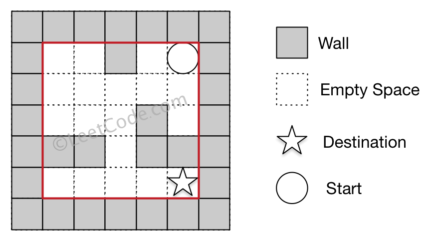

==== 神奇字符串

----
A magical string S consists of only '1' and '2' and obeys the following rules:

The string S is magical because concatenating the number of contiguous occurrences of characters '1' and '2' generates the string S itself.

The first few elements of string S is the following: S = "1221121221221121122……"

If we group the consecutive '1's and '2's in S, it will be:

1 22 11 2 1 22 1 22 11 2 11 22 ......

and the occurrences of '1's or '2's in each group are:

1 2 2 1 1 2 1 2 2 1 2 2 ......

You can see that the occurrence sequence above is the S itself.

Given an integer N as input, return the number of '1's in the first N number in the magical string S.

Note: N will not exceed 100,000.
----

这道题介绍了一种神奇字符串，只由1和2组成，通过计数1组和2组的个数，又能生成相同的字符串。而让我们求前n个数字中1的个数说白了其实就是让我们按规律生成这个神奇字符串，只有生成了字符串的前n个字符，才能统计出1的个数。其实这道题的难点就是在于找到规律来生成字符串，这里我们就直接说规律了，因为博主也没有自己找到，都是看了网上大神们的解法。根据第三个数字2开始往后生成数字，此时生成两个1，然后根据第四个数字1，生成一个2，再根据第五个数字1，生成一个1，以此类推，生成的数字1或2可能通过异或3来交替生成，在生成的过程中同时统计1的个数即可，参见代码如下： +

**解法1:** +
[source, cpp, linenums]
----
class Solution {
public:
    int magicalString(int n) {
        if (n <= 0) return 0;
        if (n <= 3) return 1;
        int res = 1, head = 2, tail = 3, num = 1;
        vector<int> v{1, 2, 2};
        while (tail < n) {
            for (int i = 0; i < v[head]; ++i) {
                v.push_back(num);
                if (num == 1 && tail < n) ++res;
                ++tail;
            }
            num ^= 3;
            ++head;
        }
        return res;
    }
};
----
下面这种解法的思路跟上面一样，但是写法上面大大的简洁了，感觉很叼！ +

**解法2:** +
[source, cpp, linenums]
----
class Solution {
public:
    int magicalString(int n) {
        string s = "122";
        int i = 2;
        while (s.size() < n) {
            s += string(s[i++] - '0', s.back() ^ 3);
        }
        return count(s.begin(), s.begin() + n, '1');
    }
};
----

==== 注册码格式化

----
Now you are given a string S, which represents a software license key which we would like to format. The string S is composed of alphanumerical characters and dashes. The dashes split the alphanumerical characters within the string into groups. (i.e. if there are M dashes, the string is split into M+1 groups). The dashes in the given string are possibly misplaced.

We want each group of characters to be of length K (except for possibly the first group, which could be shorter, but still must contain at least one character). To satisfy this requirement, we will reinsert dashes. Additionally, all the lower case letters in the string must be converted to upper case.

So, you are given a non-empty string S, representing a license key to format, and an integer K. And you need to return the license key formatted according to the description above.
----

这道题让我们对注册码进行格式化，正确的注册码的格式是每四个字符后面跟一个短杠，每一部分的长度为K，第一部分长度可以小于K，另外，字母必须是大写的。那么由于第一部分可以不为K，那么我们可以反过来想，我们从S的尾部往前遍历，把字符加入结果res，每K个后面加一个短杠，那么最后遍历完再把res翻转一下即可，注意翻转之前要把结尾的短杠去掉(如果有的话)，参见代码如下： +

**解法1:** +
[source, cpp, linenums]
----
class Solution {
public:
    string licenseKeyFormatting(string S, int K) {
        string res = "";
        int cnt = 0, n = S.size();
        for (int i = n - 1; i >= 0; --i) {
            char c = S[i];
            if (c == '-') continue;
            if (c >= 'a' && c <= 'z') c -= 32;
            res.push_back(c);
            if (++cnt % K == 0) res.push_back('-');
        }
        if (!res.empty() && res.back() == '-') res.pop_back();
        return string(res.rbegin(), res.rend());
    }
};
----

上面代码可以进一步精简到下面这种，我们用到了自带函数toupper，把字母转为大写格式，参见代码如下： +

**解法2:** +
[source, cpp, linenums]
----
class Solution {
public:
    string licenseKeyFormatting(string S, int K) {
        string res = "";
        for (int i = (int)S.size() - 1; i >= 0; --i) {
            if (S[i] != '-') {
                ((res.size() % (K + 1) - K) ? res : res += '-') += toupper(S[i]);
            }
        }
        return string(res.rbegin(), res.rend());
    }
};
----

==== 最小的好基数

----
For an integer n, we call k>=2 a good base of n, if all digits of n base k are 1.

Now given a string representing n, you should return the smallest good base of n in string format.

Example 1:
Input: "13"
Output: "3"
Explanation: 13 base 3 is 111.
----

----
这道题让我们求最小的好基数，定义了一个大于等于2的基数k，如果可以把数字n转化为各位都是1的数，那么就称这个基数k是好基数。通过看题目中的三个例子，应该大致可以理解题意了吧。如果我们用k表示基数，m表示转为全1数字的位数，那么数字n就可以拆分为：

n = 1 + k + k^2 + k^3 + ... + k^(m-1)

这是一个等比数列，中学数学的内容吧，利用求和公式可以表示为 n = (k^m - 1) / (k - 1)。我们的目标是求最小的k，那么仔细观察这个式子，在n恒定的情况，k越小则m却大，那么就是说上面的等式越长越好。下面我们来分析m的取值范围，题目中给了n的范围，是[3, 10^18]。那么由于k至少为2，n至少为3，那么肯定至少有两项，则m>=2。那么m的上限该如何求？其实也不难，想要m最大，那么k就要最小，k最小是2，那么m最大只能为log2(n + 1)，数字n用二进制表示的时候可拆分出的项最多。但这道题要求变换后的数各位都是1，那么我们看题目中最后一个例子，可以发现，当k=n-1时，一定能变成11，所以实在找不到更小的情况下就返回n-1。

下面我们来确定k的范围，由于k至少为2，那么我们可以根据下面这个不等式来求k的上限：

n = 1 + k + k^2 + k^3 + ... + k^(m-1) > k^(m-1)

解出k < n^(1 / (m-1))，其实我们也可以可以通过n < k^m - 1 来求出k的准确的下限，但由于是二分查找法，下限直接使用2也没啥问题。分析到这里，那么解法应该已经跃然纸上了，我们遍历所有可能的m值，然后利用二分查找法来确定k的值，对每一个k值，我们通过联合m值算出总和sum，然后跟n来对比即可，参见代码如下：
----

[source, cpp, linenums]
----
class Solution {
public:
    string smallestGoodBase(string n) {
        long long num = stol(n);
        for (int i = log(num + 1) / log(2); i >= 2; --i) {
            long long left = 2, right = pow(num, 1.0 / (i - 1)) + 1;
            while (left < right) {
                long long mid = left + (right - left) / 2, sum = 0;
                for (int j = 0; j < i; ++j) {
                    sum = sum * mid + 1;
                }
                if (sum == num) return to_string(mid);
                else if (sum < num) left = mid + 1;
                else right = mid;
            }
        }
        return to_string(num - 1);
    }
};
----

==== 找全排列

----
By now, you are given a secret signature consisting of character 'D' and 'I'. 'D' represents a decreasing relationship between two numbers, 'I' represents an increasing relationship between two numbers. And our secret signature was constructed by a special integer array, which contains uniquely all the different number from 1 to n (n is the length of the secret signature plus 1). For example, the secret signature "DI" can be constructed by array [2,1,3] or [3,1,2], but won't be constructed by array [3,2,4] or [2,1,3,4], which are both illegal constructing special string that can't represent the "DI" secret signature.

On the other hand, now your job is to find the lexicographically smallest permutation of [1, 2, ... n] could refer to the given secret signature in the input
----

----
这道题给了我们一个由D和I两个字符组成的字符串，分别表示对应位置的升序和降序，要我们根据这个字符串生成对应的数字字符串。由于受名字中的permutation的影响，感觉做法应该是找出所有的全排列然后逐个数字验证，这种方法十有八九无法通过OJ。其实这题用贪婪算法最为简单，我们来看一个例子：

D D I I D I

1 2 3 4 5 6 7

3 2 1 4 6 5 7

我们不难看出，只有D对应的位置附近的数字才需要变换，而且变换方法就是倒置一下字符串，我们要做的就是通过D的位置来确定需要倒置的子字符串的起始位置和长度即可。通过观察，我们需要记录D的起始位置i，还有D的连续个数k，那么我们只需要在数组中倒置[i, i+k]之间的数字即可，根据上述思路可以写出代码如下：
----

**解法1:** +
[source, cpp, linenums]
----
class Solution {
public:
    vector<int> findPermutation(string s) {
        int n = s.size(), cnt = 0;
        vector<int> res(n + 1);
        for (int i = 0; i < n + 1; ++i) res[i] = i + 1;
        for (int i = 0; i < n; ++i) {
            if (s[i] == 'D') {
                int j = i;
                while (s[i] == 'D' && i < n) ++i;
                reverse(res.begin() + j, res.begin() + i + 1);
                --i;
            } else {
                cnt = 0;
            }
        }
        return res;
    }
};
----

下面这种方法没有用到数组倒置，而是根据情况来往结果res中加入正确顺序的数字，我们遍历s字符串，遇到D直接跳过，遇到I进行处理，我们每次先记录下结果res的长度size，然后从i+1的位置开始往size遍历，将数字加入结果res中即可，参见代码如下： +

**解法2:** +
[source, cpp, linenums]
----
class Solution {
public:
    vector<int> findPermutation(string s) {
        vector<int> res;
        for (int i = 0; i < s.size() + 1; ++i) {
            if (i == s.size() || s[i] == 'I') {
                int size = res.size();
                for (int j = i + 1; j > size; --j) {
                    res.push_back(j);
                }
            }
        }
        return res;
    }
};
----

==== 最大连续1的个数

----
Given a binary array, find the maximum number of consecutive 1s in this array.

Example 1:
Input: [1,1,0,1,1,1]
Output: 3
Explanation: The first two digits or the last three digits are consecutive 1s.
    The maximum number of consecutive 1s is 3.
----

这道题让我们求最大连续1的个数，不是一道难题。我们可以遍历一遍数组，用一个计数器cnt来统计1的个数，方法是如果当前数字为0，那么cnt重置为0，如果不是0，cnt自增1，然后每次更新结果res即可，参见代码如下： +

**解法1:** +
[source, cpp, linenums]
----
class Solution {
public:
    int findMaxConsecutiveOnes(vector<int>& nums) {
        int res = 0, cnt = 0;
        for (int num : nums) {
            cnt = (num == 0) ? 0 : cnt + 1;
            res = max(res, cnt);
        }
        return res;
    }
};
----

由于是个二进制数组，所以数组中的数字只能是0或1，那么连续1的和跟个数相等，所以我们可以计算和，通过加上num，再乘以num来计算，如果当前数字是0，那么sum就被重置为0，还是要更新结果res，参见代码如下： +

**解法2:** +
[source, cpp, linenums]
----
class Solution {
public:
    int findMaxConsecutiveOnes(vector<int>& nums) {
        int res = 0, sum = 0;
        for (int num : nums) {
            sum = (sum + num) * num;
            res = max(res, sum);
        }
        return res;
    }
};
----

==== 预测赢家

----
Given an array of scores that are non-negative integers. Player 1 picks one of the numbers from either end of the array followed by the player 2 and then player 1 and so on. Each time a player picks a number, that number will not be available for the next player. This continues until all the scores have been chosen. The player with the maximum score wins.

Given an array of scores, predict whether player 1 is the winner. You can assume each player plays to maximize his score.
----

这道题给了一个小游戏，有一个数组，两个玩家轮流取数，说明了只能从开头或结尾取，问我们第一个玩家能赢吗。这道题我想到了应该是用Minimax来做，由于之前有过一道这样的题Guess Number Higher or Lower II，所以依稀记得应该要用递归的方法，而且当前玩家赢返回true的条件就是递归调用下一个玩家输返回false。我们需要一个变量来标记当前是第几个玩家，还需要两个变量来分别记录两个玩家的当前数字和，在递归函数里面，如果当前数组为空了，我们直接比较两个玩家的当前得分即可，如果数组中只有一个数字了，我们根据玩家标识来将这个数字加给某个玩家并进行比较总得分。如果数组有多个数字，我们分别生成两个新数组，一个是去掉首元素，一个是去掉尾元素，然后根据玩家标识分别调用不同的递归，只要下一个玩家两种情况中任意一种返回false了，那么当前玩家就可以赢了，参见代码如下： +

**解法1:** +
[source, cpp, linenums]
----
class Solution {
public:
    bool PredictTheWinner(vector<int>& nums) {
        return canWin(nums, 0, 0, 1);
    }
    bool canWin(vector<int> nums, int sum1, int sum2, int player) {
        if (nums.empty()) return sum1 >= sum2;
        if (nums.size() == 1) {
            if (player == 1) return sum1 + nums[0] >= sum2;
            else if (player == 2) return sum2 + nums[0] > sum1;
        }
        vector<int> va = vector<int>(nums.begin() + 1, nums.end());
        vector<int> vb = vector<int>(nums.begin(), nums.end() - 1);
        if (player == 1) {
            return !canWin(va, sum1 + nums[0], sum2, 2) || !canWin(vb, sum1 + nums.back(), sum2, 2);
        } else if (player == 2) {
            return !canWin(va, sum1, sum2 + nums[0], 1) || !canWin(vb, sum1, sum2 + nums.back(), 1);
        }
    }
};
----

我们还可以使用DP加Minimax的方法来做，先来看递归的写法，十分的简洁。DP数组的作用是保存中间结果，再次遇到相同情况时直接返回不用再次计算，提高了运算效率： +

**解法2:** +
[source, cpp, linenums]
----
class Solution {
public:
    bool PredictTheWinner(vector<int>& nums) {
        int n = nums.size();
        vector<vector<int>> dp(n, vector<int>(n, -1));
        return canWin(nums, 0, n - 1, dp) >= 0;
    }
    int canWin(vector<int>& nums, int s, int e, vector<vector<int>>& dp) {
        if (dp[s][e] == -1) {
            dp[s][e] = (s == e) ? nums[s] : max(nums[s] - canWin(nums, s + 1, e, dp), nums[e] - canWin(nums, s, e - 1, dp));
        }
        return dp[s][e];
    }
};
----

下面这种方法是DP加Minimax的递归写法，要注意的是DP的更新顺序，跟以往不太一样，这种更新方法是按区间来更新的，感觉之前好像没有遇到过这种更新的方法，还蛮特别的： +

**解法3:** +
[source, cpp, linenums]
----
class Solution {
public:
    bool PredictTheWinner(vector<int>& nums) {
        int n = nums.size();
        vector<vector<int>> dp(n, vector<int>(n, 0));
        for (int i = 0; i < n; ++i) dp[i][i] = nums[i];
        for (int len = 1; len < n; ++len) {
            for (int i = 0, j = len; j < n; ++i, ++j) {
                dp[i][j] = max(nums[i] - dp[i + 1][j], nums[j] - dp[i][j - 1]);
            }
        }
        return dp[0][n - 1] >= 0;
    }
};
----

==== 最大连续1的个数之二

----
Given a binary array, find the maximum number of consecutive 1s in this array if you can flip at most one 0.

Example 1:

Input: [1,0,1,1,0]
Output: 4
Explanation: Flip the first zero will get the the maximum number of consecutive 1s.
    After flipping, the maximum number of consecutive 1s is 4.
----

这道题在之前那道题Max Consecutive Ones的基础上加了一个条件，说我们有一次将0翻转成1的机会，问此时最大连续1的个数，再看看follow up中的说明，很明显是让我们只遍历一次数组，那我们想，肯定需要用一个变量cnt来记录连续1的个数吧，那么当遇到了0的时候怎么处理呢，因为我们有一次0变1的机会，所以我们遇到0了还是要累加cnt，然后我们此时需要用另外一个变量cur来保存当前cnt的值，然后cnt重置为0，以便于让cnt一直用来统计纯连续1的个数，然后我们每次都用用cnt+cur来更新结果res，参见代码如下： +

**解法1:** +
[source,cpp,linenums]
----
class Solution {
public:
    int findMaxConsecutiveOnes(vector<int>& nums) {
        int res = 0, cur = 0, cnt = 0;
        for (int num : nums) {
            ++cnt;
            if (num == 0) {
                cur = cnt;
                cnt = 0;
            }
            res = max(res, cnt + cur);
        }
        return res;
    }
};
----

上面的方法有局限性，如果题目中说能翻转k次怎么办呢，我们最好用一个通解来处理这类问题。我们可以维护一个窗口[left,right]来容纳至少k个0。我们遇到了0，就累加zero的个数，然后判断如果此时0的个数大于k，那么我们我们右移左边界left，如果移除掉的nums[left]为0，那么我们zero自减1。如果不大于k，那么我们用窗口中数字的个数来更新res，参见代码如下： +

**解法2:** +
[source, cpp, linenums]
----
class Solution {
public:
    int findMaxConsecutiveOnes(vector<int>& nums) {
        int res = 0, zero = 0, left = 0, k = 1;
        for (int right = 0; right < nums.size(); ++right) {
            if (nums[right] == 0) ++zero;
            while (zero > k) {
                if (nums[left++] == 0) --zero;
            }
            res = max(res, right - left + 1);
        }
        return res;
    }
};
----

上面那种方法对于follow up中的情况无法使用，因为nums[left]需要访问之前的数字。我们可以将遇到的0的位置全都保存下来，这样我们需要移动left的时候就知道移到哪里了： +

**解法3:** +
[source, cpp, linenums]
----
class Solution {
public:
    int findMaxConsecutiveOnes(vector<int>& nums) {
        int res = 0, left = 0, k = 1;
        queue<int> q;
        for (int right = 0; right < nums.size(); ++right) {
            if (nums[right] == 0) q.push(right);
            if (q.size() > k) {
                left = q.front() + 1; q.pop();
            }
            res = max(res, right - left + 1);
        }
        return res;
    }
};
----

==== 祖玛游戏
----
Think about Zuma Game. You have a row of balls on the table, colored red(R), yellow(Y), blue(B), green(G), and white(W). You also have several balls in your hand.

Each time, you may choose a ball in your hand, and insert it into the row (including the leftmost place and rightmost place). Then, if there is a group of 3 or more balls in the same color touching, remove these balls. Keep doing this until no more balls can be removed.

Find the minimal balls you have to insert to remove all the balls on the table. If you cannot remove all the balls, output -1.
----

这道题说的就是著名的祖玛游戏了，让我想起了以前玩过的泡泡龙，也是一种祖玛游戏，在QQ上也有泡泡龙的游戏，还可以使用各种道具害其他玩家，相当有趣。那么这道题是一种简化版的祖玛游戏，只是一个一维数组，而且通过限定桌面上的球不超过20个，手里的球不超过5个来降低来难度，貌似是在暗示我们可以用暴力搜索法来做。这道题比较使用递归的方法来做，通过遍历所有可能的情况来找出最优解，题目希望我们用最少的球来消掉桌上所有的球，如果不能完全消掉，返回-1。我们使用哈希表来统计手中每种球的个数，然后我们遍历桌上的球，我们找连续相同球的个数，在没有可以消除的情况下，连续的个数只能是1个或2个，然后我们用3减去连续个数，就是我们需要补充的球数以使其可以被消除，那么我们在哈希表表中看我们手中的该类型的球够不够，如果够就表示可以消除，我们在哈希表中减去需要使用掉的球数，然后将消掉的球移除，对新的字符串调用递归，如果可以成功消除，会返回一个结果，该结果加上之前需要的球数用来更新结果res，注意调用完递归要恢复哈希表的状态。还有就是在刚进入递归函数时，我们要检测字符串，去除连续3个相同球的情况，这个去除函数也是个递归函数，写起来很简洁，但是很强大，参见代码如下： +

**解法1:** +
[source, cpp, linenums]
----
class Solution {
public:
    int findMinStep(string board, string hand) {
        int res = INT_MAX;
        unordered_map<char, int> m;
        for (char c : hand) ++m[c];
        res = helper(board, m);
        return res == INT_MAX ? -1 : res;
    }
    int helper(string board, unordered_map<char, int>& m) {
        board = removeConsecutive(board);
        if (board.empty()) return 0;
        int cnt = INT_MAX, j = 0;
        for (int i = 0; i <= board.size(); ++i) {
            if (i < board.size() && board[i] == board[j]) continue;
            int need = 3 - (i - j);
            if (m[board[j]] >= need) {
                m[board[j]] -= need;
                int t = helper(board.substr(0, j) + board.substr(i), m);
                if (t != INT_MAX) cnt = min(cnt, t + need);
                m[board[j]] += need;
            }
            j = i;
        }
        return cnt;
    }
    string removeConsecutive(string board) {
        for (int i = 0, j = 0; i <= board.size(); ++i) {
            if (i < board.size() && board[i] == board[j]) continue;
            if (i - j >= 3) return removeConsecutive(board.substr(0, j) + board.substr(i));
            else j = i;
        }
        return board;
    }
};
----

下面这种解法也是递归解法，但是思路和上面略有不同，这里我们不使用哈希表，而是使用一个集合，我们遍历手中的所有小球，如果某个小球已经在集合中存在了，说明我们已经处理过该小球了，直接跳过，否则就将该小球加入集合中。然后我们遍历桌上的小球，寻找和当前手中小球一样的位置，然后将手中小球加入当前位置，调用去除重复3个小球的函数，如果此时字符串为0了，说明当前桌上小球已经完全消掉了，返回1，因为我们此时只使用了一个小球；否则就将手中的当前小球去掉，对新的桌面和剩余手中的小球调用递归，如果得到的结果不是-1，我们用此结果加1来更新结果res，参见代码如下： +

**解法2:** +
[source, cpp, linenums]
----
class Solution {
public:
    int findMinStep(string board, string hand) {
        int res = INT_MAX;
        unordered_set<char> s;
        for (int i = 0; i < hand.size(); ++i) {
            if (s.count(hand[i])) continue;
            s.insert(hand[i]);
            for (int j = 0; j < board.size(); ++j) {
                if (board[j] != hand[i]) continue;
                string newBoard = board, newHand = hand;
                newBoard.insert(j, 1, hand[i]);
                newBoard = removeConsecutive(newBoard);
                if (newBoard.size() == 0) return 1;
                newHand.erase(i, 1);
                int cnt = findMinStep(newBoard, newHand);
                if (cnt != -1) res = min(res, cnt + 1);
            }
        }
        return res == INT_MAX ? -1 : res;
    }
    string removeConsecutive(string board) {
        for (int i = 0, j = 0; i <= board.size(); ++i) {
            if (i < board.size() && board[i] == board[j]) continue;
            if (i - j >= 3) return removeConsecutive(board.substr(0, j) + board.substr(i));
            else j = i;
        }
        return board;
    }
};
----

==== Robot Room Cleaner

[source, cpp, linenums]
----
class Solution {
public:
    void cleanRoom(Robot& robot) {
        unordered_set<string> visited;
        vector<pair<int, int> > dirs = {{-1, 0}, {0, -1}, {1, 0}, {0, 1}};
        int d = 0; // 0: up, 1: left, 2: down, 3: right
        dfs (robot, visited, d, 1, 3, dirs);
    }
    void dfs(Robot& robot, unordered_set<string>& visited, int d, int i, int j, vector<pair<int, int> >& dirs) {
        string cur_pos = to_string(i) + "," + to_string(j);
        if (visited.count(cur_pos))
            return;
        visited.insert(cur_pos);
        robot.clean();
        for (int k = 0; k < 4; k++) {
            if (robot.move()) {
                int next_i = i + dirs[d].first;
                int next_j = j + dirs[d].second;
                dfs (robot, visited, d, next_i, next_j, dirs);
                // go back to starting position!
                robot.turnLeft();
                robot.turnLeft();
                robot.move();
                robot.turnRight();
                robot.turnRight();
            } // if
            // turn to next direction
            robot.turnLeft();
            d = (d + 1) % 4;
        }
    }
};
----

==== 迷宫

----
There is a ball in a maze with empty spaces and walls. The ball can go through empty spaces by rolling up, down, left or right, but it won't stop rolling until hitting a wall. When the ball stops, it could choose the next direction.

Given the ball's start position, the destination and the maze, determine whether the ball could stop at the destination.

The maze is represented by a binary 2D array. 1 means the wall and 0 means the empty space. You may assume that the borders of the maze are all walls. The start and destination coordinates are represented by row and column indexes.

Example 1

Input 1: a maze represented by a 2D array

0 0 1 0 0
0 0 0 0 0
0 0 0 1 0
1 1 0 1 1
0 0 0 0 0

Input 2: start coordinate (rowStart, colStart) = (0, 4)
Input 3: destination coordinate (rowDest, colDest) = (4, 4)

Output: true
Explanation: One possible way is : left -> down -> left -> down -> right -> down -> right.
----

这道题让我们遍历迷宫，但是与以往不同的是，这次迷宫是有一个滚动的小球，这样就不是每次只走一步了，而是朝某一个方向一直滚，直到遇到墙或者边缘才停下来，我记得貌似之前在手机上玩过类似的游戏。那么其实还是要用DFS或者BFS来解，只不过需要做一些修改。先来看DFS的解法，我们用DFS的同时最好能用上优化，即记录中间的结果，这样可以避免重复运算，提高效率。我们用二维数组dp来保存中间结果，然后用maze数组本身通过将0改为-1来记录某个点是否被访问过，这道题的难点是在于处理一直滚的情况，其实也不难，只要我们有了方向，只要一直在那个方向上往前走，每次判读是否越界了或者是否遇到墙了即可，然后对于新位置继续调用递归函数，参见代码如下： +

**解法1:** +
[source, cpp, linenums]
----
class Solution {
public:
    vector<vector<int>> dirs{{0,-1},{-1,0},{0,1},{1,0}};
    bool hasPath(vector<vector<int>>& maze, vector<int>& start, vector<int>& destination) {
        if (maze.empty() || maze[0].empty()) return true;
        int m = maze.size(), n = maze[0].size();
        vector<vector<int>> dp(m, vector<int>(n, -1));
        return helper(maze, dp, start[0], start[1], destination[0], destination[1]);
    }
    bool helper(vector<vector<int>>& maze, vector<vector<int>>& dp, int i, int j, int di, int dj) {
        if (i == di && j == dj) return true;
        if (dp[i][j] != -1) return dp[i][j];
        bool res = false;
        int m = maze.size(), n = maze[0].size();
        maze[i][j] = -1;
        for (auto dir : dirs) {
            int x = i, y = j;
            while (x >= 0 && x < m && y >= 0 && y < n && maze[x][y] != 1) {
                x += dir[0]; y += dir[1];
            }
            x -= dir[0]; y -= dir[1];
            if (maze[x][y] != -1) {
                res |= helper(maze, dp, x, y, di, dj);
            }
        }
        dp[i][j] = res;
        return res;
    }
};
----

同样的道理，对于BFS的实现需要用到队列queue，在对于一直滚的处理跟上面相同，参见代码如下： +

**解法2:** +
[source, cpp, linenums]
----
class Solution {
public:
    bool hasPath(vector<vector<int>>& maze, vector<int>& start, vector<int>& destination) {
        if (maze.empty() || maze[0].empty()) return true;
        int m = maze.size(), n = maze[0].size();
        vector<vector<bool>> visited(m, vector<bool>(n, false));
        vector<vector<int>> dirs{{0,-1},{-1,0},{0,1},{1,0}};
        queue<pair<int, int>> q;
        q.push({start[0], start[1]});
        visited[start[0]][start[1]] = true;
        while (!q.empty()) {
            auto t = q.front(); q.pop();
            if (t.first == destination[0] && t.second == destination[1]) return true;
            for (auto dir : dirs) {
                int x = t.first, y = t.second;
                while (x >= 0 && x < m && y >= 0 && y < n && maze[x][y] == 0) {
                    x += dir[0]; y += dir[1];
                }
                x -= dir[0]; y -= dir[1];
                if (!visited[x][y]) {
                    visited[x][y] = true;
                    q.push({x, y});
                }
            }
        }
        return false;
    }
};
----

==== 递增子序列

----
Given an integer array, your task is to find all the different possible increasing subsequences of the given array, and the length of an increasing subsequence should be at least 2 .

Example:

Input: [4, 6, 7, 7]
Output: [[4, 6], [4, 7], [4, 6, 7], [4, 6, 7, 7], [6, 7], [6, 7, 7], [7,7], [4,7,7]]
----

这道题让我们找出所有的递增子序列，那么我们应该不难想到，这题肯定是要先找出所有的子序列，从中找出递增的。找出所有的子序列的题我们之前也接触过Subsets和Subsets II，那两题不同之处在于数组中有没有重复项。而这道题明显是有重复项的，所以需要用到Subsets II中的解法。我们首先来看一种迭代的解法，对于重复项的处理，最偷懒的方法是使用set，利用其自动去处重复项的机制，然后最后返回时再转回vector即可。由于是找递增序列，所以我们需要对递归函数做一些修改，首先题目中说明了递归序列数字至少两个，所以只有当当前子序列个数大于等于2时，才加入结果。然后就是要递增，如果之前的数字大于当前的数字，那么跳过这种情况，继续循环，参见代码如下： +

**解法1:** +
[source, cpp, linenums]
----
class Solution {
public:
    vector<vector<int>> findSubsequences(vector<int>& nums) {
        set<vector<int>> res;
        vector<int> out;
        helper(nums, 0, out, res);
        return vector<vector<int>>(res.begin(), res.end());
    }
    void helper(vector<int>& nums, int start, vector<int>& out, set<vector<int>>& res) {
        if (out.size() >= 2) res.insert(out);
        for (int i = start; i < nums.size(); ++i) {
            if (!out.empty() && out.back() > nums[i]) continue;
            out.push_back(nums[i]);
            helper(nums, i + 1, out, res);
            out.pop_back();
        }
    }
};
----

我们也可以在递归中进行去重复处理，方法是用一个set保存中间过程的数字，如果当前的数字在之前出现过了，就直接跳过这种情况即可，参见代码如下： +

**解法2:** +
[source, cpp, linenums]
----
class Solution {
public:
    vector<vector<int>> findSubsequences(vector<int>& nums) {
        vector<vector<int>> res;
        vector<int> out;
        helper(nums, 0, out, res);
        return res;
    }
    void helper(vector<int>& nums, int start, vector<int>& out, vector<vector<int>>& res) {
        if (out.size() >= 2) res.push_back(out);
        unordered_set<int> st;
        for (int i = start; i < nums.size(); ++i) {
            if (!out.empty() && out.back() > nums[i] || st.count(nums[i])) continue;
            out.push_back(nums[i]);
            st.insert(nums[i]);
            helper(nums, i + 1, out, res);
            out.pop_back();
        }
    }
};
----

下面我们来看迭代的解法，还是老套路，先看偷懒的方法，用set来去处重复。对于递归的处理方法跟之前相同，参见代码如下： +

**解法3:** +
[source, cpp, linenums]
----
class Solution {
public:
    vector<vector<int>> findSubsequences(vector<int>& nums) {
        set<vector<int>> res;
        vector<vector<int>> cur(1);
        for (int i = 0; i < nums.size(); ++i) {
            int n = cur.size();
            for (int j = 0; j < n; ++j) {
                if (!cur[j].empty() && cur[j].back() > nums[i]) continue;
                cur.push_back(cur[j]);
                cur.back().push_back(nums[i]);
                if (cur.back().size() >= 2) res.insert(cur.back());
            }
        }
        return vector<vector<int>>(res.begin(), res.end());
    }
};
----

我们来看不用set的方法，使用一个哈希表来建立每个数字对应的遍历起始位置，默认都是0，然后在遍历的时候先取出原有值当作遍历起始点，然后更新为当前位置，如果某个数字之前出现过，那么取出的原有值就不是0，而是之前那个数的出现位置，这样就就不会产生重复了，如果不太好理解的话就带个简单的实例去试试吧，参见代码如下： +

**解法4:** +
[source, cpp, linenums]
----
class Solution {
public:
    vector<vector<int>> findSubsequences(vector<int>& nums) {
        vector<vector<int>> res, cur(1);
        unordered_map<int, int> m;
        for (int i = 0; i < nums.size(); ++i) {
            int n = cur.size();
            int start = m[nums[i]];
            m[nums[i]] = n;
            for (int j = start; j < n; ++j) {
                if (!cur[j].empty() && cur[j].back() > nums[i]) continue;
                cur.push_back(cur[j]);
                cur.back().push_back(nums[i]);
                if (cur.back().size() >= 2) res.push_back(cur.back());
            }
        }
        return res;
    }
};
----

==== 构建矩形

----
For a web developer, it is very important to know how to design a web page's size. So, given a specific rectangular web page’s area, your job by now is to design a rectangular web page, whose length L and width W satisfy the following requirements:

1. The area of the rectangular web page you designed must equal to the given target area.

2. The width W should not be larger than the length L, which means L >= W.

3. The difference between length L and width W should be as small as possible.
You need to output the length L and the width W of the web page you designed in sequence.
----

这道题让我们根据面积来求出矩形的长和宽，要求长和宽的差距尽量的小，那么就是说越接近正方形越好。那么我们肯定是先来判断一下是不是正方行，对面积开方，如果得到的不是整数，说明不是正方形。那么我们取最近的一个整数，看此时能不能整除，如果不行，就自减1，再看能否整除。最坏的情况就是面积是质数，最后减到了1，那么返回结果即可，参见代码如下： +

**解法1:** +
[source, cpp, linenums]
----
class Solution {
public:
    vector<int> constructRectangle(int area) {
        int r = sqrt(area);
        while (area % r != 0) --r;
        return {area / r, r};
    }
};
----

如果我们不想用开方运算sqrt的话，那就从1开始，看能不能整除，循环的终止条件是看平方值是否小于等于面积，参见代码如下： +

**解法2:** +
[source, cpp, linenums]
----
class Solution {
public:
    vector<int> constructRectangle(int area) {
        int r = 1;
        for (int i = 1; i * i <= area; ++i) {
            if (area % i == 0) r = i;
        }
        return {area / r, r};
    }
};
----

==== 翻转对

----
Given an array nums, we call (i, j) an important reverse pair if i < j and nums[i] > 2*nums[j].

You need to return the number of important reverse pairs in the given array.

Example1:

Input: [1,3,2,3,1]
Output: 2
----

这道题第一次做的时候就感觉和Count of Smaller Numbers After Self很像，开始也是用的二分查找法来建立有序数组，LintCode上也有一道非常类似的题Reverse Pairs 翻转对，虽然那道题没有加2倍的限制条件，但是思路都是一样的。于是我就开始稍稍改了一下，二分搜索的时候是搜索nums[i]/2.0，加入数组的时候是加入原数num，我记得当时是可以通过OJ的，但是后来OJ变的严格起来了，什么二分搜索啊，BST啊之类的解法统统弄死，据目前来看，侥幸存活下来的方法就只有BIT和MergeSort这两种方法了。对于这类问题的本质的分析，大神fun4LeetCode的帖子讲的非常好，这里也借鉴一下大神的讲解来帮助理解吧。 +

对于这类数组找数字之间的关系的题，一种很好的解题思路就是拆分数组来解决子问题，就是把大问题拆成小问题，把小问题一一解决来，大问题的答案也就出来了，这么说起来是不是有点像DP的感觉，但是不同的是，博主感觉此类问题很难找到DP的递推公式吧。fun4LeetCode大神归纳了两种拆分方法，一种叫顺序重现关系(Sequential Recurrence Relation)，用式子表示是T(i, j) = T(i, j - 1) + C。这里的C就是处理最后一个数字的子问题，那么用文字来描述就是“已知翻转对的第二个数字为nums[j], 在子数组nums[i, j - 1]中找翻转对的第一个数字”，这里翻转对的两个条件中的顺序条件已经满足，就只需要找比2*nums[j]大的数即可。当然最森破的方法就是线性扫描，但这样整个时间复杂度就会上升到令人发指的O(n2)，这又怎么能逃过连Binary Search都不放过的OJ的魔爪。由于二分搜索和BST等方法已经被OJ阉割，所以我们只能用树状数组Binary Indexed Tree来做了。关于BIT，我之前有篇博客Range Sum Query - Mutable 应该讲的比较清楚了，如果弄懂了那篇博客，我们对BIT的机制也应该有个基本的了解，由于BIT的存储方式不是将数组中的数字对应的一一存入，而是有的对应存入，有的是存若干个数字之和，其设计初衷之一就是要在O(lgn)的时间复杂度下完成求和运算。那么我们该如何利用这一特性呢，这跟这道题又有什么关系呢，别着急，博主会慢慢解释。 +

首先我们应该确定一个遍历的方向，这里博主推荐从后往前遍历数组，这样做的好处是对于当前遍历到的数字，在已遍历过的数字中找小于当前数字的一半(nums[i]/2.0)的数字，这样的遍历方向也能跟上面的顺序重现关系的定义式统一起来。当然如果你想强行从前往后遍历，也不是不行，那么就需要在已遍历的数字中找大于当前数字的二倍(nums[i]*2)的数字就行了。由于我们要在之前遍历过的数字中找符合条件的数字，怎么样利用BIT的特性来快速的找到是这种解法的最大难点。我们需要将之前遍历过的数字存入BIT中，怎么存是难点。由于之前那篇博客我们知道BIT用update函数来存数，需要提供要存入的位置和要存入的数字这两个参数，那么这里难道我们就按照数字在原数组中的位置存入BIT吗，这样做毫无意义！我们要存的是该数字在有序数组中的位置，而且存入的也不是该数字本身，而是该数字出现的次数1。我们用题目中的第一个例子来说明，我们先给数组排序，得到： +

1 1 2 3 3 +

对于每一个数字我们要确定其在BIT中的位置，由于有重复数字的存在，那么每个数字对应的位置就是其最后出现的位置，而且因为BIT是从1开始的，并不是像一般的数组那样从0开始，那么有如下对应关系： +

1->2, 2->3, 3->5 +

那么当我们遇到数字1了，就update(2,1)，遇到数字2了，就update(3,1)，遇到数字3了，就update(5,1)。我们之前解释了并不把数字本身存入BIT，而是将其对应的位置存入BIT，真正存入的数字是1，这样方便累加，而且由于1是固定的，在下面的代码中就不用将1当作函数的参数了。这样我们知道了如果存入数字，那么我们在遍历到新数字时，为了得到符合要求的数字的个数，需利用BIT的getSum函数。getSum函数需要提供一个位置参数，可以返回该位置之前的所有数之和。同理，我们提供的参数既不是当前遍历到的数字本身，也不是其在原数组中的位置，而是该数字的一半(nums[i]/2.0)在有序数组中的正确位置，可以用lower_bound函数来找第一个不小于目标值的位置，当然我们也可以自己写个二分搜索的子函数来代替lower_bound函数。比如我们当前遍历到的数字是3，那么我们在有序数组中找1.5的位置，返回是2，此时我们在BIT中用getSum来返回位置2之前的数字之和，返回几就表示有几个小于1.5的数字。讲到这里基本上这种解法的核心内容都讲完了，如果你还是一头雾水，那么就是博主的表述能力的问题了(沮丧脸:()。那么博主只能建议你带实例一步一步去试，看看每一步操作后BIT中的结果是啥，下面就列出这些内容： +

----
update(2,1) -> BIT: 0 0 1 0 1 0

update(5,1) -> BIT: 0 0 1 0 1 1

update(3,1) -> BIT: 0 0 1 1 2 1

update(5,1) -> BIT: 0 0 1 1 2 2

update(2,1) -> BIT: 0 0 2 1 3 2
----

**解法1:** +
[source, cpp, linenums]
----
class Solution {
public:
    int reversePairs(vector<int>& nums) {
        int res = 0, n = nums.size();
        vector<int> v = nums, bit(n + 1);
        sort(v.begin(), v.end());
        unordered_map<int, int> m;
        for (int i = 0; i < n; ++i) m[v[i]] = i + 1;
        for (int i = n - 1; i >= 0; --i) {
            res += getSum(lower_bound(v.begin(), v.end(), nums[i] / 2.0) - v.begin(), bit);
            update(m[nums[i]], bit);
        }
        return res;
    }
    int getSum(int i, vector<int>& bit) {
        int sum = 0;
        while (i > 0) {
            sum += bit[i];
            i -= (i & -i);
        }
        return sum;
    }
    void update(int i, vector<int>& bit) {
        while (i < bit.size()) {
            bit[i] += 1;
            i += (i & -i);
        }
    }
};
----

fun4LeetCode大神归纳的第二种方法叫做分割重现关系(Partition Recurrence Relation)，用式子表示是T(i, j) = T(i, m) + T(m+1, j) + C。这里的C就是处理合并两个部分的子问题，那么用文字来描述就是“已知翻转对的两个数字分别在子数组nums[i, m]和nums[m+1, j]之中，求满足要求的翻转对的个数”，这里翻转对的两个条件中的顺序条件已经满足，就只需要找到满足大小关系的的数对即可。这里两个数字都是不确定的，如果用暴力搜索肯定会被OJ唾弃。但是如果两个子数组是有序的，那么我们可以用双指针的方法在线性时间内就可以统计出符合题意的翻转对的个数。要想办法产生有序的子数组，那么这就和MergeSort的核心思想完美匹配了。我们知道混合排序就是不断的将数组对半拆分成子数组，拆到最小的数组后开始排序，然后一层一层的返回，最后原数组也是有序的了。这里我们在混合排序的递归函数中，对于有序的两个子数组进行统计翻转对的个数，然后再逐层返回，这就完美的实现了上述的分割重现关系的思想。整个的写法非常的简洁，实在是太叼了。博主的直觉表明，fun4LeetCode大神肯定是国人，不要问我为什么，因为这么强的肯定是中国人，哈～ +

**解法2:** +
[source, cpp, linenums]
----
class Solution {
public:
    int reversePairs(vector<int>& nums) {
        return mergeSort(nums, 0, nums.size() - 1);
    }
    int mergeSort(vector<int>& nums, int left, int right) {
        if (left >= right) return 0;
        int mid = left + (right - left) / 2;
        int res = mergeSort(nums, left, mid) + mergeSort(nums, mid + 1, right);
        for (int i = left, j = mid + 1; i <= mid; ++i) {
            while (j <= right && nums[i] / 2.0 > nums[j]) ++j;
            res += j - (mid + 1);
        }
        sort(nums.begin() + left, nums.begin() + right + 1);
        return res;
    }
};
----

==== 目标和

----
You are given a list of non-negative integers, a1, a2, ..., an, and a target, S. Now you have 2 symbols + and -. For each integer, you should choose one from + and - as its new symbol.

Find out how many ways to assign symbols to make sum of integers equal to target S.
----

这道题给了我们一个数组，和一个目标值，让我们给数组中每个数字加上正号或负号，然后求和要和目标值相等，求有多少中不同的情况。那么对于这种求多种情况的问题，我最想到的方法使用递归来做。我们从第一个数字，调用递归函数，在递归函数中，分别对目标值进行加上当前数字调用递归，和减去当前数字调用递归，这样会涵盖所有情况，并且当所有数字遍历完成后，我们看若目标值为0了，则结果res自增1，参见代码如下： +

**解法1:** +
[source, cpp, linenums]
----
class Solution {
public:
    int findTargetSumWays(vector<int>& nums, int S) {
        int res = 0;
        helper(nums, S, 0, res);
        return res;
    }
    void helper(vector<int>& nums, int S, int start, int& res) {
        if (start >= nums.size()) {
            if (S == 0) ++res;
            return;
        }
        helper(nums, S - nums[start], start + 1, res);
        helper(nums, S + nums[start], start + 1, res);
    }
};
----

我们对上面的递归方法进行优化，使用dp数组来记录中间值，这样可以避免重复运算，参见代码如下： +

**解法2:** +
[source, cpp, linenums]
----

class Solution {
public:
    int findTargetSumWays(vector<int>& nums, int S) {
        vector<unordered_map<int, int>> dp(nums.size());
        return helper(nums, S, 0, dp);
    }
    int helper(vector<int>& nums, int sum, int start, vector<unordered_map<int, int>>& dp) {
        if (start == nums.size()) return sum == 0;
        if (dp[start].count(sum)) return dp[start][sum];
        int cnt1 = helper(nums, sum - nums[start], start + 1, dp);
        int cnt2 = helper(nums, sum + nums[start], start + 1, dp);
        return dp[start][sum] = cnt1 + cnt2;
    }
};
----

我们也可以使用迭代的方法来解，还是要用dp数组，其中dp[i][j]表示到第i-1个数字且和为j的情况总数，参见代码如下： +

**解法3:** +
[source, cpp, linenums]
----
class Solution {
public:
    int findTargetSumWays(vector<int>& nums, int S) {
        int n = nums.size();
        vector<unordered_map<int, int>> dp(n + 1);
        dp[0][0] = 1;
        for (int i = 0; i < n; ++i) {
            for (auto &a : dp[i]) {
                int sum = a.first, cnt = a.second;
                dp[i + 1][sum + nums[i]] += cnt;
                dp[i + 1][sum - nums[i]] += cnt;
            }
        }
        return dp[n][S];
    }
};
----

我们也可以对上面的方法进行空间上的优化，只用一个哈希表，而不是用一个数组的哈希表，我们在遍历数组中的每一个数字时，新建一个哈希表，我们在遍历原哈希表中的项时更新这个新建的哈希表，最后把新建的哈希表整个赋值和原哈希表，参见代码如下： +

**解法4:** +
[source, cpp, linenums]
----
class Solution {
public:
    int findTargetSumWays(vector<int>& nums, int S) {
        unordered_map<int, int> dp;
        dp[0] = 1;
        for (int num : nums) {
            unordered_map<int, int> t;
            for (auto a : dp) {
                int sum = a.first, cnt = a.second;
                t[sum + num] += cnt;
                t[sum - num] += cnt;
            }
            dp = t;
        }
        return dp[S];
    }
};
----

==== 提莫攻击
----
In LLP world, there is a hero called Teemo and his attacking can make his enemy Ashe be in poisoned condition. Now, given the Teemo's attacking ascending time series towards Ashe and the poisoning time duration per Teemo's attacking, you need to output the total time that Ashe is in poisoned condition.

You may assume that Teemo attacks at the very beginning of a specific time point, and makes Ashe be in poisoned condition immediately.

Example 1:

Input: [1,4], 2
Output: 4
Explanation: At time point 1, Teemo starts attacking Ashe and makes Ashe be poisoned immediately.
This poisoned status will last 2 seconds until the end of time point 2.
And at time point 4, Teemo attacks Ashe again, and causes Ashe to be in poisoned status for another 2 seconds.
So you finally need to output 4.
----

LeetCode果然花样百出，连提莫都搬上题目了，那个草丛里乱种蘑菇的小提莫，那个“团战可以输提莫必须死”的提莫？？可以，服了，坐等女枪女警轮子妈的题目了～好了，不闲扯了，其实这道题蛮简单的，感觉不能算一道medium的题，就直接使用贪心算法，比较相邻两个时间点的时间差，如果小于duration，就加上这个差，如果大于或等于，就加上duration即可，参见代码如下： +

[source, cpp, linenums]
----
class Solution {
public:
    int findPoisonedDuration(vector<int>& timeSeries, int duration) {
        if (timeSeries.empty()) return 0;
        int res = 0, n = timeSeries.size();
        for (int i = 1; i < n; ++i) {
            int diff = timeSeries[i] - timeSeries[i - 1];
            res += (diff < duration) ? diff : duration;
        }
        return res + duration;
    }
};
----

==== 下一个较大的元素之一

----
You are given two arrays (without duplicates) nums1 and nums2 where nums1’s elements are subset of nums2. Find all the next greater numbers for nums1's elements in the corresponding places of nums2.

The Next Greater Number of a number x in nums1 is the first greater number to its right in nums2. If it does not exist, output -1 for this number.
----

这道题给了我们一个数组，又给了该数组的一个子集合，让我们求集合中每个数字在原数组中右边第一个较大的数字。参考题目中给的例子，题意不难理解，既然这次难度标识为Easy，想必不是一道太难的题。二话不说，先上无脑暴力搜索，遍历子集合中的每一个数字，然后在原数组中找到这个数字，然后向右遍历，找到第一个大于该数字的数即可，参见代码如下： +

**解法1:** +
[source, cpp, linenums]
----
class Solution {
public:
    vector<int> nextGreaterElement(vector<int>& findNums, vector<int>& nums) {
        vector<int> res(findNums.size());
        for (int i = 0; i < findNums.size(); ++i) {
            int j = 0, k = 0;
            for (; j < nums.size(); ++j) {
                if (nums[j] == findNums[i]) break;
            }
            for (k = j + 1; k < nums.size(); ++k) {
                if (nums[k] > nums[j]) {
                    res[i] = nums[k];
                    break;
                }
            }
            if (k == nums.size()) res[i] = -1;
        }
        return res;
    }
};
----

我们来对上面的方法稍做优化，我们用哈希表先来建立每个数字和其坐标位置之间的映射，那么我们在遍历子集合中的数字时，就能直接定位到该数字在原数组中的位置，然后再往右边遍历寻找较大数即可，参见代码如下： +

**解法2:** +
[source, cpp, linenums]
----
class Solution {
public:
    vector<int> nextGreaterElement(vector<int>& findNums, vector<int>& nums) {
        vector<int> res(findNums.size());
        unordered_map<int, int> m;
        for (int i = 0; i < nums.size(); ++i) {
            m[nums[i]] = i;
        }
        for (int i = 0; i < findNums.size(); ++i) {
            res[i] = -1;
            int start = m[findNums[i]];
            for (int j = start + 1; j < nums.size(); ++j) {
                if (nums[j] > findNums[i]) {
                    res[i] = nums[j];
                    break;
                }
            }
        }
        return res;
    }
};
----

下面这种方法使用了哈希表和栈，但是这里的哈希表和上面的不一样，这里是建立每个数字和其右边第一个较大数之间的映射，没有的话就是-1。我们遍历原数组中的所有数字，如果此时栈不为空，且栈顶元素小于当前数字，说明当前数字就是栈顶元素的右边第一个较大数，那么建立二者的映射，并且去除当前栈顶元素，最后将当前遍历到的数字压入栈。当所有数字都建立了映射，那么最后我们可以直接通过哈希表快速的找到子集合中数字的右边较大值，参见代码如下： +

**解法3:** +
[source, cpp, linenums]
----
class Solution {
public:
    vector<int> nextGreaterElement(vector<int>& findNums, vector<int>& nums) {
        vector<int> res;
        stack<int> st;
        unordered_map<int, int> m;
        for (int num : nums) {
            while (!st.empty() && st.top() < num) {
                m[st.top()] = num; st.pop();
            }
            st.push(num);
        }
        for (int num : findNums) {
            res.push_back(m.count(num) ? m[num] : -1);
        }
        return res;
    }
};
----

==== 非重叠矩形中的随机点

给定一个非重叠轴对齐矩形的列表 rects，写一个函数 pick 随机均匀地选取矩形覆盖的空间中的整数点。 +

[source, cpp, linenums]
----
class Solution {
public:
    vector<int> v;
    vector<vector<int>> rects;

    int area(vector<int>& r) {
        return (r[2] - r[0] + 1) * (r[3] - r[1] + 1);
    }

    Solution(vector<vector<int>> _) {
        rects = _;
        for (auto& r : rects) {
            v.push_back(area(r) + (v.empty() ? 0 : v.back()));
        }
    }

    vector<int> pick() {
        int rnd = rand() % v.back();
        auto it = upper_bound(v.begin(), v.end(), rnd);
        int idx = it - v.begin();

        // pick a random point in rect[idx]
        auto r = rects[idx];
        return {
            rand() % (r[2] - r[0] + 1) + r[0],
            rand() % (r[3] - r[1] + 1) + r[1]
        };
    }
};
----

==== 对角线遍历

----
Given a matrix of M x N elements (M rows, N columns), return all elements of the matrix in diagonal order as shown in the below image.
----

这道题给了我们一个mxn大小的数组，让我们进行对角线遍历，先向右上，然后左下，再右上，以此类推直至遍历完整个数组，题目中的例子和图示也能很好的帮我们理解。由于移动的方向不再是水平或竖直方向，而是对角线方向，那么每移动一次，横纵坐标都要变化，向右上移动的话要坐标加上[-1, 1]，向左下移动的话要坐标加上[1, -1]，那么难点在于我们如何处理越界情况，越界后遍历的方向怎么变换。向右上和左下两个对角线方向遍历的时候都会有越界的可能，但是除了左下角和右上角的位置越界需要改变两个坐标之外，其余的越界只需要改变一个。那么我们就先判断要同时改变两个坐标的越界情况，即在右上角和左下角的位置。如果在右上角位置还要往右上走时，那么要移动到它下面的位置的，那么如果col超过了n-1的范围，那么col重置为n-1，并且row自增2，然后改变遍历的方向。同理如果row超过了m-1的范围，那么row重置为m-1，并且col自增2，然后改变遍历的方向。然后我们再来判断一般的越界情况，如果row小于0，那么row重置0，然后改变遍历的方向。同理如果col小于0，那么col重置0，然后改变遍历的方向。参见代码如下： +

**解法1:** +
[source, cpp, linenums]
----
class Solution {
public:
    vector<int> findDiagonalOrder(vector<vector<int>>& matrix) {
        if (matrix.empty() || matrix[0].empty()) return {};
        int m = matrix.size(), n = matrix[0].size(), r = 0, c = 0, k = 0;
        vector<int> res(m * n);
        vector<vector<int>> dirs{{-1,1}, {1,-1}};
        for (int i = 0; i < m * n; ++i) {
            res[i] = matrix[r][c];
            r += dirs[k][0];
            c += dirs[k][1];
            if (r >= m) {r = m - 1; c += 2; k = 1 - k;}
            if (c >= n) {c = n - 1; r += 2; k = 1 - k;}
            if (r < 0) {r = 0; k = 1 - k;}
            if (c < 0) {c = 0; k = 1 - k;}
        }
        return res;
    }
};
----

下面这种方法跟上面的方法思路相同，不过写法有些不同，这里根据横纵左边之和的奇偶性来判断遍历的方向，然后对于越界情况再单独处理即可，参见代码如下： +

**解法2:** +
[source, cpp, linenums]
----
class Solution {
public:
    vector<int> findDiagonalOrder(vector<vector<int>>& matrix) {
        if (matrix.empty() || matrix[0].empty()) return {};
        int m = matrix.size(), n = matrix[0].size(), r = 0, c = 0;
        vector<int> res(m * n);
        for (int i = 0; i < m * n; ++i) {
            res[i] = matrix[r][c];
            if ((r + c) % 2 == 0) {
                if (c == n - 1) {++r;}
                else if (r == 0) {++c;}
                else {--r; ++c;}
            } else {
                if (r == m - 1) {++c;}
                else if (c == 0) {++r;}
                else {++r; --c;}
            }
        }
        return res;
    }
};
----

----
下面这种方法是按遍历方向来按规律往结果res中添加数字的，比如题目中的那个例子，那么添加的顺序如下：

[0,0] -> [0,1],[1,0] -> [2,0],[1,1],[0,2] -> [1,2],[2,1] -> [2,2]

根据遍历的方向不同共分为五层，关键就是确定每一层的坐标范围，其中下边界low = max(0, i - n + 1)，这样可以保证下边界不会小于0，而上边界high = min(i, m - 1)，这样也保证了上边界不会大于m-1，如果是偶数层，则从上边界往下边界遍历，反之如果是奇数层，则从下边界往上边界遍历，注意从matrix中取数字的坐标，，参见代码如下：
----

**解法3:** +
[source, cpp, linenums]
----
class Solution {
public:
    vector<int> findDiagonalOrder(vector<vector<int>>& matrix) {
        if (matrix.empty() || matrix[0].empty()) return {};
        int m = matrix.size(), n = matrix[0].size(), k = 0;
        vector<int> res(m * n);
        for (int i = 0; i < m + n - 1; ++i) {
            int low = max(0, i - n + 1), high = min(i, m - 1);
            if (i % 2 == 0) {
                for (int j = high; j >= low; --j) {
                    res[k++] = matrix[j][i - j];
                }
            } else {
                for (int j = low; j <= high; ++j) {
                    res[k++] = matrix[j][i - j];
                }
            }
        }
        return res;
    }
};
----
下面这种方法就有一点暴力搜索的感觉，不像上面一种精确计算每一层的坐标范围，这种方法是利用对角线上的数字的横纵坐标之和恒定这一特性来搜索的，然后把和为特定值的数字加入结果res中，参见代码如下： +

**解法4:** +
[source, cpp, linenums]
----
class Solution {
public:
    vector<int> findDiagonalOrder(vector<vector<int>>& matrix) {
        if (matrix.empty() || matrix[0].empty()) return {};
        int m = matrix.size(), n = matrix[0].size(), k = 0;
        vector<int> res;
        for (int k = 0; k < m + n - 1; ++k) {
            int delta = 1 - 2 * (k % 2 == 0);
            int ii = (m - 1) * (k % 2 == 0);
            int jj = (n - 1) * (k % 2 == 0);
            for (int i = ii; i >= 0 && i < m; i += delta) {
                for (int j = jj; j >= 0 && j < n; j += delta) {
                    if (i + j == k) {
                        res.push_back(matrix[i][j]);
                    }
                }
            }
        }
        return res;
    }
};
----

==== 迷宫之三

----
There is a ball in a maze with empty spaces and walls. The ball can go through empty spaces by rolling up (u), down (d), left (l) or right (r), but it won't stop rolling until hitting a wall. When the ball stops, it could choose the next direction. There is also a hole in this maze. The ball will drop into the hole if it rolls on to the hole.

Given the ball position, the hole position and the maze, find out how the ball could drop into the hole by moving the shortest distance. The distance is defined by the number of empty spaces traveled by the ball from the start position (excluded) to the hole (included). Output the moving directions by using 'u', 'd', 'l' and 'r'. Since there could be several different shortest ways, you should output the lexicographically smallest way. If the ball cannot reach the hole, output "impossible".

The maze is represented by a binary 2D array. 1 means the wall and 0 means the empty space. You may assume that the borders of the maze are all walls. The ball and the hole coordinates are represented by row and column indexes.
----

这道题在之前的两道The Maze II和The Maze的基础上又做了些改变，在路径中间放了个陷阱，让球在最小步数内滚到陷阱之中，此时返回的并不是最小步数，而是滚动的方向，用u, r, d, l 这四个字母来分别表示上右下左，而且在步数相等的情况下，让我们返回按字母排序小的答案。相对于迷宫二那题来说，难度是增加了一些，但我们还是可以借鉴之前那道题的思路，我们还是需要用一个二位数组dists，其中dists[i][j]表示到达(i,j)这个位置时需要的最小步数，我们都初始化为整型最大值，在后在遍历的过程中不断用较小值来更新每个位置的步数值。我们还需要用一个哈希表来建立每个位置跟滚到该位置的方向字符串之间的映射，这里我们用一个trick，将二维坐标转(i,j)为一个数字i*n+j，这实际上就是把二维数组拉成一维数组的操作，matlab中很常见的操作。还有需要注意的是，一滚到底的操作需要稍作修改，之前我们都是一直滚到墙里面或者界外才停止，然后做退一步处理，就是小球能滚到的位置，这里我们滚的时候要判断陷阱，如果滚到了陷阱，那么我们也停下来，注意这时候不需要做后退一步处理。然后我们还是比较当前步数是否小于dists中的原有步数，小于的话就更新dists，然后更新哈希表中的映射方向字符串，然后对于不是陷阱的点，我们加入队列queue中继续滚。另一点跟迷宫二不同的之处在于，这里还要处理另一种情况，就是当最小步数相等的时候，并且新的滚法的方向字符串的字母顺序要小于原有的字符串的时候，我们也需要更新哈希表的映射，并且判断是否需要加入队列queue中，参见代码如下： +

**解法1:** +
[source, cpp, linenums]
----
class Solution {
public:
    string findShortestWay(vector<vector<int>>& maze, vector<int>& ball, vector<int>& hole) {
        int m = maze.size(), n = maze[0].size();
        vector<vector<int>> dists(m, vector<int>(n, INT_MAX));
        vector<vector<int>> dirs{{0,-1},{-1,0},{0,1},{1,0}};
        vector<char> way{'l','u','r','d'};
        queue<pair<int, int>> q;
        unordered_map<int, string> u;
        dists[ball[0]][ball[1]] = 0;
        q.push({ball[0], ball[1]});
        while (!q.empty()) {
            auto t = q.front(); q.pop();
            for (int i = 0; i < 4; ++i) {
                int x = t.first, y = t.second, dist = dists[x][y];
                string path = u[x * n + y];
                while (x >= 0 && x < m && y >= 0 && y < n && maze[x][y] == 0 && (x != hole[0] || y != hole[1])) {
                    x += dirs[i][0]; y += dirs[i][1]; ++dist;
                }
                if (x != hole[0] || y != hole[1]) {
                    x -= dirs[i][0]; y -= dirs[i][1]; --dist;
                }
                path.push_back(way[i]);
                if (dists[x][y] > dist) {
                    dists[x][y] = dist;
                    u[x * n + y] = path;
                    if (x != hole[0] || y != hole[1]) q.push({x, y});
                } else if (dists[x][y] == dist && u[x * n + y].compare(path) > 0) {
                    u[x * n + y] = path;
                    if (x != hole[0] || y != hole[1]) q.push({x, y});
                }
            }
        }
        string res = u[hole[0] * n + hole[1]];
        return res.empty() ? "impossible" : res;
    }
};
----

下面这种写法是DFS的解法，可以看出来思路基本上跟上面的解法没有啥区别，写法上稍有不同，参见代码如下： +
**解法2:** +
[source, cpp, linenums]
----
class Solution {
public:
    vector<vector<int>> dirs{{0,-1},{-1,0},{0,1},{1,0}};
    vector<char> way{'l','u','r','d'};
    string findShortestWay(vector<vector<int>>& maze, vector<int>& ball, vector<int>& hole) {
        int m = maze.size(), n = maze[0].size();
        vector<vector<int>> dists(m, vector<int>(n, INT_MAX));
        unordered_map<int, string> u;
        dists[ball[0]][ball[1]] = 0;
        helper(maze, ball[0], ball[1], hole, dists, u);
        string res = u[hole[0] * n + hole[1]];
        return res.empty() ? "impossible" : res;
    }
    void helper(vector<vector<int>>& maze, int i, int j, vector<int>& hole, vector<vector<int>>& dists, unordered_map<int, string>& u) {
        if (i == hole[0] && j == hole[1]) return;
        int m = maze.size(), n = maze[0].size();
        for (int k = 0; k < 4; ++k) {
            int x = i, y = j, dist = dists[x][y];
            string path = u[x * n + y];
            while (x >= 0 && x < m && y >= 0 && y < n && maze[x][y] == 0 && (x != hole[0] || y != hole[1])) {
                x += dirs[k][0]; y += dirs[k][1]; ++dist;
            }
            if (x != hole[0] || y != hole[1]) {
                x -= dirs[k][0]; y -= dirs[k][1]; --dist;
            }
            path.push_back(way[k]);
            if (dists[x][y] > dist) {
                dists[x][y] = dist;
                u[x * n + y] = path;
                helper(maze, x, y, hole, dists, u);
            } else if (dists[x][y] == dist && u[x * n + y].compare(path) > 0) {
                u[x * n + y] = path;
                helper(maze, x, y, hole, dists, u);
            }
        }
    }
};
----

==== 键盘行

----
Given a List of words, return the words that can be typed using letters of alphabet on only one row's of American keyboard like the image below.
----

这道题给了我们一些单词，问哪些单词可以由键盘上的一行中的键符打出来，难度其实并不大。首先我们把键盘的三行字符分别保存到三个set中，然后遍历每个单词中的每个字符，分别看当前字符是否在三个集合中，如果在，对应的标识变量变为1，我们统计三个标识变量之和就知道有几个集合参与其中了，参见代码如下： +

[source, cpp, linenums]
----
class Solution {
public:
    vector<string> findWords(vector<string>& words) {
        vector<string> res;
        unordered_set<char> row1{'q','w','e','r','t','y','u','i','o','p'};
        unordered_set<char> row2{'a','s','d','f','g','h','j','k','l'};
        unordered_set<char> row3{'z','x','c','v','b','n','m'};
        for (string word : words) {
            int one = 0, two = 0, three = 0;
            for (char c : word) {
                if (c < 'a') c += 32;
                if (row1.count(c)) one = 1;
                if (row2.count(c)) two = 1;
                if (row3.count(c)) three = 1;
                if (one + two + three > 1) break;
            }
            if (one + two + three == 1) res.push_back(word);
        }
        return res;
    }
};
----
