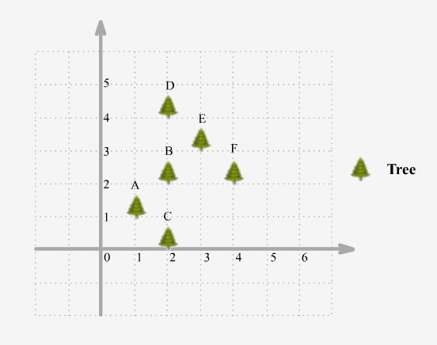

==== 学生出勤记录之一

----
You are given a string representing an attendance record for a student. The record only contains the following three characters:

'A' : Absent.
'L' : Late.
'P' : Present.

A student could be rewarded if his attendance record doesn't contain more than one 'A' (absent) or more than two continuous 'L' (late).
You need to return whether the student could be rewarded according to his attendance record.
----

这道题让我们判断学生的出勤率是否是优秀，判断标准是不能缺勤两次和不能连续迟到三次，那么最直接的方法就是分别记录缺勤和连续迟到的次数，如果当前遇到缺勤，那么缺勤计数器自增1，如果此时次数大于1了，说明已经不是优秀了，直接返回false，否则连续迟到计数器清零。如果当前遇到迟到，那么连续迟到计数器自增1，如果此时连续迟到计数器大于1了，说明已经不是优秀了，直接返回false。如果遇到正常出勤了，那么连续迟到计数器清零，参见代码如下： +

**解法1:** +
[source,cpp, linenums]
----
class Solution {
public:
    bool checkRecord(string s) {
        int cntA = 0, cntL = 0;
        for (char c : s) {
            if (c == 'A') {
                if (++cntA > 1) return false;
                cntL = 0;
            } else if (c == 'L') {
                if (++cntL > 2) return false;
            } else {
                cntL = 0;
            }
        }
        return true;
    }
};
----

那么这种方法利用到了string的查找函数，由于本题的逻辑并不复杂，所以我们可以直接对字符串进行操作，利用STL提供的find函数，方法是同时满足下面两个条件就是优秀，第一个条件是找不到A，或者正着找A和逆着找A在同一个位置(说明只有一个A)；第二个条件是找不到LLL，说明不能连续迟到三次，参见代码如下： +

**解法2:** +
[source, cpp, linenums]
----
class Solution {
public:
    bool checkRecord(string s) {
        return (s.find("A") == string::npos || s.find("A") == s.rfind("A")) && s.find("LLL") == string::npos;
    }
};
----

再来看使用正则匹配来做的解法，我们找出不合题意的情况，然后取反即可，正则匹配式是A.*A|LLL，其中.*表示有零个或者多个，那么A.*A就是至少有两A的情况，LLL是三个连续的迟到，|表示两个是或的关系，只要能匹配出任意一种情况，就会返回false，参见代码如下： +

**解法3:** +
[source, cpp, linenums]
----
class Solution {
public:
    bool checkRecord(string s) {
        return !regex_search(s, regex("A.*A|LLL"));
    }
};
----

==== 最优分隔

----
Given a list of positive integers, the adjacent integers will perform the float division. For example, [2,3,4] -> 2 / 3 / 4.

However, you can add any number of parenthesis at any position to change the priority of operations. You should find out how to add parenthesis to get the maximum result, and return the corresponding expression in string format. Your expression should NOT contain redundant parenthesis.
----

----
这道题给了我们一个数组，让我们确定除法的顺序，从而得到值最大的运算顺序，并且不能加多余的括号。刚开始博主没看清题，以为是要返回最大的值，就直接写了个递归的暴力搜索的方法，结果发现是要返回带括号的字符串，尝试的修改了一下，觉得挺麻烦。于是直接放弃抵抗，上网参考大神们的解法，结果大吃一惊，这题原来还可以这么解，完全是数学上的知识啊，太tricky了。数组中n个数字，如果不加括号就是：

x1 / x2 / x3 / ... / xn

那么我们如何加括号使得其值最大呢，那么就是将x2后面的除数都变成乘数，比如只有三个数字的情况 a / b / c，如果我们在后两个数上加上括号 a / (b / c)，实际上就是a / b * c。而且b永远只能当除数，a也永远只能当被除数。同理，x1只能当被除数，x2只能当除数，但是x3之后的数，只要我们都将其变为乘数，那么得到的值肯定是最大的，所以就只有一种加括号的方式，即:

x1 / (x2 / x3 / ... / xn)

这样的话就完全不用递归了，这道题就变成了一个道简单的字符串操作的题目了，这思路，博主服了，参见代码如下：
----

**解法1:** +
[source, cpp, linenums]
----
class Solution {
public:
    string optimalDivision(vector<int>& nums) {
        if (nums.empty()) return "";
        string res = to_string(nums[0]);
        if (nums.size() == 1) return res;
        if (nums.size() == 2) return res + "/" + to_string(nums[1]);
        res += "/(" + to_string(nums[1]);
        for (int i = 2; i < nums.size(); ++i) {
            res += "/" + to_string(nums[i]);
        }
        return res + ")";
    }
};
----
下面这种解法的思路和上面基本相同，就是写法上略有不同，直接看代码吧： +

**解法2:** +
[source, cpp, linenums]
----
class Solution {
public:
    string optimalDivision(vector<int>& nums) {
        string res = "";
        int n = nums.size();
        for (int i = 0; i < n; ++i) {
            if (i > 0) res += "/";
            if (i == 1 && n > 2) res += "(";
            res += to_string(nums[i]);
            if (i == n - 1 && n > 2) res += ")";
        }
        return res;
    }
};
----

==== 砖头墙壁

----
There is a brick wall in front of you. The wall is rectangular and has several rows of bricks. The bricks have the same height but different width. You want to draw a vertical line from the top to the bottom and cross the leastbricks.

The brick wall is represented by a list of rows. Each row is a list of integers representing the width of each brick in this row from left to right.

If your line go through the edge of a brick, then the brick is not considered as crossed. You need to find out how to draw the line to cross the least bricks and return the number of crossed bricks.

You cannot draw a line just along one of the two vertical edges of the wall, in which case the line will obviously cross no bricks.
----

image::images/question_554.png[width="20%", height="25%"]

这道题给了我们一个砖头墙壁，上面由不同的长度的砖头组成，让我们选个地方从上往下把墙劈开，使得被劈开的砖头个数最少，前提是不能从墙壁的两边劈，这样没有什么意义。我们使用一个哈希表来建立每一个断点的长度和其出现频率之间的映射，这样只要我们从断点频率出现最多的地方劈墙，损坏的板砖一定最少，参见代码如下： +

[source, cpp, linenums]
----
class Solution {
public:
    int leastBricks(vector<vector<int>>& wall) {
        int mx = 0;
        unordered_map<int, int> m;
        for (auto a : wall) {
            int sum = 0;
            for (int i = 0; i < a.size() - 1; ++i) {
                sum += a[i];
                ++m[sum];
                mx = max(mx, m[sum]);
            }
        }
        return wall.size() - mx;
    }
};
----

==== 分割串联字符串
----
Given a list of strings, you could concatenate these strings together into a loop, where for each string you could choose to reverse it or not. Among all the possible loops, you need to find the lexicographically biggest string after cutting the loop, which will make the looped string into a regular one.

Specifically, to find the lexicographically biggest string, you need to experience two phases:

Concatenate all the strings into a loop, where you can reverse some strings or not and connect them in the same order as given.
Cut and make one breakpoint in any place of the loop, which will make the looped string into a regular one starting from the character at the cutpoint.

And your job is to find the lexicographically biggest one among all the possible regular strings.
----

这道题给了我们一些字符串，让我们将其连接起来，连接的时候对于每个字符串我们可以选择翻转或者不翻转，在行程的大的字符串上找一个位置cut掉，将该位置当作首字符，前面的字符串移动到末尾去，问怎么cut能使字符串的字母顺序大。刚开始博主想，既然要让最终字符串字母顺序最大，那么每一个字符串当然要尽可能的大了，所以如果其翻转字符串的字母顺序大的话，就要对字符串进行翻转。然后在组成的字符串中找最大的字符进行cut，然而这种思路不一定能得到正确的结果。比如字符串数组["lc", "love", "ydc"]，如果按照博主之前的思路得到的字符串应该为"ydclclove"，但正确结果应该是"ylclovecd"。我们可出来正确的答案中cut位置所在的字符串ydc，虽然cdy小于ydc，但还是翻转了。但是其他的字符都是按照字母顺序来确定要不要翻转的，那么我们可以得出这样的结论，只有cut所在的字符串的翻转可能不按规律。那么我们如何确定cut位置呢，其实没有太好的办法，只能遍历每一个字母。我们首先来根据字母顺序确定要不要翻转每一个字符串，将字母顺序大的连成一个字符串，然后遍历每一个字符串，在每一个字符串中遍历每一个位置，将当前遍历的字符串后面的所有字符串跟前面所有字符串先连起来，存入mid中，然后取出当前遍历的字符串中当前遍历的位置及其后面的字符取出，连上mid，然后再连上当前位置前面的字符，然后跟结果res比较，取较大者存入结果res。这里我们可以进行小优化，如果cut位置的字母大于等于结果res的首字母，我们才进行对比更新。注意我们在遍历每个字符串时，要将其翻转字符串的每一位也遍历了，这样才能涵盖所有的情况，参见代码如下： +

[source, cpp, linenums]
----
class Solution {
public:
    string splitLoopedString(vector<string>& strs) {
        if (strs.empty()) return "";
        string s = "", res = "a";
        int n = strs.size(), cur = 0;
        for (string str : strs) {
            string t = string(str.rbegin(), str.rend());
            s += str > t ? str : t;
        }
        for (int i = 0; i < n; ++i) {
            string t1 = strs[i], t2 = string(t1.rbegin(), t1.rend());
            string mid = s.substr(cur + t1.size()) + s.substr(0, cur);
            for (int j = 0; j < strs[i].size(); ++j) {
                if (t1[j] >= res[0]) res = max(res, t1.substr(j) + mid + t1.substr(0, j));
                if (t2[j] >= res[0]) res = max(res, t2.substr(j) + mid + t2.substr(0, j));
            }
            cur += strs[i].size();
        }
        return res;
    }
};
----

==== 下一个较大的元素之三

----
Given a positive 32-bit integer n, you need to find the smallest 32-bit integer which has exactly the same digits existing in the integer n and is greater in value than n. If no such positive 32-bit integer exists, you need to return -1.
----

这道题给了我们一个数字，让我们对各个位数重新排序，求出刚好比给定数字大的一种排序，如果不存在就返回-1。这道题给的例子的数字都比较简单，我们来看一个复杂的，比如12443322，这个数字的重排序结果应该为13222344，如果我们仔细观察的话会发现数字变大的原因是左数第二位的2变成了3，细心的童鞋会更进一步的发现后面的数字由降序变为了升序，这也不难理解，因为我们要求刚好比给定数字大的排序方式。那么我们再观察下原数字，看看2是怎么确定的，我们发现，如果从后往前看的话，2是第一个小于其右边位数的数字，因为如果是个纯降序排列的数字，做任何改变都不会使数字变大，直接返回-1。知道了找出转折点的方法，再来看如何确定2和谁交换，这里2并没有跟4换位，而是跟3换了，那么如何确定的3？其实也是从后往前遍历，找到第一个大于2的数字交换，然后把转折点之后的数字按升序排列就是最终的结果了。最后记得为防止越界要转为长整数型，然后根据结果判断是否要返回-1即可，参见代码如下： +

**解法1:** +
[source, cpp, linenums]
----
class Solution {
public:
    int nextGreaterElement(int n) {
        string str = to_string(n);
        int len = str.size(), i = len - 1;
        for (; i > 0; --i) {
            if (str[i] > str[i - 1]) break;
        }
        if (i == 0) return -1;
        for (int j = len - 1; j >= i; --j) {
            if (str[j] > str[i - 1]) {
                swap(str[j], str[i - 1]);
                break;
            }
        }
        sort(str.begin() + i, str.end());
        long long res = stoll(str);
        return res > INT_MAX ? -1 : res;
    }
};
----

下面这种解法博主感觉有些耍赖了，用到了STL的内置函数next_permutation，该数字实现的就是这样一个功能，找下一个全排序，刚好比当前的值大，贴上来权当好玩： +

**解法2:** +
[source, cpp, linenums]
----
class Solution {
public:
    int nextGreaterElement(int n) {
        string str = to_string(n);
        next_permutation(str.begin(), str.end());
        long long res = stoll(str);
        return (res > INT_MAX || res <= n) ? -1 : res;
    }
};
----

==== 翻转字符串中的单词之三

----
Given a string, you need to reverse the order of characters in each word within a sentence while still preserving whitespace and initial word order.
----

这道题让我们翻转字符串中的每个单词，感觉整体难度要比之前两道Reverse Words in a String II和Reverse Words in a String要小一些，由于题目中说明了没有多余空格，使得难度进一步的降低了。首先我们来看使用字符流处理类stringstream来做的方法，相当简单，就是按顺序读入每个单词进行翻转即可，参见代码如下： +

**解法1:** +
[source, cpp, linenums]
----
class Solution {
public:
    string reverseWords(string s) {
        string res = "", t = "";
        istringstream is(s);
        while (is >> t) {
            reverse(t.begin(), t.end());
            res += t + " ";
        }
        res.pop_back();
        return res;
    }
};
----

下面我们来看不使用字符流处理类，也不使用STL内置的reverse函数的方法，那么就是用两个指针，分别指向每个单词的开头和结尾位置，确定了单词的首尾位置后，再用两个指针对单词进行首尾交换即可，有点像验证回文字符串的方法，参见代码如下： +

**解法2:** +
[source, cpp, linenums]
----
class Solution {
public:
    string reverseWords(string s) {
        int start = 0, end = 0, n = s.size();
        while (start < n && end < n) {
            while (end < n && s[end] != ' ') ++end;
            for (int i = start, j = end - 1; i < j; ++i, --j) {
                swap(s[i], s[j]);
            }
            start = ++end;
        }
        return s;
    }
};
----

==== 四叉树交集
----
四叉树是一种树数据，其中每个结点恰好有四个子结点：topLeft、topRight、bottomLeft 和 bottomRight。四叉树通常被用来划分一个二维空间，递归地将其细分为四个象限或区域。

我们希望在四叉树中存储 True/False 信息。四叉树用来表示 N * N 的布尔网格。对于每个结点, 它将被等分成四个孩子结点直到这个区域内的值都是相同的。每个节点都有另外两个布尔属性：isLeaf 和 isLeaf。当这个节点是一个叶子结点时 isLeaf 为真。val 变量储存叶子结点所代表的区域的值。
----

[source, cpp, linenums]
----
class Solution {
public:
    Node* intersect(Node* quadTree1, Node* quadTree2) {
        if(quadTree1->isLeaf && quadTree1->val) return quadTree1;
        if(quadTree2->isLeaf && quadTree2->val) return quadTree2;
        if(quadTree1->isLeaf && !quadTree1->val) return quadTree2;
        if(quadTree2->isLeaf && !quadTree2->val) return quadTree1;

        auto tl = intersect(quadTree1->topLeft, quadTree2->topLeft);
        auto tr = intersect(quadTree1->topRight, quadTree2->topRight);
        auto bl = intersect(quadTree1->bottomLeft, quadTree2->bottomLeft);
        auto br = intersect(quadTree1->bottomRight, quadTree2->bottomRight);

        if(tl->val == tr->val && tl->val == bl->val && tl->val == br->val && tl->isLeaf && tr->isLeaf && bl->isLeaf && br->isLeaf)
            return new Node(tl->val, true, nullptr, nullptr, nullptr, nullptr);
        else
            return new Node(false, false, tl, tr, bl, br);
    }
};
----

==== N叉树的最大深度

----
给定一个 N 叉树，找到其最大深度。

最大深度是指从根节点到最远叶子节点的最长路径上的节点总数。
----

[source, cpp, linenums]
----
class Solution {
public:
    int maxDepth(Node* root) {
        if (!root) {
            return 0;
        }

        int max_depth = 0;
        for (auto child : root->children) {
            max_depth = std::max(max_depth, maxDepth(child));
        }

        return 1 + max_depth;
    }
};
----

==== K 子数组和为K
----
Given an array of integers and an integer k, you need to find the total number of continuous subarrays whose sum equals to k.
----

这道题给了我们一个数组，让我们求和为k的连续子数组的个数，博主最开始看到这道题想着肯定要建立累加和数组啊，然后遍历累加和数组的每个数字，首先看其是否为k，是的话结果res自增1，然后再加个往前的循环，这样可以快速求出所有的子数组之和，看是否为k，参见代码如下： +

**解法1:** +
[source, cpp, linenums]
----
class Solution {
public:
    int subarraySum(vector<int>& nums, int k) {
        int res = 0, n = nums.size();
        vector<int> sums = nums;
        for (int i = 1; i < n; ++i) {
            sums[i] = sums[i - 1] + nums[i];
        }
        for (int i = 0; i < n; ++i) {
            if (sums[i] == k) ++res;
            for (int j = i - 1; j >= 0; --j) {
                if (sums[i] - sums[j] == k) ++res;
            }
        }
        return res;
    }
};
----

上面的求累加和的方法其实并没有提高程序的执行效率，跟下面这种暴力搜索的解法并没有什么不同，博主很惊奇OJ居然这么大度，让这种解法也能通过，参见代码如下： +

**解法3:** +
[source, cpp, linenums]
----
class Solution {
public:
    int subarraySum(vector<int>& nums, int k) {
        int res = 0, n = nums.size();
        for (int i = 0; i < n; ++i) {
            int sum = nums[i];
            if (sum == k) ++res;
            for (int j = i + 1; j < n; ++j) {
                sum += nums[j];
                if (sum == k) ++res;
            }
        }
        return res;
    }
};
----

论坛上大家比较推崇的其实是这种解法，用一个哈希表来建立连续子数组之和跟其出现次数之间的映射，初始化要加入{0,1}这对映射，这是为啥呢，因为我们的解题思路是遍历数组中的数字，用sum来记录到当前位置的累加和，我们建立哈希表的目的是为了让我们可以快速的查找sum-k是否存在，即是否有连续子数组的和为sum-k，如果存在的话，那么和为k的子数组一定也存在，这样当sum刚好为k的时候，那么数组从起始到当前位置的这段子数组的和就是k，满足题意，如果哈希表中事先没有m[0]项的话，这个符合题意的结果就无法累加到结果res中，这就是初始化的用途。上面讲解的内容顺带着也把for循环中的内容解释了，这里就不多阐述了，有疑问的童鞋请在评论区留言哈，参见代码如下： +

**解法3:** +
[source, cpp, linenums]
----
class Solution {
public:
    int subarraySum(vector<int>& nums, int k) {
        int res = 0, sum = 0, n = nums.size();
        unordered_map<int, int> m{{0, 1}};
        for (int i = 0; i < n; ++i) {
            sum += nums[i];
            res += m[sum - k];
            ++m[sum];
        }
        return res;
    }
};
----

==== 数组分割之一

----
Given an array of 2n integers, your task is to group these integers into n pairs of integer, say (a1, b1), (a2, b2), ..., (an, bn) which makes sum of min(ai, bi) for all i from 1 to n as large as possible.
----

这道题让我们分割数组，两两一对，让每对中较小的数的和最大。这题难度不大，用贪婪算法就可以了。由于我们要最大化每对中的较小值之和，那么肯定是每对中两个数字大小越接近越好，因为如果差距过大，而我们只取较小的数字，那么大数字就浪费掉了。明白了这一点，我们只需要给数组排个序，然后按顺序的每两个就是一对，我们取出每对中的第一个数即为较小值累加起来即可，参见代码如下： +

[source, cpp, linenums]
----
class Solution {
public:
    int arrayPairSum(vector<int>& nums) {
        int res = 0, n = nums.size();
        sort(nums.begin(), nums.end());
        for (int i = 0; i < n; i += 2) {
            res += nums[i];
        }
        return res;
    }
};
----

==== 矩阵中最长的连续1

----
Given a 01 matrix M, find the longest line of consecutive one in the matrix. The line could be horizontal, vertical, diagonal or anti-diagonal.
----

这道题给了我们一个二维矩阵，让我们求矩阵中最长的连续1，连续方向任意，可以是水平，竖直，对角线或者逆对角线均可。那么最直接最暴力的方法就是四个方向分别来统计最长的连续1，其中水平方向和竖直方向都比较容易，就是逐行逐列的扫描，使用一个计数器，如果当前位置是1，则计数器自增1，并且更新结果res，否则计数器清零。对于对角线和逆对角线需要进行些坐标转换，对于一个mxn的矩阵，对角线和逆对角线的排数都是m+n-1个，难点在于我们要确定每一排上的数字的坐标，如果i是从0到m+n-1之间遍历，j是在i到0之间遍历，那么对角线的数字的坐标就为(i-j, j)，逆对角线的坐标就为(m-1-i+j, j)，这是博主千辛万苦试出来的T.T，如果能直接记住，效果肯定棒！那么有了坐标转换，求对角线和逆对角线的连续1也就不是啥难事了，参见代码如下： +

**解法1:** +
[source, cpp, linenums]
----
class Solution {
public:
    int longestLine(vector<vector<int>>& M) {
        if (M.empty() || M[0].empty()) return 0;
        int res = 0, m = M.size(), n = M[0].size();
        for (int i = 0; i < m; ++i) { // Check horizontal
            int cnt = 0;
            for (int j = 0; j < n; ++j) {
                if (M[i][j] == 1) res = max(res, ++cnt);
                else cnt = 0;
            }
        }
        for (int j = 0; j < n; ++j) {
            int cnt = 0;
            for (int i = 0; i < m; ++i) { // Check vertical
                if (M[i][j] == 1) res = max(res, ++cnt);
                else cnt = 0;
            }
        }
        for (int i = 0; i < m + n - 1; ++i) {
            int cnt1 = 0, cnt2 = 0;
            for (int j = i; j >= 0; --j) {
                if (i - j < m && j < n) { // Check diagonal
                    if (M[i - j][j] == 1) res = max(res, ++cnt1);
                    else cnt1 = 0;
                }
                int t = m - 1 - i + j;
                if (t >= 0 && t < m && j < n ) { // Check anti-diagonal
                    if(M[t][j] == 1) res = max(res, ++cnt2);
                    else cnt2 = 0;
                }
            }
        }
        return res;
    }
};
----

如果上面的解法的坐标转换不好想的话，我们也可以考虑用DP解法来做，我们建立一个三维dp数组，其中dp[i][j][k]表示从开头遍历到数字nums[i][j]为止，第k种情况的连续1的个数，k的值为0，1，2，3，分别对应水平，竖直，对角线和逆对角线这四种情况。之后就是更新dp数组的过程了，如果如果数字为0的情况直接跳过，然后水平方向就加上前一个的dp值，竖直方向加上上面一个数字的dp值，对角线方向就加上右上方数字的dp值，逆对角线就加上左上方数字的dp值，然后每个值都用来更新结果res，参见代码如下： +

**解法2:** +
[source, cpp, linenums]
----
class Solution {
public:
    int longestLine(vector<vector<int>>& M) {
        if (M.empty() || M[0].empty()) return 0;
        int m = M.size(), n = M[0].size(), res = 0;
        vector<vector<vector<int>>> dp(m, vector<vector<int>>(n, vector<int>(4)));
        for (int i = 0; i < m; ++i) {
            for (int j = 0; j < n; ++j) {
                if (M[i][j] == 0) continue;
                for (int k = 0; k < 4; ++k) dp[i][j][k] = 1;
                if (j > 0) dp[i][j][0] += dp[i][j - 1][0]; // horizonal
                if (i > 0) dp[i][j][1] += dp[i - 1][j][1]; // vertical
                if (i > 0 && j < n - 1) dp[i][j][2] += dp[i - 1][j + 1][2]; // diagonal
                if (i > 0 && j > 0) dp[i][j][3] += dp[i - 1][j - 1][3]; // anti-diagonal
                res = max(res, max(dp[i][j][0], dp[i][j][1]));
                res = max(res, max(dp[i][j][2], dp[i][j][3]));
            }
        }
        return res;
    }
};
----

下面我们来优化空间复杂度，用一种类似于DFS的思路来解决问题，我们在遍历到为1的点时，对其水平方向，竖直方向，对角线方向和逆对角线方向分别不停遍历，直到越界或者遇到为0的数字，同时用计数器来累计1的个数，这样就可以用来更新结果res了，就不用把每个中间结果都保存下来了，参见代码如下： +

**解法3:** +
[source, cpp, linenums]
----
class Solution {
public:
    int longestLine(vector<vector<int>>& M) {
        if (M.empty() || M[0].empty()) return 0;
        int m = M.size(), n = M[0].size(), res = 0;
        vector<vector<int>> dirs{{1,0},{0,1},{-1,-1},{-1,1}};
        for (int i = 0; i < m; ++i) {
            for (int j = 0; j < n; ++j) {
                if (M[i][j] == 0) continue;
                for (int k = 0; k < 4; ++k) {
                    int cnt = 0, x = i, y = j;
                    while (x >= 0 && x < m && y >= 0 && y < n && M[x][y] == 1) {
                        x += dirs[k][0];
                        y += dirs[k][1];
                        ++cnt;
                    }
                    res = max(res, cnt);
                }
            }
        }
        return res;
    }
};
----

==== 二叉树的坡度

----
Given a binary tree, return the tilt of the whole tree.

The tilt of a tree node is defined as the absolute difference between the sum of all left subtree node values and the sum of all right subtree node values. Null node has tilt 0.

The tilt of the whole tree is defined as the sum of all nodes' tilt.
----

这道题让我们求二叉树的坡度，某个结点的坡度的定义为该结点的左子树之和与右子树之和的差的绝对值，这道题让我们求所有结点的坡度之和。我开始的想法就是老老实实的按定义去做，用先序遍历，对于每个遍历到的结点，先计算坡度，根据定义就是左子树之和与右子树之和的差的绝对值，然后返回的是当前结点的tilt加上对其左右子结点调用求坡度的递归函数即可。其中求子树之和用另外一个函数来求，也是用先序遍历来求结点之和，为了避免重复运算，这里用哈希表来保存已经算过的结点，参见代码如下： +

**解法1:** +
[source, cpp, linenums]
----
class Solution {
public:
    unordered_map<TreeNode*, int> m;
    int findTilt(TreeNode* root) {
        if (!root) return 0;
        int tilt = abs(getSum(root->left, m) - getSum(root->right, m));
        return tilt + findTilt(root->left) + findTilt(root->right);
    }
    int getSum(TreeNode* node, unordered_map<TreeNode*, int>& m) {
        if (!node) return 0;
        if (m.count(node)) return m[node];
        return m[node] = getSum(node->left, m) + getSum(node->right, m) + node->val;
    }
};
----

但是在论坛中看了大神们的帖子后，发现这道题最好的解法应该是用后序遍历来做，因为后序遍历的顺序是左-右-根，那么就会从叶结点开始处理，这样我们就能很方便的计算结点的累加和，同时也可以很容易的根据子树和来计算tilt，参见代码如下： +

**解法2:** +
[source, cpp, linenums]
----
class Solution {
public:
    int findTilt(TreeNode* root) {
        int res = 0;
        postorder(root, res);
        return res;
    }
    int postorder(TreeNode* node, int& res) {
        if (!node) return 0;
        int leftSum = postorder(node->left, res);
        int rightSum = postorder(node->right, res);
        res += abs(leftSum - rightSum);
        return leftSum + rightSum + node->val;
    }
};
----

==== 寻找最近的回文串

----
Given an integer n, find the closest integer (not including itself), which is a palindrome.

The 'closest' is defined as absolute difference minimized between two integers.
----

这道题给了我们一个数字，让我们找到其最近的回文数，而且说明了这个最近的回文数不能是其本身。比如如果给你个131，那么就需要返回121。而且返回的回文数可能位数还不同，比如当n为100的时候，我们就应该返回99，或者给了我们99时，需要返回101。那么实际上最近回文数是有范围的，比如说n为三位数，那么其最近回文数的范围在[99, 1001]之间，这样我们就可以根据给定数字的位数来确定出两个边界值，要和其他生成的回文数进行比较，取绝对差最小的。 +

下面我们来看如何求一般情况下的最近回文数，我们知道回文数就是左半边和右半边互为翻转，奇数情况下中间还有个单独的值。那么如何将一个不是回文数的数变成回文数呢，我们有两种选择，要么改变左半边，要么改变右半边。由于我们希望和原数绝对差最小，肯定是改变低位上的数比较好，所以我们改变右半边，那么改变的情况又分为两种，一种是原数本来就是回文数，这种情况下，我们需要改变中间的那个数字，要么增加1，要么减小1，比如121，可以变成111和131。另一种情况是原数不是回文数，我们只需要改变右半边就行了，比如123，变成121。那么其实这三种情况可以总结起来，分别相当于对中间的2进行了-1, +1, +0操作，那么我们就可以用一个-1到1的for循环一起处理了，先取出包括中间数的左半边，比如123就取出12，1234也取出12，然后就要根据左半边生成右半边，为了同时处理奇数和偶数的情况，我们使用一个小tricky，在反转复制左半边的时候，我们给rbegin()加上len&1，当奇数时，len&1为1，这样就不会复制中间数了；为偶数时，len&1为0，这就整个翻转复制了左半边。我们把每次生成的回文串转为转为数字后加入到一个集合set中，把之前的两个边界值也同样加进去，最后我们在五个candidates中找出和原数绝对差最小的那个返回，记得别忘了在集合中删除原数，因为如果原数时回文的话, i=0时就把自己也加入集合了，参见代码如下： +

[source, cpp, linenums]
----
class Solution {
public:
    string nearestPalindromic(string n) {
        long len = n.size(), num = stol(n), res, minDiff = LONG_MAX;
        unordered_set<long> s;
        s.insert(pow(10, len) + 1);
        s.insert(pow(10, len - 1) - 1);
        long prefix = stol(n.substr(0, (len + 1) / 2));
        for (long i = -1; i <= 1; ++i) {
            string pre = to_string(prefix + i);
            string str = pre + string(pre.rbegin() + (len & 1), pre.rend());
            s.insert(stol(str));
        }
        s.erase(num);
        for (auto a : s) {
            long diff = abs(a - num);
            if (diff < minDiff) {
                minDiff = diff;
                res = a;
            } else if (diff == minDiff) {
                res = min(res, a);
            }
        }
        return to_string(res);
    }
};
----

==== 数组嵌套

----
A zero-indexed array A consisting of N different integers is given. The array contains all integers in the range [0, N - 1].

Sets S[K] for 0 <= K < N are defined as follows:

S[K] = { A[K], A[A[K]], A[A[A[K]]], ... }.

Sets S[K] are finite for each K and should NOT contain duplicates.

Write a function that given an array A consisting of N integers, return the size of the largest set S[K] for this array.
----

这道题让我们找嵌套数组的最大个数，给的数组总共有n个数字，范围均在[0, n-1]之间，题目中也把嵌套数组的生成解释的很清楚了，其实就是值变成坐标，得到的数值再变坐标。那么实际上当循环出现的时候，嵌套数组的长度也不能再增加了，而出现的这个相同的数一定是嵌套数组的首元素，博主刚开始没有想清楚这一点，以为出现重复数字的地方可能是嵌套数组中间的某个位置，于是用个set将生成的嵌套数组存入，然后每次查找新生成的数组是否已经存在。而且还以原数组中每个数字当作嵌套数组的起始数字都算一遍，结果当然是TLE了。其实对于遍历过的数字，我们不用再将其当作开头来计算了，而是只对于未遍历过的数字当作嵌套数组的开头数字，不过在进行嵌套运算的时候，并不考虑中间的数字是否已经访问过，而是只要找到和起始位置相同的数字位置，然后更新结果res，参见代码如下： +

**解法1:** +
[source, cpp, linenums]
----
class Solution {
public:
    int arrayNesting(vector<int>& nums) {
        int n = nums.size(), res = INT_MIN;
        vector<bool> visited(n, false);
        for (int i = 0; i < nums.size(); ++i) {
            if (visited[nums[i]]) continue;
            res = max(res, helper(nums, i, visited));
        }
        return res;
    }
    int helper(vector<int>& nums, int start, vector<bool>& visited) {
        int i = start, cnt = 0;
        while (cnt == 0 || i != start) {
            visited[i] = true;
            i = nums[i];
            ++cnt;
        }
        return cnt;
    }
};
----

下面这种方法写法上更简洁一些，思路完全一样，参见代码如下： +

**解法2:** +
[source, cpp, linenums]
----
class Solution {
public:
    int arrayNesting(vector<int>& nums) {
        int n = nums.size(), res = INT_MIN;
        vector<bool> visited(n, false);
        for (int i = 0; i < n; ++i) {
            if (visited[nums[i]]) continue;
            int cnt = 0, j = i;
            while(cnt == 0 || j != i) {
                visited[j] = true;
                j = nums[j];
                ++cnt;
            }
            res = max(res, cnt);
        }
        return res;
    }
};
----

下面这种解法是网友@edyyy提醒博主的，我们可以优化解法二的空间，我们并不需要专门的数组来记录数组是否被遍历过，而是我们在遍历的过程中，将其交换到其应该出现的位置上，因为如果某个数出现在正确的位置上，那么它一定无法组成嵌套数组，这样就相当于我们标记了其已经访问过了，思路确实很赞啊，参见代码如下： +

**解法3:** +
[source, cpp, linenums]
----
class Solution {
public:
    int arrayNesting(vector<int>& nums) {
        int n = nums.size(), res = 0;
        for (int i = 0; i < n; ++i) {
            int cnt = 1;
            while (nums[i] != i && nums[i] != nums[nums[i]]) {
                swap(nums[i], nums[nums[i]]);
                ++cnt;
            }
            res = max(res, cnt);
        }
        return res;
    }
};
----

==== 重塑矩阵

----
In MATLAB, there is a very useful function called 'reshape', which can reshape a matrix into a new one with different size but keep its original data.

You're given a matrix represented by a two-dimensional array, and two positive integers r and c representing the row number and column number of the wanted reshaped matrix, respectively.

The reshaped matrix need to be filled with all the elements of the original matrix in the same row-traversing order as they were.

If the 'reshape' operation with given parameters is possible and legal, output the new reshaped matrix; Otherwise, output the original matrix.
----

这道题让我们实现矩阵大小的重塑，也就是实现Matlab中的reshape函数，博主也经常使用matlab，对这个函数还是比较的熟悉的。对于这种二维数组大小重新非配的问题的关键就是对应位置的坐标转换，最直接的办法就是先把原数组拉直，变成一条直线，然后再组成新的数组。所以这道题我们先判断给定数组是否能重塑成给定的大小，就是看两者的元素总数是否相同，直接行数乘以列数即可，然后我们新建一个目标大小的数组，并开始遍历，对于每个位置，我们先转为拉直后的一维坐标，然后在算出在原数组中的对应位置赋值过来即可，参见代码如下： +

**解法1:** +
[source, cpp, linenums]
----
class Solution {
public:
    vector<vector<int>> matrixReshape(vector<vector<int>>& nums, int r, int c) {
        int m = nums.size(), n = nums[0].size();
        if (m * n != r * c) return nums;
        vector<vector<int>> res(r, vector<int>(c));
        for (int i = 0; i < r; ++i) {
            for (int j = 0; j < c; ++j) {
                int k = i * c + j;
                res[i][j] = nums[k / n][k % n];
            }
        }
        return res;
    }
};
----

下面这种方法整体思路和上面没啥区别，但是只使用了一个循环，直接就是遍历拉直后的一维数组的坐标，然后分别转换为两个二维数组的坐标进行赋值，参见代码如下： +

**解法2:** +
[source, cpp, linenums]
----
class Solution {
public:
    vector<vector<int>> matrixReshape(vector<vector<int>>& nums, int r, int c) {
        int m = nums.size(), n = nums[0].size();
        if (m * n != r * c) return nums;
        vector<vector<int>> res(r, vector<int>(c));
        for (int i = 0; i < r * c; ++i) {
            res[i / c][i % c] = nums[i / n][i % n];
        }
        return res;
    }
};
----

==== 字符串中的全排列

Given two strings s1 and s2, write a function to return true if s2 contains the permutation of s1. In other words, one of the first string's permutations is the substring of the second string. +

这道题给了两个字符串s1和s2，问我们s1的全排列的字符串任意一个是否为s2的字串。虽然题目中有全排列的关键字，但是跟之前的全排列的题目的解法并不一样，如果受思维定势影响比较深的话，很容易遍历s1所有全排列的情况，然后检测其是否为s2的子串，这种解法是非常不高效的，估计OJ不会答应。 这道题的正确做法应该是使用滑动窗口Sliding Window的思想来做，可以使用两个哈希表来做，或者是使用一个哈希表配上双指针来做。我们先来看使用两个哈希表来做的情况，我们先来分别统计s1和s2中前n1个字符串中各个字符出现的次数，其中n1为字符串s1的长度，这样如果二者字符出现次数的情况完全相同，说明s1和s2中前n1的字符互为全排列关系，那么符合题意了，直接返回true。如果不是的话，那么我们遍历s2之后的字符，对于遍历到的字符，对应的次数加1，由于窗口的大小限定为了n1，所以每在窗口右侧加一个新字符的同时就要在窗口左侧去掉一个字符，每次都比较一下两个哈希表的情况，如果相等，说明存在，参见代码如下： +

**解法1:** +
[source, cpp, linenums]
----

class Solution {
public:
    bool checkInclusion(string s1, string s2) {
        int n1 = s1.size(), n2 = s2.size();
        vector<int> m1(128), m2(128);
        for (int i = 0; i < n1; ++i) {
            ++m1[s1[i]]; ++m2[s2[i]];
        }
        if (m1 == m2) return true;
        for (int i = n1; i < n2; ++i) {
            ++m2[s2[i]];
            --m2[s2[i - n1]];
            if (m1 == m2) return true;
        }
        return false;
    }
};
----

下面这种解法是利用一个哈希表加上双指针，我们还是先统计s1中字符的出现次数，然后遍历s2中的字符，对于每个遍历到的字符，我们在哈希表中对应的字符次数减1，如果次数次数小于0了，说明该字符在s1中不曾出现，或是出现的次数超过了s1中的对应的字符出现次数，那么我们此时移动滑动窗口的左边界，对于移除的字符串，哈希表中对应的次数要加1，如果此时次数不为0，说明该字符不在s1中，继续向右移，直到更新后的次数为0停止，此时到达的字符是在s1中的。如果次数大于等于0了，我们看此时窗口大小是否为s1的长度，若二者相等，由于此时窗口中的字符都是在s1中存在的字符，而且对应的次数都为0了，说明窗口中的字符串和s1互为全排列，返回true即可，参见代码如下： +

**解法2:** +
[source, cpp, linenums]
----
class Solution {
public:
    bool checkInclusion(string s1, string s2) {
        int n1 = s1.size(), n2 = s2.size(), left = 0;
        vector<int> m(128);
        for (char c : s1) ++m[c];
        for (int right = 0; right < n2; ++right) {
            if (--m[s2[right]] < 0) {
                while (++m[s2[left++]] != 0) {}
            } else if (right - left + 1 == n1) return true;
        }
        return n1 == 0;
    }
};
----

下面这种解法也是用一个哈希表外加双指针来做的，跟上面的解法思路大体相同，写法有些不同，不变的还是统计s1中字符出现的次数，不一样的是我们用一个变量cnt来表示还需要匹配的s1中的字符的个数，初始化为s1的长度，然后遍历s2中的字符，如果该字符在哈希表中存在，说明匹配上了，cnt自减1，哈希表中的次数也应该自减1，然后如果cnt减为0了，说明s1的字符都匹配上了，如果此时窗口的大小正好为s1的长度，那么说明找到了s1的全排列，返回true，否则说明窗口过大，里面有一些非s1中的字符，我们将左边界右移，同时将移除的字符串在哈希表中的次数自增1，如果增加后的次数大于0了，说明该字符是s1中的字符，我们将其移除了，那么cnt就要自增1，参见代码如下： +

**解法3:** +
[source, cpp, linenums]
----
class Solution {
public:
    bool checkInclusion(string s1, string s2) {
        int n1 = s1.size(), n2 = s2.size(), cnt = n1, left = 0;
        vector<int> m(128);
        for (char c : s1) ++m[c];
        for (int right = 0; right < n2; ++right) {
            if (m[s2[right]]-- > 0) --cnt;
            while (cnt == 0) {
                if (right - left + 1 == n1) return true;
                if (++m[s2[left++]] > 0) ++cnt;
            }
        }
        return false;
    }
};
----

==== 最大化休假日
----
LeetCode wants to give one of its best employees the option to travel among N cities to collect algorithm problems. But all work and no play makes Jack a dull boy, you could take vacations in some particular cities and weeks. Your job is to schedule the traveling to maximize the number of vacation days you could take, but there are certain rules and restrictions you need to follow.

Rules and restrictions:

You can only travel among N cities, represented by indexes from 0 to N-1. Initially, you are in the city indexed 0 on Monday.
The cities are connected by flights. The flights are represented as a N*N matrix (not necessary symmetrical), called flights representing the airline status from the city i to the city j. If there is no flight from the city i to the city j, flights[i][j] = 0; Otherwise, flights[i][j] = 1. Also, flights[i][i] = 0 for all i.
You totally have K weeks (each week has 7 days) to travel. You can only take flights at most once per day and can only take flights on each week's Monday morning. Since flight time is so short, we don't consider the impact of flight time.
For each city, you can only have restricted vacation days in different weeks, given an N*K matrix called days representing this relationship. For the value of days[i][j], it represents the maximum days you could take vacation in the city i in the week j.

You're given the flights matrix and days matrix, and you need to output the maximum vacation days you could take during K weeks.
----

这道题给了我们一个NxN的数组，表示城市i是否有飞机直达城市j，又给了我们一个NxK的数组days，表示在第j周能在城市i休假的天数，让我们找出一个行程能使我们休假的天数最大化。开始尝试写了个递归的暴力破解法，结果TLE了。其实这道题比较适合用DP来解，我们建立一个二维DP数组，其中dp[i][j]表示目前是第j周，并且在此时在城市i，总共已经获得休假的总日子数。我们采取从后往前更新的方式(不要问我为什么，因为从前往后更新的写法要复杂一些)，我们从第k周开始往第一周遍历，那么最后结果都累加在了dp[i][0]中，i的范围是[0, n-1]，找出其中的最大值就是我们能休息的最大假期数了。难点就在于找递推式了，我们想dp[i][j]表示的是当前是第j周并在城市i已经获得的休假总日子数，那么上一个状态，也就是j+1周(因为我们是从后往前更新)，跟当前状态有何联系，上一周我们可能还在城市i，也可能在其他城市p，那么在其他城市p的条件是，城市p有直飞城市i的飞机，那么我们可以用上一个状态的值dp[p][j+1]来更新当前值dp[i][j]，还要注意的是我们要从倒数第二周开始更新，因为倒数第一周没有上一个状态，还有就是每个状态dp[i][j]都初始化赋为days[i][j]来更新，这样一旦没有任何城市可以直飞当前城市，起码我们还可以享受当前城市的假期，最后要做的就是想上面所说在dp[i][0]中找最大值，下面的代码是把这一步融合到了for循环中，所以加上了一堆判断条件，我们也可以在dp数组整个更新结束之后再来找最大值，参见代码如下： +

**解法1:** +
[source, cpp, linenums]
----
class Solution {
public:
    int maxVacationDays(vector<vector<int>>& flights, vector<vector<int>>& days) {
        int n = flights.size(), k = days[0].size(), res = 0;
        vector<vector<int>> dp(n, vector<int>(k, 0));
        for (int j = k - 1; j >= 0; --j) {
            for (int i = 0; i < n; ++i) {
                dp[i][j] = days[i][j];
                for (int p = 0; p < n; ++p) {
                    if ((i == p || flights[i][p]) && j < k - 1) {
                        dp[i][j] = max(dp[i][j], dp[p][j + 1] + days[i][j]);
                    }
                    if (j == 0 && (i == 0 || flights[0][i])) res = max(res, dp[i][0]);
                }
            }
        }
        return res;
    }
};
----

下面这种方法优化了空间复杂度，只用了一个一维的DP数组，其中dp[i]表示在当前周，在城市i时已经获得的最大假期数，
并且除了第一个数初始化为0，其余均初始化为整型最小值，然后我们从第一周往后遍历，我们新建一个临时数组t，初始化为整型最小值，
然后遍历每一个城市，对于每一个城市，我们遍历其他所有城市，看是否有飞机能直达当前城市，或者就是当前的城市，
我们用dp[p] + days[i][j]来更更新dp[i]，当每个城市都遍历完了之后，我们将t整个赋值给dp，然后进行下一周的更新，
最后只要在dp数组中找出最大值返回即可，这种写法不但省空间，而且也相对简洁一些，很赞啊～ +

**解法2:** +
[source, cpp, linenums]
----
class Solution {
public:
    int maxVacationDays(vector<vector<int>>& flights, vector<vector<int>>& days) {
        int n = flights.size(), k = days[0].size();
        vector<int> dp(n, INT_MIN);
        dp[0] = 0;
        for (int j = 0; j < k; ++j) {
            vector<int> t(n, INT_MIN);
            for (int i = 0; i < n; ++i) {
                for (int p = 0; p < n; ++p) {
                    if (i == p || flights[p][i]) {
                        t[i] = max(t[i], dp[p] + days[i][j]);
                    }
                }
            }
            dp = t;
        }
        return *max_element(dp.begin(), dp.end());
    }
};
----

之前提到了递归的DFS会TLE，但是如果我们使用一个memo数组来保存中间计算结果，就能省去大量的重复计算，并且能够通过OJ，解题思想跟解法一非常的类似，参见代码如下： +

**解法3:** +
[source, cpp, linenums]
----
class Solution {
public:
    int maxVacationDays(vector<vector<int>>& flights, vector<vector<int>>& days) {
        int n = flights.size(), k = days[0].size();
        vector<vector<int>> memo(n, vector<int>(k, 0));
        return helper(flights, days, 0, 0, memo);
    }
    int helper(vector<vector<int>>& flights, vector<vector<int>>& days, int city, int day, vector<vector<int>>& memo) {
        int n = flights.size(), k = days[0].size(), res = 0;
        if (day == k) return 0;
        if (memo[city][day] > 0) return memo[city][day];
        for (int i = 0; i < n; ++i) {
            if (i == city || flights[city][i] == 1) {
                res = max(res, days[i][day] + helper(flights, days, i, day + 1, memo));
            }
        }
        return memo[city][day] = res;
    }
};
----

==== Median Employee Salary

----
The Employee table holds all employees. The employee table has three columns: Employee Id, Company Name, and Salary.

+-----+------------+--------+
|Id   | Company    | Salary |
+-----+------------+--------+
|1    | A          | 2341   |
|2    | A          | 341    |
|3    | A          | 15     |
|4    | A          | 15314  |
|5    | A          | 451    |
|6    | A          | 513    |
|7    | B          | 15     |
|8    | B          | 13     |
|9    | B          | 1154   |
|10   | B          | 1345   |
|11   | B          | 1221   |
|12   | B          | 234    |
|13   | C          | 2345   |
|14   | C          | 2645   |
|15   | C          | 2645   |
|16   | C          | 2652   |
|17   | C          | 65     |
+-----+------------+--------+
Write a SQL query to find the median salary of each company. Bonus points if you can solve it without using any built-in SQL functions.

+-----+------------+--------+
|Id   | Company    | Salary |
+-----+------------+--------+
|5    | A          | 451    |
|6    | A          | 513    |
|12   | B          | 234    |
|9    | B          | 1154   |
|14   | C          | 2645   |
+-----+------------+--------+
----

[source, sql, linenums]
----
SELECT
Employee.Id, Employee.Company, Employee.Salary
FROM
Employee,
Employee alias
WHERE
Employee.Company = alias.Company
GROUP BY Employee.Company , Employee.Salary
HAVING SUM(CASE
           WHEN Employee.Salary = alias.Salary THEN 1
           ELSE 0
           END) >= ABS(SUM(SIGN(Employee.Salary - alias.Salary)))
ORDER BY Employee.Id
;
----

==== Managers with at Least 5 Direct Reports

----
The Employee table holds all employees including their managers. Every employee has an Id, and there is also a column for the manager Id.

+------+----------+-----------+----------+
|Id    |Name 	  |Department |ManagerId |
+------+----------+-----------+----------+
|101   |John 	  |A 	      |null      |
|102   |Dan 	  |A 	      |101       |
|103   |James 	  |A 	      |101       |
|104   |Amy 	  |A 	      |101       |
|105   |Anne 	  |A 	      |101       |
|106   |Ron 	  |B 	      |101       |
+------+----------+-----------+----------+
Given the Employee table, write a SQL query that finds out managers with at least 5 direct report. For the above table, your SQL query should return:

+-------+
| Name  |
+-------+
| John  |
+-------+
----

[source, sql, linenums]
----
SELECT
Name
FROM
Employee AS t1 JOIN
(SELECT
 ManagerId
 FROM
 Employee
 GROUP BY ManagerId
 HAVING COUNT(ManagerId) >= 5) AS t2
ON t1.Id = t2.ManagerId
;
----

==== Find Median Given Frequency of Numbers

[source, sql, linenums]
----
select FORMAT(avg(n.Number),4)*1.0 as median
from Numbers n left join
(
 select Number, @prev := @count as prevNumber, (@count := @count + Frequency) as countNumber
 from Numbers,
 (select @count := 0, @prev := 0, @total := (select sum(Frequency) from Numbers)) temp order by Number
 ) n2
on n.Number = n2.Number
where
(prevNumber < floor((@total+1)/2) and countNumber >= floor((@total+1)/2))
or
(prevNumber < floor((@total+2)/2) and countNumber >= floor((@total+2)/2))
----

==== 另一个树的子树

----
Given two non-empty binary trees s and t, check whether tree t has exactly the same structure and node values with a subtree of s. A subtree of s is a tree consists of a node in s and all of this node's descendants. The tree scould also be considered as a subtree of itself.
----

这道题让我们求一个数是否是另一个树的子树，从题目中的第二个例子中可以看出，子树必须是从叶结点开始的，
中间某个部分的不能算是子树，那么我们转换一下思路，是不是从s的某个结点开始，跟t的所有结构都一样，
那么问题就转换成了判断两棵树是否相同，也就是Same Tree的问题了，这点想通了其实代码就很好写了，用递归来写十分的简洁，
我们先从s的根结点开始，跟t比较，如果两棵树完全相同，那么返回true，否则就分别对s的左子结点和右子结点调用递归再次来判断是否相同，
只要有一个返回true了，就表示可以找得到。 +

**解法1:** +
[source, cpp, linenums]
----
class Solution {
public:
    bool isSubtree(TreeNode* s, TreeNode* t) {
        if (!s) return false;
        if (isSame(s, t)) return true;
        return isSubtree(s->left, t) || isSubtree(s->right, t);
    }
    bool isSame(TreeNode* s, TreeNode* t) {
        if (!s && !t) return true;
        if (!s || !t) return false;
        if (s->val != t->val) return false;
        return isSame(s->left, t->left) && isSame(s->right, t->right);
    }
};
----

下面这道题的解法用到了之前那道Serialize and Deserialize Binary Tree的解法，思路是对s和t两棵树分别进行序列化，各生成一个字符串，如果t的字符串是s的子串的话，就说明t是s的子树，但是需要注意的是，为了避免出现[12], [2], 这种情况，虽然2也是12的子串，但是[2]却不是[12]的子树，所以我们再序列化的时候要特殊处理一下，就是在每个结点值前面都加上一个字符，比如','，来分隔开，那么[12]序列化后就是",12,#"，而[2]序列化之后就是",2,#"，这样就可以完美的解决之前的问题了，参见代码如下： +

**解法2:** +
[source, cpp, linenums]
----
class Solution {
public:
    bool isSubtree(TreeNode* s, TreeNode* t) {
        ostringstream os1, os2;
        serialize(s, os1);
        serialize(t, os2);
        return os1.str().find(os2.str()) != string::npos;
    }
    void serialize(TreeNode* node, ostringstream& os) {
        if (!node) os << ",#";
        else {
            os << "," << node->val;
            serialize(node->left, os);
            serialize(node->right, os);
        }
    }
};
----

==== 松鼠模拟

----
There's a tree, a squirrel, and several nuts. Positions are represented by the cells in a 2D grid. Your goal is to find the minimal distance for the squirrel to collect all the nuts and put them under the tree one by one. The squirrel can only take at most one nut at one time and can move in four directions - up, down, left and right, to the adjacent cell. The distance is represented by the number of moves.
----

这道题是关于可爱的小松鼠的题目，不由得让人想起来冰河世纪里面的那只对粟子执着追求的原始松鼠。每天在校园里也能见到抱着粟子啃的小家伙，有的挺个大白肚皮，吃的巨肥，完全没有天敌啊。本题说有一只小松鼠，一堆在不同位置的粟子，还有一棵树，小松鼠目标是把所有的粟子都运到树的位置，问怎样的顺序可以使用最少的步数。那么我们这么想，如果小松鼠本身就在树的位置，那么把所有的栗子运回树的步数就是一个定值，为每个粟子距树的距离总和乘以2。那么只有当小松鼠不在树的位置时候，它首先要走到一个粟子的位置，然后再去树那儿。而且一旦小松鼠到了树那，再出发，之后的步数就是定值了。所以关键就在于决定小松鼠首先去哪个粟子那。博主最开始犯了一个这道题很容易犯的一个错误，就是在选起始粟子的时候的判定条件是松鼠到该粟子的距离加上该粟子到树的距离之和最小当作判定条件，其实这样是不对的。举个简单的反例，比如此时有两个粟子A和B，小松鼠到粟子A的距离为2，粟子A到树的距离为1，小松鼠到粟子B的距离为2，粟子B到树的距离为2。那么按照博主之前的选择方法，会选先去粟子A，因为小松鼠到粟子A再到树的距离之和为3，小于先去粟子B再去树的距离之和(为4)。然而小松鼠先去粟子A的话，总距离就是7，而如果先去粟子B的话，总距离为6，这就说明之前的判定条件不对。那么正确思路应该是，假设小松树最先应该去粟子i，那么我们假设粟子i到树的距离为x，小松鼠到粟子i的距离为y，那么如果小松鼠不去粟子i，累加步数就是2x，如果小松鼠去粟子i，累加步数就是x+y，我们希望x+y尽可能的小于2x，那么就是y尽可能小于x，即x-y越大越好。这样我们遍历每个粟子，找出x-y最大的那个，让小松鼠先去捡就好了。话说萌萌的小松鼠真是很可爱，希望这些小萌物们远离马路，不要随便过马路，真是太危险了。。。 +

[source, cpp, linenums]
----
class Solution {
public:
    int minDistance(int height, int width, vector<int>& tree, vector<int>& squirrel, vector<vector<int>>& nuts) {
        int res = 0, mxDiff = INT_MIN, idx = 0;
        for (auto nut : nuts) {
            int dist = abs(tree[0] - nut[0]) + abs(tree[1] - nut[1]);
            res += 2 * dist;
            mxDiff = max(mxDiff, dist - abs(squirrel[0] - nut[0]) - abs(squirrel[1] - nut[1]));
        }
        return res - mxDiff;
    }
};
----

==== Winning Candidate

----
Table: Candidate

+-----+---------+
| id  | Name    |
+-----+---------+
| 1   | A       |
| 2   | B       |
| 3   | C       |
| 4   | D       |
| 5   | E       |
+-----+---------+
Table: Vote

+-----+--------------+
| id  | CandidateId  |
+-----+--------------+
| 1   |     2        |
| 2   |     4        |
| 3   |     3        |
| 4   |     2        |
| 5   |     5        |
+-----+--------------+
id is the auto-increment primary key,
CandidateId is the id appeared in Candidate table.
Write a sql to find the name of the winning candidate, the above example will return the winner B.

+------+
| Name |
+------+
| B    |
+------+
----

[source, sql, linenums]
----
SELECT
    name AS 'Name'
FROM
    Candidate
        JOIN
    (SELECT
        Candidateid
    FROM
        Vote
    GROUP BY Candidateid
    ORDER BY COUNT(*) DESC
    LIMIT 1) AS winner
WHERE
Candidate.id = winner.Candidateid;
----

==== 分糖果
----
Given an integer array with even length, where different numbers in this array represent different kinds of candies. Each number means one candy of the corresponding kind. You need to distribute these candies equally in number to brother and sister. Return the maximum number of kinds of candies the sister could gain.
----

这道题给我们一堆糖，每种糖的个数不定，分给两个人，让我们求其中一个人能拿到的最大的糖的种类数。那么我们想，如果总共有n个糖，平均分给两个人，每人得到n/2块糖，那么能拿到的最大的糖的种类数也就是n／2种，不可能再多，只可能再少。那么我们要做的就是统计出总共的糖的种类数，如果糖的种类数小于n/2，说明拿不到n/2种糖，最多能拿到的种类数数就是当前糖的总种类数，明白了这点就很容易了，我们利用集合set的自动去重复特性来求出糖的种类数，然后跟n/2比较，取二者之中的较小值返回即可，参加代码如下： +

**解法1:** +
[source, cpp, linenums]
----
class Solution {
public:
    int distributeCandies(vector<int>& candies) {
        unordered_set<int> s;
        for (int candy : candies) s.insert(candy);
        return min(s.size(), candies.size() / 2);
    }
};
----

下面这种方法叼的不行，直接用把上面的解法浓缩为了一行，有种显摆的感觉： +

**解法2:** +
[source, cpp, linenums]
----
class Solution {
public:
    int distributeCandies(vector<int>& candies) {
        return min(unordered_set<int>(candies.begin(), candies.end()).size(), candies.size() / 2);
    }
};
----

==== 出界的路径

----
There is an m by n grid with a ball. Given the start coordinate (i,j) of the ball, you can move the ball to adjacent cell or cross the grid boundary in four directions (up, down, left, right). However, you can at most move N times. Find out the number of paths to move the ball out of grid boundary. The answer may be very large, return it after mod 109 + 7.
----

这道题给了我们一个二维的数组，某个位置放个足球，每次可以在上下左右四个方向中任意移动一步，总共可以移动N步，问我们总共能有多少种移动方法能把足球移除边界，由于结果可能是个巨大的数，所以让我们对一个大数取余。那么我们知道对于这种结果很大的数如果用递归解法很容易爆栈，所以最好考虑使用DP来解。那么我们使用一个三维的DP数组，其中dp[k][i][j]表示总共走k步，从(i,j)位置走出边界的总路径数。那么我们来找递推式，对于dp[k][i][j]，走k步出边界的总路径数等于其周围四个位置的走k-1步出边界的总路径数之和，如果周围某个位置已经出边界了，那么就直接加上1，否则就在dp数组中找出该值，这样整个更新下来，我们就能得出每一个位置走任意步数的出界路径数了，最后只要返回dp[N][i][j]就是所求结果了，参见代码如下： +

**解法1:** +
[source, cpp, linenums]
----
class Solution {
public:
    int findPaths(int m, int n, int N, int i, int j) {
        vector<vector<vector<int>>> dp(N + 1, vector<vector<int>>(m, vector<int>(n, 0)));
        for (int k = 1; k <= N; ++k) {
            for (int x = 0; x < m; ++x) {
                for (int y = 0; y < n; ++y) {
                    long long v1 = (x == 0) ? 1 : dp[k - 1][x - 1][y];
                    long long v2 = (x == m - 1) ? 1 : dp[k - 1][x + 1][y];
                    long long v3 = (y == 0) ? 1 : dp[k - 1][x][y - 1];
                    long long v4 = (y == n - 1) ? 1 : dp[k - 1][x][y + 1];
                    dp[k][x][y] = (v1 + v2 + v3 + v4) % 1000000007;
                }
            }
        }
        return dp[N][i][j];
    }
};
----

下面这种方法虽然也是用的DP解法，但是DP数组的定义和上面的不一样，这种解法相当于使用了BFS搜索，以(i, j)为起始点，其中dp[k][x][y]表示用了k步，进入(x, y)位置的路径数，由于dp[k][x][y]只依赖于dp[k-1][x][y]，所以我们可以用一个二维dp数组来代替，初始化dp[i][j]为1，总共N步，进行N次循环，每次都新建一个mxn大小的临时数组t，然后就是对于遍历到的每个位置，都遍历其四个相邻位置，如果相邻位置越界了，那么我们用当前位置的dp值更新结果res，因为此时dp值的意义就是从(i,j)到越界位置的路径数。如果没有，我们将当前位置的dp值赋给t数组的对应位置，这样在遍历完所有的位置时，将数组t整个赋值给dp，然后进入下一步的循环，参加代码如下： +

**解法2:** +
[source, cpp, linenums]
----
class Solution {
public:
    int findPaths(int m, int n, int N, int i, int j) {
        int res = 0;
        vector<vector<int>> dp(m, vector<int>(n, 0));
        dp[i][j] = 1;
        vector<vector<int>> dirs{{0,-1},{-1,0},{0,1},{1,0}};
        for (int k = 0; k < N; ++k) {
            vector<vector<int>> t(m, vector<int>(n, 0));
            for (int r = 0; r < m; ++r) {
                for (int c = 0; c < n; ++c) {
                    for (auto dir : dirs) {
                        int x = r + dir[0], y = c + dir[1];
                        if (x < 0 || x >= m || y < 0 || y >= n) {
                            res = (res + dp[r][c]) % 1000000007;
                        } else {
                            t[x][y] = (t[x][y] + dp[r][c]) % 1000000007;
                        }
                    }
                }
            }
            dp = t;
        }
        return res;
    }
};
----

==== Employee Bonus

----
Select all employee's name and bonus whose bonus is < 1000.

Table:Employee

+-------+--------+-----------+--------+
| empId |  name  | supervisor| salary |
+-------+--------+-----------+--------+
|   1   | John   |  3        | 1000   |
|   2   | Dan    |  3        | 2000   |
|   3   | Brad   |  null     | 4000   |
|   4   | Thomas |  3        | 4000   |
+-------+--------+-----------+--------+
empId is the primary key column for this table.
Table: Bonus

+-------+-------+
| empId | bonus |
+-------+-------+
| 2     | 500   |
| 4     | 2000  |
+-------+-------+
empId is the primary key column for this table.
----

[source, sql, linenums]
----
SELECT
    Employee.name, Bonus.bonus
FROM
    Employee
        LEFT OUTER JOIN
    Bonus ON Employee.empid = Bonus.empid
;
----

==== Get Highest Answer Rate Question

----
Get the highest answer rate question from a table survey_log with these columns: uid, action, question_id, answer_id, q_num, timestamp.

uid means user id; action has these kind of values: "show", "answer", "skip"; answer_id is not null when action column is "answer", while is null for "show" and "skip"; q_num is the numeral order of the question in current session.

Write a sql query to identify the question which has the highest answer rate.
----

[source, sql, linenums]
----
SELECT question_id as survey_log
FROM
(
 SELECT question_id,
 SUM(case when action="answer" THEN 1 ELSE 0 END) as num_answer,
 SUM(case when action="show" THEN 1 ELSE 0 END) as num_show,
 FROM survey_log
 GROUP BY question_id
 ) as tbl
ORDER BY (num_answer / num_show) DESC
LIMIT 1

SELECT
question_id AS 'survey_log'
FROM
survey_log
GROUP BY question_id
ORDER BY COUNT(answer_id) / COUNT(IF(action = 'show', 1, 0)) DESC
LIMIT 1;
----

==== Find Cumulative Salary of an Employee

----
The Employee table holds the salary information in a year.

Write a SQL to get the cumulative sum of an employee's salary over a period of 3 months but exclude the most recent month.

The result should be displayed by 'Id' ascending, and then by 'Month' descending.
----

[source, sql, linenums]
----
SELECT
E1.id,
E1.month,
(IFNULL(E1.salary, 0) + IFNULL(E2.salary, 0) + IFNULL(E3.salary, 0)) AS Salary
FROM
(SELECT
 id, MAX(month) AS month
 FROM
 Employee
 GROUP BY id
 HAVING COUNT(*) > 1) AS maxmonth
LEFT JOIN
Employee E1 ON (maxmonth.id = E1.id
                AND maxmonth.month > E1.month)
LEFT JOIN
Employee E2 ON (E2.id = E1.id
                AND E2.month = E1.month - 1)
LEFT JOIN
Employee E3 ON (E3.id = E1.id
                AND E3.month = E1.month - 2)
ORDER BY id ASC , month DESC
;
----

==== Count Student Number in Departments
----
A university uses 2 data tables, student and department, to store data about its students and the departments associated with each major.

Write a query to print the respective department name and number of students majoring in each department for all departments in the department table (even ones with no current students).

Sort your results by descending number of students; if two or more departments have the same number of students, then sort those departments alphabetically by department name.

The student is described as follow:

| Column Name  | Type      |
|--------------|-----------|
| student_id   | Integer   |
| student_name | String    |
| gender       | Character |
| dept_id      | Integer   |
where student_id is the student's ID number, student_name is the student's name, gender is their gender, and dept_id is the department ID associated with their declared major.

And the department table is described as below:

| Column Name | Type    |
|-------------|---------|
| dept_id     | Integer |
| dept_name   | String  |
where dept_id is the department's ID number and dept_name is the department name.
----

[source, sql, linenums]
----
SELECT
dept_name, COUNT(student_id) AS student_number
FROM
department
LEFT OUTER JOIN
student ON department.dept_id = student.dept_id
GROUP BY department.dept_name
ORDER BY student_number DESC , department.dept_name
;
----

==== 最短无序连续子数组

----
Given an integer array, you need to find one continuous subarray that if you only sort this subarray in ascending order, then the whole array will be sorted in ascending order, too.

You need to find the shortest such subarray and output its length.
----

这道题给了我们一个数组，让我们求最短的无序连续子数组，根据题目中的例子也不难分析出来是让我们找出数组中的无序的部分。那么我最开始的想法就是要确定无序子数组的起始和结束位置，这样就能知道子数组的长度了。所以我们用一个变量start来记录起始位置，然后我们开始遍历数组，当我们发现某个数字比其前面的数字要小的时候，说明此时数组不再有序，所以我们要将此数字向前移动，移到其应该在的地方，我们用另一个变量j来记录移动到的位置，然后我们考虑要不要用这个位置来更新start的值，当start还是初始值-1时，肯定要更新，因为这是出现的第一个无序的地方，还有就是如果当前位置小于start也要更新，这说明此时的无序数组比之前的更长了。我们举个例子来说明，比如数组[1,3,5,4,2]，第一个无序的地方是数字4，它移动到的正确位置是坐标2，此时start更新为2，然后下一个无序的地方是数字2，它的正确位置是坐标1，所以此时start应更新为1，这样每次用i - start + 1来更新结果res时才能得到正确的结果，参见代码如下： +

**解法1:** +
[source, cpp, linenums]
----
class Solution {
public:
    int findUnsortedSubarray(vector<int>& nums) {
        int res = 0, start = -1, n = nums.size();
        for (int i = 1; i < n; ++i) {
            if (nums[i] < nums[i - 1]) {
                int j = i;
                while (j > 0 && nums[j] < nums[j - 1]) {
                    swap(nums[j], nums[j - 1]);
                    --j;
                }
                if (start == -1 || start > j) start = j;
                res = max(res, i - start + 1);
            }
        }
        return res;
    }
};
----

下面这种方法是用了一个辅助数组，我们新一个跟原数组一摸一样的数组，然后排序。从数组起始位置开始，两个数组相互比较，当对应位置数字不同的时候停止，同理再从末尾开始，对应位置上比较，也是遇到不同的数字时停止，这样中间一段就是最短无序连续子数组了，参见代码如下： +

**解法2:** +
[source, cpp, linenums]
----
class Solution {
public:
    int findUnsortedSubarray(vector<int>& nums) {
        int n = nums.size(), i = 0, j = n - 1;
        vector<int> t = nums;
        sort(t.begin(), t.end());
        while (i < n && nums[i] == t[i]) ++i;
        while (j > i && nums[j] == t[j]) --j;
        return j - i + 1;
    }
};
----

下面这种方法很叼啊，是O(n)的时间复杂度加上O(1)的空间复杂度，博主觉得这实际上是对上面的那种方法进行空间上的优化的结果，用两个变量mx和mn来代替上面的有序数组，我们仔细来分析发现，最小值mn初始化为数组的最后一个数字，最大值mx初始化为了第一个数字，然后我们从第二个数字开始遍历，mx和nums[i]之间取较大值赋值给mx，然后比较此时mx和nums[i]之间的大小关系，如果mx大于nums[i]，就把i赋值给end，那么我们想如果第一个数字小于第二个，mx就会赋值为第二个数字，这时候mx和nums[i]就相等了，不进行任何操作，这make sense，因为说明此时是有序的。mn和nums[n-1-i]之间取较小值赋给mn，然后比较此时mn和nums[n-1-i]之间的大小关系，如果mn小于nums[n-1-i]，就把n-1-i赋值给start，那么什么时候会进行赋值呢，是当倒数第二个数字大于最后一个数字，这样mn还是最后一个数字，而nums[n-1-i]就会大于mn，这样我们更新start。我们可以看出start是不断往前走的，end是不断往后走的，整个遍历完成后，start和end就分别指向了最短无序连续子数组的起始和结束位置，参见代码如下： +

**解法3:** +
[source, cpp, linenums]
----
class Solution {
public:
    int findUnsortedSubarray(vector<int>& nums) {
        int n = nums.size(), start = -1, end = -2;
        int mn = nums[n - 1], mx = nums[0];
        for (int i = 1; i < n; ++i) {
            mx = max(mx, nums[i]);
            mn = min(mn, nums[n - 1 - i]);
            if (mx > nums[i]) end = i;
            if (mn < nums[n - 1 - i]) start = n - 1 - i;
        }
        return end - start + 1;
    }
};
----

==== 结束进程

----
Given n processes, each process has a unique PID (process id) and its PPID (parent process id).

Each process only has one parent process, but may have one or more children processes. This is just like a tree structure. Only one process has PPID that is 0, which means this process has no parent process. All the PIDs will be distinct positive integers.

We use two list of integers to represent a list of processes, where the first list contains PID for each process and the second list contains the corresponding PPID.

Now given the two lists, and a PID representing a process you want to kill, return a list of PIDs of processes that will be killed in the end. You should assume that when a process is killed, all its children processes will be killed. No order is required for the final answer.
----

这道题让我们结束进程，一直不想翻译程杀死进程，感觉进程很可怜的样子，还要被杀死。题目给了我们两个数组，一个是进程的数组，
还有一个是进程数组中的每个进程的父进程组成的数组。题目中说结束了某一个进程，其所有的子进程都需要结束，
由于一个进程可能有多个子进程，所以我们首先要理清父子进程的关系。所以我们使用一个哈希表，建立进程和其所有子进程之间的映射，
然后我们首先把要结束的进程放入一个队列queue中，然后while循环，每次取出一个进程，将其加入结果res中，然后遍历其所有子进程，
将所有子进程都排入队列中，这样我们就能结束所有相关的进程，参见代码如下： +

**解法1:** +
[source, cpp, linenums]
----
class Solution {
public:
    vector<int> killProcess(vector<int>& pid, vector<int>& ppid, int kill) {
        vector<int> res;
        queue<int> q{{kill}};
        unordered_map<int, vector<int>> m;
        for (int i = 0; i < pid.size(); ++i) {
            m[ppid[i]].push_back(pid[i]);
        }
        while (!q.empty()) {
            int t = q.front(); q.pop();
            res.push_back(t);
            for (int p : m[t]) {
                q.push(p);
            }
        }
        return res;
    }
};
----

我们也可以使用递归的写法，思路都一样，只不过用递归函数来代替队列，参见代码如下： +

**解法2:** +
[source, cpp, linenums]
----
class Solution {
public:
    vector<int> killProcess(vector<int>& pid, vector<int>& ppid, int kill) {
        vector<int> res;
        unordered_map<int, vector<int>> m;
        for (int i = 0; i < pid.size(); ++i) {
            m[ppid[i]].push_back(pid[i]);
        }
        helper(kill, m, res);
        return res;
    }
    void helper(int kill, unordered_map<int, vector<int>>& m, vector<int>& res) {
        res.push_back(kill);
        for (int p : m[kill]) {
            helper(p, m, res);
        }
    }
};
----

==== 两个字符串的删除操作

Given two words word1 and word2, find the minimum number of steps required to make word1 and word2 the same, where in each step you can delete one character in either string. +

这道题给了我们两个单词，问我们最少需要多少步可以让两个单词相等，每一步我们可以在任意一个单词中删掉一个字符。那么我们分析怎么能让步数最少呢，是不是知道两个单词最长的相同子序列的长度，并乘以2，被两个单词的长度之和减，就是最少步数了。其实这道题就转换成求Longest Common Subsequence最长相同子序列的问题，令博主意外的是，LeetCode中竟然没有这道题，这与包含万物的LeetCode的作风不符啊。不过没事，有这道题也行啊，对于这种玩字符串，并且是求极值的问题，十有八九都是用dp来解的，曾经有网友问博主，如何确定什么时候用greedy，什么时候用dp？其实博主也不不太清楚，感觉dp要更tricky一些，而且出现的概率大，所以博主一般会先考虑dp，如果实在想不出递推公式，那么就想想greedy能做不。如果有大神知道更好的区分方法，请一定留言告知博主啊，多谢！那么决定了用dp来做，就定义一个二维的dp数组，其中dp[i][j]表示word1的前i个字符和word2的前j个字符组成的两个单词的最长公共子序列的长度。下面来看递推式dp[i][j]怎么求，首先来考虑dp[i][j]和dp[i-1][j-1]之间的关系，我们可以发现，如果当前的两个字符相等，那么dp[i][j] = dp[i-1][j-1] + 1，这不难理解吧，因为最长相同子序列又多了一个相同的字符，所以长度加1。由于我们dp数组的大小定义的是(n1+1) x (n2+1)，所以我们比较的是word1[i-1]和word2[j-1]。那么我们想如果这两个字符不相等呢，难道我们直接将dp[i-1][j-1]赋值给dp[i][j]吗，当然不是，我们还要错位相比嘛，比如就拿题目中的例子来说，"sea"和"eat"，当我们比较第一个字符，发现's'和'e'不相等，下一步就要错位比较啊，比较sea中第一个's'和eat中的'a'，sea中的'e'跟eat中的第一个'e'相比，这样我们的dp[i][j]就要取dp[i-1][j]跟dp[i][j-1]中的较大值了，最后我们求出了最大共同子序列的长度，就能直接算出最小步数了，参见代码如下： +

**解法1:** +
[source, cpp, linenums]
----
class Solution {
public:
    int minDistance(string word1, string word2) {
        int n1 = word1.size(), n2 = word2.size();
        vector<vector<int>> dp(n1 + 1, vector<int>(n2 + 1, 0));
        for (int i = 1; i <= n1; ++i) {
            for (int j = 1; j <= n2; ++j) {
                if (word1[i - 1] == word2[j - 1]) {
                    dp[i][j] = dp[i - 1][j - 1] + 1;
                } else {
                    dp[i][j] = max(dp[i - 1][j], dp[i][j - 1]);
                }
            }
        }
        return n1 + n2 - 2 * dp[n1][n2];
    }
};
----

下面这种方法也是用的dp，但是和上面的dp思路不太一样，这种算法是跟之前那道Edit Distance相同的思路。那道题问我们一个单词通过多少步修改可以得到另一个单词，其实word2删除一个字符，和跟在word1对应的地方加上那个要删除的字符，达到的效果是一样的，并不影响最终的步骤数，所以这道题完全可以按照那道题的解法来做，一点都不需要变动，定义一个二维的dp数组，其中dp[i][j]表示word1的前i个字符和word2的前j个字符组成的两个单词，能使其变相同的最小的步数，讲解可以参看那篇帖子，参见代码入下： +

**解法2:** +
[source, cpp, linennums]
----
class Solution {
public:
    int minDistance(string word1, string word2) {
        int n1 = word1.size(), n2 = word2.size();
        vector<vector<int>> dp(n1 + 1, vector<int>(n2 + 1, 0));
        for (int i = 0; i <= n1; ++i) dp[i][0] = i;
        for (int j = 0; j <= n2; ++j) dp[0][j] = j;
        for (int i = 1; i <= n1; ++i) {
            for (int j = 1; j <= n2; ++j) {
                if (word1[i - 1] == word2[j - 1]) {
                    dp[i][j] = dp[i - 1][j - 1];
                } else {
                    dp[i][j] = 1 + min(dp[i - 1][j], dp[i][j - 1]);
                }
            }
        }
        return dp[n1][n2];
    }
};
----

下面这种方法是解法二的递归写法，用的优化的dfs的方法，用memo数组来保存中间计算结果，以避免大量的重复计算，参见代码如下： +

**解法3:** +
[source, cpp, linenums]
----
class Solution {
public:
    int minDistance(string word1, string word2) {
        int n1 = word1.size(), n2 = word2.size();
        vector<vector<int>> memo(n1 + 1, vector<int>(n2 + 1, 0));
        return helper(word1, word2, 0, 0, memo);
    }
    int helper(string word1, string word2, int p1, int p2, vector<vector<int>>& memo) {
        if (memo[p1][p2] != 0) return memo[p1][p2];
        int n1 = word1.size(), n2 = word2.size();
        if (p1 == n1 || p2 == n2) return n1 - p1 + n2 - p2;
        if (word1[p1] == word2[p2]) {
            memo[p1][p2] = helper(word1, word2, p1 + 1, p2 + 1, memo);
        } else {
            memo[p1][p2] = 1 + min(helper(word1, word2, p1 + 1, p2, memo), helper(word1, word2, p1, p2 + 1, memo));
        }
        return memo[p1][p2];
    }
};
----

==== Find Customer Referee

----
Given a table customer holding customers information and the referee.

+------+------+-----------+
| id   | name | referee_id|
+------+------+-----------+
|    1 | Will |      NULL |
|    2 | Jane |      NULL |
|    3 | Alex |         2 |
|    4 | Bill |      NULL |
|    5 | Zack |         1 |
|    6 | Mark |         2 |
+------+------+-----------+
Write a query to return the list of customers NOT referred by the person with id '2'.
----

[source, sql, linenums]
----
SELECT name FROM customer WHERE referee_id <> 2 OR referee_id IS NULL;
----

==== Investments in 2016

----
Write a query to print the sum of all total investment values in 2016 (TIV_2016), to a scale of 2 decimal places, for all policy holders who meet the following criteria:

Have the same TIV_2015 value as one or more other policyholders.
Are not located in the same city as any other policyholder (i.e.: the (latitude, longitude) attribute pairs must be unique).
Input Format:
The insurance table is described as follows:

| Column Name | Type          |
|-------------|---------------|
| PID         | INTEGER(11)   |
| TIV_2015    | NUMERIC(15,2) |
| TIV_2016    | NUMERIC(15,2) |
| LAT         | NUMERIC(5,2)  |
| LON         | NUMERIC(5,2)  |
where PID is the policyholder's policy ID, TIV_2015 is the total investment value in 2015, TIV_2016 is the total investment value in 2016, LAT is the latitude of the policy holder's city, and LON is the longitude of the policy holder's city.
----

[source, sql, linenums]
----
SELECT
SUM(insurance.TIV_2016) AS TIV_2016
FROM
insurance
WHERE
insurance.TIV_2015 IN
(
 SELECT
 TIV_2015
 FROM
 insurance
 GROUP BY TIV_2015
 HAVING COUNT(*) > 1
 )
AND CONCAT(LAT, LON) IN
(
 SELECT
 CONCAT(LAT, LON)
 FROM
 insurance
 GROUP BY LAT , LON
 HAVING COUNT(*) = 1
 )
;
----

==== Customer Placing the Largest Number of Orders

----
Query the customer_number from the orders table for the customer who has placed the largest number of orders.

It is guaranteed that exactly one customer will have placed more orders than any other customer.

The orders table is defined as follows:

| Column            | Type      |
|-------------------|-----------|
| order_number (PK) | int       |
| customer_number   | int       |
| order_date        | date      |
| required_date     | date      |
| shipped_date      | date      |
| status            | char(15)  |
| comment           | char(200) |
----

[source, sql, linenums]
----
SELECT
customer_number
FROM
orders
GROUP BY customer_number
ORDER BY COUNT(*) DESC
LIMIT 1
;
----

==== 竖立栅栏

There are some trees, where each tree is represented by (x,y) coordinate in a two-dimensional garden. Your job is to fence the entire garden using the minimum length of rope as it is expensive. The garden is well fenced only if all the trees are enclosed. Your task is to help find the coordinates of trees which are exactly located on the fence perimeter. +

这道题给了我们一些树，每个树都有其特定的坐标，让我们用最少的栅栏将其全部包住，让我们找出在栅栏边上的树。其实这道题是凸包问题，就是平面上给了一堆点，让我们找出一个多边形，正好包括了所有的点。凸包问题的算法有很多，常见的有八种，参见wiki上的这个帖子。我们来看一种比较常见的算法，卷包裹Gift wrapping算法，又叫Jarvis march算法。这种算法的核心像一种卷包裹的操作，比如说我们把每个点当成墙上的钉子，然后我们有一个皮筋，我们直接将皮筋撑的老大，然后套在所有钉子上松手，其自动形成的形状就是要求的凸包，也是凸多边形。脑海中有没有产生这个画面？撑起皮筋的边缘点就是我们要求的关键的结点，形象的图文讲解可以参见这个帖子。 +

我们的目标是找到这些点，做法是先找到一个边缘点，然后按一个方向转一圈，找到所有的边缘点，当再次找到起始的边缘点时结束循环。起始点的选择方法是找横坐标最小的点，即最左边的点，如果有多个横坐标相同且最小的点也没有关系，其中任意一个都可以当作起始点。因为某个点的横坐标或纵坐标任意一个是最小或最大时，该点一定是边缘上的点。我们把这个起始点标记为first，其坐标标记为firstIdx，然后我们建立一个当前点遍历cur，初始化为first，当前点坐标curIdx，初始化为firstIdx。然后我们进行循环，我们目标是找到下一个边缘点next，初始化其为数组中的第一个点，在例子1中，起始点也是数组中的第一个点，这样cur和next重合了，不过没有关系，这是个初始化而已。好，现在两个点已经确定了，我们还需要一个点，这样三个点就可以利用叉积来求出向量间的夹角，从而根据正负来判断是否为边缘点。第三个点的选择就从数组中的第二个点开始遍历，如果遍历到了cur点，直接跳过。然后此时我们算三个点之间的叉积Cross Product，不太了解叉积的菊苣们可以google一些帖子看一看，简单的来说，就是比如有三个点A，B和C，那么叉积就是求和向量BA，BC都垂直的一个向量，等于两个向量的长度乘以夹角的正弦值。在之前那道Convex Polygon中，我们就是根据叉积来判断是否是凸多边形，要保持凸多边形，那么每三个点的叉积要同正或同负。这有什么用呢，别急，一会再说。先来说之前的cur和next重合了的情况，根据叉积的计算方法，只要有两个点重合，那么叉积就为0。比如当cur和next都是A，points[i]是B时，cross是0，此时我们判断如果points[i]到cur的距离大于next到cur的距离的话，将next移动到points[i]。为啥要判断距离呢，我们假设现在有种情况，cur是D，next是E，points[i]是F，此时的cross算出是0，而且FD的距离大于ED的距离，则将next移动到F点，是正确的。但假如此cur是D，next是F，pionts[i]是E，此时cross算出来也是0，但是ED的距离小于FD的距离，所以不用讲next移动到E，这也make sense。 +

好，还有两种情况也需要移动next，一种是当next点和cur点相同的时候直接移动next到points[i]，其实这种情况已经在上面的分析中cover了，所以这个判断有没有都一样，有的话能省几步距离的计算吧。还有一种情况是cross大于0的时候，要找凸多边形，cross必须同正负，如果我们设定cross大于0移动next，那么就是逆时针来找边缘点。当我们算出来了next后，如果不存在三点共线的情况，我们可以直接将next存入结果res中，但是有共线点的话，我们只能遍历所有的点，再次计算cross，如果为0的话，说明共线，则加入结果res中。在大神的帖子中用的是Set可以自动取出重复，C++版本的应该使用指针的Point，这样才能让set的插入函数work，不加指针的话就不能用set了，那只能手动去重复了，写个去重复的子函数来filter一下吧，参见代码如下： +

[source, cpp, linenums]
----
class Solution {
public:
    vector<Point> outerTrees(vector<Point>& points) {
        vector<Point> res;
        Point first = points[0];
        int firstIdx = 0, n = points.size();
        for (int i = 1; i < n; ++i) {
            if (points[i].x < first.x) {
                first = points[i];
                firstIdx = i;
            }
        }
        res.push_back(first);
        Point cur = first;
        int curIdx = firstIdx;
        while (true) {
            Point next = points[0];
            int nextIdx = 0;
            for (int i = 1; i < n; ++i) {
                if (i == curIdx) continue;
                int cross = crossProduct(cur, points[i], next);
                if (nextIdx == curIdx || cross > 0 || (cross == 0 && dist(points[i], cur) > dist(next, cur))) {
                    next = points[i];
                    nextIdx = i;
                }
            }
            for (int i = 0; i < n; ++i) {
                if (i == curIdx) continue;
                int cross = crossProduct(cur, points[i], next);
                if (cross == 0) {
                    if (check(res, points[i])) res.push_back(points[i]);
                }
            }
            cur = next;
            curIdx = nextIdx;
            if (curIdx == firstIdx) break;
        }
        return res;
    }
    int crossProduct(Point A, Point B, Point C) {
        int BAx = A.x - B.x;
        int BAy = A.y - B.y;
        int BCx = C.x - B.x;
        int BCy = C.y - B.y;
        return BAx * BCy - BAy * BCx;
    }
    int dist(Point A, Point B) {
        return (A.x - B.x) * (A.x - B.x) + (A.y - B.y) * (A.y - B.y);
    }
    bool check(vector<Point>& res, Point p) {
        for (Point r : res) {
            if (r.x == p.x && r.y == p.y) return false;
        }
        return true;
    }
};
----

==== 设计内存文件系统

----
Design an in-memory file system to simulate the following functions:

ls: Given a path in string format. If it is a file path, return a list that only contains this file's name. If it is a directory path, return the list of file and directory names in this directory. Your output (file and directory names together) should in lexicographic order.

mkdir: Given a directory path that does not exist, you should make a new directory according to the path. If the middle directories in the path don't exist either, you should create them as well. This function has void return type.

addContentToFile: Given a file path and file content in string format. If the file doesn't exist, you need to create that file containing given content. If the file already exists, you need to append given content to original content. This function has void return type.

readContentFromFile: Given a file path, return its content in string format.
----

这道题让我们设计一个内存文件系统，实现显示当前文件，创建文件，添加内容到文件，读取文件内容等功能，感觉像是模拟一个terminal的一些命令。这道题比较tricky的地方是ls这个命令，题目中的例子其实不能很好的展示出ls的要求，其对文件和文件夹的处理方式是不同的。由于这里面的文件没有后缀，所以最后一个字符串有可能是文件，也有可能是文件夹。比如a/b/c，那么最后的c有可能是文件夹，也有可能好是文件，如果c是文件夹的话，ls命令要输出文件夹c中的所有文件和文件夹，而当c是文件的话，只需要输出文件c即可。另外需要注意的是在创建文件夹的时候，路径上没有的文件夹都要创建出来，还有就是在给文件添加内容时，路径中没有的文件夹都要创建出来。论坛上这道题的高票解法都新建了一个自定义类，但是博主一般不喜欢用自定义类来解题，而且感觉那些使用了自定义类的解法并没有更简洁易懂，所以这里博主就不创建自定义类了，而是使用两个哈希表来做，其中dirs建立了路径和其对应的包含所有文件和文件夹的集合之间的映射，files建立了文件的路径跟其内容之间的映射。 +

最开始时将根目录"/"放入dirs中，然后看ls的实现方法，如果该路径存在于files中，说明最后一个字符串是文件，那么我们将文件名取出来返回即可，如果不存在，说明最后一个字符串是文件夹，那么我们到dirs中取出该文件夹内所有的东西返回即可。再来看mkdir函数，我们的处理方法就是根据"/"来分隔分隔字符串，如果是Java，那么直接用String自带的split函数就好了，但是C++没有Java那么多自带函数，所以只能借助字符串流类来处理，处理方法就是将每一层的路径分离出来，然后将该层的文件或者文件夹加入对应的集合中，注意的地方就是处理根目录时，要先加上"/"，其他情况都是后加。下面来看addContentToFile函数，首先分离出路径和文件名，如果路径为空，说明是根目录，需要加上"/"，然后看这个路径是否已经在dirs中存在，如果不存在，调用mkdir来创建该路径，然后把文件加入该路径对应的集合中，再把内容加入该文件路径的映射中。最后的读取文件内容就相当简单了，直接在files中返回即可，参见代码如下： +

[source, cpp, linenums]
----
class FileSystem {
public:
    FileSystem() {
        dirs["/"];
    }

    vector<string> ls(string path) {
        if (files.count(path)) {
            int idx = path.find_last_of('/');
            return {path.substr(idx + 1)};
        }
        auto t = dirs[path];
        return vector<string>(t.begin(), t.end());
    }

    void mkdir(string path) {
        istringstream is(path);
        string t = "", dir = "";
        while (getline(is, t, '/')) {
            if (t.empty()) continue;
            if (dir.empty()) dir += "/";
            dirs[dir].insert(t);
            if (dir.size() > 1) dir += "/";
            dir += t;
        }
    }

    void addContentToFile(string filePath, string content) {
        int idx = filePath.find_last_of('/');
        string dir = filePath.substr(0, idx);
        string file = filePath.substr(idx + 1);
        if (dir.empty()) dir = "/";
        if (!dirs.count(dir)) mkdir(dir);
        dirs[dir].insert(file);
        files[filePath].append(content);
    }

    string readContentFromFile(string filePath) {
        return files[filePath];
    }

private:
    unordered_map<string, set<string>> dirs;
    unordered_map<string, string> files;
};
----

==== N-ary Tree Preorder Traversal

Given an n-ary tree, return the preorder traversal of its nodes' values. +

[source, cpp, linenums]
----
class Solution {
public:
    vector<int> preorder(Node* root) {
        /*
        if(!root)
            return vector<int>();
        vector<int> res;
        res.push_back(root->val);
        for(int i(0);i<root->children.size();i++){
            vector<int> cur=preorder(root->children[i]);
            if(cur.size()>0)
                res.insert(res.end(),cur.begin(),cur.end());
        }
        return res;
        */

        vector<int> v;
        stack<Node*> s;
        if (!root) return v;
        if (root->children.size() == 0) {
            v.push_back(root->val);
            return v;
        }
        s.push(root);
        while (s.size() > 0) {
            Node* c = s.top();
            s.pop();
            v.push_back(c->val);
            for (int i = c->children.size() - 1; c != nullptr && i > -1; i--) {
                s.push(c->children[i]);
            }
        }
        return v;
    }
};
----

==== N-ary Tree Postorder Transversal

----
Given an n-ary tree, return the postorder traversal of its nodes' values.
----

[source, cpp, linenums]
----
class Solution {
public:
    vector<int> postorder(Node* root) {
        if(root==NULL) return {};
        vector<int> res;
        stack<Node*> stk;
        stk.push(root);
        while(!stk.empty())
        {
            Node* temp=stk.top();
            stk.pop();
            for(int i=0;i<temp->children.size();i++)
                stk.push(temp->children[i]);
            res.push_back(temp->val);
        }
        reverse(res.begin(), res.end());
        return res;
    }
};
----
